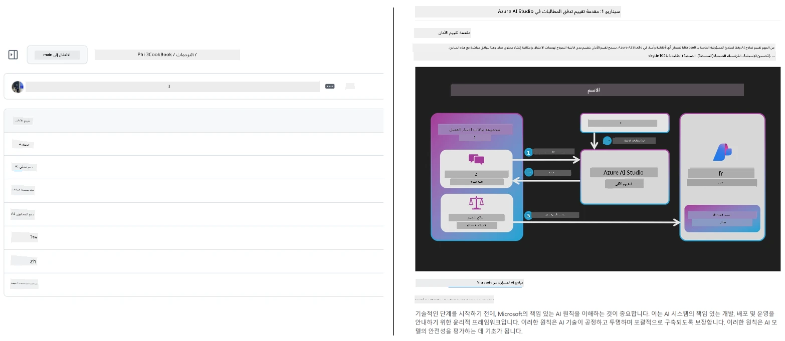
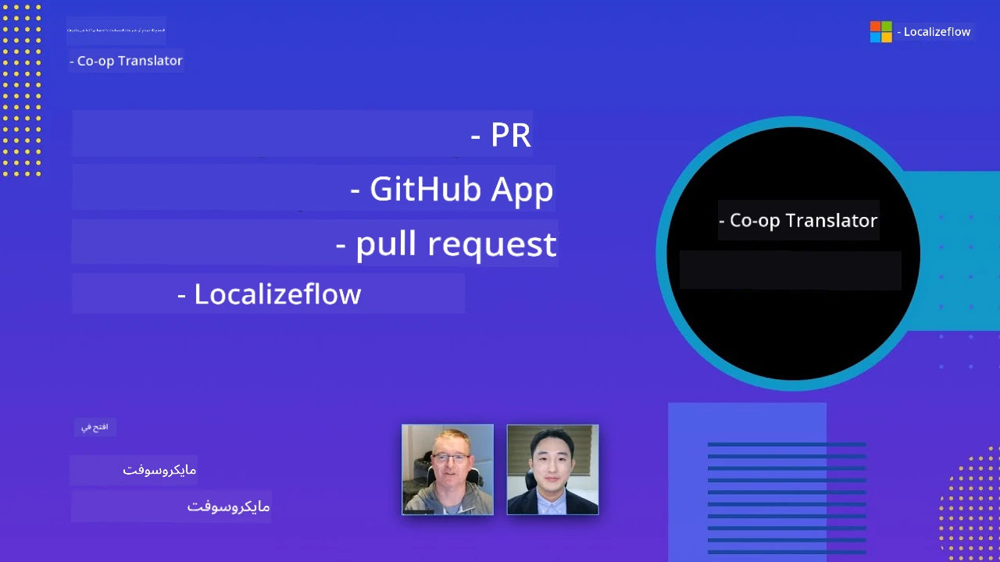

# Co-op Translator

_قم بأتمتة وترجمة محتوى GitHub التعليمي الخاص بك بسهولة عبر لغات متعددة مع تطور مشروعك._


[](https://pypi.org/project/co-op-translator/)
[](https://github.com/azure/co-op-translator/blob/main/LICENSE)
[](https://pepy.tech/project/co-op-translator)
[](https://pepy.tech/project/co-op-translator)
[](https://github.com/azure/co-op-translator/pkgs/container/co-op-translator)
[](https://github.com/psf/black)

[](https://GitHub.com/azure/co-op-translator/graphs/contributors/)
[](https://GitHub.com/azure/co-op-translator/issues/)
[](https://GitHub.com/azure/co-op-translator/pulls/)
[](http://makeapullrequest.com)

### 🌐 دعم متعدد اللغات

#### مدعوم من قبل [Co-op Translator](https://github.com/Azure/Co-op-Translator)

<!-- CO-OP TRANSLATOR LANGUAGES TABLE START -->
[Arabic](./README.md) | [Bengali](../bn/README.md) | [Bulgarian](../bg/README.md) | [Burmese (Myanmar)](../my/README.md) | [Chinese (Simplified)](../zh-CN/README.md) | [Chinese (Traditional, Hong Kong)](../zh-HK/README.md) | [Chinese (Traditional, Macau)](../zh-MO/README.md) | [Chinese (Traditional, Taiwan)](../zh-TW/README.md) | [Croatian](../hr/README.md) | [Czech](../cs/README.md) | [Danish](../da/README.md) | [Dutch](../nl/README.md) | [Estonian](../et/README.md) | [Finnish](../fi/README.md) | [French](../fr/README.md) | [German](../de/README.md) | [Greek](../el/README.md) | [Hebrew](../he/README.md) | [Hindi](../hi/README.md) | [Hungarian](../hu/README.md) | [Indonesian](../id/README.md) | [Italian](../it/README.md) | [Japanese](../ja/README.md) | [Kannada](../kn/README.md) | [Khmer](../km/README.md) | [Korean](../ko/README.md) | [Lithuanian](../lt/README.md) | [Malay](../ms/README.md) | [Malayalam](../ml/README.md) | [Marathi](../mr/README.md) | [Nepali](../ne/README.md) | [Nigerian Pidgin](../pcm/README.md) | [Norwegian](../no/README.md) | [Persian (Farsi)](../fa/README.md) | [Polish](../pl/README.md) | [Portuguese (Brazil)](../pt-BR/README.md) | [Portuguese (Portugal)](../pt-PT/README.md) | [Punjabi (Gurmukhi)](../pa/README.md) | [Romanian](../ro/README.md) | [Russian](../ru/README.md) | [Serbian (Cyrillic)](../sr/README.md) | [Slovak](../sk/README.md) | [Slovenian](../sl/README.md) | [Spanish](../es/README.md) | [Swahili](../sw/README.md) | [Swedish](../sv/README.md) | [Tagalog (Filipino)](../tl/README.md) | [Tamil](../ta/README.md) | [Telugu](../te/README.md) | [Thai](../th/README.md) | [Turkish](../tr/README.md) | [Ukrainian](../uk/README.md) | [Urdu](../ur/README.md) | [Vietnamese](../vi/README.md)

> **تفضل الاستنساخ محليًا؟**
>
> يتضمن هذا المستودع أكثر من 50 ترجمة للغات مما يزيد بشكل كبير من حجم التنزيل. للاستنساخ بدون الترجمات، استخدم السحب الانتقائي (sparse checkout):
>
> **Bash / macOS / Linux:**
> ```bash
> git clone --filter=blob:none --sparse https://github.com/skytin1004/co-op-translator.git
> cd co-op-translator
> git sparse-checkout set --no-cone '/*' '!translations' '!translated_images'
> ```
>
> **CMD (Windows):**
> ```cmd
> git clone --filter=blob:none --sparse https://github.com/skytin1004/co-op-translator.git
> cd co-op-translator
> git sparse-checkout set --no-cone "/*" "!translations" "!translated_images"
> ```
>
> هذا يمنحك كل ما تحتاجه لإكمال الدورة مع تنزيل أسرع بكثير.
<!-- CO-OP TRANSLATOR LANGUAGES TABLE END -->

[](https://GitHub.com/azure/co-op-translator/watchers/)
[](https://GitHub.com/azure/co-op-translator/network/)
[](https://GitHub.com/azure/co-op-translator/stargazers/)

[](https://discord.gg/nTYy5BXMWG)

[](https://codespaces.new/azure/co-op-translator)

## نظرة عامة

يساعدك **Co-op Translator** على ترجمة محتوى GitHub التعليمي الخاص بك إلى لغات متعددة بكل سهولة.  
عندما تقوم بتحديث ملفات Markdown أو الصور أو دفاتر الملاحظات، تبقى الترجمات متزامنة تلقائيًا، مما يضمن بقاء المحتوى دقيقًا ومحدّثًا للمتعلمين في جميع أنحاء العالم.

مثال على كيفية تنظيم المحتوى المترجم:



## كيفية إدارة حالة الترجمة

يدير Co-op Translator المحتوى المترجم كـ **مخزون برمجي له إصدارات**،  
لا كملفات ثابتة.

تتبع الأداة حالة ملفات Markdown، والصور، ودفاتر الملاحظات المترجمة باستخدام **بيانات وصفية مقيّدة باللغات**.

هذا التصميم يسمح لـ Co-op Translator بـ:

- الكشف الموثوق عن الترجمات القديمة
- التعامل مع Markdown، والصور، ودفاتر الملاحظات بشكل متسق
- التوسع بأمان عبر مستودعات كبيرة ومتعددة اللغات وسريعة الحركة

عن طريق نمذجة الترجمات كمخزونات مدارة،  
تتوافق سير عمل الترجمة بشكل طبيعي مع ممارسات إدارة التبعيات والمخزونات البرمجية الحديثة.

→ [كيف تتم إدارة حالة الترجمة](https://techcommunity.microsoft.com/blog/azuredevcommunityblog/rethinking-documentation-translation-treating-translations-as-versioned-software/4491755)


## بداية سريعة

```bash
# إنشاء وتفعيل بيئة افتراضية (موصى به)
python -m venv .venv
# ويندوز
.venv\Scripts\activate
# ماك أو إس/لينكس
source .venv/bin/activate
# تثبيت الحزمة
pip install co-op-translator
# ترجمة
translate -l "ko ja fr" -md
```

دوكر:

```bash
# اسحب الصورة العامة من GHCR
docker pull ghcr.io/azure/co-op-translator:latest
# شغل مع تركيب المجلد الحالي وملف .env المقدم (Bash/Zsh)
docker run --rm -it --env-file .env -v "${PWD}:/work" ghcr.io/azure/co-op-translator:latest -l "ko ja fr" -md
```

## إعداد الحد الأدنى

1. تحقق من امتلاكك لإصدار Python المدعوم (حاليًا 3.10-3.12). في poetry (pyproject.toml) يتم التعامل مع هذا تلقائيًا.
2. أنشئ ملف `.env` باستخدام القالب: [.env.template](../../.env.template)
3. قم بتكوين مزود LLM واحد (Azure OpenAI أو OpenAI)
4. (اختياري) لترجمة الصور (`-img`) قم بتكوين Azure AI Vision
5. (اختياري) يمكنك تكوين مجموعات متعددة من بيانات الاعتماد بتكرار المتغيرات باستخدام لاحقات مثل `_1`, `_2`، إلخ. يجب أن تشترك جميع المتغيرات في مجموعة لاحقة واحدة.
6. (موصى به) قم بتنظيف أي ترجمات سابقة لتجنب التعارضات (مثلاً `translations/`)
7. (موصى به) أضف قسم الترجمة في ملف README باستخدام قالب [README للغات](./getting_started/README_languages_template.md)
8. راجع: [إعداد Azure AI](./getting_started/set-up-azure-ai.md)

## الاستخدام

ترجم جميع الأنواع المدعومة:

```bash
translate -l "ko ja"
```

ملفات Markdown فقط:

```bash
translate -l "de" -md
```

Markdown + صور:

```bash
translate -l "pt" -md -img
```

دفاتر الملاحظات فقط:

```bash
translate -l "zh" -nb
```

عوامل تحكم إضافية: [مرجع الأوامر](./getting_started/command-reference.md)

## الميزات

- ترجمة مؤتمتة للـ Markdown، ودفاتر الملاحظات، والصور
- تحافظ على مزامنة الترجمات مع تغييرات المصدر
- تعمل محليًا (CLI) أو في CI (GitHub Actions)
- تستخدم Azure OpenAI أو OpenAI؛ ورؤية Azure AI اختيارية للصور
- تحافظ على تنسيق وبنية Markdown

## الوثائق

- [دليل سطر الأوامر](./getting_started/command-line-guide/command-line-guide.md)
- [دليل GitHub Actions (المستودعات العامة والسرية القياسية)](./getting_started/github-actions-guide/github-actions-guide-public.md)
- [دليل GitHub Actions (مستودعات منظمة Microsoft والإعدادات على مستوى المنظمة)](./getting_started/github-actions-guide/github-actions-guide-org.md)
- [قالب README للغات](./getting_started/README_languages_template.md)
- [اللغات المدعومة](./getting_started/supported-languages.md)
- [المساهمة](./CONTRIBUTING.md)
- [استكشاف الأخطاء وإصلاحها](./getting_started/troubleshooting.md)

### دليل خاص بـ Microsoft
> [!NOTE]
> فقط لصيانة مستودعات Microsoft "للمبتدئين".

- [تحديث قائمة "الدورات الأخرى" (خاص بمستودعات MS Beginners فقط)](./getting_started/update-other-courses.md)

## دعمنا وتعزيز التعلم العالمي

انضم إلينا في تغيير كيفية مشاركة المحتوى التعليمي عالميًا! قم بمنح [Co-op Translator](https://github.com/azure/co-op-translator) ⭐ على GitHub وادعم مهمتنا لكسر حواجز اللغة في التعلم والتقنية. اهتمامك ومساهماتك تحدث فرقًا كبيرًا! مساهمات الكود واقتراحات الميزات مرحب بها دائمًا.

### استكشف محتوى Microsoft التعليمي بلغتك

- [LangChain4j-for-Beginners](https://github.com/microsoft/LangChain4j-for-Beginners)
- [AZD for Beginners](https://github.com/microsoft/AZD-for-beginners)
- [Edge AI for Beginners](https://github.com/microsoft/edgeai-for-beginners)
- [Model Context Protocol (MCP) For Beginners](https://github.com/microsoft/mcp-for-beginners)
- [AI Agents for Beginners](https://github.com/microsoft/ai-agents-for-beginners)
- [Generative AI for Beginners using .NET](https://github.com/microsoft/Generative-AI-for-beginners-dotnet)
- [Generative AI for Beginners](https://github.com/microsoft/generative-ai-for-beginners)
- [Generative AI for Beginners using Java](https://github.com/microsoft/generative-ai-for-beginners-java)
- [ML for Beginners](https://aka.ms/ml-beginners)
- [Data Science for Beginners](https://aka.ms/datascience-beginners)
- [AI for Beginners](https://aka.ms/ai-beginners)
- [Cybersecurity for Beginners](https://github.com/microsoft/Security-101)
- [Web Dev for Beginners](https://aka.ms/webdev-beginners)
- [IoT for Beginners](https://aka.ms/iot-beginners)
- [PhiCookBook](https://github.com/microsoft/PhiCookBook)

## عروض الفيديو

👉 اضغط على الصورة أدناه للمشاهدة على يوتيوب.

- **Open at Microsoft**: مقدمة موجزة مدتها 18 دقيقة ودليل سريع لاستخدام Co-op Translator.

  [](https://www.youtube.com/watch?v=jX_swfH_KNU)

## المساهمة

يرحب هذا المشروع بالمساهمات والاقتراحات. مهتم بالمساهمة في Azure Co-op Translator؟ يرجى مراجعة [CONTRIBUTING.md](./CONTRIBUTING.md) للإرشادات حول كيفية المساعدة في جعل Co-op Translator أكثر سهولة.

## المساهمون
[](https://github.com/Azure/co-op-translator/graphs/contributors)

## مدونة السلوك

تبنى هذا المشروع [مدونة سلوك المصدر المفتوح لمايكروسوفت](https://opensource.microsoft.com/codeofconduct/).
لمزيد من المعلومات راجع [الأسئلة المتكررة حول مدونة السلوك](https://opensource.microsoft.com/codeofconduct/faq/) أو
تواصل عبر البريد الإلكتروني [opencode@microsoft.com](mailto:opencode@microsoft.com) لأي أسئلة أو تعليقات إضافية.

## الذكاء الاصطناعي المسؤول

تلتزم مايكروسوفت بمساعدة عملائنا على استخدام منتجات الذكاء الاصطناعي لدينا بمسؤولية، ومشاركة خبراتنا، وبناء شراكات قائمة على الثقة من خلال أدوات مثل ملاحظات الشفافية وتقييم الأثر. يمكن العثور على العديد من هذه الموارد على [https://aka.ms/RAI](https://aka.ms/RAI).
يرتكز نهج مايكروسوفت تجاه الذكاء الاصطناعي المسؤول على مبادئ الذكاء الاصطناعي لدينا المتعلقة بالإنصاف والموثوقية والسلامة، والخصوصية والأمان، والشمولية، والشفافية، والمساءلة.

يمكن لنماذج اللغة الطبيعية واسعة النطاق، والصور، والصوت - مثل تلك المستخدمة في هذا المثال - أن تتصرف بطرق قد تكون غير عادلة، أو غير موثوقة، أو مسيئة، مما قد يسبب أضراراً. يرجى مراجعة [مذكرة الشفافية لخدمة Azure OpenAI](https://learn.microsoft.com/legal/cognitive-services/openai/transparency-note?tabs=text) للاطلاع على المخاطر والقيود.

النهج الموصى به للتخفيف من هذه المخاطر هو تضمين نظام أمان في هيكلك يمكنه اكتشاف ومنع السلوك الضار. يوفر [Azure AI Content Safety](https://learn.microsoft.com/azure/ai-services/content-safety/overview) طبقة حماية مستقلة، قادرة على اكتشاف المحتوى الضار الذي يُنشئه المستخدمون أو الذكاء الاصطناعي في التطبيقات والخدمات. يتضمن Azure AI Content Safety واجهات برمجة تطبيقات للنصوص والصور تتيح لك اكتشاف المواد الضارة. كما نمتلك استوديو أمان المحتوى التفاعلي الذي يسمح لك بمشاهدة واستكشاف وتجربة أمثلة التعليمات البرمجية لاكتشاف المحتوى الضار عبر الوسائط المختلفة. يوجهك [دليل البدء السريع التالي](https://learn.microsoft.com/azure/ai-services/content-safety/quickstart-text?tabs=visual-studio%2Clinux&pivots=programming-language-rest) خلال كيفية تقديم الطلبات إلى الخدمة.

جانب آخر يجب أخذه في الاعتبار هو أداء التطبيق بشكل عام. مع التطبيقات متعددة الوسائط والنماذج، نعتبر الأداء يعني أن النظام يعمل كما تتوقع أنت والمستخدمون لديك، بما في ذلك عدم توليد مخرجات ضارة. من المهم تقييم أداء تطبيقك الكلي باستخدام [مقاييس جودة التوليد والمخاطر والسلامة](https://learn.microsoft.com/azure/ai-studio/concepts/evaluation-metrics-built-in).

يمكنك تقييم تطبيقات الذكاء الاصطناعي الخاصة بك في بيئة التطوير باستخدام [SDK تدفق البادئات prompt flow](https://microsoft.github.io/promptflow/index.html). باستخدام مجموعة بيانات اختبار أو هدف، يتم قياس إنتاجات تطبيق الذكاء الاصطناعي التوليدي لديك بشكل كمي باستخدام مقيمين مدمجين أو مقيمين مخصصين من اختيارك. للبدء باستخدام SDK تدفق البادئات لتقييم نظامك، يمكنك اتباع [دليل البدء السريع](https://learn.microsoft.com/azure/ai-studio/how-to/develop/flow-evaluate-sdk). بمجرد تنفيذ تشغيل التقييم، يمكنك [عرض النتائج في Azure AI Studio](https://learn.microsoft.com/azure/ai-studio/how-to/evaluate-flow-results).

## العلامات التجارية

قد يحتوي هذا المشروع على علامات تجارية أو شعارات لمشاريع أو منتجات أو خدمات. يخضع الاستخدام المصرح به لعلامات مايكروسوفت التجارية أو شعاراتها لـ
[إرشادات العلامة التجارية والملكية الفكرية لمايكروسوفت](https://www.microsoft.com/en-us/legal/intellectualproperty/trademarks/usage/general).
يجب ألا يسبب استخدام علامات مايكروسوفت التجارية أو شعاراتها في نسخ معدلة من هذا المشروع الارتباك أو يوحي برعاية مايكروسوفت.
أي استخدام للعلامات التجارية أو الشعارات التابعة لأطراف ثالثة يخضع لسياسات تلك الأطراف.

## الحصول على المساعدة

إذا واجهت صعوبة أو كان لديك أي أسئلة حول بناء تطبيقات الذكاء الاصطناعي، انضم إلى:

[](https://discord.gg/nTYy5BXMWG)

إذا كان لديك تعليقات على المنتج أو أخطاء أثناء البناء، زر:

[](https://aka.ms/foundry/forum)

---

<!-- CO-OP TRANSLATOR DISCLAIMER START -->
**تنبيه**:  
تم ترجمة هذا المستند باستخدام خدمة الترجمة بالذكاء الاصطناعي [Co-op Translator](https://github.com/Azure/co-op-translator). بينما نسعى للدقة، يرجى العلم أن الترجمات الآلية قد تحتوي على أخطاء أو عدم دقة. يجب اعتبار المستند الأصلي بلغته الأصلية المصدر الموثوق به. للمعلومات الحساسة، يوصى بالترجمة البشرية المهنية. نحن غير مسؤولين عن أي سوء فهم أو تفسيرات خاطئة تنشأ عن استخدام هذه الترجمة.
<!-- CO-OP TRANSLATOR DISCLAIMER END -->