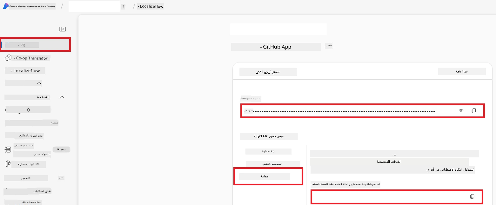

# إعداد Azure AI لـ Co-op Translator (Azure OpneAI و Azure AI Vision)

يرشدك هذا الدليل خلال إعداد Azure OpenAI لترجمة اللغات و Azure Computer Vision لتحليل محتوى الصور (الذي يمكن استخدامه بعد ذلك للترجمة المعتمدة على الصور) داخل Azure AI Foundry.

**المتطلبات المسبقة:**
- حساب Azure مع اشتراك نشط.
- أذونات كافية لإنشاء الموارد والنشر في اشتراك Azure الخاص بك.

## إنشاء مشروع Azure AI

ستبدأ بإنشاء مشروع Azure AI، والذي يعمل كمكان مركزي لإدارة موارد الذكاء الاصطناعي الخاصة بك.

1. انتقل إلى [https://ai.azure.com](https://ai.azure.com) وقم بتسجيل الدخول باستخدام حساب Azure الخاص بك.

1. اختر **+إنشاء** لإنشاء مشروع جديد.

1. قم بالمهام التالية:
   - أدخل **اسم المشروع** (على سبيل المثال، `CoopTranslator-Project`).
   - اختر **مركز الذكاء الاصطناعي** (على سبيل المثال، `CoopTranslator-Hub`) (أنشئ واحدًا جديدًا إذا لزم الأمر).

1. انقر على "**مراجعة وإنشاء**" لإعداد مشروعك. سيتم نقلك إلى صفحة نظرة عامة على مشروعك.

## إعداد Azure OpenAI لترجمة اللغات

داخل مشروعك، ستقوم بنشر نموذج Azure OpenAI ليعمل كخلفية لترجمة النصوص.

### التنقل إلى مشروعك

إذا لم تكن هناك بعد، افتح مشروعك الذي أنشأته حديثًا (على سبيل المثال، `CoopTranslator-Project`) في Azure AI Foundry.

### نشر نموذج OpenAI

1. من القائمة الجانبية لمشروعك، ضمن "أصولي"، اختر "**النماذج + نقاط النهاية**".

1. اختر **+ نشر نموذج**.

1. اختر **نشر نموذج أساسي**.

1. ستُعرض لك قائمة بالنماذج المتاحة. قم بالتصفية أو البحث عن نموذج GPT مناسب. نوصي بـ `gpt-4o`.

1. اختر النموذج الذي ترغب به وانقر **تأكيد**.

1. اختر **نشر**.

### تكوين Azure OpenAI

بمجرد نشره، يمكنك اختيار النشر من صفحة "**النماذج + نقاط النهاية**" للعثور على **رابط نقطة النهاية REST**، و**المفتاح**، و**اسم النشر**، و**اسم النموذج**، و**إصدار API**. ستكون هذه البيانات ضرورية لدمج نموذج الترجمة في تطبيقك.

> [!NOTE]
> يمكنك اختيار إصدارات API من صفحة [API version deprecation](https://learn.microsoft.com/azure/ai-services/openai/api-version-deprecation) بناءً على متطلباتك. لاحظ أن **إصدار API** مختلف عن **إصدار النموذج** المعروض على صفحة **النماذج + نقاط النهاية** في Azure AI Foundry.

## إعداد Azure Computer Vision لترجمة الصور

لتمكين ترجمة النص داخل الصور، تحتاج إلى العثور على مفتاح API ونقطة نهاية خدمة Azure AI.

1. انتقل إلى مشروع Azure AI الخاص بك (على سبيل المثال، `CoopTranslator-Project`). تأكد من أنك في صفحة نظرة عامة على المشروع.

### تكوين خدمة Azure AI

ابحث عن مفتاح API ونقطة النهاية من خدمة Azure AI.

1. انتقل إلى مشروع Azure AI الخاص بك (على سبيل المثال، `CoopTranslator-Project`). تأكد من أنك في صفحة نظرة عامة على المشروع.

1. ابحث عن **مفتاح API** و **نقطة النهاية** من علامة تبويب خدمة Azure AI.

    

هذا الاتصال يجعل قدرات مورد خدمة Azure AI المرتبط (بما في ذلك تحليل الصور) متاحة لمشروع AI Foundry الخاص بك. يمكنك بعد ذلك استخدام هذا الاتصال في دفاتر الملاحظات أو التطبيقات الخاصة بك لاستخراج النص من الصور، والتي يمكن بعد ذلك إرسالها إلى نموذج Azure OpenAI للترجمة.

## تجميع بيانات الاعتماد الخاصة بك

بحلول الآن، يجب أن تكون قد جمعت ما يلي:

**لـ Azure OpenAI (ترجمة النص):**
- نقطة نهاية Azure OpenAI
- مفتاح API لـ Azure OpenAI
- اسم نموذج Azure OpenAI (مثلاً `gpt-4o`)
- اسم نشر Azure OpenAI (مثلاً `cooptranslator-gpt4o`)
- إصدار API لـ Azure OpenAI

**لخدمات Azure AI (استخراج نص الصور عبر الرؤية):**
- نقطة نهاية خدمة Azure AI
- مفتاح API لخدمة Azure AI

### مثال: تكوين متغيرات البيئة (معاينة)

لاحقًا، عند بناء تطبيقك، من المحتمل أن تقوم بتكوينه باستخدام بيانات الاعتماد التي جمعتها. على سبيل المثال، قد تضبطها كمتغيرات بيئة كما يلي:

```bash
# بيانات اعتماد خدمة Azure AI (مطلوبة لترجمة الصور)
AZURE_AI_SERVICE_API_KEY="your_azure_ai_service_api_key" # مثلاً، 21xasd...
AZURE_AI_SERVICE_ENDPOINT="https://your_azure_ai_service_endpoint.cognitiveservices.azure.com/"

# مجموعات احتياطية اختيارية: نسخ المتغيرات مع اللاحقة _1/_2 (نفس الفهرس لجميع المتغيرات في المجموعة)
AZURE_AI_SERVICE_API_KEY_1="your_azure_ai_service_api_key_1"
AZURE_AI_SERVICE_ENDPOINT_1="https://your_azure_ai_service_endpoint_1.cognitiveservices.azure.com/"

# بيانات اعتماد Azure OpenAI (مطلوبة لترجمة النصوص)
AZURE_OPENAI_API_KEY="your_azure_openai_api_key" # مثلاً، 21xasd...
AZURE_OPENAI_ENDPOINT="https://your_azure_openai_endpoint.openai.azure.com/"
AZURE_OPENAI_MODEL_NAME="your_model_name" # مثلاً، gpt-4o
AZURE_OPENAI_CHAT_DEPLOYMENT_NAME="your_deployment_name" # مثلاً، cooptranslator-gpt4o
AZURE_OPENAI_API_VERSION="your_api_version" # مثلاً، 2024-12-01-preview

# مجموعات احتياطية اختيارية: نسخ مجموعة AZURE_OPENAI_* كاملة مع اللاحقة _1/_2 (نفس الفهرس لجميع المتغيرات)
```

---

### قراءة إضافية

- [كيفية إنشاء مشروع في Azure AI Foundry](https://learn.microsoft.com/azure/ai-foundry/how-to/create-projects?tabs=ai-studio)
- [كيفية إنشاء موارد Azure AI](https://learn.microsoft.com/azure/ai-foundry/how-to/create-azure-ai-resource?tabs=portal)
- [كيفية نشر نماذج OpenAI في Azure AI Foundry](https://learn.microsoft.com/en-us/azure/ai-foundry/how-to/deploy-models-openai)

---

<!-- CO-OP TRANSLATOR DISCLAIMER START -->
**إخلاء المسؤولية**:  
تمت ترجمة هذا المستند باستخدام خدمة الترجمة الآلية [Co-op Translator](https://github.com/Azure/co-op-translator). بينما نحرص على الدقة، يرجى العلم أن الترجمات الآلية قد تحتوي على أخطاء أو عدم دقة. يجب اعتبار الوثيقة الأصلية بلغتها الأصلية المصدر الرسمي والموثوق. للمعلومات الهامة، يُنصح بالترجمة المهنية البشرية. نحن غير مسؤولين عن أي سوء فهم أو تفسير ناتج عن استخدام هذه الترجمة.
<!-- CO-OP TRANSLATOR DISCLAIMER END -->