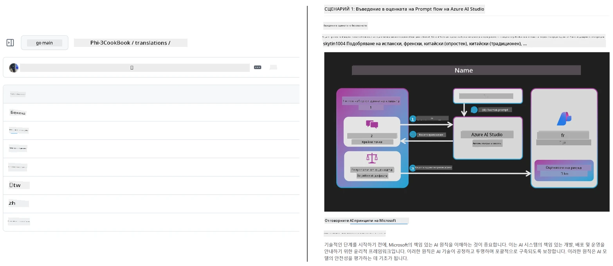
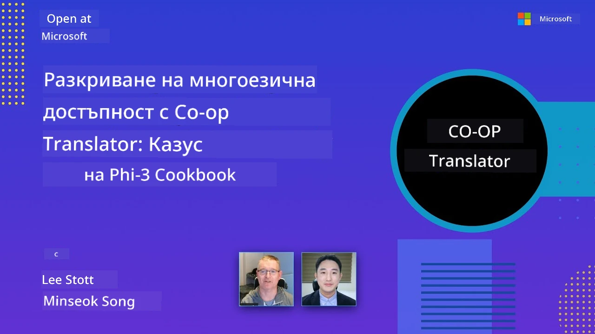

# Co-op Translator

_Лесно автоматизирайте и поддържайте преводите на вашето образователно съдържание в GitHub на множество езици с развитието на вашия проект._


[](https://pypi.org/project/co-op-translator/)
[](https://github.com/azure/co-op-translator/blob/main/LICENSE)
[](https://pepy.tech/project/co-op-translator)
[](https://pepy.tech/project/co-op-translator)
[](https://github.com/azure/co-op-translator/pkgs/container/co-op-translator)
[](https://github.com/psf/black)

[](https://GitHub.com/azure/co-op-translator/graphs/contributors/)
[](https://GitHub.com/azure/co-op-translator/issues/)
[](https://GitHub.com/azure/co-op-translator/pulls/)
[](http://makeapullrequest.com)

### 🌐 Поддръжка на множество езици

#### Поддържано от [Co-op Translator](https://github.com/Azure/Co-op-Translator)

<!-- CO-OP TRANSLATOR LANGUAGES TABLE START -->
[Arabic](../ar/README.md) | [Bengali](../bn/README.md) | [Bulgarian](./README.md) | [Burmese (Myanmar)](../my/README.md) | [Chinese (Simplified)](../zh-CN/README.md) | [Chinese (Traditional, Hong Kong)](../zh-HK/README.md) | [Chinese (Traditional, Macau)](../zh-MO/README.md) | [Chinese (Traditional, Taiwan)](../zh-TW/README.md) | [Croatian](../hr/README.md) | [Czech](../cs/README.md) | [Danish](../da/README.md) | [Dutch](../nl/README.md) | [Estonian](../et/README.md) | [Finnish](../fi/README.md) | [French](../fr/README.md) | [German](../de/README.md) | [Greek](../el/README.md) | [Hebrew](../he/README.md) | [Hindi](../hi/README.md) | [Hungarian](../hu/README.md) | [Indonesian](../id/README.md) | [Italian](../it/README.md) | [Japanese](../ja/README.md) | [Kannada](../kn/README.md) | [Khmer](../km/README.md) | [Korean](../ko/README.md) | [Lithuanian](../lt/README.md) | [Malay](../ms/README.md) | [Malayalam](../ml/README.md) | [Marathi](../mr/README.md) | [Nepali](../ne/README.md) | [Nigerian Pidgin](../pcm/README.md) | [Norwegian](../no/README.md) | [Persian (Farsi)](../fa/README.md) | [Polish](../pl/README.md) | [Portuguese (Brazil)](../pt-BR/README.md) | [Portuguese (Portugal)](../pt-PT/README.md) | [Punjabi (Gurmukhi)](../pa/README.md) | [Romanian](../ro/README.md) | [Russian](../ru/README.md) | [Serbian (Cyrillic)](../sr/README.md) | [Slovak](../sk/README.md) | [Slovenian](../sl/README.md) | [Spanish](../es/README.md) | [Swahili](../sw/README.md) | [Swedish](../sv/README.md) | [Tagalog (Filipino)](../tl/README.md) | [Tamil](../ta/README.md) | [Telugu](../te/README.md) | [Thai](../th/README.md) | [Turkish](../tr/README.md) | [Ukrainian](../uk/README.md) | [Urdu](../ur/README.md) | [Vietnamese](../vi/README.md)

> **Предпочитате да клонирате локално?**
>
> Това хранилище включва над 50 езикови превода, което значително увеличава размера на изтегляне. За да клонирате без преводите, използвайте sparse checkout:
>
> **Bash / macOS / Linux:**
> ```bash
> git clone --filter=blob:none --sparse https://github.com/skytin1004/co-op-translator.git
> cd co-op-translator
> git sparse-checkout set --no-cone '/*' '!translations' '!translated_images'
> ```
>
> **CMD (Windows):**
> ```cmd
> git clone --filter=blob:none --sparse https://github.com/skytin1004/co-op-translator.git
> cd co-op-translator
> git sparse-checkout set --no-cone "/*" "!translations" "!translated_images"
> ```
>
> Това ще ви даде всичко необходимо, за да завършите курса с много по-бързо изтегляне.
<!-- CO-OP TRANSLATOR LANGUAGES TABLE END -->

[](https://GitHub.com/azure/co-op-translator/watchers/)
[](https://GitHub.com/azure/co-op-translator/network/)
[](https://GitHub.com/azure/co-op-translator/stargazers/)

[](https://discord.gg/nTYy5BXMWG)

[](https://codespaces.new/azure/co-op-translator)

## Преглед

**Co-op Translator** ви помага да локализирате вашето образователно съдържание в GitHub на множество езици без усилие.  
Когато обновявате Markdown файлове, изображения или тетрадки, преводите остават автоматично синхронизирани, гарантирайки, че вашето съдържание е точно и актуално за учащите по целия свят.

Пример как е организирано преведеното съдържание:



## Как се управлява състоянието на превода

Co-op Translator управлява преведеното съдържание като **версионирани софтуерни артефакти**,  
а не като статични файлове.

Инструментът проследява състоянието на преведения Markdown, изображения и тетрадки  
чрез **метаданни с обхват на езика**.

Тази структура позволява на Co-op Translator да:

- Надеждно открива остарели преводи
- Третира Markdown, изображения и тетрадки последователно
- Масшабира безопасно при големи, бързо променящи се мултиезични хранилища

Като моделира преводите като управлявани артефакти,  
работните процеси по превод се съгласуват естествено с модерните практики за управление на зависимости и артефакти в софтуера.

→ [Как се управлява състоянието на превода](https://techcommunity.microsoft.com/blog/azuredevcommunityblog/rethinking-documentation-translation-treating-translations-as-versioned-software/4491755)


## Бърз старт

```bash
# Създайте и активирайте виртуална среда (препоръчително)
python -m venv .venv
# Windows
.venv\Scripts\activate
# macOS/Linux
source .venv/bin/activate
# Инсталирайте пакета
pip install co-op-translator
# Преведи
translate -l "ko ja fr" -md
```

Docker:

```bash
# Изтеглете публичното изображение от GHCR
docker pull ghcr.io/azure/co-op-translator:latest
# Стартирайте с монтирана текуща папка и предоставен .env файл (Bash/Zsh)
docker run --rm -it --env-file .env -v "${PWD}:/work" ghcr.io/azure/co-op-translator:latest -l "ko ja fr" -md
```

## Минимална настройка

1. Уверете се, че имате поддържана версия на Python (в момента 3.10-3.12). В poetry (pyproject.toml) това се обработва автоматично.
2. Създайте файл `.env` по шаблона: [.env.template](../../.env.template)
3. Конфигурирайте доставчик на LLM (Azure OpenAI или OpenAI)
4. (По избор) За превод на изображения (`-img`), конфигурирайте Azure AI Vision
5. (По избор) Можете да конфигурирате няколко комплекта с идентификационни данни, като дублирате променливи с наставки като `_1`, `_2` и т.н. Всички променливи в комплект трябва да имат една и съща наставка.
6. (Препоръчително) Почистете всякакви предишни преводи, за да избегнете конфликти (например `translations/`)
7. (Препоръчително) Добавете раздел за преводи във вашия README, използвайки [шаблона за README езици](./getting_started/README_languages_template.md)
8. Вижте: [Настройка на Azure AI](./getting_started/set-up-azure-ai.md)

## Използване

Преведете всички поддържани типове:

```bash
translate -l "ko ja"
```

Само Markdown:

```bash
translate -l "de" -md
```

Markdown + изображения:

```bash
translate -l "pt" -md -img
```

Само тетрадки:

```bash
translate -l "zh" -nb
```

Още опции: [Референтен документ команди](./getting_started/command-reference.md)

## Функции

- Автоматизиран превод за Markdown, тетрадки и изображения
- Поддържа преводите синхронизирани с изходните промени
- Работи локално (CLI) или в CI (GitHub Actions)
- Използва Azure OpenAI или OpenAI; по избор Azure AI Vision за изображения
- Запазва форматирането и структурата на Markdown

## Документация

- [Ръководство за командния ред](./getting_started/command-line-guide/command-line-guide.md)
- [Ръководство за GitHub Actions (публични хранилища и стандартни тайни)](./getting_started/github-actions-guide/github-actions-guide-public.md)
- [Ръководство за GitHub Actions (хранилища на Microsoft организация и настройки на организацията)](./getting_started/github-actions-guide/github-actions-guide-org.md)
- [Шаблон за README езици](./getting_started/README_languages_template.md)
- [Поддържани езици](./getting_started/supported-languages.md)
- [Как да допринасяте](./CONTRIBUTING.md)
- [Отстраняване на проблеми](./getting_started/troubleshooting.md)

### Специално ръководство за Microsoft
> [!NOTE]
> Само за поддържане на хранилища "За начинаещи" на Microsoft.

- [Обновяване на списъка "други курсове" (само за хранилища на MS Начинаещи)](./getting_started/update-other-courses.md)

## Подкрепете ни и насърчете глобалното учене

Присъединете се към нас в революцията на споделянето на образователно съдържание в световен мащаб! Дайте ⭐ на [Co-op Translator](https://github.com/azure/co-op-translator) в GitHub и подкрепете нашата мисия да премахнем езиковите бариери в обучението и технологиите. Вашият интерес и принос правят голяма разлика! Приемаме кодови принос и предложения за функции с радост.

### Разгледайте образователно съдържание на Microsoft на вашия език

- [LangChain4j-for-Beginners](https://github.com/microsoft/LangChain4j-for-Beginners)
- [AZD for Beginners](https://github.com/microsoft/AZD-for-beginners)
- [Edge AI for Beginners](https://github.com/microsoft/edgeai-for-beginners)
- [Model Context Protocol (MCP) For Beginners](https://github.com/microsoft/mcp-for-beginners)
- [AI Agents for Beginners](https://github.com/microsoft/ai-agents-for-beginners)
- [Generative AI for Beginners using .NET](https://github.com/microsoft/Generative-AI-for-beginners-dotnet)
- [Generative AI for Beginners](https://github.com/microsoft/generative-ai-for-beginners)
- [Generative AI for Beginners using Java](https://github.com/microsoft/generative-ai-for-beginners-java)
- [ML for Beginners](https://aka.ms/ml-beginners)
- [Data Science for Beginners](https://aka.ms/datascience-beginners)
- [AI for Beginners](https://aka.ms/ai-beginners)
- [Cybersecurity for Beginners](https://github.com/microsoft/Security-101)
- [Web Dev for Beginners](https://aka.ms/webdev-beginners)
- [IoT for Beginners](https://aka.ms/iot-beginners)
- [PhiCookBook](https://github.com/microsoft/PhiCookBook)

## Видео презентации

👉 Кликнете върху изображението долу, за да гледате в YouTube.

- **Open at Microsoft**: Кратко 18-минутно въведение и бързо ръководство за използване на Co-op Translator.

  [](https://www.youtube.com/watch?v=jX_swfH_KNU)

## Как да допринесете

Този проект приема приноси и предложения. Интересувате ли се да допринесете към Azure Co-op Translator? Моля, вижте [CONTRIBUTING.md](./CONTRIBUTING.md) за насоки как можете да помогнете Co-op Translator да стане по-достъпен.

## Сътрудници
[](https://github.com/Azure/co-op-translator/graphs/contributors)

## Кодекс на поведение

Този проект е приел [Microsoft Open Source Code of Conduct](https://opensource.microsoft.com/codeofconduct/).
За повече информация вижте [Code of Conduct FAQ](https://opensource.microsoft.com/codeofconduct/faq/) или
свържете се с [opencode@microsoft.com](mailto:opencode@microsoft.com) при допълнителни въпроси или коментари.

## Отговорен AI

Microsoft се ангажира да помага на клиентите си да използват нашите AI продукти отговорно, като споделя нашите научени уроци и изгражда партньорства, базирани на доверие, чрез инструменти като Transparency Notes и Impact Assessments. Много от тези ресурси могат да бъдат намерени на [https://aka.ms/RAI](https://aka.ms/RAI).
Подходът на Microsoft към отговорния AI се основава на нашите AI принципи за справедливост, надеждност и безопасност, поверителност и сигурност, приобщаване, прозрачност и отчетност.

Големи модели за естествен език, изображения и реч – като тези, използвани в този пример – могат потенциално да се държат по начини, които са несправедливи, ненадеждни или обидни, което от своя страна може да причини вреди. Моля, консултирайте се със [забележката за прозрачност на Azure OpenAI услугата](https://learn.microsoft.com/legal/cognitive-services/openai/transparency-note?tabs=text), за да бъдете информирани за рисковете и ограниченията.

Препоръчителният подход за преодоляване на тези рискове е да включите система за безопасност във вашата архитектура, която може да засича и предотвратява вредно поведение. [Azure AI Content Safety](https://learn.microsoft.com/azure/ai-services/content-safety/overview) предоставя независим слой защита, способен да открива вредно съдържание, генерирано от потребители и AI, в приложения и услуги. Azure AI Content Safety включва текстови и образни API, които ви позволяват да откривате вреден материал. Имаме и интерактивно Content Safety Studio, което ви позволява да разглеждате, изследвате и пробвате примерен код за откриване на вредно съдържание в различни модалности. Следващата [документация за бърз старт](https://learn.microsoft.com/azure/ai-services/content-safety/quickstart-text?tabs=visual-studio%2Clinux&pivots=programming-language-rest) ви напътства как да правите заявки към услугата.

Друг аспект, който трябва да се вземе предвид, е цялостното представяне на приложението. При мулти-модални и мулти-моделни приложения, разбираме под представяне, че системата работи според очакванията ви и тези на потребителите, включително да не генерира вредни резултати. Важно е да оцените представянето на цялостното приложение, използвайки [метрики за качество на генерацията и рискове и безопасност](https://learn.microsoft.com/azure/ai-studio/concepts/evaluation-metrics-built-in).

Можете да оцените вашето AI приложение във вашата среда за разработка, използвайки [prompt flow SDK](https://microsoft.github.io/promptflow/index.html). При предоставяне на тестов набор от данни или цел, генерациите на вашето генеративно AI приложение се измерват количествено с вградени оценители или с персонализирани оценители по ваш избор. За да започнете с prompt flow sdk за оценка на вашата система, следвайте [ръководството за бърз старт](https://learn.microsoft.com/azure/ai-studio/how-to/develop/flow-evaluate-sdk). След като изпълните оценъчен цикъл, можете да [визуализирате резултатите в Azure AI Studio](https://learn.microsoft.com/azure/ai-studio/how-to/evaluate-flow-results).

## Търговски марки

Този проект може да съдържа търговски марки или лога на проекти, продукти или услуги. Употребата на търговски марки или лога на Microsoft е разрешена само при спазване на
[Правилата за търговски марки и бранд на Microsoft](https://www.microsoft.com/en-us/legal/intellectualproperty/trademarks/usage/general).
Използването на търговски марки или лога на Microsoft в модифицирани версии на този проект не трябва да причинява объркване или да навежда на мисълта за спонсорство от Microsoft.
Всяко използване на търговски марки или лога на трети страни подлежи на политиките на съответните трети страни.

## Получаване на помощ

Ако имате затруднения или въпроси относно създаването на AI приложения, присъединете се към:

[](https://discord.gg/nTYy5BXMWG)

Ако имате обратна връзка за продукта или грешки при разработката, посетете:

[](https://aka.ms/foundry/forum)

---

<!-- CO-OP TRANSLATOR DISCLAIMER START -->
**Отказ от отговорност**:  
Този документ е преведен с помощта на AI преводаческа услуга [Co-op Translator](https://github.com/Azure/co-op-translator). Въпреки че се стремим към точност, моля, имайте предвид, че автоматизираните преводи може да съдържат грешки или неточности. Оригиналният документ на неговия език трябва да се счита за авторитетен източник. За критична информация се препоръчва професионален превод от човешки преводач. Не носим отговорност за каквито и да е недоразумения или неправилни тълкувания, възникнали от използването на този превод.
<!-- CO-OP TRANSLATOR DISCLAIMER END -->