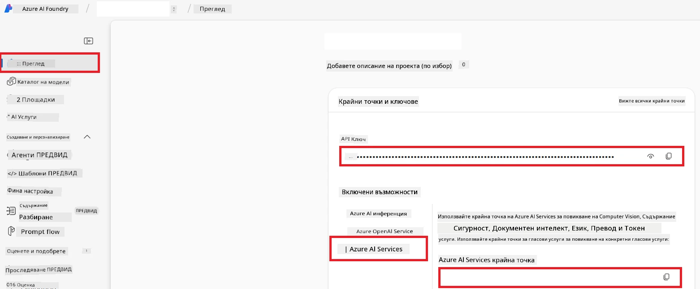

# Настройване на Azure AI за Co-op Translator (Azure OpneAI & Azure AI Vision)

Това ръководство ви превежда през процеса на настройване на Azure OpenAI за езиков превод и Azure Computer Vision за анализ на съдържанието на изображения (което след това може да се използва за превод на базата на изображения) в рамките на Azure AI Foundry.

**Необходими изисквания:**
- Профил в Azure с активен абонамент.
- Достатъчни разрешения за създаване на ресурси и разгръщания във вашия Azure абонамент.

## Създаване на Azure AI проект

Започнете със създаването на Azure AI проект, който служи като централизирано място за управление на вашите AI ресурси.

1. Отидете на [https://ai.azure.com](https://ai.azure.com) и влезте с вашия Azure профил.

1. Изберете **+Create**, за да създадете нов проект.

1. Извършете следните действия:
   - Въведете **Име на проект** (например `CoopTranslator-Project`).
   - Изберете **AI hub**  (например `CoopTranslator-Hub`) (създайте нов, ако е необходимо).

1. Кликнете върху "**Review and Create**", за да конфигурирате проекта си. Ще бъдете пренасочени към страницата с преглед на проекта.

## Настройване на Azure OpenAI за езиков превод

В рамките на вашия проект ще разположите Azure OpenAI модел, който ще служи като бекенд за превод на текст.

### Навигиране до вашия проект

Ако все още не сте там, отворете току-що създадения проект (например `CoopTranslator-Project`) в Azure AI Foundry.

### Разполагане на OpenAI модел

1. В лявото меню на проекта, под "My assets", изберете "**Models + endpoints**".

1. Изберете **+ Deploy model**.

1. Изберете **Deploy Base Model**.

1. Ще се появи списък с налични модели. Филтрирайте или потърсете подходящ GPT модел. Препоръчваме `gpt-4o`.

1. Изберете желания модел и кликнете върху **Confirm**.

1. Изберете **Deploy**.

### Конфигурация на Azure OpenAI

След като бъде разположен, можете да изберете разгръщането от страницата "**Models + endpoints**", за да намерите **REST endpoint URL**, **Key**, **Deployment name**, **Model name** и **API version**. Те ще бъдат необходими за интегриране на модела за превод във вашето приложение.

> [!NOTE]
> Можете да избирате версии на API от страницата за [API version deprecation](https://learn.microsoft.com/azure/ai-services/openai/api-version-deprecation), според вашите нужди. Обърнете внимание, че **API version** се различава от **Model version**, показан на страницата **Models + endpoints** в Azure AI Foundry.

## Настройване на Azure Computer Vision за превод на изображения

За да активирате превод на текст в изображения, трябва да намерите Azure AI Service API Key и Endpoint.

1. Навигирайте до вашия Azure AI проект (например `CoopTranslator-Project`). Уверете се, че сте на страницата с преглед на проекта.

### Конфигурация на Azure AI Service

Намерете API Key и Endpoint от Azure AI Service.

1. Навигирайте до вашия Azure AI проект (например `CoopTranslator-Project`). Уверете се, че сте на страницата с преглед.

1. Намерете **API Key** и **Endpoint** в таба Azure AI Service.

    

Тази връзка прави възможностите на свързания Azure AI Services ресурс (включително анализ на изображения) достъпни за вашия AI Foundry проект. След това можете да използвате тази връзка в тетрадки или приложения, за да извличате текст от изображения, който впоследствие може да бъде изпратен към Azure OpenAI модела за превод.

## Обобщаване на вашите данни за достъп

Към момента би трябвало да сте събрали следното:

**За Azure OpenAI (превод на текст):**
- Azure OpenAI Endpoint
- Azure OpenAI API Key
- Azure OpenAI Model Name (например `gpt-4o`)
- Azure OpenAI Deployment Name (например `cooptranslator-gpt4o`)
- Azure OpenAI API Version

**За Azure AI Services (извличане на текст от изображения чрез Vision):**
- Azure AI Service Endpoint
- Azure AI Service API Key

### Пример: Конфигурация на променливи на средата (преглед)

По-нататък при изграждане на вашето приложение вероятно ще го конфигурирате с помощта на събраните данни за достъп. Например, може да ги зададете като променливи на средата по следния начин:

```bash
# Удостоверителни данни за Azure AI услуги (Необходими за превод на изображения)
AZURE_AI_SERVICE_API_KEY="your_azure_ai_service_api_key" # напр. 21xasd...
AZURE_AI_SERVICE_ENDPOINT="https://your_azure_ai_service_endpoint.cognitiveservices.azure.com/"

# Незадължителни резервни набори: копирайте променливите с суфикс _1/_2 (с еднакъв индекс за всички променливи в набора)
AZURE_AI_SERVICE_API_KEY_1="your_azure_ai_service_api_key_1"
AZURE_AI_SERVICE_ENDPOINT_1="https://your_azure_ai_service_endpoint_1.cognitiveservices.azure.com/"

# Удостоверителни данни за Azure OpenAI (Необходими за превод на текст)
AZURE_OPENAI_API_KEY="your_azure_openai_api_key" # напр. 21xasd...
AZURE_OPENAI_ENDPOINT="https://your_azure_openai_endpoint.openai.azure.com/"
AZURE_OPENAI_MODEL_NAME="your_model_name" # напр. gpt-4o
AZURE_OPENAI_CHAT_DEPLOYMENT_NAME="your_deployment_name" # напр. cooptranslator-gpt4o
AZURE_OPENAI_API_VERSION="your_api_version" # напр. 2024-12-01-preview

# Незадължителни резервни набори: копирайте пълния комплект AZURE_OPENAI_* с суфикс _1/_2 (с еднакъв индекс за всички променливи)
```

---

### Допълнителни ресурси

- [Как да създадете проект в Azure AI Foundry](https://learn.microsoft.com/azure/ai-foundry/how-to/create-projects?tabs=ai-studio)
- [Как да създадете Azure AI ресурси](https://learn.microsoft.com/azure/ai-foundry/how-to/create-azure-ai-resource?tabs=portal)
- [Как да разполагате OpenAI модели в Azure AI Foundry](https://learn.microsoft.com/en-us/azure/ai-foundry/how-to/deploy-models-openai)

---

<!-- CO-OP TRANSLATOR DISCLAIMER START -->
**Отказ от отговорност**:  
Този документ е преведен с помощта на AI преводаческа услуга [Co-op Translator](https://github.com/Azure/co-op-translator). Въпреки че се стремим към точност, моля, имайте предвид, че автоматизираните преводи може да съдържат грешки или неточности. Оригиналният документ на неговия оригинален език трябва да се счита за авторитетен източник. За критична информация се препоръчва професионален човешки превод. Не носим отговорност за всякакви недоразумения или неправилни тълкувания, произтичащи от използването на този превод.
<!-- CO-OP TRANSLATOR DISCLAIMER END -->