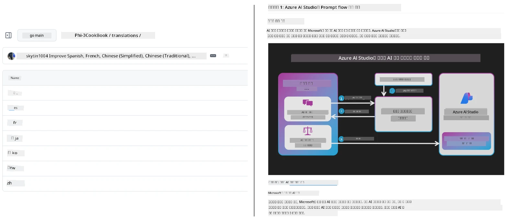

# Co-op Translator

_সহজেই আপনার শিক্ষামূলক GitHub সামগ্রীর বিভিন্ন ভাষায় অনুবাদ স্বয়ংক্রিয়করণ এবং বজায় রাখুন যখন আপনার প্রকল্প উন্নত হয়।_


[](https://pypi.org/project/co-op-translator/)
[](https://github.com/azure/co-op-translator/blob/main/LICENSE)
[](https://pepy.tech/project/co-op-translator)
[](https://pepy.tech/project/co-op-translator)
[](https://github.com/azure/co-op-translator/pkgs/container/co-op-translator)
[](https://github.com/psf/black)

[](https://GitHub.com/azure/co-op-translator/graphs/contributors/)
[](https://GitHub.com/azure/co-op-translator/issues/)
[](https://GitHub.com/azure/co-op-translator/pulls/)
[](http://makeapullrequest.com)

### 🌐 বহুভাষিক সমর্থন

#### দ্বারা সমর্থিত [Co-op Translator](https://github.com/Azure/Co-op-Translator)

<!-- CO-OP TRANSLATOR LANGUAGES TABLE START -->
[Arabic](../ar/README.md) | [Bengali](./README.md) | [Bulgarian](../bg/README.md) | [Burmese (Myanmar)](../my/README.md) | [Chinese (Simplified)](../zh-CN/README.md) | [Chinese (Traditional, Hong Kong)](../zh-HK/README.md) | [Chinese (Traditional, Macau)](../zh-MO/README.md) | [Chinese (Traditional, Taiwan)](../zh-TW/README.md) | [Croatian](../hr/README.md) | [Czech](../cs/README.md) | [Danish](../da/README.md) | [Dutch](../nl/README.md) | [Estonian](../et/README.md) | [Finnish](../fi/README.md) | [French](../fr/README.md) | [German](../de/README.md) | [Greek](../el/README.md) | [Hebrew](../he/README.md) | [Hindi](../hi/README.md) | [Hungarian](../hu/README.md) | [Indonesian](../id/README.md) | [Italian](../it/README.md) | [Japanese](../ja/README.md) | [Kannada](../kn/README.md) | [Khmer](../km/README.md) | [Korean](../ko/README.md) | [Lithuanian](../lt/README.md) | [Malay](../ms/README.md) | [Malayalam](../ml/README.md) | [Marathi](../mr/README.md) | [Nepali](../ne/README.md) | [Nigerian Pidgin](../pcm/README.md) | [Norwegian](../no/README.md) | [Persian (Farsi)](../fa/README.md) | [Polish](../pl/README.md) | [Portuguese (Brazil)](../pt-BR/README.md) | [Portuguese (Portugal)](../pt-PT/README.md) | [Punjabi (Gurmukhi)](../pa/README.md) | [Romanian](../ro/README.md) | [Russian](../ru/README.md) | [Serbian (Cyrillic)](../sr/README.md) | [Slovak](../sk/README.md) | [Slovenian](../sl/README.md) | [Spanish](../es/README.md) | [Swahili](../sw/README.md) | [Swedish](../sv/README.md) | [Tagalog (Filipino)](../tl/README.md) | [Tamil](../ta/README.md) | [Telugu](../te/README.md) | [Thai](../th/README.md) | [Turkish](../tr/README.md) | [Ukrainian](../uk/README.md) | [Urdu](../ur/README.md) | [Vietnamese](../vi/README.md)

> **স্থানীয়ভাবে ক্লোন করতে ইচ্ছুক?**
>
> এই রিপোজিটরিতে ৫০+ ভাষার অনুবাদ রয়েছে যা ডাউনলোড আকার উল্লেখযোগ্যভাবে বৃদ্ধি করে। অনুবাদ ছাড়া ক্লোন করতে স্পারস চেকআউট ব্যবহার করুন:
>
> **Bash / macOS / Linux:**
> ```bash
> git clone --filter=blob:none --sparse https://github.com/Azure/co-op-translator.git
> cd co-op-translator
> git sparse-checkout set --no-cone '/*' '!translations' '!translated_images'
> ```
>
> **CMD (Windows):**
> ```cmd
> git clone --filter=blob:none --sparse https://github.com/Azure/co-op-translator.git
> cd co-op-translator
> git sparse-checkout set --no-cone "/*" "!translations" "!translated_images"
> ```
>
> এটি আপনাকে দ্রুততর ডাউনলোডের মাধ্যমে কোর্স সম্পূর্ণ করতে প্রয়োজনীয় সবকিছু দেয়।
<!-- CO-OP TRANSLATOR LANGUAGES TABLE END -->

[](https://GitHub.com/azure/co-op-translator/watchers/)
[](https://GitHub.com/azure/co-op-translator/network/)
[](https://GitHub.com/azure/co-op-translator/stargazers/)

[](https://discord.gg/nTYy5BXMWG)

[](https://codespaces.new/azure/co-op-translator)

## ওভারভিউ

**Co-op Translator** আপনাকে সহজেই আপনার শিক্ষামূলক GitHub সামগ্রী বহু ভাষায় লোকালাইজ করতে সাহায্য করে।  
আপনি যখন আপনার Markdown ফাইল, ছবি বা নোটবুক আপডেট করবেন, তখন অনুবাদগুলি স্বয়ংক্রিয়ভাবে সিঙ্ক্রোনাইজ হয়ে থাকে, নিশ্চিত করে যে আপনার সামগ্রী বিশ্বব্যাপী শিক্ষার্থীদের জন্য সঠিক এবং আপ টু ডেট থাকে।

অনুবাদিত সামগ্রীর সংগঠনের একটি উদাহরণ:



## অনুবাদের অবস্থা কিভাবে পরিচালিত হয়

Co-op Translator অনুবাদিত সামগ্রীকে **ভার্সনকৃত সফটওয়্যার আর্টিফ্যাক্ট** হিসাবে পরিচালনা করে,  
স্থির ফাইল হিসাবে নয়।

এই টুলটি অনুবাদিত Markdown, ছবি, এবং নোটবুকগুলির অবস্থা  
**ভাষা-স্কোপড মেটাডেটা** ব্যবহার করে ট্র্যাক করে।

এই নকশা Co-op Translator-কে সক্ষম করে:

- পুরনো অনুবাদ নির্ভরযোগ্যভাবে সনাক্ত করতে
- Markdown, ছবি, এবং নোটবুকসমূহকে সঙ্গতিপূর্ণভাবে পরিচালনা করতে
- বড়, দ্রুত পরিবর্তিত, বহু ভাষার রিপোজিটরিগুলোর মধ্যে নিরাপদে স্কেল করতে

অনুবাদগুলোকে পরিচালিত আর্টিফ্যাক্ট হিসেবে মডেল করে,  
অনুবাদ ওয়ার্কফ্লোগুলো স্বাভাবিকভাবেই আধুনিক সফটওয়্যার নির্ভরতা এবং আর্টিফ্যাক্ট ব্যবস্থাপনা অনুশীলনের সাথে সামঞ্জস্যপূর্ণ হয়।

→ [অনুবাদের অবস্থা কিভাবে পরিচালিত হয়](https://techcommunity.microsoft.com/blog/azuredevcommunityblog/rethinking-documentation-translation-treating-translations-as-versioned-software/4491755)


## দ্রুত শুরু

```bash
# একটি ভার্চুয়াল পরিবেশ তৈরি করুন এবং সক্রিয় করুন (সুপারিশকৃত)
python -m venv .venv
# উইন্ডোজ
.venv\Scripts\activate
# ম্যাকওএস/লিনাক্স
source .venv/bin/activate
# প্যাকেজ ইনস্টল করুন
pip install co-op-translator
# অনুবাদ করুন
translate -l "ko ja fr" -md
```

ডকার:

```bash
# GHCR থেকে পাবলিক ইমেজ টানুন
docker pull ghcr.io/azure/co-op-translator:latest
# বর্তমান ফোল্ডার মাউন্ট করে এবং .env প্রদান করে চালান (Bash/Zsh)
docker run --rm -it --env-file .env -v "${PWD}:/work" ghcr.io/azure/co-op-translator:latest -l "ko ja fr" -md
```

## ন্যূনতম সেটআপ

1. নিশ্চিত করুন আপনার কাছে সমর্থিত পাইথন ভার্সন রয়েছে (বর্তমানে ৩.১০-৩.১২)। poetry (pyproject.toml) এটাকে স্বয়ংক্রিয়ভাবে পরিচালনা করে।  
2. একটি `.env` ফাইল তৈরি করুন টেমপ্লেট ব্যবহার করে: [.env.template](../../.env.template)  
3. একটি LLM প্রোভাইডার কনফিগার করুন (Azure OpenAI অথবা OpenAI)  
4. (ঐচ্ছিক) ছবি অনুবাদের জন্য (`-img`), Azure AI Vision কনফিগার করুন  
5. (ঐচ্ছিক) আপনি একাধিক ক্রেডেনশিয়াল সেট কনফিগার করতে পারেন সাফিক্স সহ ভেরিয়েবল ডুপ্লিকেট করে `_1`, `_2` ইত্যাদি। একটি সেটের সব ভেরিয়েবল একই সাফিক্স শেয়ার করতে হবে।  
6. (প্রস্তাবিত) পূর্ববর্তী অনুবাদগুলো পরিষ্কার করুন সংঘাত এড়াতে (যেমন, `translations/`)  
7. (প্রস্তাবিত) আপনার README-তে একটি অনুবাদ সেকশন যোগ করুন [README ভাষা টেমপ্লেট](./getting_started/README_languages_template.md) ব্যবহার করে  
8. দেখুন: [Azure AI সেট আপ করুন](./getting_started/set-up-azure-ai.md)

## ব্যবহার

সমস্ত সমর্থিত ধরন অনুবাদ করুন:

```bash
translate -l "ko ja"
```

মাত্র Markdown:

```bash
translate -l "de" -md
```

Markdown + ছবি:

```bash
translate -l "pt" -md -img
```

মাত্র নোটবুক:

```bash
translate -l "zh" -nb
```

আরও ফ্ল্যাগ: [কমান্ড রেফারেন্স](./getting_started/command-reference.md)

## বৈশিষ্ট্য

- Markdown, নোটবুক, এবং ছবির জন্য স্বয়ংক্রিয় অনুবাদ  
- উৎস পরিবর্তনের সাথে অনুবাদ স্বয়ংক্রিয় সিঙ্ক  
- স্থানীয়ভাবে (CLI) অথবা CI (GitHub Actions) এ কাজ করে  
- Azure OpenAI অথবা OpenAI ব্যবহার করে; ঐচ্ছিক Azure AI Vision ছবি জন্য  
- Markdown ফরম্যাটিং এবং কাঠামো সংরক্ষণ করে  

## ডকুমেন্টেশন

- [কমান্ড লাইন গাইড](./getting_started/command-line-guide/command-line-guide.md)
- [GitHub Actions গাইড (সার্বজনীন রিপোজিটরি ও স্ট্যান্ডার্ড সিক্রেটস)](./getting_started/github-actions-guide/github-actions-guide-public.md)
- [GitHub Actions গাইড (Microsoft অর্গানাইজেশন রিপোজিটরি ও অর্গ লেভেল সেটআপ)](./getting_started/github-actions-guide/github-actions-guide-org.md)
- [README ভাষা টেমপ্লেট](./getting_started/README_languages_template.md)
- [সমর্থিত ভাষাগুলি](./getting_started/supported-languages.md)
- [অবদান রাখা](./CONTRIBUTING.md)
- [সমস্যা সমাধান](./getting_started/troubleshooting.md)

### মাইক্রোসফট-বিশেষ গাইড
> [!NOTE]
> কেবল Microsoft “For Beginners” রিপোজিটরির রক্ষণাবেক্ষকেদের জন্য।

- [“অন্যান্য কোর্স” তালিকা আপডেট করা (কেবল MS Beginners রিপোজিটরির জন্য)](./getting_started/update-other-courses.md)

## আমাদের সমর্থন করুন এবং বৈশ্বিক শিক্ষাকে উন্নত করুন

বিশ্বব্যাপী শিক্ষামূলক সামগ্রী শেয়ার করার কৌশল বিপ্লব ঘটাতে আমাদের সাথে যোগ দিন! [Co-op Translator](https://github.com/azure/co-op-translator) কে GitHub-এ ⭐ দিন এবং শেখা ও প্রযুক্তিতে ভাষাগত বাধা ভাঙার আমাদের উদ্দেশ্যকে সহায়তা করুন। আপনার আগ্রহ ও অবদান গুরুত্বপূর্ণ প্রভাব ফেলে! কোড অবদান এবং বৈশিষ্ট্য পরামর্শ সব সময় স্বাগত।

### আপনার ভাষায় Microsoft শিক্ষামূলক সামগ্রী এক্সপ্লোর করুন

- [LangChain4j-for-Beginners](https://github.com/microsoft/LangChain4j-for-Beginners)
- [AZD for Beginners](https://github.com/microsoft/AZD-for-beginners)
- [Edge AI for Beginners](https://github.com/microsoft/edgeai-for-beginners)
- [Model Context Protocol (MCP) For Beginners](https://github.com/microsoft/mcp-for-beginners)
- [AI Agents for Beginners](https://github.com/microsoft/ai-agents-for-beginners)
- [Generative AI for Beginners using .NET](https://github.com/microsoft/Generative-AI-for-beginners-dotnet)
- [Generative AI for Beginners](https://github.com/microsoft/generative-ai-for-beginners)
- [Generative AI for Beginners using Java](https://github.com/microsoft/generative-ai-for-beginners-java)
- [ML for Beginners](https://aka.ms/ml-beginners)
- [Data Science for Beginners](https://aka.ms/datascience-beginners)
- [AI for Beginners](https://aka.ms/ai-beginners)
- [Cybersecurity for Beginners](https://github.com/microsoft/Security-101)
- [Web Dev for Beginners](https://aka.ms/webdev-beginners)
- [IoT for Beginners](https://aka.ms/iot-beginners)
- [PhiCookBook](https://github.com/microsoft/PhiCookBook)

## ভিডিও উপস্থাপনা

👉 নীচের ছবিতে ক্লিক করে YouTube-এ দেখুন।

- **Open at Microsoft**: Co-op Translator কীভাবে ব্যবহার করবেন তার একটি সংক্ষিপ্ত ১৮ মিনিটের পরিচিতি এবং দ্রুত গাইড।

  [](https://www.youtube.com/watch?v=jX_swfH_KNU)

## অবদান রাখা

এই প্রকল্পে অবদান এবং প্রস্তাবনাগুলো স্বাগত। Azure Co-op Translator-এ অবদান রাখতে আগ্রহী? অনুগ্রহ করে আমাদের [CONTRIBUTING.md](./CONTRIBUTING.md) দেখুন কিভাবে আপনি Co-op Translator কে আরও সহজলভ্য করতে সাহায্য করতে পারেন।

## অবদানকারীরা
[](https://github.com/Azure/co-op-translator/graphs/contributors)

## আচরণবিধি

এই প্রকল্পটি [Microsoft Open Source Code of Conduct](https://opensource.microsoft.com/codeofconduct/) গ্রহণ করেছে।  
অধিক তথ্যের জন্য [Code of Conduct FAQ](https://opensource.microsoft.com/codeofconduct/faq/) দেখুন অথবা  
অতিরিক্ত প্রশ্ন বা মন্তব্য করার জন্য [opencode@microsoft.com](mailto:opencode@microsoft.com) এ যোগাযোগ করুন।

## দায়শীল AI

Microsoft আমাদের গ্রাহকদের দায়িত্বশীলভাবে AI পণ্যের ব্যবহার করতে সাহায্য করার, আমাদের শিক্ষণসমূহ শেয়ার করার, এবং Transparency Notes ও Impact Assessments-এর মত যন্ত্রের মাধ্যমে বিশ্বাসভিত্তিক অংশীদারিত্ব গড়ে তোলার জন্য প্রতিশ্রুতিবদ্ধ। এই সম্পদের অনেকগুলি পাওয়া যায় [https://aka.ms/RAI](https://aka.ms/RAI) এ।  
Microsoft-এর দায়শীল AI-এর পদ্ধতি ন্যায্যতা, নির্ভরযোগ্যতা ও নিরাপত্তা, গোপনীয়তা ও সুরক্ষা, অন্তর্ভুক্তিরতা, স্বচ্ছতা, এবং জবাবদিহিতা সম্পর্কিত আমাদের AI নীতিমালার উপর ভিত্তি করে।

এই নমুনাতে ব্যবহৃত বড় পরিসরের প্রাকৃতিক ভাষা, চিত্র, এবং ভাষণ মডেলগুলি সম্ভাবনাময় এমনভাবে আচরণ করতে পারে যা অন্যায়, অবিশ্বাস্য, বা আপত্তিকর হতে পারে, যার ফলে ক্ষতি সাধিত হতে পারে। ঝুঁকি এবং সীমাবদ্ধতা সম্পর্কে অবহিত হতে অনুগ্রহ করে [Azure OpenAI service Transparency note](https://learn.microsoft.com/legal/cognitive-services/openai/transparency-note?tabs=text) পরামর্শ করুন।

এই ঝুঁকিগুলো কমানোর সুপারিশকৃত পদ্ধতি হল আপনার স্থাপত্যে এমন একটি সুরক্ষা ব্যবস্থা অন্তর্ভুক্ত করা যা ক্ষতিকর আচরণ সনাক্ত এবং প্রতিরোধ করতে পারে। [Azure AI Content Safety](https://learn.microsoft.com/azure/ai-services/content-safety/overview) স্বতন্ত্র সুরক্ষা স্তর সরবরাহ করে, যা অ্যাপ্লিকেশন এবং পরিষেবাগুলিতে ক্ষতিকর ব্যবহারকারী-উত্পন্ন এবং AI-উত্পন্ন সামগ্রী সনাক্ত করতে সক্ষম। Azure AI Content Safety-তে এমন টেক্সট এবং ইমেজ API অন্তর্ভুক্ত রয়েছে যা ক্ষতিকর সামগ্রী সনাক্ত করতে দেয়। আমরা একটি ইন্টারেকটিভ Content Safety Studio প্রদান করি যা আপনাকে বিভিন্ন মাধ্যম জুড়ে ক্ষতিকর সামগ্রী সনাক্তকরণের জন্য নমুনা কোড দেখতে, অনুসন্ধান করতে এবং চেষ্টা করতে দেয়। নিম্নলিখিত [quickstart documentation](https://learn.microsoft.com/azure/ai-services/content-safety/quickstart-text?tabs=visual-studio%2Clinux&pivots=programming-language-rest) আপনাকে সেবাটিতে অনুরোধ প্রেরণে পথ প্রদর্শন করবে।

আরেকটি বিবেচ্য বিষয় হল সামগ্রিক অ্যাপ্লিকেশন কর্মক্ষমতা। মাল্টি-মোডাল ও মাল্টি-মডেল অ্যাপ্লিকেশনে আমরা কর্মক্ষমতাকে বুঝি যে সিস্টেম আপনার এবং আপনার ব্যবহারকারীদের প্রত্যাশা অনুযায়ী কাজ করে, যার মধ্যে ক্ষতিকর আউটপুট তৈরি না করা অন্তর্ভুক্ত। আপনার সামগ্রিক অ্যাপ্লিকেশনের কর্মক্ষমতা মূল্যায়নের জন্য [generation quality and risk and safety metrics](https://learn.microsoft.com/azure/ai-studio/concepts/evaluation-metrics-built-in) ব্যবহার করা গুরুত্বপূর্ণ।

আপনি [prompt flow SDK](https://microsoft.github.io/promptflow/index.html) ব্যবহার করে আপনার উন্নয়ন পরিবেশে আপনার AI অ্যাপ্লিকেশন মূল্যায়ন করতে পারেন। একটি পরীক্ষামূলক ডেটাসেট বা লক্ষ্য দেওয়ার মাধ্যমে, আপনার জেনারেটিভ AI অ্যাপ্লিকেশন জেনারেশন গুলো built-in বা আপনার পছন্দ মতো কাস্টম ইভ্যালুয়েটর দিয়ে পরিমাণগতভাবে পরিমাপ করা হয়। prompt flow sdk ব্যবহার করে আপনার সিস্টেম মূল্যায়ন শুরু করার জন্য আপনি [quickstart guide](https://learn.microsoft.com/azure/ai-studio/how-to/develop/flow-evaluate-sdk) অনুসরণ করতে পারেন। একবার আপনি একটি মূল্যায়ন চালালে, আপনি ফলাফলগুলি [Azure AI Studio-তে ভিজ্যুয়ালাইজ](https://learn.microsoft.com/azure/ai-studio/how-to/evaluate-flow-results) করতে পারেন।

## ট্রেডমার্ক

এই প্রকল্পে প্রকল্প, পণ্য বা পরিষেবাগুলির ট্রেডমার্ক বা লোগো থাকতে পারে। Microsoft  
ট্রেডমার্ক বা লোগোর অনুমোদিত ব্যবহার অবশ্যই অনুসরণ করতে হবে  
[Microsoft's Trademark & Brand Guidelines](https://www.microsoft.com/en-us/legal/intellectualproperty/trademarks/usage/general)।  
এই প্রকল্পের পরিবর্তিত সংস্করণে Microsoft ট্রেডমার্ক বা লোগো ব্যবহারে বিভ্রান্তি সৃষ্টি বা Microsoft স্পন্সরশিপ বোঝানো যাবে না।  
তৃতীয় পক্ষের ট্রেডমার্ক বা লোগোর যেকোনো ব্যবহার ঐ তৃতীয় পক্ষের নীতিমালা অনুসরণ করবে।

## সাহায্য নেওয়া

যদি আপনি আটকে যান বা AI অ্যাপ তৈরি সম্পর্কে কোনো প্রশ্ন থাকে, যোগ দিন:

[](https://discord.gg/nTYy5BXMWG)

যদি পণ্য সম্পর্কিত প্রতিক্রিয়া বা তৈরি করার সময় ত্রুটি থাকে, যান:

[](https://aka.ms/foundry/forum)

---

<!-- CO-OP TRANSLATOR DISCLAIMER START -->
**ডিসক্লেইমার**:  
এই ডকুমেন্টটি AI অনুবাদ সেবা [Co-op Translator](https://github.com/Azure/co-op-translator) ব্যবহার করে অনূদিত হয়েছে। আমরা যথাসাধ্য সঠিকতার জন্য চেষ্টা করি, তবে দয়া করে মনে রাখুন যে স্বয়ংক্রিয় অনুবাদে ত্রুটি বা অসঙ্গতি থাকতে পারে। মূল নথি তার নিজস্ব ভাষায় কর্তৃত্বপূর্ণ উৎস হিসেবে বিবেচিত হওয়া উচিত। গুরুত্বপূর্ণ তথ্যের জন্য পেশাদার মানব অনুবাদের পরামর্শ দেওয়া হয়। এই অনুবাদ ব্যবহারের ফলে কোনও ভুল বোঝাবুঝি বা ত্রুটির জন্য আমরা দায়ী নয়।
<!-- CO-OP TRANSLATOR DISCLAIMER END -->