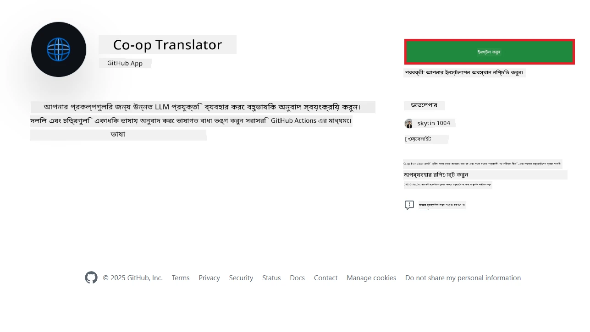
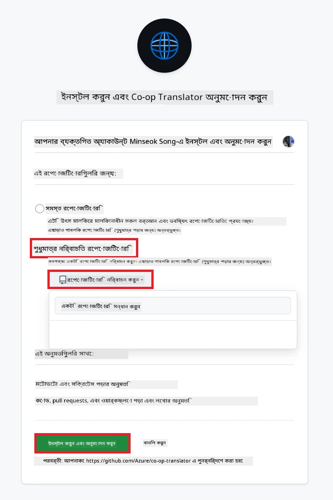
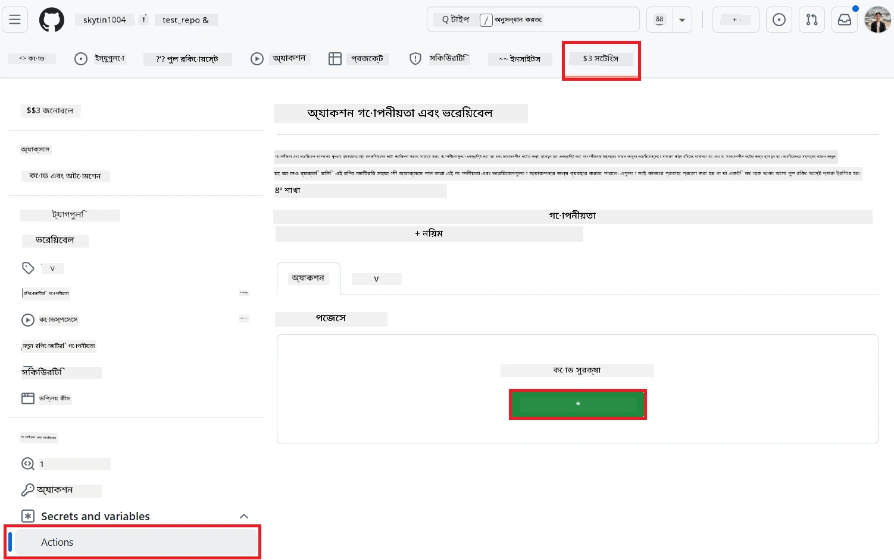
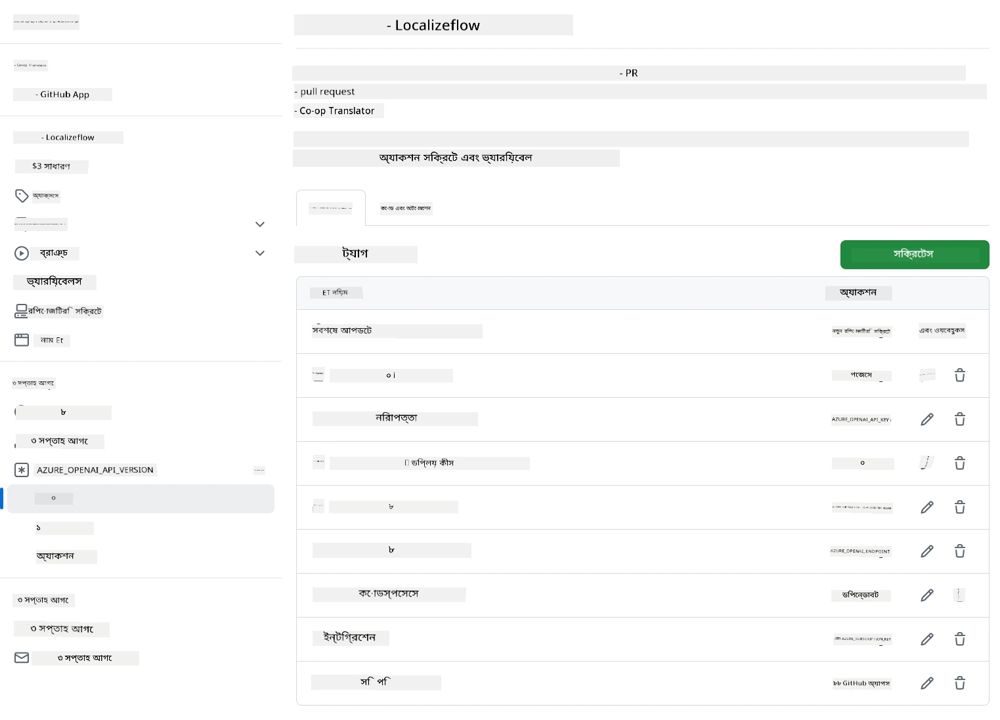

# কো-অপ ট্রান্সলেটর GitHub অ্যাকশন ব্যবহার (সংগঠন নির্দেশিকা)

**লক্ষ্য পাঠক:** এই নির্দেশিকাটি **Microsoft অভ্যন্তরীণ ব্যবহারকারী** বা **টিম**দের জন্য, যারা প্রস্তুতকৃত Co-op Translator GitHub App-এর জন্য প্রয়োজনীয় ক্রেডেনশিয়াল অ্যাক্সেস করতে পারেন অথবা নিজেদের কাস্টম GitHub App তৈরি করতে পারেন।

আপনার রিপোজিটরির ডকুমেন্টেশন অনায়াসে অনুবাদ করতে Co-op Translator GitHub Action ব্যবহার করুন। এই নির্দেশিকাটি দেখাবে কিভাবে অ্যাকশনটি সেটআপ করবেন যাতে সোর্স Markdown ফাইল বা ছবি পরিবর্তন হলে স্বয়ংক্রিয়ভাবে আপডেটেড অনুবাদসহ pull request তৈরি হয়।

> [!IMPORTANT]
> 
> **সঠিক নির্দেশিকা নির্বাচন:**
>
> এই নির্দেশিকায় **GitHub App ID এবং Private Key** ব্যবহার করে সেটআপ দেখানো হয়েছে। সাধারণত এই "সংগঠন নির্দেশিকা" প্রয়োজন হয় যদি: **`GITHUB_TOKEN` পারমিশন সীমিত:** আপনার সংগঠন বা রিপোজিটরি সেটিংস ডিফল্ট `GITHUB_TOKEN`-এর পারমিশন সীমিত করে। বিশেষ করে, যদি `GITHUB_TOKEN`-এ প্রয়োজনীয় `write` পারমিশন (যেমন `contents: write` বা `pull-requests: write`) না থাকে, তাহলে [Public Setup Guide](./github-actions-guide-public.md)-এর workflow যথেষ্ট পারমিশন না থাকায় ব্যর্থ হবে। নির্দিষ্ট GitHub App ব্যবহার করে স্পষ্টভাবে পারমিশন দেওয়া থাকলে এই সীমাবদ্ধতা এড়িয়ে যাওয়া যায়।
>
> **উপরেরটি যদি আপনার ক্ষেত্রে প্রযোজ্য না হয়:**
>
> যদি আপনার রিপোজিটরিতে ডিফল্ট `GITHUB_TOKEN` যথেষ্ট পারমিশন পায় (অর্থাৎ, আপনি সংগঠনের সীমাবদ্ধতায় আটকে নেই), তাহলে **[Public Setup Guide using GITHUB_TOKEN](./github-actions-guide-public.md)** ব্যবহার করুন। পাবলিক নির্দেশিকায় App ID বা Private Key ব্যবস্থাপনা প্রয়োজন নেই, শুধুমাত্র ডিফল্ট `GITHUB_TOKEN` এবং রিপোজিটরি পারমিশনেই কাজ হয়।

## পূর্বশর্ত

GitHub Action কনফিগার করার আগে প্রয়োজনীয় AI সার্ভিস ক্রেডেনশিয়াল প্রস্তুত রাখুন।

**১. প্রয়োজনীয়: AI Language Model Credentials**
কমপক্ষে একটি সমর্থিত Language Model-এর জন্য ক্রেডেনশিয়াল লাগবে:

- **Azure OpenAI**: Endpoint, API Key, Model/Deployment Name, API Version প্রয়োজন।
- **OpenAI**: API Key, (ঐচ্ছিক: Org ID, Base URL, Model ID) প্রয়োজন।
- বিস্তারিত জানতে [Supported Models and Services](../../../../README.md) দেখুন।
- সেটআপ নির্দেশিকা: [Set up Azure OpenAI](../set-up-resources/set-up-azure-openai.md)।

**২. ঐচ্ছিক: Computer Vision Credentials (ছবির অনুবাদের জন্য)**

- শুধুমাত্র ছবির মধ্যে লেখা অনুবাদ করতে চাইলে প্রয়োজন।
- **Azure Computer Vision**: Endpoint এবং Subscription Key প্রয়োজন।
- না দিলে অ্যাকশন [Markdown-only mode](../markdown-only-mode.md)-এ চলে যাবে।
- সেটআপ নির্দেশিকা: [Set up Azure Computer Vision](../set-up-resources/set-up-azure-computer-vision.md)।

## সেটআপ ও কনফিগারেশন

নিম্নলিখিত ধাপগুলো অনুসরণ করে Co-op Translator GitHub Action আপনার রিপোজিটরিতে কনফিগার করুন:

### ধাপ ১: GitHub App Authentication ইনস্টল ও কনফিগার করুন

ওয়ার্কফ্লোটি GitHub App authentication ব্যবহার করে নিরাপদে আপনার রিপোজিটরিতে (যেমন pull request তৈরি) কাজ করে। একটি অপশন বেছে নিন:

#### **অপশন A: প্রস্তুতকৃত Co-op Translator GitHub App ইনস্টল করুন (Microsoft অভ্যন্তরীণ ব্যবহারকারীদের জন্য)**

১. [Co-op Translator GitHub App](https://github.com/apps/co-op-translator) পেজে যান।

১. **Install** সিলেক্ট করুন এবং আপনার অ্যাকাউন্ট বা সংগঠন নির্বাচন করুন যেখানে টার্গেট রিপোজিটরি আছে।

    

১. **Only select repositories** নির্বাচন করুন এবং আপনার টার্গেট রিপোজিটরি (যেমন `PhiCookBook`) সিলেক্ট করুন। **Install** ক্লিক করুন। প্রয়োজনে অথেন্টিকেট করতে হতে পারে।

    

১. **App Credentials সংগ্রহ করুন (অভ্যন্তরীণ প্রক্রিয়া):** ওয়ার্কফ্লোটি অ্যাপ হিসেবে অথেন্টিকেট করতে দুটি তথ্য লাগবে, যা Co-op Translator টিম সরবরাহ করবে:
  - **App ID:** Co-op Translator অ্যাপের ইউনিক আইডি। App ID হলো: `1164076`।
  - **Private Key:** `.pem` প্রাইভেট কি ফাইলের **সম্পূর্ণ কনটেন্ট** মেইনটেইনারের কাছ থেকে সংগ্রহ করুন। **এই কি পাসওয়ার্ডের মতো গোপন রাখুন।**

১. Step 2-তে যান।

#### **অপশন B: নিজের কাস্টম GitHub App ব্যবহার করুন**

- চাইলে নিজেই GitHub App তৈরি ও কনফিগার করতে পারেন। Contents এবং Pull requests-এ Read & write access থাকতে হবে। App ID এবং জেনারেট করা Private Key লাগবে।

### ধাপ ২: রিপোজিটরি সিক্রেট কনফিগার করুন

GitHub App credentials এবং AI সার্ভিস credentials আপনার রিপোজিটরি সেটিংসে এনক্রিপ্টেড সিক্রেট হিসেবে যোগ করতে হবে।

১. আপনার টার্গেট GitHub রিপোজিটরিতে যান (যেমন `PhiCookBook`)।

১. **Settings** > **Secrets and variables** > **Actions**-এ যান।

১. **Repository secrets**-এর নিচে, নিচের প্রতিটি সিক্রেটের জন্য **New repository secret** ক্লিক করুন।

   

**প্রয়োজনীয় সিক্রেট (GitHub App Authentication-এর জন্য):**

| Secret Name          | বিবরণ                                      | Value Source                                     |
| :------------------- | :------------------------------------------ | :----------------------------------------------- |
| `GH_APP_ID`          | GitHub App-এর App ID (Step 1 থেকে)          | GitHub App Settings                              |
| `GH_APP_PRIVATE_KEY` | ডাউনলোড করা `.pem` ফাইলের **সম্পূর্ণ কনটেন্ট** | `.pem` ফাইল (Step 1 থেকে)                        |

**AI সার্ভিস সিক্রেট (পূর্বশর্ত অনুযায়ী প্রযোজ্য সব যোগ করুন):**

| Secret Name                         | বিবরণ                               | Value Source                     |
| :---------------------------------- | :---------------------------------- | :------------------------------- |
| `AZURE_AI_SERVICE_API_KEY`            | Azure AI Service-এর Key (Computer Vision)  | Azure AI Foundry                    |
| `AZURE_AI_SERVICE_ENDPOINT`         | Azure AI Service-এর Endpoint (Computer Vision) | Azure AI Foundry                     |
| `AZURE_OPENAI_API_KEY`              | Azure OpenAI সার্ভিসের Key              | Azure AI Foundry                     |
| `AZURE_OPENAI_ENDPOINT`             | Azure OpenAI সার্ভিসের Endpoint         | Azure AI Foundry                     |
| `AZURE_OPENAI_MODEL_NAME`           | Azure OpenAI Model Name                 | Azure AI Foundry                     |
| `AZURE_OPENAI_CHAT_DEPLOYMENT_NAME` | Azure OpenAI Deployment Name            | Azure AI Foundry                     |
| `AZURE_OPENAI_API_VERSION`          | Azure OpenAI-এর API Version             | Azure AI Foundry                     |
| `OPENAI_API_KEY`                    | OpenAI-এর API Key                       | OpenAI Platform                  |
| `OPENAI_ORG_ID`                     | OpenAI Organization ID                   | OpenAI Platform                  |
| `OPENAI_CHAT_MODEL_ID`              | নির্দিষ্ট OpenAI model ID                | OpenAI Platform                    |
| `OPENAI_BASE_URL`                   | কাস্টম OpenAI API Base URL               | OpenAI Platform                    |



### ধাপ ৩: Workflow ফাইল তৈরি করুন

অবশেষে, YAML ফাইল তৈরি করুন যা automated workflow সংজ্ঞায়িত করবে।

১. আপনার রিপোজিটরির root ডিরেক্টরিতে `.github/workflows/` ডিরেক্টরি না থাকলে তৈরি করুন।

১. `.github/workflows/`-এর মধ্যে `co-op-translator.yml` নামে একটি ফাইল তৈরি করুন।

১. নিচের কনটেন্ট co-op-translator.yml-এ পেস্ট করুন।

```
name: Co-op Translator

on:
  push:
    branches:
      - main

jobs:
  co-op-translator:
    runs-on: ubuntu-latest

    permissions:
      contents: write
      pull-requests: write

    steps:
      - name: Checkout repository
        uses: actions/checkout@v4
        with:
          fetch-depth: 0

      - name: Set up Python
        uses: actions/setup-python@v4
        with:
          python-version: '3.10'

      - name: Install Co-op Translator
        run: |
          python -m pip install --upgrade pip
          pip install co-op-translator

      - name: Run Co-op Translator
        env:
          PYTHONIOENCODING: utf-8
          # Azure AI Service Credentials
          AZURE_AI_SERVICE_API_KEY: ${{ secrets.AZURE_AI_SERVICE_API_KEY }}
          AZURE_AI_SERVICE_ENDPOINT: ${{ secrets.AZURE_AI_SERVICE_ENDPOINT }}

          # Azure OpenAI Credentials
          AZURE_OPENAI_API_KEY: ${{ secrets.AZURE_OPENAI_API_KEY }}
          AZURE_OPENAI_ENDPOINT: ${{ secrets.AZURE_OPENAI_ENDPOINT }}
          AZURE_OPENAI_MODEL_NAME: ${{ secrets.AZURE_OPENAI_MODEL_NAME }}
          AZURE_OPENAI_CHAT_DEPLOYMENT_NAME: ${{ secrets.AZURE_OPENAI_CHAT_DEPLOYMENT_NAME }}
          AZURE_OPENAI_API_VERSION: ${{ secrets.AZURE_OPENAI_API_VERSION }}

          # OpenAI Credentials
          OPENAI_API_KEY: ${{ secrets.OPENAI_API_KEY }}
          OPENAI_ORG_ID: ${{ secrets.OPENAI_ORG_ID }}
          OPENAI_CHAT_MODEL_ID: ${{ secrets.OPENAI_CHAT_MODEL_ID }}
          OPENAI_BASE_URL: ${{ secrets.OPENAI_BASE_URL }}
        run: |
          # =====================================================================
          # IMPORTANT: Set your target languages here (REQUIRED CONFIGURATION)
          # =====================================================================
          # Example: Translate to Spanish, French, German. Add -y to auto-confirm.
          translate -l "es fr de" -y  # <--- MODIFY THIS LINE with your desired languages

      - name: Authenticate GitHub App
        id: generate_token
        uses: tibdex/github-app-token@v1
        with:
          app_id: ${{ secrets.GH_APP_ID }}
          private_key: ${{ secrets.GH_APP_PRIVATE_KEY }}

      - name: Create Pull Request with translations
        uses: peter-evans/create-pull-request@v5
        with:
          token: ${{ steps.generate_token.outputs.token }}
          commit-message: "🌐 Update translations via Co-op Translator"
          title: "🌐 Update translations via Co-op Translator"
          body: |
            This PR updates translations for recent changes to the main branch.

            ### 📋 Changes included
            - Translated contents are available in the `translations/` directory
            - Translated images are available in the `translated_images/` directory

            ---
            🌐 Automatically generated by the [Co-op Translator](https://github.com/Azure/co-op-translator) GitHub Action.
          branch: update-translations
          base: main
          labels: translation, automated-pr
          delete-branch: true
          add-paths: |
            translations/
            translated_images/

```

৪.  **Workflow কাস্টমাইজ করুন:**
  - **[!IMPORTANT] টার্গেট ভাষা:** `Run Co-op Translator` স্টেপে, `translate -l "..." -y` কমান্ডে ভাষার কোডের তালিকা **পর্যালোচনা ও পরিবর্তন** করতে হবে আপনার প্রকল্পের প্রয়োজন অনুযায়ী। উদাহরণ তালিকা (`ar de es...`) পরিবর্তন বা ঠিক করতে হবে।
  - **Trigger (`on:`):** বর্তমান trigger `main`-এ প্রতিটি push-এ রান হয়। বড় রিপোজিটরির জন্য, `paths:` ফিল্টার যোগ করুন (YAML-এ কমেন্ট করা উদাহরণ দেখুন) যাতে শুধুমাত্র প্রাসঙ্গিক ফাইল (যেমন সোর্স ডকুমেন্টেশন) পরিবর্তন হলে workflow চলে, runner মিনিট বাঁচে।
  - **PR Details:** প্রয়োজনে `commit-message`, `title`, `body`, `branch` নাম, এবং `labels` কাস্টমাইজ করুন `Create Pull Request` স্টেপে।

## Credential Management এবং Renewal

- **নিরাপত্তা:** সংবেদনশীল credentials (API key, private key) সবসময় GitHub Actions secrets হিসেবে সংরক্ষণ করুন। workflow ফাইল বা রিপোজিটরি কোডে কখনো প্রকাশ করবেন না।
- **[!IMPORTANT] Key Renewal (Microsoft অভ্যন্তরীণ ব্যবহারকারী):** Microsoft-এ ব্যবহৃত Azure OpenAI key-এ বাধ্যতামূলক renewal policy থাকতে পারে (যেমন, প্রতি ৫ মাসে)। workflow ব্যর্থতা এড়াতে সংশ্লিষ্ট GitHub secrets (`AZURE_OPENAI_...` key) **মেয়াদ শেষ হওয়ার আগে** আপডেট করুন।

## Workflow চালানো

> [!WARNING]  
> **GitHub-hosted Runner Time Limit:**  
> GitHub-hosted runner যেমন `ubuntu-latest`-এ **সর্বোচ্চ ৬ ঘণ্টা** execution time limit আছে।  
> বড় ডকুমেন্টেশন রিপোজিটরির ক্ষেত্রে, অনুবাদ ৬ ঘণ্টা ছাড়িয়ে গেলে workflow স্বয়ংক্রিয়ভাবে বন্ধ হয়ে যাবে।  
> এড়াতে:  
> - **Self-hosted runner** ব্যবহার করুন (কোনো সময়সীমা নেই)  
> - প্রতি রান-এ টার্গেট ভাষার সংখ্যা কমান

`co-op-translator.yml` ফাইলটি আপনার main branch-এ (বা `on:` trigger-এ নির্ধারিত branch-এ) merge হলে, workflow স্বয়ংক্রিয়ভাবে চলবে যখনই ঐ branch-এ পরিবর্তন push হবে (এবং `paths` filter থাকলে, সেটি মিলবে)।

যদি অনুবাদ তৈরি বা আপডেট হয়, অ্যাকশনটি স্বয়ংক্রিয়ভাবে পরিবর্তনসহ একটি Pull Request তৈরি করবে, যা আপনি রিভিউ ও merge করতে পারবেন।

---

**অস্বীকৃতি**:
এই নথিটি AI অনুবাদ পরিষেবা [Co-op Translator](https://github.com/Azure/co-op-translator) ব্যবহার করে অনুবাদ করা হয়েছে। আমরা যথাসাধ্য নির্ভুলতা বজায় রাখার চেষ্টা করি, তবে অনুগ্রহ করে মনে রাখবেন যে স্বয়ংক্রিয় অনুবাদে ভুল বা অসঙ্গতি থাকতে পারে। মূল ভাষায় থাকা নথিটিই কর্তৃত্বপূর্ণ উৎস হিসেবে বিবেচিত হবে। গুরুত্বপূর্ণ তথ্যের জন্য পেশাদার মানব অনুবাদ সুপারিশ করা হয়। এই অনুবাদের ব্যবহারের ফলে কোনো ভুল বোঝাবুঝি বা ভুল ব্যাখ্যার জন্য আমরা দায়ী নই।