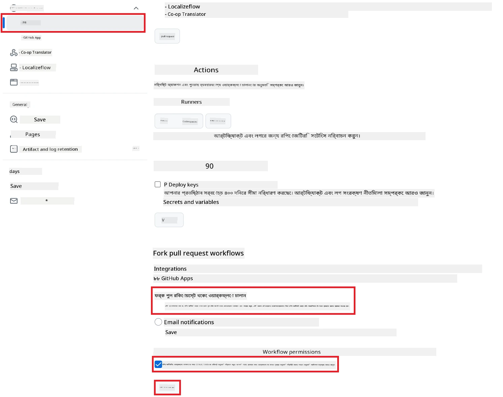

# কো-অপ ট্রান্সলেটর গিটহাব অ্যাকশন ব্যবহার করা (পাবলিক সেটআপ)

**লক্ষ্য পাঠক:** এই গাইডটি বেশিরভাগ পাবলিক বা প্রাইভেট রিপোজিটরির ব্যবহারকারীদের জন্য, যেখানে সাধারণ GitHub Actions পারমিশন যথেষ্ট। এটি বিল্ট-ইন `GITHUB_TOKEN` ব্যবহার করে।

আপনার রিপোজিটরির ডকুমেন্টেশন স্বয়ংক্রিয়ভাবে অনুবাদ করতে কো-অপ ট্রান্সলেটর গিটহাব অ্যাকশন ব্যবহার করুন। এই গাইডটি দেখাবে কিভাবে অ্যাকশনটি সেটআপ করবেন যাতে সোর্স মার্কডাউন ফাইল বা ছবি পরিবর্তন হলে স্বয়ংক্রিয়ভাবে আপডেটেড অনুবাদসহ pull request তৈরি হয়।

> [!IMPORTANT]
>
> **সঠিক গাইড নির্বাচন করুন:**
>
> এই গাইডে **সাধারণ `GITHUB_TOKEN` ব্যবহার করে সহজ সেটআপ** দেখানো হয়েছে। বেশিরভাগ ব্যবহারকারীর জন্য এটি সুপারিশকৃত পদ্ধতি, কারণ এতে সংবেদনশীল GitHub App Private Key ব্যবস্থাপনা করতে হয় না।
>

## পূর্বশর্ত

GitHub Action কনফিগার করার আগে, আপনার AI সার্ভিসের ক্রেডেনশিয়াল প্রস্তুত আছে কিনা নিশ্চিত করুন।

**১. প্রয়োজনীয়: AI Language Model Credentials**
কমপক্ষে একটি সমর্থিত Language Model-এর জন্য ক্রেডেনশিয়াল লাগবে:

- **Azure OpenAI**: Endpoint, API Key, Model/Deployment Name, API Version লাগবে।
- **OpenAI**: API Key, (ঐচ্ছিক: Org ID, Base URL, Model ID) লাগবে।
- বিস্তারিত জানতে [Supported Models and Services](../../../../README.md) দেখুন।

**২. ঐচ্ছিক: AI Vision Credentials (ছবির অনুবাদের জন্য)**

- শুধুমাত্র ছবির মধ্যে লেখা অনুবাদ করতে হলে লাগবে।
- **Azure AI Vision**: Endpoint এবং Subscription Key লাগবে।
- না দিলে, অ্যাকশন [Markdown-only mode](../markdown-only-mode.md) এ চলে যাবে।

## সেটআপ ও কনফিগারেশন

নিচের ধাপগুলো অনুসরণ করে আপনার রিপোজিটরিতে সাধারণ `GITHUB_TOKEN` ব্যবহার করে কো-অপ ট্রান্সলেটর GitHub Action কনফিগার করুন।

### ধাপ ১: অথেন্টিকেশন বুঝুন (`GITHUB_TOKEN` ব্যবহার)

এই workflow-তে GitHub Actions-এর বিল্ট-ইন `GITHUB_TOKEN` ব্যবহার করা হয়েছে। এই টোকেন স্বয়ংক্রিয়ভাবে রিপোজিটরির সাথে workflow-এর ইন্টারঅ্যাকশনের অনুমতি দেয়, যা **ধাপ ৩**-এ কনফিগার করা হবে।

### ধাপ ২: রিপোজিটরি সিক্রেট কনফিগার করুন

শুধুমাত্র আপনার **AI সার্ভিসের ক্রেডেনশিয়াল** গুলো রিপোজিটরির সেটিংসে এনক্রিপ্টেড সিক্রেট হিসেবে যোগ করতে হবে।

১.  আপনার টার্গেট GitHub রিপোজিটরিতে যান।
২.  **Settings** > **Secrets and variables** > **Actions** এ যান।
৩.  **Repository secrets**-এর নিচে, প্রতিটি প্রয়োজনীয় AI সার্ভিস সিক্রেটের জন্য **New repository secret**-এ ক্লিক করুন।

     *(ছবির রেফারেন্স: এখানে কিভাবে সিক্রেট যোগ করবেন দেখানো হয়েছে)*

**প্রয়োজনীয় AI সার্ভিস সিক্রেট (পূর্বশর্ত অনুযায়ী প্রযোজ্য সব যোগ করুন):**

| সিক্রেটের নাম                         | বিবরণ                               | ভ্যালু সোর্স                     |
| :---------------------------------- | :---------------------------------------- | :------------------------------- |
| `AZURE_AI_SERVICE_API_KEY`            | Azure AI Service (Computer Vision)-এর জন্য Key  | আপনার Azure AI Foundry               |
| `AZURE_AI_SERVICE_ENDPOINT`         | Azure AI Service (Computer Vision)-এর জন্য Endpoint | আপনার Azure AI Foundry               |
| `AZURE_OPENAI_API_KEY`              | Azure OpenAI সার্ভিসের জন্য Key              | আপনার Azure AI Foundry               |
| `AZURE_OPENAI_ENDPOINT`             | Azure OpenAI সার্ভিসের জন্য Endpoint         | আপনার Azure AI Foundry               |
| `AZURE_OPENAI_MODEL_NAME`           | আপনার Azure OpenAI Model Name              | আপনার Azure AI Foundry               |
| `AZURE_OPENAI_CHAT_DEPLOYMENT_NAME` | আপনার Azure OpenAI Deployment Name         | আপনার Azure AI Foundry               |
| `AZURE_OPENAI_API_VERSION`          | Azure OpenAI-এর API Version              | আপনার Azure AI Foundry               |
| `OPENAI_API_KEY`                    | OpenAI-এর জন্য API Key                        | আপনার OpenAI Platform              |
| `OPENAI_ORG_ID`                     | OpenAI Organization ID (ঐচ্ছিক)         | আপনার OpenAI Platform              |
| `OPENAI_CHAT_MODEL_ID`              | নির্দিষ্ট OpenAI model ID (ঐচ্ছিক)       | আপনার OpenAI Platform              |
| `OPENAI_BASE_URL`                   | কাস্টম OpenAI API Base URL (ঐচ্ছিক)     | আপনার OpenAI Platform              |

### ধাপ ৩: Workflow Permission কনফিগার করুন

GitHub Action-কে `GITHUB_TOKEN`-এর মাধ্যমে কোড checkout ও pull request তৈরি করার অনুমতি দিতে হবে।

১.  রিপোজিটরিতে যান, **Settings** > **Actions** > **General** এ যান।
২.  **Workflow permissions** সেকশনে স্ক্রল করুন।
৩.  **Read and write permissions** নির্বাচন করুন। এতে `GITHUB_TOKEN`-কে এই workflow-এর জন্য `contents: write` এবং `pull-requests: write` পারমিশন দেয়া হবে।
৪.  **Allow GitHub Actions to create and approve pull requests** চেকবক্সটি **চেক** করুন।
৫.  **Save** নির্বাচন করুন।



### ধাপ ৪: Workflow ফাইল তৈরি করুন

শেষে, `GITHUB_TOKEN` ব্যবহার করে স্বয়ংক্রিয় workflow-এর YAML ফাইল তৈরি করুন।

১.  রিপোজিটরির root ডিরেক্টরিতে `.github/workflows/` ডিরেক্টরি না থাকলে তৈরি করুন।
২.  `.github/workflows/`-এর ভিতরে `co-op-translator.yml` নামে একটি ফাইল তৈরি করুন।
৩.  নিচের কনটেন্টটি `co-op-translator.yml`-এ পেস্ট করুন।

```yaml
name: Co-op Translator

on:
  push:
    branches:
      - main

jobs:
  co-op-translator:
    runs-on: ubuntu-latest

    permissions:
      contents: write
      pull-requests: write

    steps:
      - name: Checkout repository
        uses: actions/checkout@v4
        with:
          fetch-depth: 0

      - name: Set up Python
        uses: actions/setup-python@v4
        with:
          python-version: '3.10'

      - name: Install Co-op Translator
        run: |
          python -m pip install --upgrade pip
          pip install co-op-translator

      - name: Run Co-op Translator
        env:
          PYTHONIOENCODING: utf-8
          # === AI Service Credentials ===
          AZURE_AI_SERVICE_API_KEY: ${{ secrets.AZURE_AI_SERVICE_API_KEY }}
          AZURE_AI_SERVICE_ENDPOINT: ${{ secrets.AZURE_AI_SERVICE_ENDPOINT }}
          AZURE_OPENAI_API_KEY: ${{ secrets.AZURE_OPENAI_API_KEY }}
          AZURE_OPENAI_ENDPOINT: ${{ secrets.AZURE_OPENAI_ENDPOINT }}
          AZURE_OPENAI_MODEL_NAME: ${{ secrets.AZURE_OPENAI_MODEL_NAME }}
          AZURE_OPENAI_CHAT_DEPLOYMENT_NAME: ${{ secrets.AZURE_OPENAI_CHAT_DEPLOYMENT_NAME }}
          AZURE_OPENAI_API_VERSION: ${{ secrets.AZURE_OPENAI_API_VERSION }}
          OPENAI_API_KEY: ${{ secrets.OPENAI_API_KEY }}
          OPENAI_ORG_ID: ${{ secrets.OPENAI_ORG_ID }}
          OPENAI_CHAT_MODEL_ID: ${{ secrets.OPENAI_CHAT_MODEL_ID }}
          OPENAI_BASE_URL: ${{ secrets.OPENAI_BASE_URL }}
        run: |
          # =====================================================================
          # IMPORTANT: Set your target languages here (REQUIRED CONFIGURATION)
          # =====================================================================
          # Example: Translate to Spanish, French, German. Add -y to auto-confirm.
          translate -l "es fr de" -y  # <--- MODIFY THIS LINE with your desired languages

      - name: Create Pull Request with translations
        uses: peter-evans/create-pull-request@v5
        with:
          token: ${{ secrets.GITHUB_TOKEN }}
          commit-message: "🌐 Update translations via Co-op Translator"
          title: "🌐 Update translations via Co-op Translator"
          body: |
            This PR updates translations for recent changes to the main branch.

            ### 📋 Changes included
            - Translated contents are available in the `translations/` directory
            - Translated images are available in the `translated_images/` directory

            ---
            🌐 Automatically generated by the [Co-op Translator](https://github.com/Azure/co-op-translator) GitHub Action.
          branch: update-translations
          base: main
          labels: translation, automated-pr
          delete-branch: true
          add-paths: |
            translations/
            translated_images/
```

৪.  **Workflow কাস্টমাইজ করুন:**
  - **[!IMPORTANT] টার্গেট ভাষা:** `Run Co-op Translator` স্টেপে, `translate -l "..." -y` কমান্ডের মধ্যে ভাষার কোডের তালিকা **পর্যালোচনা ও পরিবর্তন করা আবশ্যক** যাতে আপনার প্রকল্পের চাহিদা অনুযায়ী হয়। উদাহরণ তালিকা (`ar de es...`) পরিবর্তন বা ঠিক করতে হবে।
  - **Trigger (`on:`):** বর্তমান trigger `main`-এ প্রতিটি push-এ রান হয়। বড় রিপোজিটরির জন্য, `paths:` ফিল্টার যোগ করার কথা ভাবুন (YAML-এ কমেন্ট করা উদাহরণ দেখুন) যাতে workflow শুধুমাত্র প্রাসঙ্গিক ফাইল (যেমন সোর্স ডকুমেন্টেশন) পরিবর্তন হলে চলে, runner মিনিট বাঁচাতে।
  - **PR Details:** `Create Pull Request` স্টেপে `commit-message`, `title`, `body`, `branch` নাম, এবং `labels` কাস্টমাইজ করুন যদি দরকার হয়।

## Workflow চালানো

> [!WARNING]  
> **GitHub-hosted Runner Time Limit:**  
> GitHub-hosted runner যেমন `ubuntu-latest`-এর **সর্বোচ্চ রান টাইম ৬ ঘণ্টা**।  
> বড় ডকুমেন্টেশন রিপোজিটরির ক্ষেত্রে, অনুবাদ প্রক্রিয়া ৬ ঘণ্টা ছাড়িয়ে গেলে workflow স্বয়ংক্রিয়ভাবে বন্ধ হয়ে যাবে।  
> এটি এড়াতে:  
> - **Self-hosted runner** ব্যবহার করুন (কোনো টাইম লিমিট নেই)  
> - প্রতি রান-এ টার্গেট ভাষার সংখ্যা কমান

`co-op-translator.yml` ফাইলটি আপনার main branch-এ (বা `on:` trigger-এ নির্দিষ্ট branch-এ) merge হলে, ওই branch-এ পরিবর্তন push হলেই (এবং `paths` ফিল্টার থাকলে মিললে) workflow স্বয়ংক্রিয়ভাবে চলবে।

---

**অস্বীকৃতি**:
এই নথিটি AI অনুবাদ পরিষেবা [Co-op Translator](https://github.com/Azure/co-op-translator) ব্যবহার করে অনুবাদ করা হয়েছে। আমরা যথাসাধ্য নির্ভুলতা বজায় রাখার চেষ্টা করি, তবে অনুগ্রহ করে মনে রাখবেন যে স্বয়ংক্রিয় অনুবাদে ভুল বা অসঙ্গতি থাকতে পারে। মূল ভাষায় লেখা নথিটিই কর্তৃত্বপূর্ণ উৎস হিসেবে বিবেচিত হবে। গুরুত্বপূর্ণ তথ্যের জন্য পেশাদার মানব অনুবাদ সুপারিশ করা হয়। এই অনুবাদের ব্যবহারের ফলে কোনো ভুল বোঝাবুঝি বা ভুল ব্যাখ্যার জন্য আমরা দায়ী নই।