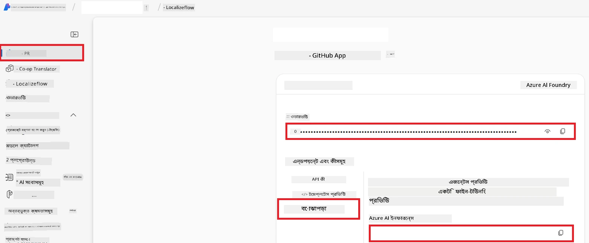

# Co-op Translator এর জন্য Azure AI সেট আপ করুন (Azure OpneAI & Azure AI Vision)

এই গাইডটি আপনাকে Azure AI Foundry এর মধ্যে ভাষা অনুবাদের জন্য Azure OpenAI এবং ছবি ভিত্তিক অনুবাদে ব্যবহারের জন্য Azure Computer Vision সেট আপ করার ধাপগুলি দেখাবে।

**প্রয়োজনীয়তা:**
- একটি সক্রিয় সাবস্ক্রিপশনসহ Azure অ্যাকাউন্ট।
- আপনার Azure সাবস্ক্রিপশনে রিসোর্স এবং ডিপ্লয়মেন্ট তৈরি করার যথেষ্ট অনুমতি।

## একটি Azure AI প্রকল্প তৈরি করুন

আপনি প্রথমে একটি Azure AI প্রকল্প তৈরি করবেন, যা আপনার AI রিসোর্সগুলি পরিচালনার জন্য একটি কেন্দ্রীয় স্থান হিসেবে কাজ করবে।

1. [https://ai.azure.com](https://ai.azure.com) এ যান এবং আপনার Azure অ্যাকাউন্ট দিয়ে সাইন ইন করুন।

1. নতুন একটি প্রকল্প তৈরি করতে **+Create** সিলেক্ট করুন।

1. নিম্নলিখিত কাজগুলো করুন:
   - একটি **Project name** দিন (যেমন, `CoopTranslator-Project`)।
   - **AI hub** নির্বাচন করুন (যেমন, `CoopTranslator-Hub`) (প্রয়োজনে নতুন একটি তৈরি করুন)।

1. আপনার প্রকল্প সেট আপ করতে "**Review and Create**" ক্লিক করুন। আপনাকে আপনার প্রকল্পের ওভারভিউ পৃষ্ঠায় নিয়ে যাওয়া হবে।

## ভাষা অনুবাদের জন্য Azure OpenAI সেট আপ করুন

আপনার প্রকল্পের মধ্যে, আপনি একটি Azure OpenAI মডেল ডিপ্লয় করবেন যা টেক্সট অনুবাদের ব্যাকএন্ড হিসেবে কাজ করবে।

### আপনার প্রকল্পে যান

যদি এখনও না যান, নতুন তৈরি করা প্রকল্পটি (যেমন, `CoopTranslator-Project`) Azure AI Foundry তে খুলুন।

### একটি OpenAI মডেল ডিপ্লয় করুন

1. আপনার প্রকল্পের বাম পাশে "My assets" এর নিচে "**Models + endpoints**" নির্বাচন করুন।

1. **+ Deploy model** সিলেক্ট করুন।

1. **Deploy Base Model** নির্বাচন করুন।

1. উপলব্ধ মডেলগুলোর একটি তালিকা দেখানো হবে। একটি উপযুক্ত GPT মডেল ফিল্টার বা সার্চ করুন। আমরা `gpt-4o` সুপারিশ করছি।

1. আপনার পছন্দের মডেল নির্বাচন করুন এবং **Confirm** ক্লিক করুন।

1. **Deploy** সিলেক্ট করুন।

### Azure OpenAI কনফিগারেশন

ডিপ্লয় করার পর, আপনি "**Models + endpoints**" পৃষ্ঠাতে গিয়ে এর **REST endpoint URL**, **Key**, **Deployment name**, **Model name** এবং **API version** দেখতে পারবেন। এইগুলো আপনার অ্যাপ্লিকেশনেই অনুবাদ মডেল ইন্টিগ্রেট করার জন্য প্রয়োজন হবে।

> [!NOTE]
> আপনি আপনার প্রয়োজন অনুসারে [API version deprecation](https://learn.microsoft.com/azure/ai-services/openai/api-version-deprecation) পৃষ্ঠা থেকে API ভার্সন নির্বাচন করতে পারেন। লক্ষ্য করুন যে **API version** এবং Azure AI Foundry এর **Models + endpoints** পৃষ্ঠায় দেখানো **Model version** ভিন্ন।

## ইমেজ অনুবাদের জন্য Azure Computer Vision সেট আপ করুন

ছবির মধ্যে পাঠ্যের অনুবাদ সক্ষম করতে, আপনাকে Azure AI Service এর API Key এবং Endpoint খুঁজে বের করতে হবে।

1. আপনার Azure AI প্রকল্প (যেমন, `CoopTranslator-Project`) এ যান। নিশ্চিত করুন আপনি প্রকল্প ওভারভিউ পৃষ্ঠায় আছেন।

### Azure AI Service কনফিগারেশন

Azure AI Service থেকে API Key এবং Endpoint খুঁজে বের করুন।

1. আপনার Azure AI প্রকল্প (যেমন, `CoopTranslator-Project`) এ যান। নিশ্চিত করুন আপনি প্রকল্প ওভারভিউ পৃষ্ঠায় আছেন।

1. Azure AI Service ট্যাব থেকে **API Key** এবং **Endpoint** খুঁজুন।

    

এই সংযোগটি লিঙ্ক করা Azure AI Services রিসোর্সের ক্ষমতাগুলো (ছবি বিশ্লেষণ সহ) আপনার AI Foundry প্রকল্পে উপলব্ধ করে তোলে। এরপর আপনি এই সংযোগটি ব্যবহার করে আপনার নোটবুক কিংবা অ্যাপ্লিকেশনে ছবি থেকে পাঠ্য বের করতে পারেন, যা পরে Azure OpenAI মডেলে অনুবাদের জন্য পাঠানো যাবে।

## আপনার ক্রেডেনশিয়ালগুলো একত্রিত করা

এখন পর্যন্ত, আপনার কাছে নিম্নলিখিত তথ্য থাকা উচিত:

**Azure OpenAI (টেক্সট অনুবাদ) এর জন্য:**
- Azure OpenAI Endpoint
- Azure OpenAI API Key
- Azure OpenAI Model Name (যেমন, `gpt-4o`)
- Azure OpenAI Deployment Name (যেমন, `cooptranslator-gpt4o`)
- Azure OpenAI API Version

**Azure AI Services (দৃষ্টি দ্বারা ইমেজ টেক্সট নির্যাস) এর জন্য:**
- Azure AI Service Endpoint
- Azure AI Service API Key

### উদাহরণ: পরিবেশ পরিবর্তনশীল কনফিগারেশন (প্রিভিউ)

পরবর্তীতে, যখন আপনি আপনার অ্যাপ্লিকেশন তৈরি করবেন, তখন সম্ভবত এই সংগ্রহীত ক্রেডেনশিয়ালগুলো পরিবেশ পরিবর্তনশীলে কনফিগার করবেন। যেমন:

```bash
# Azure AI সার্ভিস ক্রেডেনশিয়ালস (ছবির অনুবাদের জন্য প্রয়োজন)
AZURE_AI_SERVICE_API_KEY="your_azure_ai_service_api_key" # যেমন, 21xasd...
AZURE_AI_SERVICE_ENDPOINT="https://your_azure_ai_service_endpoint.cognitiveservices.azure.com/"

# ঐচ্ছিক ব্যাকআপ সেট: _1/_2 সাথের সাথে ডুপ্লিকেট ভেরিয়েবলগুলি (সেটের সব ভেরিয়েবলের জন্য একই সূচক)
AZURE_AI_SERVICE_API_KEY_1="your_azure_ai_service_api_key_1"
AZURE_AI_SERVICE_ENDPOINT_1="https://your_azure_ai_service_endpoint_1.cognitiveservices.azure.com/"

# Azure OpenAI ক্রেডেনশিয়ালস (লেখার অনুবাদের জন্য প্রয়োজন)
AZURE_OPENAI_API_KEY="your_azure_openai_api_key" # যেমন, 21xasd...
AZURE_OPENAI_ENDPOINT="https://your_azure_openai_endpoint.openai.azure.com/"
AZURE_OPENAI_MODEL_NAME="your_model_name" # যেমন, gpt-4o
AZURE_OPENAI_CHAT_DEPLOYMENT_NAME="your_deployment_name" # যেমন, cooptranslator-gpt4o
AZURE_OPENAI_API_VERSION="your_api_version" # যেমন, 2024-12-01-preview

# ঐচ্ছিক ব্যাকআপ সেট: সম্পূর্ণ AZURE_OPENAI_* সেটটি _1/_2 সাথের সাথে ডুপ্লিকেট করুন (সকল ভেরিয়েবলের জন্য একই সূচক)
```

---

### আরও পড়ুন

- [Azure AI Foundry তে একটি প্রকল্প কীভাবে তৈরি করবেন](https://learn.microsoft.com/azure/ai-foundry/how-to/create-projects?tabs=ai-studio)
- [Azure AI রিসোর্স কীভাবে তৈরি করবেন](https://learn.microsoft.com/azure/ai-foundry/how-to/create-azure-ai-resource?tabs=portal)
- [Azure AI Foundry তে OpenAI মডেল কীভাবে ডিপ্লয় করবেন](https://learn.microsoft.com/en-us/azure/ai-foundry/how-to/deploy-models-openai)

---

<!-- CO-OP TRANSLATOR DISCLAIMER START -->
**অস্বীকারোক্তি**:  
এই নথিটি AI অনুবাদ সেবা [Co-op Translator](https://github.com/Azure/co-op-translator) ব্যবহার করে অনুবাদ করা হয়েছে। আমরা সঠিকতার জন্য চেষ্টা করি, তবে স্বয়ংক্রিয় অনুবাদে ভুল বা সম্ভাব্য অসঙ্গতি থাকতে পারে। মূল নথির স্থানীয় ভাষার সংস্করণই কর্তৃত্বপূর্ণ উৎস হিসেবে বিবেচিত হওয়া উচিত। গুরুত্বপূর্ণ তথ্যের জন্য পেশাদার মানব অনুবাদ করার পরামর্শ করা হয়। এই অনুবাদ ব্যবহারের ফলে যে কোন ভুলবোঝাবুঝি বা ভুল ব্যাখ্যার জন্য আমরা দায়ী নই।
<!-- CO-OP TRANSLATOR DISCLAIMER END -->