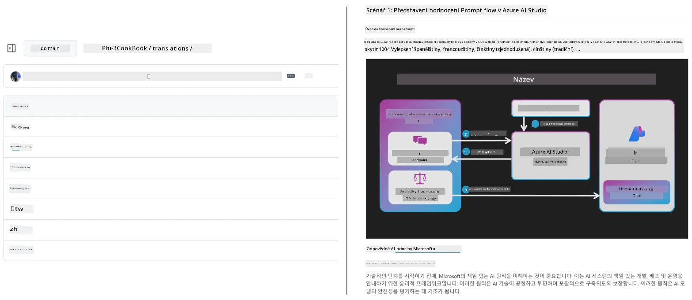
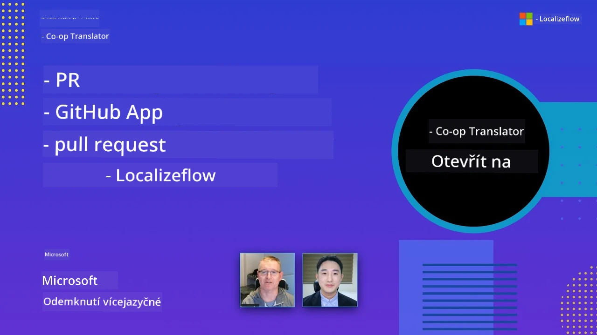

# Co-op Translator

_Snadná automatizace a údržba překladů vašeho vzdělávacího obsahu na GitHubu do více jazyků, jak se váš projekt vyvíjí._


[](https://pypi.org/project/co-op-translator/)
[](https://github.com/azure/co-op-translator/blob/main/LICENSE)
[](https://pepy.tech/project/co-op-translator)
[](https://pepy.tech/project/co-op-translator)
[](https://github.com/azure/co-op-translator/pkgs/container/co-op-translator)
[](https://github.com/psf/black)

[](https://GitHub.com/azure/co-op-translator/graphs/contributors/)
[](https://GitHub.com/azure/co-op-translator/issues/)
[](https://GitHub.com/azure/co-op-translator/pulls/)
[](http://makeapullrequest.com)

### 🌐 Podpora více jazyků

#### Podporováno pomocí [Co-op Translator](https://github.com/Azure/Co-op-Translator)

<!-- CO-OP TRANSLATOR LANGUAGES TABLE START -->
[Arabština](../ar/README.md) | [Bengálština](../bn/README.md) | [Bulharština](../bg/README.md) | [Barmština (Myanmar)](../my/README.md) | [Čínština (zjednodušená)](../zh-CN/README.md) | [Čínština (tradiční, Hong Kong)](../zh-HK/README.md) | [Čínština (tradiční, Macao)](../zh-MO/README.md) | [Čínština (tradiční, Tchaj-wan)](../zh-TW/README.md) | [Chorvatština](../hr/README.md) | [Čeština](./README.md) | [Dánština](../da/README.md) | [Nizozemština](../nl/README.md) | [Estonština](../et/README.md) | [Finština](../fi/README.md) | [Francouzština](../fr/README.md) | [Němčina](../de/README.md) | [Řečtina](../el/README.md) | [Hebrejština](../he/README.md) | [Hindština](../hi/README.md) | [Maďarština](../hu/README.md) | [Indonéština](../id/README.md) | [Italština](../it/README.md) | [Japonština](../ja/README.md) | [Kannadština](../kn/README.md) | [Khmerština](../km/README.md) | [Korejština](../ko/README.md) | [Litevština](../lt/README.md) | [Malajština](../ms/README.md) | [Malajalámština](../ml/README.md) | [Maráthština](../mr/README.md) | [Nepálština](../ne/README.md) | [Nigerijská pidžin](../pcm/README.md) | [Norština](../no/README.md) | [Perština (Farsi)](../fa/README.md) | [Polština](../pl/README.md) | [Portugalština (Brazílie)](../pt-BR/README.md) | [Portugalština (Portugalsko)](../pt-PT/README.md) | [Pandžábština (Gurmukhi)](../pa/README.md) | [Rumunština](../ro/README.md) | [Ruština](../ru/README.md) | [Srbština (cyrilice)](../sr/README.md) | [Slovenština](../sk/README.md) | [Slovinština](../sl/README.md) | [Španělština](../es/README.md) | [Suahelština](../sw/README.md) | [Švédština](../sv/README.md) | [Tagalog (filipínština)](../tl/README.md) | [Tamilština](../ta/README.md) | [Telugština](../te/README.md) | [Thajština](../th/README.md) | [Turečtina](../tr/README.md) | [Ukrajinština](../uk/README.md) | [Urdu](../ur/README.md) | [Vietnamština](../vi/README.md)

> **Raději klonovat lokálně?**
>
> Toto úložiště obsahuje 50+ jazykových překladů, což výrazně zvětšuje velikost stahování. Pro klonování bez překladů použijte sparse checkout:
>
> **Bash / macOS / Linux:**
> ```bash
> git clone --filter=blob:none --sparse https://github.com/skytin1004/co-op-translator.git
> cd co-op-translator
> git sparse-checkout set --no-cone '/*' '!translations' '!translated_images'
> ```
>
> **CMD (Windows):**
> ```cmd
> git clone --filter=blob:none --sparse https://github.com/skytin1004/co-op-translator.git
> cd co-op-translator
> git sparse-checkout set --no-cone "/*" "!translations" "!translated_images"
> ```
>
> Díky tomu získáte vše potřebné ke zvládnutí kurzu s mnohem rychlejším stažením.
<!-- CO-OP TRANSLATOR LANGUAGES TABLE END -->

[](https://GitHub.com/azure/co-op-translator/watchers/)
[](https://GitHub.com/azure/co-op-translator/network/)
[](https://GitHub.com/azure/co-op-translator/stargazers/)

[](https://discord.gg/nTYy5BXMWG)

[](https://codespaces.new/azure/co-op-translator)

## Přehled

**Co-op Translator** vám pomáhá snadno lokalizovat váš vzdělávací obsah na GitHubu do více jazyků.
Když aktualizujete své Markdown soubory, obrázky nebo notebooky, překlady zůstávají automaticky synchronizované, což zajišťuje, že váš obsah zůstává přesný a aktuální pro studenty po celém světě.

Příklad, jak je přeložený obsah organizován:



## Jak je spravován stav překladu

Co-op Translator spravuje přeložený obsah jako **verzované softwarové artefakty**,  
nikoli jako statické soubory.

Nástroj sleduje stav přeložených Markdown, obrázků a notebooků pomocí **metadata orientovaných na jazyk**.

Tento design umožňuje Co-op Translator:

- Spolehlivě detekovat zastaralé překlady
- Zacházet konzistentně s Markdown, obrázky a notebooky
- Bezpečně škálovat napříč velkými, rychle se vyvíjejícími, vícejazyčnými repozitáři

Modelováním překladů jako spravovaných artefaktů
jsou překladatelské pracovní postupy přirozeně sladěny s moderní
správou softwarových závislostí a artefaktů.

→ [Jak je spravován stav překladu](https://techcommunity.microsoft.com/blog/azuredevcommunityblog/rethinking-documentation-translation-treating-translations-as-versioned-software/4491755)


## Rychlý start

```bash
# Vytvořte a aktivujte virtuální prostředí (doporučeno)
python -m venv .venv
# Windows
.venv\Scripts\activate
# macOS/Linux
source .venv/bin/activate
# Nainstalujte balíček
pip install co-op-translator
# Přeložit
translate -l "ko ja fr" -md
```

Docker:

```bash
# Stáhněte veřejný obraz z GHCR
docker pull ghcr.io/azure/co-op-translator:latest
# Spusťte se současnou složkou připojenou a poskytnutým souborem .env (Bash/Zsh)
docker run --rm -it --env-file .env -v "${PWD}:/work" ghcr.io/azure/co-op-translator:latest -l "ko ja fr" -md
```

## Minimální nastavení

1. Ověřte, že máte podporovanou verzi Pythonu (aktuálně 3.10-3.12). V poetry (pyproject.toml) je to řešeno automaticky.
2. Vytvořte soubor `.env` pomocí šablony: [.env.template](../../.env.template)
3. Nakonfigurujte jednoho poskytovatele LLM (Azure OpenAI nebo OpenAI)
4. (Volitelné) Pro překlad obrázků (`-img`) nakonfigurujte Azure AI Vision
5. (Volitelné) Můžete nakonfigurovat více sad přihlašovacích údajů duplikací proměnných se suffixy jako `_1`, `_2` atd. Všechny proměnné v sadě musí sdílet stejný suffix.
6. (Doporučeno) Vyčistěte případné předchozí překlady, abyste předešli konfliktům (např. `translations/`)
7. (Doporučeno) Přidejte sekci o překladu do vašeho README pomocí [README language template](./getting_started/README_languages_template.md)
8. Viz: [Nastavení Azure AI](./getting_started/set-up-azure-ai.md)

## Použití

Přeložte všechny podporované typy:

```bash
translate -l "ko ja"
```

Pouze Markdown:

```bash
translate -l "de" -md
```

Markdown + obrázky:

```bash
translate -l "pt" -md -img
```

Pouze notebooky:

```bash
translate -l "zh" -nb
```

Více příznaků: [Reference příkazů](./getting_started/command-reference.md)

## Funkce

- Automatizovaný překlad Markdown, notebooků a obrázků
- Udržuje překlady synchronizované se změnami zdroje
- Funguje lokálně (CLI) nebo v CI (GitHub Actions)
- Používá Azure OpenAI nebo OpenAI; volitelně Azure AI Vision pro obrázky
- Zachovává formátování a strukturu Markdown

## Dokumentace

- [Průvodce příkazovou řádkou](./getting_started/command-line-guide/command-line-guide.md)
- [Průvodce GitHub Actions (veřejné repozitáře & standardní tajemství)](./getting_started/github-actions-guide/github-actions-guide-public.md)
- [Průvodce GitHub Actions (repozitáře Microsoft organizace & nastavení na úrovni organizace)](./getting_started/github-actions-guide/github-actions-guide-org.md)
- [Šablona README jazyků](./getting_started/README_languages_template.md)
- [Podporované jazyky](./getting_started/supported-languages.md)
- [Přispívání](./CONTRIBUTING.md)
- [Řešení problémů](./getting_started/troubleshooting.md)

### Průvodce specifický pro Microsoft
> [!NOTE]
> Pouze pro správce repozitářů Microsoft „Pro začátečníky“.

- [Aktualizace seznamu „jiných kurzů“ (pouze pro MS Beginners repozitáře)](./getting_started/update-other-courses.md)

## Podpořte nás a podpořte globální vzdělávání

Přidejte se k nám ve zlepšování způsobu, jakým se vzdělávací obsah sdílí globálně! Dejte [Co-op Translator](https://github.com/azure/co-op-translator) ⭐ na GitHubu a podpořte naši misi rozbíjet jazykové bariéry ve vzdělávání a technologiích. Váš zájem a příspěvky mají významný dopad! Příspěvky kódu a návrhy funkcí jsou vždy vítány.

### Objevte vzdělávací obsah Microsoft ve svém jazyce

- [LangChain4j-pro-začátečníky](https://github.com/microsoft/LangChain4j-for-Beginners)
- [AZD pro začátečníky](https://github.com/microsoft/AZD-for-beginners)
- [Edge AI pro začátečníky](https://github.com/microsoft/edgeai-for-beginners)
- [Model Context Protocol (MCP) pro začátečníky](https://github.com/microsoft/mcp-for-beginners)
- [AI agenti pro začátečníky](https://github.com/microsoft/ai-agents-for-beginners)
- [Generativní AI pro začátečníky s .NET](https://github.com/microsoft/Generative-AI-for-beginners-dotnet)
- [Generativní AI pro začátečníky](https://github.com/microsoft/generative-ai-for-beginners)
- [Generativní AI pro začátečníky s Javou](https://github.com/microsoft/generative-ai-for-beginners-java)
- [ML pro začátečníky](https://aka.ms/ml-beginners)
- [Data Science pro začátečníky](https://aka.ms/datascience-beginners)
- [AI pro začátečníky](https://aka.ms/ai-beginners)
- [Kyberbezpečnost pro začátečníky](https://github.com/microsoft/Security-101)
- [Web vývoj pro začátečníky](https://aka.ms/webdev-beginners)
- [IoT pro začátečníky](https://aka.ms/iot-beginners)
- [PhiCookBook](https://github.com/microsoft/PhiCookBook)

## Video prezentace

👉 Klikněte na obrázek níže a sledujte na YouTube.

- **Open at Microsoft**: Stručný 18 minutový úvod a rychlý průvodce, jak používat Co-op Translator.

  [](https://www.youtube.com/watch?v=jX_swfH_KNU)

## Přispívání

Tento projekt vítá příspěvky a návrhy. Máte zájem přispět do Azure Co-op Translator? Podívejte se prosím na naše [CONTRIBUTING.md](./CONTRIBUTING.md) pro pokyny, jak pomoci zpřístupnit Co-op Translator širšímu publiku.

## Přispěvatelé
[](https://github.com/Azure/co-op-translator/graphs/contributors)

## Kod chování

Tento projekt přijal [Kodex chování otevřeného zdroje Microsoft](https://opensource.microsoft.com/codeofconduct/).
Pro více informací viz [FAQ Kodexu chování](https://opensource.microsoft.com/codeofconduct/faq/) nebo
kontaktujte [opencode@microsoft.com](mailto:opencode@microsoft.com) s případnými dalšími dotazy či poznámkami.

## Odpovědná AI

Microsoft je zavázán pomáhat našim zákazníkům používat naše AI produkty odpovědně, sdílet naše poznatky a budovat partnerství založená na důvěře prostřednictvím nástrojů, jako jsou Poznámky o transparentnosti a Hodnocení dopadů. Mnoho z těchto zdrojů najdete na [https://aka.ms/RAI](https://aka.ms/RAI).
Přístup Microsoftu k odpovědné AI je založen na našich principech AI: spravedlnost, spolehlivost a bezpečnost, soukromí a zabezpečení, inkluzivnost, transparentnost a odpovědnost.

Velké modely pro zpracování přirozeného jazyka, obrazu a řeči – jako ty použité v tomto příkladu – se mohou potenciálně chovat nespravedlivě, nespolehlivě nebo urážlivě, což může způsobit škody. Prosím, prostudujte [Poznámku o transparentnosti služby Azure OpenAI](https://learn.microsoft.com/legal/cognitive-services/openai/transparency-note?tabs=text), abyste byli informováni o rizicích a omezeních.

Doporučeným přístupem k omezení těchto rizik je začlenění bezpečnostního systému do vaší architektury, který dokáže detekovat a předcházet škodlivému chování. [Azure AI Content Safety](https://learn.microsoft.com/azure/ai-services/content-safety/overview) nabízí nezávislou vrstvu ochrany, schopnou rozpoznat škodlivý uživatelsky generovaný a AI generovaný obsah v aplikacích a službách. Azure AI Content Safety zahrnuje textové a obrazové API, která vám umožní detekovat škodlivý materiál. Máme také interaktivní Content Safety Studio, které vám umožní zobrazit, prozkoumat a vyzkoušet vzorový kód pro detekci škodlivého obsahu napříč různými modalitami. Následující [rychlý start dokumentace](https://learn.microsoft.com/azure/ai-services/content-safety/quickstart-text?tabs=visual-studio%2Clinux&pivots=programming-language-rest) vás provede vytvářením požadavků na službu.

Dalším aspektem, který je třeba vzít v úvahu, je celkový výkon aplikace. U multimodálních a multimodelových aplikací považujeme výkon za to, že systém funguje tak, jak vy a vaši uživatelé očekáváte, včetně negenerování škodlivých výsledků. Je důležité vyhodnotit výkon vaší celkové aplikace pomocí [metrík kvality generování a rizika a bezpečnosti](https://learn.microsoft.com/azure/ai-studio/concepts/evaluation-metrics-built-in).

Svoji AI aplikaci můžete vyhodnotit ve svém vývojovém prostředí pomocí [prompt flow SDK](https://microsoft.github.io/promptflow/index.html). S použitím testovacího datasetu nebo cíle jsou generace vaší generativní AI aplikace kvantitativně měřeny vestavěnými hodnotiteli nebo vámi zvolenými vlastními hodnotiteli. Pro začátek s prompt flow sdk při hodnocení vašeho systému můžete postupovat podle [průvodce rychlým startem](https://learn.microsoft.com/azure/ai-studio/how-to/develop/flow-evaluate-sdk). Po spuštění hodnotícího běhu můžete [vizualizovat výsledky v Azure AI Studio](https://learn.microsoft.com/azure/ai-studio/how-to/evaluate-flow-results).

## Ochranné známky

Tento projekt může obsahovat ochranné známky nebo loga projektů, produktů či služeb. Autorizované použití ochranných známek nebo log Microsoft podléhá a musí dodržovat
[Pravidla použití ochranných známek a značek Microsoft](https://www.microsoft.com/en-us/legal/intellectualproperty/trademarks/usage/general).
Použití ochranných známek nebo log Microsoft v pozměněných verzích tohoto projektu nesmí vést ke zmatku ani naznačovat podporu Microsoftu.
Jakékoliv použití ochranných známek nebo log třetích stran podléhá pravidlům těchto třetích stran.

## Získání pomoci

Pokud narazíte na problém nebo máte dotazy ohledně vytváření AI aplikací, připojte se:

[](https://discord.gg/nTYy5BXMWG)

Máte-li zpětnou vazbu k produktu nebo se při vývoji vyskytly chyby, navštivte:

[](https://aka.ms/foundry/forum)

---

<!-- CO-OP TRANSLATOR DISCLAIMER START -->
**Prohlášení o vyloučení odpovědnosti**:
Tento dokument byl přeložen pomocí AI překladatelské služby [Co-op Translator](https://github.com/Azure/co-op-translator). Přestože usilujeme o přesnost, mějte prosím na paměti, že automatizované překlady mohou obsahovat chyby nebo nepřesnosti. Původní dokument v jeho mateřském jazyce by měl být považován za autoritativní zdroj. Pro důležité informace se doporučuje profesionální lidský překlad. Nejsme odpovědní za jakékoliv nedorozumění nebo nesprávné výklady vyplývající z použití tohoto překladu.
<!-- CO-OP TRANSLATOR DISCLAIMER END -->