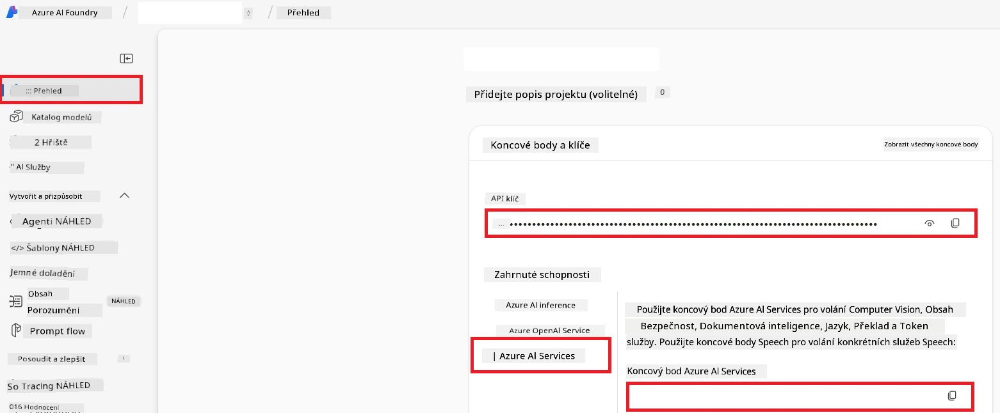

# Nastavení Azure AI pro Co-op Translator (Azure OpenAI & Azure AI Vision)

Tento průvodce vás provede nastavením Azure OpenAI pro překlad jazyka a Azure Computer Vision pro analýzu obsahu obrázků (která pak může být použita pro překlad založený na obrázcích) v rámci Azure AI Foundry.

**Požadavky:**
- Účet Azure s aktivním předplatným.
- Dostatečná oprávnění k vytváření zdrojů a nasazení ve vašem předplatném Azure.

## Vytvoření projektu Azure AI

Začnete vytvořením projektu Azure AI, který slouží jako centrální místo pro správu vašich AI zdrojů.

1. Přejděte na [https://ai.azure.com](https://ai.azure.com) a přihlaste se pomocí vašeho účtu Azure.

1. Vyberte **+Create** pro vytvoření nového projektu.

1. Proveďte následující kroky:
   - Zadejte **Název projektu** (např. `CoopTranslator-Project`).
   - Vyberte **AI hub** (např. `CoopTranslator-Hub`) (v případě potřeby vytvořte nový).

1. Klikněte na "**Review and Create**" pro založení projektu. Budete přesměrováni na stránku přehledu projektu.

## Nastavení Azure OpenAI pro překlad jazyků

V rámci vašeho projektu nasadíte model Azure OpenAI, který bude sloužit jako backend pro překlad textu.

### Přejděte do vašeho projektu

Pokud tam ještě nejste, otevřete svůj nově vytvořený projekt (např. `CoopTranslator-Project`) v Azure AI Foundry.

### Nasazení modelu OpenAI

1. V levém menu vašeho projektu, pod „My assets“, vyberte "**Models + endpoints**".

1. Zvolte **+ Deploy model**.

1. Vyberte **Deploy Base Model**.

1. Zobrazí se seznam dostupných modelů. Filtrovat nebo vyhledejte vhodný GPT model. Doporučujeme `gpt-4o`.

1. Vyberte požadovaný model a klikněte na **Confirm**.

1. Vyberte **Deploy**.

### Konfigurace Azure OpenAI

Po nasazení můžete vybrat nasazení na stránce "**Models + endpoints**" a získat jeho **REST endpoint URL**, **Klíč**, **Název nasazení**, **Název modelu** a **Verzi API**. Tyto údaje budete potřebovat pro integraci překladového modelu do vaší aplikace.

> [!NOTE]
> Verze API si můžete vybrat z [API version deprecation](https://learn.microsoft.com/azure/ai-services/openai/api-version-deprecation) stránky dle vašich požadavků. Uvědomte si, že **verze API** se liší od **verze modelu**, která je zobrazena na stránce **Models + endpoints** v Azure AI Foundry.

## Nastavení Azure Computer Vision pro překlad textu v obrázcích

Pro umožnění překladu textu v obrázcích je potřeba získat API klíč a endpoint Azure AI Services.

1. Přejděte do vašeho projektu Azure AI (např. `CoopTranslator-Project`). Ujistěte se, že jste na stránce přehledu projektu.

### Konfigurace Azure AI Service

Najděte API klíč a endpoint z Azure AI Service.

1. Přejděte do vašeho projektu Azure AI (např. `CoopTranslator-Project`). Ujistěte se, že jste na stránce přehledu projektu.

1. Najděte **API Key** a **Endpoint** na kartě Azure AI Service.

    

Toto propojení zpřístupní funkce připojeného zdroje Azure AI Services (včetně analýzy obrázků) vašemu projektu AI Foundry. Pak můžete toto propojení použít ve vašich zápisnících nebo aplikacích k extrakci textu z obrázků, který může být následně odeslán modelu Azure OpenAI pro překlad.

## Konsolidace vašich přihlašovacích údajů

Nyní byste měli mít shromážděné následující údaje:

**Pro Azure OpenAI (překlad textu):**
- Azure OpenAI Endpoint
- Azure OpenAI API Key
- Název modelu Azure OpenAI (např. `gpt-4o`)
- Název nasazení Azure OpenAI (např. `cooptranslator-gpt4o`)
- Verze API Azure OpenAI

**Pro Azure AI Services (extrakce textu z obrázků přes Vision):**
- Azure AI Service Endpoint
- Azure AI Service API Key

### Příklad: Konfigurace proměnných prostředí (Preview)

Později při tvorbě vaší aplikace je pravděpodobné, že je budete chtít nastavit jako proměnné prostředí takto:

```bash
# Přihlašovací údaje služby Azure AI (vyžadováno pro překlad obrázků)
AZURE_AI_SERVICE_API_KEY="your_azure_ai_service_api_key" # např., 21xasd...
AZURE_AI_SERVICE_ENDPOINT="https://your_azure_ai_service_endpoint.cognitiveservices.azure.com/"

# Volitelné náhradní sady: duplikujte proměnné s příponou _1/_2 (stejný index pro všechny proměnné v sadě)
AZURE_AI_SERVICE_API_KEY_1="your_azure_ai_service_api_key_1"
AZURE_AI_SERVICE_ENDPOINT_1="https://your_azure_ai_service_endpoint_1.cognitiveservices.azure.com/"

# Přihlašovací údaje Azure OpenAI (vyžadováno pro překlad textu)
AZURE_OPENAI_API_KEY="your_azure_openai_api_key" # např., 21xasd...
AZURE_OPENAI_ENDPOINT="https://your_azure_openai_endpoint.openai.azure.com/"
AZURE_OPENAI_MODEL_NAME="your_model_name" # např., gpt-4o
AZURE_OPENAI_CHAT_DEPLOYMENT_NAME="your_deployment_name" # např., cooptranslator-gpt4o
AZURE_OPENAI_API_VERSION="your_api_version" # např., 2024-12-01-preview

# Volitelné náhradní sady: duplikujte celou sadu AZURE_OPENAI_* s příponou _1/_2 (stejný index pro všechny proměnné)
```

---

### Další čtení

- [Jak vytvořit projekt v Azure AI Foundry](https://learn.microsoft.com/azure/ai-foundry/how-to/create-projects?tabs=ai-studio)
- [Jak vytvořit zdroje Azure AI](https://learn.microsoft.com/azure/ai-foundry/how-to/create-azure-ai-resource?tabs=portal)
- [Jak nasadit OpenAI modely v Azure AI Foundry](https://learn.microsoft.com/en-us/azure/ai-foundry/how-to/deploy-models-openai)

---

<!-- CO-OP TRANSLATOR DISCLAIMER START -->
**Upozornění**:  
Tento dokument byl přeložen pomocí AI překladatelské služby [Co-op Translator](https://github.com/Azure/co-op-translator). I když usilujeme o přesnost, mějte prosím na paměti, že automatizované překlady mohou obsahovat chyby nebo nepřesnosti. Původní dokument v jeho rodném jazyce by měl být považován za autoritativní zdroj. Pro kritické informace je doporučen profesionální lidský překlad. Nejsme odpovědní za jakékoli nedorozumění nebo špatné interpretace vyplývající z použití tohoto překladu.
<!-- CO-OP TRANSLATOR DISCLAIMER END -->