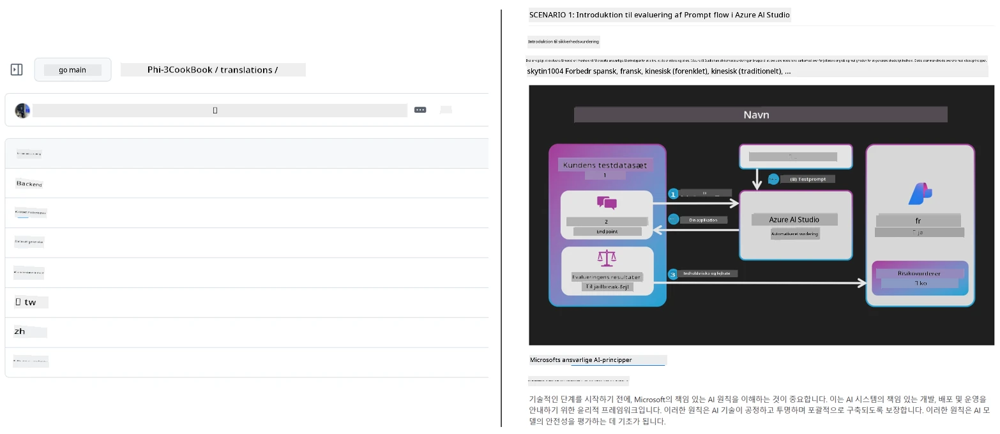
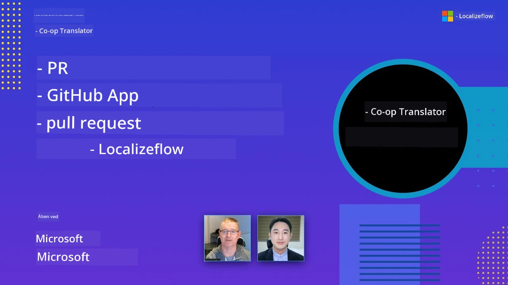

# Co-op Translator

_Let nemt automatisere og vedligeholde oversættelser af dit uddannelsesindhold på GitHub på flere sprog, efterhånden som dit projekt udvikler sig._


[](https://pypi.org/project/co-op-translator/)
[](https://github.com/azure/co-op-translator/blob/main/LICENSE)
[](https://pepy.tech/project/co-op-translator)
[](https://pepy.tech/project/co-op-translator)
[](https://github.com/azure/co-op-translator/pkgs/container/co-op-translator)
[](https://github.com/psf/black)

[](https://GitHub.com/azure/co-op-translator/graphs/contributors/)
[](https://GitHub.com/azure/co-op-translator/issues/)
[](https://GitHub.com/azure/co-op-translator/pulls/)
[](http://makeapullrequest.com)

### 🌐 Multisproget understøttelse

#### Understøttet af [Co-op Translator](https://github.com/Azure/Co-op-Translator)

<!-- CO-OP TRANSLATOR LANGUAGES TABLE START -->
[Arabisk](../ar/README.md) | [Bengali](../bn/README.md) | [Bulgarsk](../bg/README.md) | [Burmesisk (Myanmar)](../my/README.md) | [Kinesisk (Forenklet)](../zh-CN/README.md) | [Kinesisk (Traditionelt, Hong Kong)](../zh-HK/README.md) | [Kinesisk (Traditionelt, Macau)](../zh-MO/README.md) | [Kinesisk (Traditionelt, Taiwan)](../zh-TW/README.md) | [Kroatisk](../hr/README.md) | [Tjekkisk](../cs/README.md) | [Dansk](./README.md) | [Hollandsk](../nl/README.md) | [Estisk](../et/README.md) | [Finsk](../fi/README.md) | [Fransk](../fr/README.md) | [Tysk](../de/README.md) | [Græsk](../el/README.md) | [Hebraisk](../he/README.md) | [Hindi](../hi/README.md) | [Ungarsk](../hu/README.md) | [Indonesisk](../id/README.md) | [Italiensk](../it/README.md) | [Japansk](../ja/README.md) | [Kannada](../kn/README.md) | [Khmer](../km/README.md) | [Koreansk](../ko/README.md) | [Litauisk](../lt/README.md) | [Malayisk](../ms/README.md) | [Malayalam](../ml/README.md) | [Marathi](../mr/README.md) | [Nepali](../ne/README.md) | [Nigeriansk Pidgin](../pcm/README.md) | [Norsk](../no/README.md) | [Persisk (Farsi)](../fa/README.md) | [Polsk](../pl/README.md) | [Portugisisk (Brasilien)](../pt-BR/README.md) | [Portugisisk (Portugal)](../pt-PT/README.md) | [Punjabi (Gurmukhi)](../pa/README.md) | [Rumænsk](../ro/README.md) | [Russisk](../ru/README.md) | [Serbisk (Kyrillisk)](../sr/README.md) | [Slovakisk](../sk/README.md) | [Slovensk](../sl/README.md) | [Spansk](../es/README.md) | [Swahili](../sw/README.md) | [Svensk](../sv/README.md) | [Tagalog (Filippinsk)](../tl/README.md) | [Tamil](../ta/README.md) | [Telugu](../te/README.md) | [Thai](../th/README.md) | [Tyrkisk](../tr/README.md) | [Ukrainsk](../uk/README.md) | [Urdu](../ur/README.md) | [Vietnamesisk](../vi/README.md)

> **Foretrækker du at klone lokalt?**
>
> Dette repository inkluderer 50+ sprogoversættelser, hvilket øger downloadstørrelsen betydeligt. For at klone uden oversættelser, brug sparsom checkout:
>
> **Bash / macOS / Linux:**
> ```bash
> git clone --filter=blob:none --sparse https://github.com/Azure/co-op-translator.git
> cd co-op-translator
> git sparse-checkout set --no-cone '/*' '!translations' '!translated_images'
> ```
>
> **CMD (Windows):**
> ```cmd
> git clone --filter=blob:none --sparse https://github.com/Azure/co-op-translator.git
> cd co-op-translator
> git sparse-checkout set --no-cone "/*" "!translations" "!translated_images"
> ```
>
> Dette giver dig alt, hvad du behøver for at gennemføre kurset med en meget hurtigere download.
<!-- CO-OP TRANSLATOR LANGUAGES TABLE END -->

[](https://GitHub.com/azure/co-op-translator/watchers/)
[](https://GitHub.com/azure/co-op-translator/network/)
[](https://GitHub.com/azure/co-op-translator/stargazers/)

[](https://discord.gg/nTYy5BXMWG)

[](https://codespaces.new/azure/co-op-translator)

## Oversigt

**Co-op Translator** hjælper dig med at lokalnummerere dit uddannelsesindhold på GitHub til flere sprog uden besvær.  
Når du opdaterer dine Markdown-filer, billeder eller notebooks, holdes oversættelser automatisk synkroniseret, hvilket sikrer, at dit indhold forbliver korrekt og up-to-date for elever verden over.

Eksempel på, hvordan oversat indhold er organiseret:



## Hvordan oversættelsestilstanden håndteres

Co-op Translator håndterer oversat indhold som **versionsstyrede softwareartefakter**,  
ikke som statiske filer.

Værktøjet sporer tilstanden for oversat Markdown, billeder og notebooks  
ved hjælp af **sprogspecifik metadata**.

Dette design gør det muligt for Co-op Translator at:

- Pålideligt opdage forældede oversættelser  
- Behandle Markdown, billeder og notebooks konsekvent  
- Skalere sikkert på tværs af store, hurtigt voksende, flersprogede repositories

Ved at modellere oversættelser som styrede artefakter  
passer oversættelsesarbejdsgange naturligt til moderne  
softwareafhængigheds- og artefakthåndteringsmetoder.

→ [Hvordan oversættelsestilstanden håndteres](https://techcommunity.microsoft.com/blog/azuredevcommunityblog/rethinking-documentation-translation-treating-translations-as-versioned-software/4491755)

## Kom godt i gang

```bash
# Opret og aktivér et virtuelt miljø (anbefalet)
python -m venv .venv
# Windows
.venv\Scripts\activate
# macOS/Linux
source .venv/bin/activate
# Installer pakken
pip install co-op-translator
# Oversæt
translate -l "ko ja fr" -md
```

Docker:

```bash
# Hent det offentlige billede fra GHCR
docker pull ghcr.io/azure/co-op-translator:latest
# Kør med den nuværende mappe monteret og .env leveret (Bash/Zsh)
docker run --rm -it --env-file .env -v "${PWD}:/work" ghcr.io/azure/co-op-translator:latest -l "ko ja fr" -md
```

## Minimal opsætning

1. Sørg for at du har en understøttet Python-version (pt. 3.10-3.12). I poetry (pyproject.toml) håndteres dette automatisk.  
2. Opret en `.env` fil ved hjælp af skabelonen: [.env.template](../../.env.template)  
3. Konfigurer en LLM-udbyder (Azure OpenAI eller OpenAI)  
4. (Valgfrit) For billedoversættelse (`-img`), konfigurer Azure AI Vision  
5. (Valgfrit) Du kan konfigurere flere legitimationssæt ved at duplikere variabler med suffikser som `_1`, `_2` osv. Alle variabler i et sæt skal have samme suffiks.  
6. (Anbefalet) Ryd op i eventuelle tidligere oversættelser for at undgå konflikter (f.eks. `translations/`)  
7. (Anbefalet) Tilføj en oversættelsessektion til din README ved at bruge [README languages template](./getting_started/README_languages_template.md)  
8. Se: [Opsæt Azure AI](./getting_started/set-up-azure-ai.md)

## Brug

Oversæt alle understøttede typer:

```bash
translate -l "ko ja"
```

Kun Markdown:

```bash
translate -l "de" -md
```

Markdown + billeder:

```bash
translate -l "pt" -md -img
```

Kun notebooks:

```bash
translate -l "zh" -nb
```

Flere flag: [Kommando reference](./getting_started/command-reference.md)

## Funktioner

- Automatisk oversættelse for Markdown, notebooks og billeder  
- Holder oversættelser synkroniserede med kildeforandringer  
- Fungerer lokalt (CLI) eller i CI (GitHub Actions)  
- Bruger Azure OpenAI eller OpenAI; valgfri Azure AI Vision til billeder  
- Bevarer Markdown-formatering og struktur

## Dokumentation

- [Kommando-linje guide](./getting_started/command-line-guide/command-line-guide.md)  
- [GitHub Actions guide (offentlige repositories & standard secrets)](./getting_started/github-actions-guide/github-actions-guide-public.md)  
- [GitHub Actions guide (Microsoft organisations repositories & org-niveau opsætninger)](./getting_started/github-actions-guide/github-actions-guide-org.md)  
- [README languages template](./getting_started/README_languages_template.md)  
- [Understøttede sprog](./getting_started/supported-languages.md)  
- [Bidrag](./CONTRIBUTING.md)  
- [Fejlfinding](./getting_started/troubleshooting.md)

### Microsoft-specifik guide
> [!NOTE]
> Kun for vedligeholdere af Microsoft’s “For Beginners” repositories.

- [Opdatering af listen “andre kurser” (kun for MS Beginners repositories)](./getting_started/update-other-courses.md)

## Støt os og frem læring globalt

Vær med til at revolutionere måden, uddannelsesindhold deles globalt! Giv [Co-op Translator](https://github.com/azure/co-op-translator) en ⭐ på GitHub og støt vores mission om at nedbryde sprogbarrierer inden for læring og teknologi. Din interesse og dine bidrag gør en stor forskel! Kodebidrag og forslag til funktioner er altid velkomne.

### Udforsk Microsofts uddannelsesindhold på dit sprog

- [LangChain4j-for-Beginners](https://github.com/microsoft/LangChain4j-for-Beginners)  
- [AZD for Beginners](https://github.com/microsoft/AZD-for-beginners)  
- [Edge AI for Beginners](https://github.com/microsoft/edgeai-for-beginners)  
- [Model Context Protocol (MCP) For Beginners](https://github.com/microsoft/mcp-for-beginners)  
- [AI Agents for Beginners](https://github.com/microsoft/ai-agents-for-beginners)  
- [Generative AI for Beginners using .NET](https://github.com/microsoft/Generative-AI-for-beginners-dotnet)  
- [Generative AI for Beginners](https://github.com/microsoft/generative-ai-for-beginners)  
- [Generative AI for Beginners using Java](https://github.com/microsoft/generative-ai-for-beginners-java)  
- [ML for Beginners](https://aka.ms/ml-beginners)  
- [Data Science for Beginners](https://aka.ms/datascience-beginners)  
- [AI for Beginners](https://aka.ms/ai-beginners)  
- [Cybersecurity for Beginners](https://github.com/microsoft/Security-101)  
- [Web Dev for Beginners](https://aka.ms/webdev-beginners)  
- [IoT for Beginners](https://aka.ms/iot-beginners)  
- [PhiCookBook](https://github.com/microsoft/PhiCookBook)

## Video-præsentationer

👉 Klik på billedet nedenfor for at se på YouTube.

- **Open at Microsoft**: En kort 18-minutters introduktion og hurtig guide til, hvordan du bruger Co-op Translator.

  [](https://www.youtube.com/watch?v=jX_swfH_KNU)

## Bidrag

Dette projekt byder velkommen til bidrag og forslag. Er du interesseret i at bidrage til Azure Co-op Translator? Se venligst vores [CONTRIBUTING.md](./CONTRIBUTING.md) for retningslinjer om, hvordan du kan hjælpe med at gøre Co-op Translator mere tilgængelig.

## Bidragsydere
[](https://github.com/Azure/co-op-translator/graphs/contributors)

## Adfærdskodeks

Dette projekt har taget [Microsoft Open Source Code of Conduct](https://opensource.microsoft.com/codeofconduct/) i brug.  
For mere information se [Code of Conduct FAQ](https://opensource.microsoft.com/codeofconduct/faq/) eller  
kontakt [opencode@microsoft.com](mailto:opencode@microsoft.com) med eventuelle yderligere spørgsmål eller kommentarer.

## Ansvarlig AI

Microsoft er forpligtet til at hjælpe vores kunder med at bruge vores AI-produkter ansvarligt, dele vores erfaringer og opbygge tillidsbaserede partnerskaber gennem værktøjer som Transparency Notes og Impact Assessments. Mange af disse ressourcer kan findes på [https://aka.ms/RAI](https://aka.ms/RAI).  
Microsofts tilgang til ansvarlig AI er baseret på vores AI-principper om retfærdighed, pålidelighed og sikkerhed, privatliv og sikkerhed, inklusivitet, gennemsigtighed og ansvarlighed.

Storskala modeller til naturligt sprog, billeder og tale – som dem der bruges i dette eksempel – kan potentielt opføre sig på måder, der er urimelige, upålidelige eller stødende, hvilket igen kan forårsage skade. Konsulter venligst [Azure OpenAI service Transparency note](https://learn.microsoft.com/legal/cognitive-services/openai/transparency-note?tabs=text) for at blive informeret om risici og begrænsninger.

Den anbefalede fremgangsmåde til at mindske disse risici er at inkludere et sikkerhedssystem i din arkitektur, som kan opdage og forhindre skadelig adfærd. [Azure AI Content Safety](https://learn.microsoft.com/azure/ai-services/content-safety/overview) leverer et uafhængigt beskyttelseslag, der kan opdage skadeligt brugergenereret og AI-genereret indhold i applikationer og services. Azure AI Content Safety inkluderer tekst- og billed-API’er, som gør det muligt at opdage skadeligt materiale. Vi har også et interaktivt Content Safety Studio, der giver dig mulighed for at se, udforske og prøve eksempel kode til at opdage skadeligt indhold på tværs af forskellige modaliteter. Følgende [quickstart dokumentation](https://learn.microsoft.com/azure/ai-services/content-safety/quickstart-text?tabs=visual-studio%2Clinux&pivots=programming-language-rest) guider dig gennem at lave forespørgsler til servicen.

En anden faktor, der skal tages i betragtning, er den samlede applikationsydelse. Med multimodale og multimodel-applikationer betragter vi ydelse som det, at systemet fungerer som du og dine brugere forventer, inklusive at det ikke genererer skadelige output. Det er vigtigt at vurdere ydelsen af din samlede applikation ved hjælp af [generation quality and risk and safety metrics](https://learn.microsoft.com/azure/ai-studio/concepts/evaluation-metrics-built-in).

Du kan evaluere din AI-applikation i dit udviklingsmiljø ved hjælp af [prompt flow SDK](https://microsoft.github.io/promptflow/index.html). Givet enten et testdatasæt eller et mål bliver dine generative AI-applikationsgenereringer kvantitativt målt med indbyggede evaluatorer eller brugerdefinerede evaluatorer efter eget valg. For at komme i gang med prompt flow SDK til at evaluere dit system kan du følge [quickstart guiden](https://learn.microsoft.com/azure/ai-studio/how-to/develop/flow-evaluate-sdk). Når du har kørt en evaluering, kan du [visualisere resultaterne i Azure AI Studio](https://learn.microsoft.com/azure/ai-studio/how-to/evaluate-flow-results).

## Varemærker

Dette projekt kan indeholde varemærker eller logoer for projekter, produkter eller tjenester. Autoriseret brug af Microsofts  
varemærker eller logoer er underlagt og skal følge  
[Microsofts varemærke- og brand-retningslinjer](https://www.microsoft.com/en-us/legal/intellectualproperty/trademarks/usage/general).  
Brug af Microsofts varemærker eller logoer i ændrede versioner af dette projekt må ikke skabe forvirring eller antyde Microsoft-sponsorat.  
Enhver brug af tredjepartsvaremærker eller logoer er underlagt tredjepartens politikker.

## Få hjælp

Hvis du sidder fast eller har spørgsmål om at bygge AI-applikationer, så deltag i:

[](https://discord.gg/nTYy5BXMWG)

Hvis du har produktfeedback eller oplever fejl under udvikling, besøg:

[](https://aka.ms/foundry/forum)

---

<!-- CO-OP TRANSLATOR DISCLAIMER START -->
**Ansvarsfraskrivelse**:  
Dette dokument er blevet oversat ved hjælp af AI-oversættelsestjenesten [Co-op Translator](https://github.com/Azure/co-op-translator). Selvom vi stræber efter nøjagtighed, skal du være opmærksom på, at automatiserede oversættelser kan indeholde fejl eller unøjagtigheder. Det oprindelige dokument på dets modersmål bør betragtes som den autoritative kilde. For kritiske oplysninger anbefales professionel menneskelig oversættelse. Vi påtager os ikke ansvar for nogen misforståelser eller fejltolkninger, der opstår som følge af brugen af denne oversættelse.
<!-- CO-OP TRANSLATOR DISCLAIMER END -->