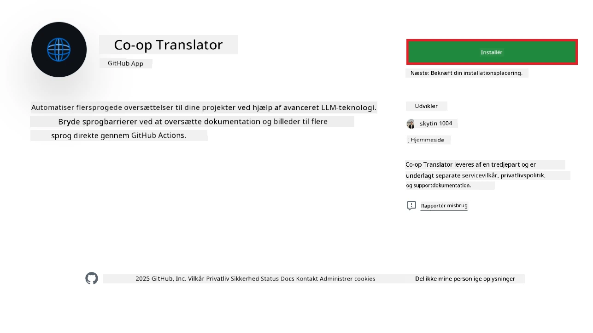
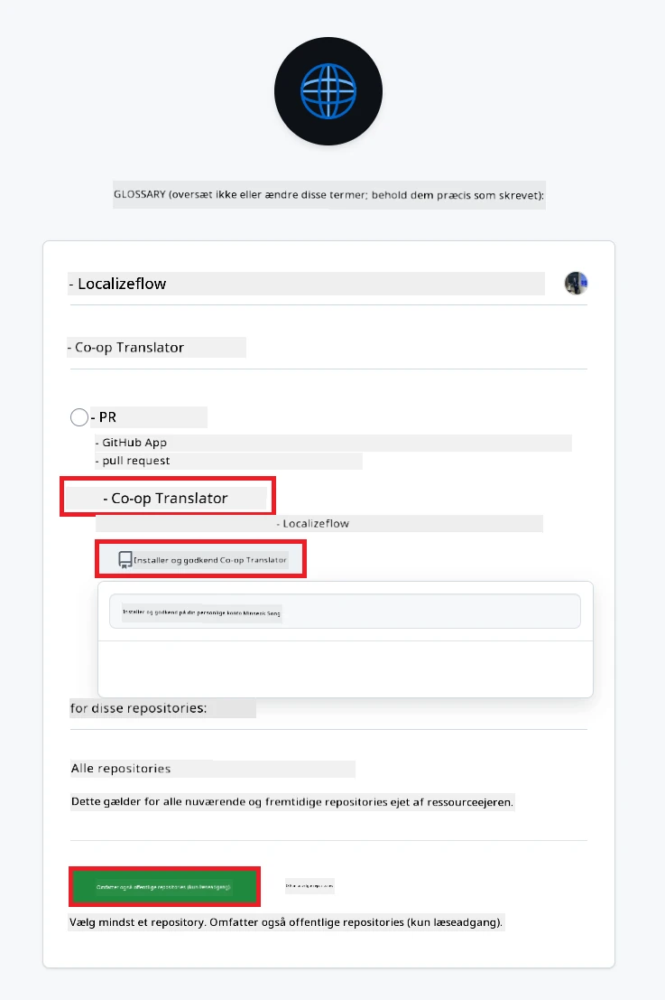
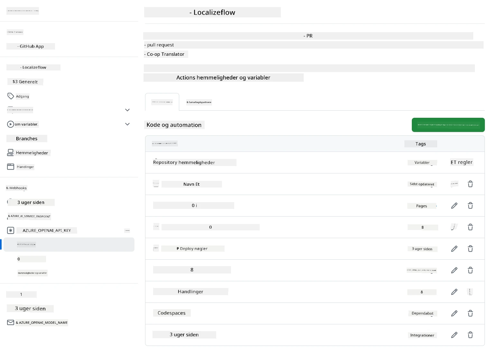

# Brug af Co-op Translator GitHub Action (Organisationsvejledning)

**Målgruppe:** Denne vejledning er til **Microsoft interne brugere** eller **teams, der har adgang til de nødvendige legitimationsoplysninger til den færdigbyggede Co-op Translator GitHub App** eller kan oprette deres egen tilpassede GitHub App.

Automatiser oversættelsen af dit repositories dokumentation nemt med Co-op Translator GitHub Action. Denne vejledning guider dig igennem opsætningen, så der automatisk oprettes pull requests med opdaterede oversættelser, hver gang dine kilde-Markdown-filer eller billeder ændres.

> [!IMPORTANT]
> 
> **Vælg den rigtige vejledning:**
>
> Denne vejledning beskriver opsætning med **GitHub App ID og en Private Key**. Du har typisk brug for denne "Organisationsvejledning", hvis: **`GITHUB_TOKEN`-tilladelser er begrænsede:** Din organisation eller repository-indstillinger begrænser de standardtilladelser, som den normale `GITHUB_TOKEN` giver. Specifikt, hvis `GITHUB_TOKEN` ikke har de nødvendige `write`-tilladelser (som `contents: write` eller `pull-requests: write`), vil workflowet i [Public Setup Guide](./github-actions-guide-public.md) fejle på grund af manglende tilladelser. Ved at bruge en dedikeret GitHub App med eksplicitte tilladelser undgår du denne begrænsning.
>
> **Hvis ovenstående ikke gælder for dig:**
>
> Hvis den normale `GITHUB_TOKEN` har tilstrækkelige tilladelser i dit repository (dvs. du ikke er blokeret af organisatoriske begrænsninger), så brug **[Public Setup Guide med GITHUB_TOKEN](./github-actions-guide-public.md)**. Den offentlige vejledning kræver ikke App ID eller Private Key og bruger kun den normale `GITHUB_TOKEN` og repository-tilladelser.

## Forudsætninger

Før du konfigurerer GitHub Action, skal du sikre dig, at du har de nødvendige AI-service-legitimationsoplysninger klar.

**1. Krævet: AI Language Model-legitimationsoplysninger**
Du skal have legitimationsoplysninger til mindst én understøttet Language Model:

- **Azure OpenAI**: Kræver Endpoint, API Key, Model/Deployment-navne, API Version.
- **OpenAI**: Kræver API Key, (Valgfrit: Org ID, Base URL, Model ID).
- Se [Understøttede modeller og tjenester](../../../../README.md) for detaljer.
- Opsætningsvejledning: [Opsæt Azure OpenAI](../set-up-resources/set-up-azure-openai.md).

**2. Valgfrit: Computer Vision-legitimationsoplysninger (til billedoversættelse)**

- Kun nødvendigt, hvis du skal oversætte tekst i billeder.
- **Azure Computer Vision**: Kræver Endpoint og Subscription Key.
- Hvis ikke angivet, kører actionen i [Markdown-only mode](../markdown-only-mode.md).
- Opsætningsvejledning: [Opsæt Azure Computer Vision](../set-up-resources/set-up-azure-computer-vision.md).

## Opsætning og konfiguration

Følg disse trin for at konfigurere Co-op Translator GitHub Action i dit repository:

### Trin 1: Installer og konfigurer GitHub App-autentificering

Workflowet bruger GitHub App-autentificering til sikkert at interagere med dit repository (f.eks. oprette pull requests) på dine vegne. Vælg én mulighed:

#### **Mulighed A: Installer den færdigbyggede Co-op Translator GitHub App (til Microsoft intern brug)**

1. Gå til [Co-op Translator GitHub App](https://github.com/apps/co-op-translator)-siden.

1. Vælg **Installér** og vælg den konto eller organisation, hvor dit repository ligger.

    

1. Vælg **Kun udvalgte repositories** og vælg dit repository (f.eks. `PhiCookBook`). Klik på **Installér**. Du kan blive bedt om at godkende.

    

1. **Få App-legitimationsoplysninger (intern proces krævet):** For at workflowet kan autentificere som appen, skal du bruge to oplysninger fra Co-op Translator-teamet:
  - **App ID:** Det unikke ID for Co-op Translator-appen. App ID er: `1164076`.
  - **Private Key:** Du skal få **hele indholdet** af `.pem` private key-filen fra kontaktpersonen. **Behandl denne nøgle som en adgangskode og hold den sikker.**

1. Fortsæt til Trin 2.

#### **Mulighed B: Brug din egen tilpassede GitHub App**

- Hvis du foretrækker det, kan du oprette og konfigurere din egen GitHub App. Sørg for, at den har læse- og skrivetilladelse til Contents og Pull requests. Du skal bruge dens App ID og en genereret Private Key.

### Trin 2: Konfigurer repository-secrets

Du skal tilføje GitHub App-legitimationsoplysninger og dine AI-service-legitimationsoplysninger som krypterede secrets i repository-indstillingerne.

1. Gå til dit repository (f.eks. `PhiCookBook`).

1. Gå til **Settings** > **Secrets and variables** > **Actions**.

1. Under **Repository secrets**, klik på **New repository secret** for hver secret nedenfor.

   

**Nødvendige secrets (til GitHub App-autentificering):**

| Secret Name          | Beskrivelse                                      | Værdi-kilde                                     |
| :------------------- | :----------------------------------------------- | :----------------------------------------------- |
| `GH_APP_ID`          | App ID for GitHub App (fra Trin 1).              | GitHub App-indstillinger                        |
| `GH_APP_PRIVATE_KEY` | **Hele indholdet** af den downloadede `.pem`-fil. | `.pem`-fil (fra Trin 1)                         |

**AI-service-secrets (Tilføj ALLE relevante ud fra dine forudsætninger):**

| Secret Name                         | Beskrivelse                               | Værdi-kilde                     |
| :---------------------------------- | :---------------------------------------- | :------------------------------ |
| `AZURE_AI_SERVICE_API_KEY`            | Nøgle til Azure AI Service (Computer Vision)  | Azure AI Foundry                |
| `AZURE_AI_SERVICE_ENDPOINT`         | Endpoint til Azure AI Service (Computer Vision) | Azure AI Foundry                |
| `AZURE_OPENAI_API_KEY`              | Nøgle til Azure OpenAI service            | Azure AI Foundry                |
| `AZURE_OPENAI_ENDPOINT`             | Endpoint til Azure OpenAI service         | Azure AI Foundry                |
| `AZURE_OPENAI_MODEL_NAME`           | Dit Azure OpenAI Model Name               | Azure AI Foundry                |
| `AZURE_OPENAI_CHAT_DEPLOYMENT_NAME` | Dit Azure OpenAI Deployment Name          | Azure AI Foundry                |
| `AZURE_OPENAI_API_VERSION`          | API Version til Azure OpenAI              | Azure AI Foundry                |
| `OPENAI_API_KEY`                    | API Key til OpenAI                        | OpenAI Platform                 |
| `OPENAI_ORG_ID`                     | OpenAI Organization ID                    | OpenAI Platform                 |
| `OPENAI_CHAT_MODEL_ID`              | Specifikt OpenAI model ID                 | OpenAI Platform                 |
| `OPENAI_BASE_URL`                   | Tilpasset OpenAI API Base URL             | OpenAI Platform                 |



### Trin 3: Opret workflow-filen

Til sidst skal du oprette YAML-filen, der definerer det automatiserede workflow.

1. I roden af dit repository, opret mappen `.github/workflows/`, hvis den ikke findes.

1. Inde i `.github/workflows/`, opret en fil med navnet `co-op-translator.yml`.

1. Indsæt følgende indhold i co-op-translator.yml.

```
name: Co-op Translator

on:
  push:
    branches:
      - main

jobs:
  co-op-translator:
    runs-on: ubuntu-latest

    permissions:
      contents: write
      pull-requests: write

    steps:
      - name: Checkout repository
        uses: actions/checkout@v4
        with:
          fetch-depth: 0

      - name: Set up Python
        uses: actions/setup-python@v4
        with:
          python-version: '3.10'

      - name: Install Co-op Translator
        run: |
          python -m pip install --upgrade pip
          pip install co-op-translator

      - name: Run Co-op Translator
        env:
          PYTHONIOENCODING: utf-8
          # Azure AI Service Credentials
          AZURE_AI_SERVICE_API_KEY: ${{ secrets.AZURE_AI_SERVICE_API_KEY }}
          AZURE_AI_SERVICE_ENDPOINT: ${{ secrets.AZURE_AI_SERVICE_ENDPOINT }}

          # Azure OpenAI Credentials
          AZURE_OPENAI_API_KEY: ${{ secrets.AZURE_OPENAI_API_KEY }}
          AZURE_OPENAI_ENDPOINT: ${{ secrets.AZURE_OPENAI_ENDPOINT }}
          AZURE_OPENAI_MODEL_NAME: ${{ secrets.AZURE_OPENAI_MODEL_NAME }}
          AZURE_OPENAI_CHAT_DEPLOYMENT_NAME: ${{ secrets.AZURE_OPENAI_CHAT_DEPLOYMENT_NAME }}
          AZURE_OPENAI_API_VERSION: ${{ secrets.AZURE_OPENAI_API_VERSION }}

          # OpenAI Credentials
          OPENAI_API_KEY: ${{ secrets.OPENAI_API_KEY }}
          OPENAI_ORG_ID: ${{ secrets.OPENAI_ORG_ID }}
          OPENAI_CHAT_MODEL_ID: ${{ secrets.OPENAI_CHAT_MODEL_ID }}
          OPENAI_BASE_URL: ${{ secrets.OPENAI_BASE_URL }}
        run: |
          # =====================================================================
          # IMPORTANT: Set your target languages here (REQUIRED CONFIGURATION)
          # =====================================================================
          # Example: Translate to Spanish, French, German. Add -y to auto-confirm.
          translate -l "es fr de" -y  # <--- MODIFY THIS LINE with your desired languages

      - name: Authenticate GitHub App
        id: generate_token
        uses: tibdex/github-app-token@v1
        with:
          app_id: ${{ secrets.GH_APP_ID }}
          private_key: ${{ secrets.GH_APP_PRIVATE_KEY }}

      - name: Create Pull Request with translations
        uses: peter-evans/create-pull-request@v5
        with:
          token: ${{ steps.generate_token.outputs.token }}
          commit-message: "🌐 Update translations via Co-op Translator"
          title: "🌐 Update translations via Co-op Translator"
          body: |
            This PR updates translations for recent changes to the main branch.

            ### 📋 Changes included
            - Translated contents are available in the `translations/` directory
            - Translated images are available in the `translated_images/` directory

            ---
            🌐 Automatically generated by the [Co-op Translator](https://github.com/Azure/co-op-translator) GitHub Action.
          branch: update-translations
          base: main
          labels: translation, automated-pr
          delete-branch: true
          add-paths: |
            translations/
            translated_images/

```

4.  **Tilpas workflowet:**
  - **[!IMPORTANT] Mål-sprog:** I `Run Co-op Translator`-trinnet skal du **gennemgå og tilpasse listen af sprogkoder** i kommandoen `translate -l "..." -y`, så den passer til dit projekt. Eksempellisten (`ar de es...`) skal udskiftes eller justeres.
  - **Trigger (`on:`):** Den nuværende trigger kører ved hvert push til `main`. For store repositories kan du tilføje et `paths:`-filter (se kommenteret eksempel i YAML) for kun at køre workflowet, når relevante filer (f.eks. kilde-dokumentation) ændres, og dermed spare runner-minutter.
  - **PR-detaljer:** Tilpas `commit-message`, `title`, `body`, `branch`-navn og `labels` i `Create Pull Request`-trinnet efter behov.

## Håndtering og fornyelse af legitimationsoplysninger

- **Sikkerhed:** Opbevar altid følsomme legitimationsoplysninger (API-nøgler, private keys) som GitHub Actions-secrets. Udgiv dem aldrig i workflow-filen eller repository-koden.
- **[!IMPORTANT] Nøglefornyelse (Microsoft interne brugere):** Vær opmærksom på, at Azure OpenAI-nøglen, der bruges internt i Microsoft, kan have en obligatorisk fornyelsespolitik (f.eks. hver 5. måned). Sørg for at opdatere de tilsvarende GitHub-secrets (`AZURE_OPENAI_...`-nøgler) **inden de udløber** for at undgå workflow-fejl.

## Kørsel af workflowet

> [!WARNING]  
> **Tidsbegrænsning for GitHub-hostede runners:**  
> GitHub-hostede runners som `ubuntu-latest` har en **maksimal køretid på 6 timer**.  
> For store dokumentationsrepositories, hvis oversættelsesprocessen overstiger 6 timer, vil workflowet automatisk blive afbrudt.  
> For at undgå dette kan du:  
> - Bruge en **self-hosted runner** (ingen tidsbegrænsning)  
> - Reducere antallet af mål-sprog pr. kørsel

Når `co-op-translator.yml`-filen er flettet ind i din main-branch (eller den branch, der er angivet i `on:`-triggeren), vil workflowet automatisk køre, hver gang der pushes ændringer til den branch (og matcher `paths`-filteret, hvis det er konfigureret).

Hvis der genereres eller opdateres oversættelser, opretter actionen automatisk et Pull Request med ændringerne, klar til din gennemgang og fletning.

---

**Ansvarsfraskrivelse**:
Dette dokument er blevet oversat ved hjælp af AI-oversættelsestjenesten [Co-op Translator](https://github.com/Azure/co-op-translator). Selvom vi bestræber os på nøjagtighed, skal du være opmærksom på, at automatiserede oversættelser kan indeholde fejl eller unøjagtigheder. Det originale dokument på dets oprindelige sprog bør betragtes som den autoritative kilde. For kritisk information anbefales professionel menneskelig oversættelse. Vi påtager os intet ansvar for misforståelser eller fejltolkninger, der måtte opstå ved brug af denne oversættelse.