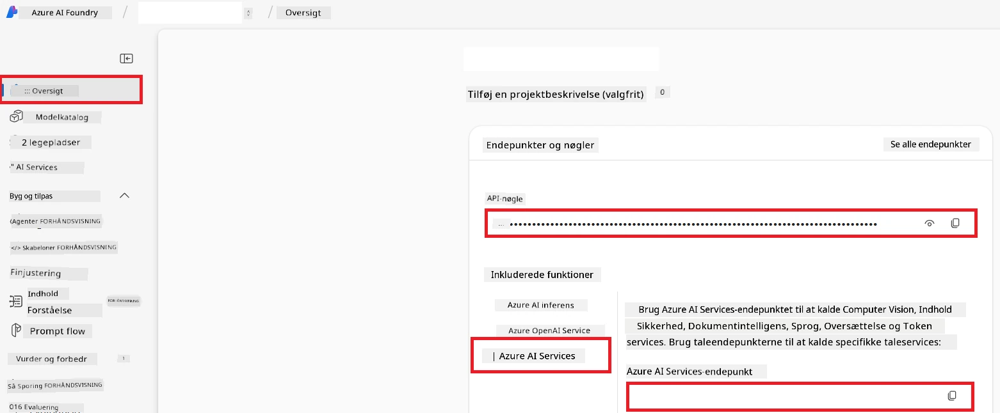

# Opsæt Azure AI til Co-op Translator (Azure OpneAI & Azure AI Vision)

Denne vejledning guider dig gennem opsætningen af Azure OpenAI til sprogoversættelse og Azure Computer Vision til billedindholdsanalyse (som derefter kan bruges til billedbaseret oversættelse) inden for Azure AI Foundry.

**Forudsætninger:**
- En Azure-konto med et aktivt abonnement.
- Tilstrækkelige tilladelser til at oprette ressourcer og implementeringer i dit Azure-abonnement.

## Opret et Azure AI-projekt

Du starter med at oprette et Azure AI-projekt, som fungerer som et centralt sted til at administrere dine AI-ressourcer.

1. Gå til [https://ai.azure.com](https://ai.azure.com) og log ind med din Azure-konto.

1. Vælg **+Create** for at oprette et nyt projekt.

1. Udfør følgende opgaver:
   - Indtast et **Projektnavn** (f.eks. `CoopTranslator-Project`).
   - Vælg **AI-hubben** (f.eks. `CoopTranslator-Hub`) (Opret en ny om nødvendigt).

1. Klik på "**Review and Create**" for at oprette dit projekt. Du vil blive ført til oversigtssiden for dit projekt.

## Opsæt Azure OpenAI til sprogoversættelse

Inden for dit projekt implementerer du en Azure OpenAI-model, som fungerer som backend til tekstoversættelse.

### Gå til dit projekt

Hvis du ikke allerede er der, skal du åbne dit nyskabte projekt (f.eks. `CoopTranslator-Project`) i Azure AI Foundry.

### Implementer en OpenAI-model

1. Fra dit projekts venstremenu, under "My assets", vælg "**Models + endpoints**".

1. Vælg **+ Deploy model**.

1. Vælg **Deploy Base Model**.

1. Du vil få vist en liste over tilgængelige modeller. Filtrer eller søg efter en passende GPT-model. Vi anbefaler `gpt-4o`.

1. Vælg din ønskede model og klik på **Confirm**.

1. Vælg **Deploy**.

### Azure OpenAI-konfiguration

Når den er implementeret, kan du vælge implementeringen fra siden "**Models + endpoints**" for at finde dens **REST endpoint URL**, **Nøgle**, **Implementeringsnavn**, **Modelnavn** og **API-version**. Disse vil være nødvendige for at integrere oversættelsesmodellen i din applikation.

> [!NOTE]
> Du kan vælge API-versioner fra siden [API version deprecation](https://learn.microsoft.com/azure/ai-services/openai/api-version-deprecation) baseret på dine krav. Vær opmærksom på, at **API-versionen** er forskellig fra den **Modelversion**, der vises på siden **Models + endpoints** i Azure AI Foundry.

## Opsæt Azure Computer Vision til billedoversættelse

For at muliggøre oversættelse af tekst i billeder skal du finde Azure AI Service API-nøgle og endpoint.

1. Gå til dit Azure AI-projekt (f.eks. `CoopTranslator-Project`). Sørg for, at du er på projektets oversigtsside.

### Azure AI Service-konfiguration

Find API-nøglen og endpoint fra Azure AI Service.

1. Gå til dit Azure AI-projekt (f.eks. `CoopTranslator-Project`). Sørg for, at du er på projektets oversigtsside.

1. Find **API Key** og **Endpoint** under fanen Azure AI Service.

    

Denne forbindelse gør kapaciteterne i den tilknyttede Azure AI Services-ressource (inklusive billedanalyse) tilgængelige for dit AI Foundry-projekt. Du kan derefter bruge denne forbindelse i dine notesbøger eller applikationer til at udtrække tekst fra billeder, som efterfølgende kan sendes til Azure OpenAI-modellen til oversættelse.

## Samling af dine legitimationsoplysninger

På nuværende tidspunkt skulle du have samlet følgende:

**For Azure OpenAI (Tekstoversættelse):**
- Azure OpenAI Endpoint
- Azure OpenAI API-nøgle
- Azure OpenAI Modelnavn (f.eks. `gpt-4o`)
- Azure OpenAI Implementeringsnavn (f.eks. `cooptranslator-gpt4o`)
- Azure OpenAI API-version

**For Azure AI Services (Udtrækning af tekst fra billeder via Vision):**
- Azure AI Service Endpoint
- Azure AI Service API-nøgle

### Eksempel: Konfiguration af miljøvariabler (Preview)

Senere, når du bygger din applikation, vil du sandsynligvis konfigurere den ved hjælp af disse indsamlede legitimationsoplysninger. For eksempel kan du sætte dem som miljøvariabler på følgende måde:

```bash
# Azure AI-service legitimationsoplysninger (påkrævet til billedoversættelse)
AZURE_AI_SERVICE_API_KEY="your_azure_ai_service_api_key" # f.eks., 21xasd...
AZURE_AI_SERVICE_ENDPOINT="https://your_azure_ai_service_endpoint.cognitiveservices.azure.com/"

# Valgfrie fallback-sæt: duplikér variabler med suffikset _1/_2 (samme indeks for alle variabler i sættet)
AZURE_AI_SERVICE_API_KEY_1="your_azure_ai_service_api_key_1"
AZURE_AI_SERVICE_ENDPOINT_1="https://your_azure_ai_service_endpoint_1.cognitiveservices.azure.com/"

# Azure OpenAI-legitimationsoplysninger (påkrævet til tekstoversættelse)
AZURE_OPENAI_API_KEY="your_azure_openai_api_key" # f.eks., 21xasd...
AZURE_OPENAI_ENDPOINT="https://your_azure_openai_endpoint.openai.azure.com/"
AZURE_OPENAI_MODEL_NAME="your_model_name" # f.eks., gpt-4o
AZURE_OPENAI_CHAT_DEPLOYMENT_NAME="your_deployment_name" # f.eks., cooptranslator-gpt4o
AZURE_OPENAI_API_VERSION="your_api_version" # f.eks., 2024-12-01-preview

# Valgfrie fallback-sæt: duplikér hele AZURE_OPENAI_* sættet med suffikset _1/_2 (samme indeks for alle variabler)
```

---

### Yderligere læsning

- [Sådan opretter du et projekt i Azure AI Foundry](https://learn.microsoft.com/azure/ai-foundry/how-to/create-projects?tabs=ai-studio)
- [Sådan opretter du Azure AI-ressourcer](https://learn.microsoft.com/azure/ai-foundry/how-to/create-azure-ai-resource?tabs=portal)
- [Sådan implementeres OpenAI-modeller i Azure AI Foundry](https://learn.microsoft.com/en-us/azure/ai-foundry/how-to/deploy-models-openai)

---

<!-- CO-OP TRANSLATOR DISCLAIMER START -->
**Ansvarsfraskrivelse**:  
Dette dokument er oversat ved hjælp af AI-oversættelsestjenesten [Co-op Translator](https://github.com/Azure/co-op-translator). Selvom vi bestræber os på at være nøjagtige, skal du være opmærksom på, at automatiske oversættelser kan indeholde fejl eller unøjagtigheder. Det oprindelige dokument på dets modersmål bør betragtes som den autoritative kilde. For kritisk information anbefales professionel menneskelig oversættelse. Vi påtager os intet ansvar for misforståelser eller fejltolkninger, der opstår som følge af brugen af denne oversættelse.
<!-- CO-OP TRANSLATOR DISCLAIMER END -->