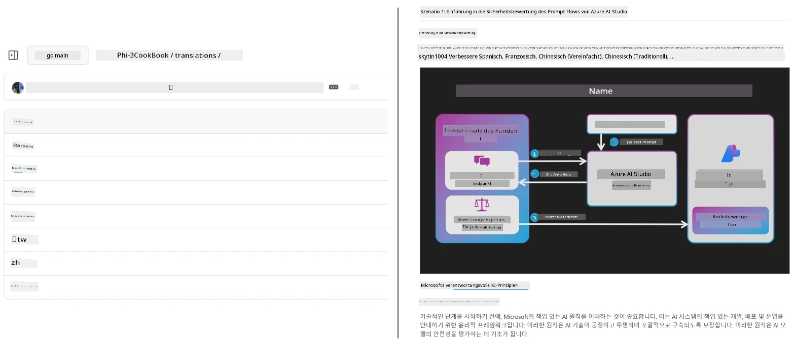
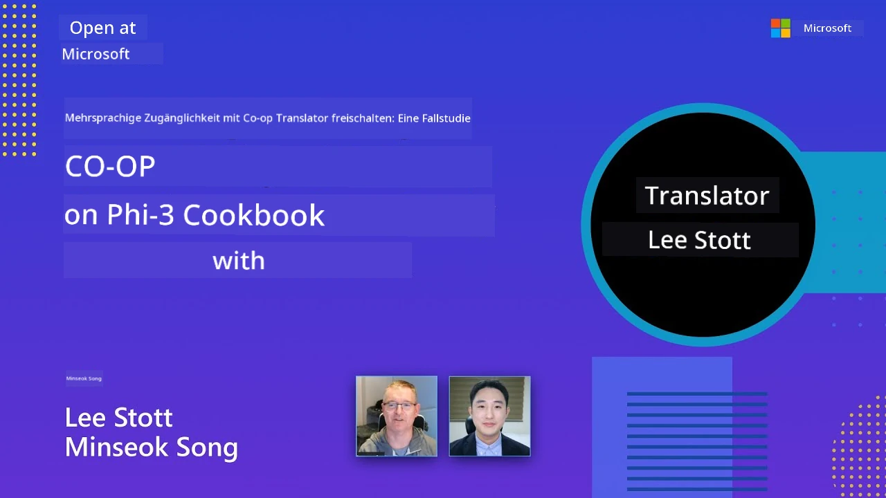

# Co-op Translator

_Erleichtern Sie die Automatisierung und Pflege von Übersetzungen für Ihre edukativen GitHub-Inhalte über mehrere Sprachen hinweg, während Ihr Projekt wächst._


[](https://pypi.org/project/co-op-translator/)
[](https://github.com/azure/co-op-translator/blob/main/LICENSE)
[](https://pepy.tech/project/co-op-translator)
[](https://pepy.tech/project/co-op-translator)
[](https://github.com/azure/co-op-translator/pkgs/container/co-op-translator)
[](https://github.com/psf/black)

[](https://GitHub.com/azure/co-op-translator/graphs/contributors/)
[](https://GitHub.com/azure/co-op-translator/issues/)
[](https://GitHub.com/azure/co-op-translator/pulls/)
[](http://makeapullrequest.com)

### 🌐 Mehrsprachige Unterstützung

#### Unterstützt von [Co-op Translator](https://github.com/Azure/Co-op-Translator)

<!-- CO-OP TRANSLATOR LANGUAGES TABLE START -->
[Arabisch](../ar/README.md) | [Bengalisch](../bn/README.md) | [Bulgarisch](../bg/README.md) | [Birmanisch (Myanmar)](../my/README.md) | [Chinesisch (Vereinfacht)](../zh-CN/README.md) | [Chinesisch (Traditionell, Hongkong)](../zh-HK/README.md) | [Chinesisch (Traditionell, Macau)](../zh-MO/README.md) | [Chinesisch (Traditionell, Taiwan)](../zh-TW/README.md) | [Kroatisch](../hr/README.md) | [Tschechisch](../cs/README.md) | [Dänisch](../da/README.md) | [Niederländisch](../nl/README.md) | [Estnisch](../et/README.md) | [Finnisch](../fi/README.md) | [Französisch](../fr/README.md) | [Deutsch](./README.md) | [Griechisch](../el/README.md) | [Hebräisch](../he/README.md) | [Hindi](../hi/README.md) | [Ungarisch](../hu/README.md) | [Indonesisch](../id/README.md) | [Italienisch](../it/README.md) | [Japanisch](../ja/README.md) | [Kannada](../kn/README.md) | [Khmer](../km/README.md) | [Koreanisch](../ko/README.md) | [Litauisch](../lt/README.md) | [Malaiisch](../ms/README.md) | [Malayalam](../ml/README.md) | [Marathi](../mr/README.md) | [Nepalesisch](../ne/README.md) | [Nigerianisches Pidgin](../pcm/README.md) | [Norwegisch](../no/README.md) | [Persisch (Farsi)](../fa/README.md) | [Polnisch](../pl/README.md) | [Portugiesisch (Brasilien)](../pt-BR/README.md) | [Portugiesisch (Portugal)](../pt-PT/README.md) | [Punjabi (Gurmukhi)](../pa/README.md) | [Rumänisch](../ro/README.md) | [Russisch](../ru/README.md) | [Serbisch (Kyrillisch)](../sr/README.md) | [Slowakisch](../sk/README.md) | [Slowenisch](../sl/README.md) | [Spanisch](../es/README.md) | [Swahili](../sw/README.md) | [Schwedisch](../sv/README.md) | [Tagalog (Filipino)](../tl/README.md) | [Tamil](../ta/README.md) | [Telugu](../te/README.md) | [Thailändisch](../th/README.md) | [Türkisch](../tr/README.md) | [Ukrainisch](../uk/README.md) | [Urdu](../ur/README.md) | [Vietnamesisch](../vi/README.md)

> **Lieber lokal klonen?**
>
> Dieses Repository enthält über 50 Sprachübersetzungen, was die Downloadgröße erheblich erhöht. Um ohne Übersetzungen zu klonen, verwenden Sie sparse checkout:
>
> **Bash / macOS / Linux:**
> ```bash
> git clone --filter=blob:none --sparse https://github.com/Azure/co-op-translator.git
> cd co-op-translator
> git sparse-checkout set --no-cone '/*' '!translations' '!translated_images'
> ```
>
> **CMD (Windows):**
> ```cmd
> git clone --filter=blob:none --sparse https://github.com/Azure/co-op-translator.git
> cd co-op-translator
> git sparse-checkout set --no-cone "/*" "!translations" "!translated_images"
> ```
>
> So erhalten Sie alles, was Sie für den Kurs benötigen, mit einem deutlich schnelleren Download.
<!-- CO-OP TRANSLATOR LANGUAGES TABLE END -->

[](https://GitHub.com/azure/co-op-translator/watchers/)
[](https://GitHub.com/azure/co-op-translator/network/)
[](https://GitHub.com/azure/co-op-translator/stargazers/)

[](https://discord.gg/nTYy5BXMWG)

[](https://codespaces.new/azure/co-op-translator)

## Übersicht

**Co-op Translator** hilft Ihnen, Ihre edukativen GitHub-Inhalte mühelos in mehrere Sprachen zu lokalisieren.  
Wenn Sie Ihre Markdown-Dateien, Bilder oder Notebooks aktualisieren, bleiben Übersetzungen automatisch synchronisiert, sodass Ihre Inhalte für Lernende weltweit stets aktuell und korrekt sind.

Beispiel, wie übersetzte Inhalte organisiert sind:



## Wie der Übersetzungsstatus verwaltet wird

Co-op Translator verwaltet übersetzte Inhalte als **versionierte Software-Artefakte**,  
nicht als statische Dateien.

Das Tool verfolgt den Status von übersetztem Markdown, Bildern und Notebooks  
mit **sprachspezifischen Metadaten**.

Dieses Design erlaubt Co-op Translator:

- Zuverlässiges Erkennen von veralteten Übersetzungen  
- Einheitlichen Umgang mit Markdown, Bildern und Notebooks  
- Sichere Skalierung in großen, schnelllebigen, mehrsprachigen Repositories  

Indem Übersetzungen als verwaltete Artefakte modelliert werden,  
richten sich Übersetzungsprozesse natürlich nach modernen  
Software-Abhängigkeits- und Artefaktmanagement-Praktiken aus.

→ [Wie der Übersetzungsstatus verwaltet wird](https://techcommunity.microsoft.com/blog/azuredevcommunityblog/rethinking-documentation-translation-treating-translations-as-versioned-software/4491755)


## Schnellstart

```bash
# Erstellen und Aktivieren einer virtuellen Umgebung (empfohlen)
python -m venv .venv
# Windows
.venv\Scripts\activate
# macOS/Linux
source .venv/bin/activate
# Paket installieren
pip install co-op-translator
# Übersetzen
translate -l "ko ja fr" -md
```

Docker:

```bash
# Ziehen Sie das öffentliche Image von GHCR
docker pull ghcr.io/azure/co-op-translator:latest
# Führen Sie es mit dem aktuellen Ordner eingebunden und bereitgestellter .env-Datei aus (Bash/Zsh)
docker run --rm -it --env-file .env -v "${PWD}:/work" ghcr.io/azure/co-op-translator:latest -l "ko ja fr" -md
```

## Minimale Einrichtung

1. Stellen Sie sicher, dass Sie eine unterstützte Python-Version (aktuell 3.10–3.12) verwenden. In poetry (pyproject.toml) wird dies automatisch gehandhabt.  
2. Erstellen Sie eine `.env`-Datei anhand der Vorlage: [.env.template](../../.env.template)  
3. Konfigurieren Sie einen LLM-Anbieter (Azure OpenAI oder OpenAI)  
4. (Optional) Für die Bildübersetzung (`-img`) konfigurieren Sie Azure AI Vision  
5. (Optional) Sie können mehrere Anmeldedatensätze konfigurieren, indem Sie Variablen mit Suffixen wie `_1`, `_2`, etc. duplizieren. Alle Variablen in einem Satz müssen denselben Suffix teilen.  
6. (Empfohlen) Bereinigen Sie vorherige Übersetzungen, um Konflikte zu vermeiden (z.B. `translations/`)  
7. (Empfohlen) Fügen Sie in Ihrer README eine Übersetzungssektion mit der [README-Sprachvorlage](./getting_started/README_languages_template.md) hinzu  
8. Siehe: [Azure AI einrichten](./getting_started/set-up-azure-ai.md)

## Nutzung

Übersetzen aller unterstützten Typen:

```bash
translate -l "ko ja"
```

Nur Markdown:

```bash
translate -l "de" -md
```

Markdown + Bilder:

```bash
translate -l "pt" -md -img
```

Nur Notebooks:

```bash
translate -l "zh" -nb
```

Weitere Optionen: [Befehlsreferenz](./getting_started/command-reference.md)

## Funktionen

- Automatisierte Übersetzung für Markdown, Notebooks und Bilder  
- Hält Übersetzungen synchron mit Quelländerungen  
- Funktioniert lokal (CLI) oder in CI (GitHub Actions)  
- Verwendet Azure OpenAI oder OpenAI; optional Azure AI Vision für Bilder  
- Bewahrt Markdown-Formatierung und -Struktur

## Dokumentation

- [Kommandozeilen-Anleitung](./getting_started/command-line-guide/command-line-guide.md)  
- [GitHub Actions Anleitung (öffentliche Repositories & Standard-Secrets)](./getting_started/github-actions-guide/github-actions-guide-public.md)  
- [GitHub Actions Anleitung (Microsoft Organisations-Repositories & Organisations-Setups)](./getting_started/github-actions-guide/github-actions-guide-org.md)  
- [README-Sprachvorlage](./getting_started/README_languages_template.md)  
- [Unterstützte Sprachen](./getting_started/supported-languages.md)  
- [Beitragen](./CONTRIBUTING.md)  
- [Problemlösung](./getting_started/troubleshooting.md)

### Microsoft-spezifische Anleitung
> [!NOTE]
> Nur für Maintainer der Microsoft „Für Anfänger“ Repositories.

- [Aktualisierung der „anderen Kurse“ Liste (nur für MS Anfänger-Repositories)](./getting_started/update-other-courses.md)

## Unterstützen Sie uns und fördern Sie globales Lernen

Begleiten Sie uns bei der Revolutionierung, wie edukative Inhalte weltweit geteilt werden! Geben Sie [Co-op Translator](https://github.com/azure/co-op-translator) auf GitHub einen ⭐ und unterstützen Sie unsere Mission, Sprachbarrieren im Lernen und in der Technologie abzubauen. Ihr Interesse und Ihre Beiträge machen einen bedeutenden Unterschied! Code-Beiträge und Feature-Vorschläge sind stets willkommen.

### Erkunden Sie Microsoft-Bildungsinhalte in Ihrer Sprache

- [LangChain4j-for-Beginners](https://github.com/microsoft/LangChain4j-for-Beginners)  
- [AZD for Beginners](https://github.com/microsoft/AZD-for-beginners)  
- [Edge AI for Beginners](https://github.com/microsoft/edgeai-for-beginners)  
- [Model Context Protocol (MCP) For Beginners](https://github.com/microsoft/mcp-for-beginners)  
- [AI Agents for Beginners](https://github.com/microsoft/ai-agents-for-beginners)  
- [Generative AI for Beginners using .NET](https://github.com/microsoft/Generative-AI-for-beginners-dotnet)  
- [Generative AI for Beginners](https://github.com/microsoft/generative-ai-for-beginners)  
- [Generative AI for Beginners using Java](https://github.com/microsoft/generative-ai-for-beginners-java)  
- [ML for Beginners](https://aka.ms/ml-beginners)  
- [Data Science for Beginners](https://aka.ms/datascience-beginners)  
- [AI for Beginners](https://aka.ms/ai-beginners)  
- [Cybersecurity for Beginners](https://github.com/microsoft/Security-101)  
- [Web Dev for Beginners](https://aka.ms/webdev-beginners)  
- [IoT for Beginners](https://aka.ms/iot-beginners)  
- [PhiCookBook](https://github.com/microsoft/PhiCookBook)

## Videopräsentationen

👉 Klicken Sie auf das Bild unten, um es auf YouTube anzuschauen.

- **Open at Microsoft**: Eine kurze Einführung von 18 Minuten und Schnellstart-Anleitung zur Nutzung von Co-op Translator.

  [](https://www.youtube.com/watch?v=jX_swfH_KNU)

## Beitragen

Dieses Projekt freut sich über Beiträge und Vorschläge. Interessieren Sie sich für eine Mitarbeit am Azure Co-op Translator? Bitte lesen Sie unsere [CONTRIBUTING.md](./CONTRIBUTING.md) für Richtlinien, wie Sie Co-op Translator zugänglicher machen können.

## Mitwirkende
[](https://github.com/Azure/co-op-translator/graphs/contributors)

## Verhaltenskodex

Dieses Projekt hat den [Microsoft Open Source Code of Conduct](https://opensource.microsoft.com/codeofconduct/) übernommen.  
Weitere Informationen finden Sie in den [FAQ zum Verhaltenskodex](https://opensource.microsoft.com/codeofconduct/faq/) oder  
kontaktieren Sie [opencode@microsoft.com](mailto:opencode@microsoft.com) bei weiteren Fragen oder Anmerkungen.

## Verantwortungsvolle KI

Microsoft setzt sich dafür ein, unseren Kunden zu helfen, unsere KI-Produkte verantwortungsvoll zu nutzen, unsere Erkenntnisse zu teilen und vertrauensbasierte Partnerschaften durch Tools wie Transparenznotizen und Auswirkungen-Bewertungen aufzubauen. Viele dieser Ressourcen finden Sie unter [https://aka.ms/RAI](https://aka.ms/RAI).  
Der Ansatz von Microsoft für verantwortungsvolle KI basiert auf unseren KI-Prinzipien Fairness, Zuverlässigkeit und Sicherheit, Datenschutz und Sicherheit, Inklusivität, Transparenz und Verantwortlichkeit.

Großangelegte Modelle für natürliche Sprache, Bilder und Sprache – wie die in diesem Beispiel verwendeten – können sich potenziell unfair, unzuverlässig oder anstößig verhalten und dadurch Schäden verursachen. Bitte konsultieren Sie die [Transparenznotiz des Azure OpenAI-Dienstes](https://learn.microsoft.com/legal/cognitive-services/openai/transparency-note?tabs=text), um über Risiken und Einschränkungen informiert zu sein.

Der empfohlene Ansatz zur Minderung dieser Risiken besteht darin, ein Sicherheitssystem in Ihre Architektur zu integrieren, das schädliches Verhalten erkennen und verhindern kann. [Azure AI Content Safety](https://learn.microsoft.com/azure/ai-services/content-safety/overview) bietet eine unabhängige Schutzschicht, die in der Lage ist, schädliche, von Benutzern oder KI erzeugte Inhalte in Anwendungen und Diensten zu erkennen. Azure AI Content Safety umfasst Text- und Bild-APIs, mit denen Sie schädliche Inhalte erkennen können. Wir bieten auch ein interaktives Content Safety Studio, das Ihnen ermöglicht, Beispielcodes zur Erkennung schädlicher Inhalte in verschiedenen Modalitäten anzusehen, zu erkunden und auszuprobieren. Die folgende [Schnellstart-Dokumentation](https://learn.microsoft.com/azure/ai-services/content-safety/quickstart-text?tabs=visual-studio%2Clinux&pivots=programming-language-rest) führt Sie durch das Stellen von Anfragen an den Dienst.

Ein weiterer zu berücksichtigender Aspekt ist die Gesamtleistung der Anwendung. Bei multimodalen und multimodellspezifischen Anwendungen verstehen wir unter Leistung, dass das System so funktioniert, wie Sie und Ihre Benutzer es erwarten, einschließlich der Vermeidung schädlicher Ausgaben. Es ist wichtig, die Leistung Ihrer Gesamtanwendung mit [Generierungsqualität sowie Risiko- und Sicherheitsmetriken](https://learn.microsoft.com/azure/ai-studio/concepts/evaluation-metrics-built-in) zu bewerten.

Sie können Ihre KI-Anwendung in Ihrer Entwicklungsumgebung mit dem [prompt flow SDK](https://microsoft.github.io/promptflow/index.html) evaluieren. Basierend auf einem Testdatensatz oder einem Ziel werden Ihre generativen KI-Anwendungsergebnisse quantitativ mit eingebauten oder benutzerdefinierten Evaluatoren gemessen. Um mit dem Prompt Flow SDK zur Bewertung Ihres Systems zu starten, können Sie der [Schnellstartanleitung](https://learn.microsoft.com/azure/ai-studio/how-to/develop/flow-evaluate-sdk) folgen. Nach Ausführung eines Evaluationslaufs können Sie [die Ergebnisse im Azure AI Studio visualisieren](https://learn.microsoft.com/azure/ai-studio/how-to/evaluate-flow-results).

## Marken

Dieses Projekt kann Marken oder Logos für Projekte, Produkte oder Dienste enthalten. Die autorisierte Verwendung von Microsoft-Marken oder -Logos unterliegt und muss den [Microsoft Trademark & Brand Guidelines](https://www.microsoft.com/en-us/legal/intellectualproperty/trademarks/usage/general) entsprechen.  
Die Verwendung von Microsoft-Marken oder -Logos in modifizierten Versionen dieses Projekts darf keine Verwirrung stiften oder eine Microsoft-Unterstützung suggerieren.  
Die Verwendung von Marken oder Logos Dritter unterliegt den jeweiligen Richtlinien dieser Dritten.

## Hilfe erhalten

Wenn Sie nicht weiterkommen oder Fragen zum Erstellen von KI-Apps haben, treten Sie bei:

[](https://discord.gg/nTYy5BXMWG)

Wenn Sie Produktfeedback oder Fehler beim Erstellen melden möchten, besuchen Sie:

[](https://aka.ms/foundry/forum)

---

<!-- CO-OP TRANSLATOR DISCLAIMER START -->
**Haftungsausschluss**:  
Dieses Dokument wurde mit dem KI-Übersetzungsdienst [Co-op Translator](https://github.com/Azure/co-op-translator) übersetzt. Obwohl wir uns um Genauigkeit bemühen, beachten Sie bitte, dass automatische Übersetzungen Fehler oder Ungenauigkeiten enthalten können. Das Originaldokument in seiner Originalsprache ist als maßgebliche Quelle zu betrachten. Für kritische Informationen wird eine professionelle menschliche Übersetzung empfohlen. Wir übernehmen keine Haftung für Missverständnisse oder Fehlinterpretationen, die aus der Verwendung dieser Übersetzung entstehen.
<!-- CO-OP TRANSLATOR DISCLAIMER END -->