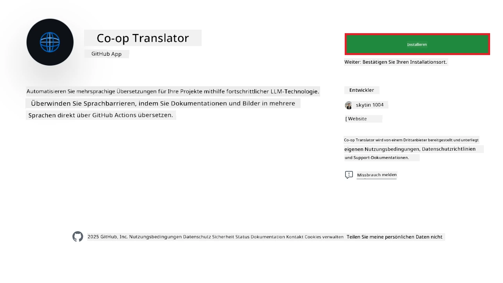
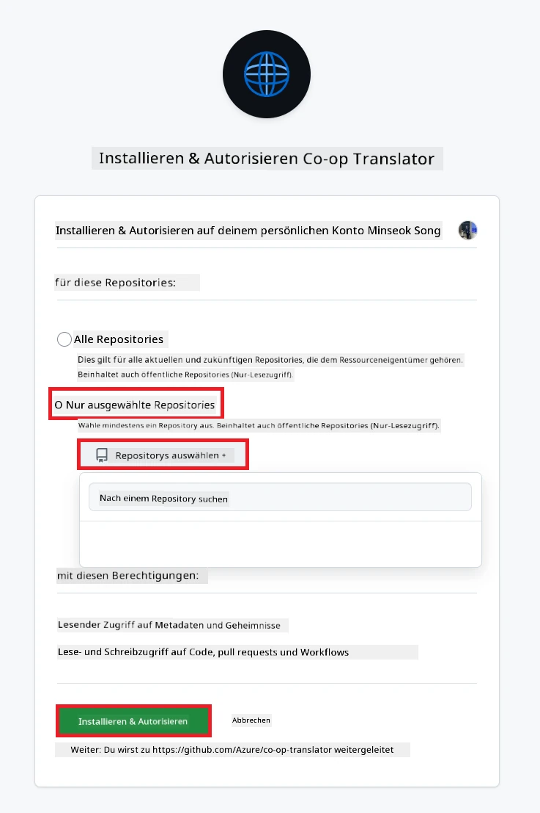
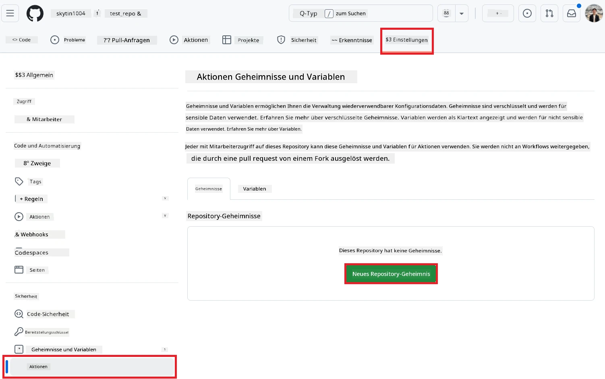
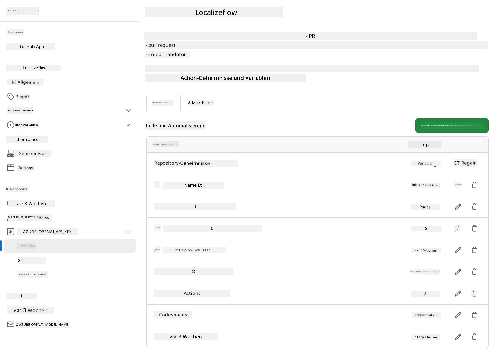

# Verwendung der Co-op Translator GitHub Action (Organisationsanleitung)

**Zielgruppe:** Diese Anleitung richtet sich an **interne Microsoft-Nutzer** oder **Teams, die Zugang zu den erforderlichen Zugangsdaten für die vorgefertigte Co-op Translator GitHub App haben** oder ihre eigene GitHub App erstellen können.

Automatisieren Sie die Übersetzung der Dokumentation Ihres Repositories mühelos mit der Co-op Translator GitHub Action. Diese Anleitung führt Sie durch die Einrichtung der Action, sodass bei Änderungen an Ihren Quell-Markdown-Dateien oder Bildern automatisch Pull Requests mit aktualisierten Übersetzungen erstellt werden.

> [!IMPORTANT]
> 
> **Die richtige Anleitung wählen:**
>
> Diese Anleitung beschreibt die Einrichtung mit **GitHub App ID und Private Key**. Sie benötigen diese "Organisationsanleitung" in der Regel, wenn: **`GITHUB_TOKEN`-Berechtigungen eingeschränkt sind:** Die Einstellungen Ihrer Organisation oder Ihres Repositories schränken die Standardberechtigungen des `GITHUB_TOKEN` ein. Insbesondere, wenn das `GITHUB_TOKEN` nicht die erforderlichen `write`-Berechtigungen erhält (wie `contents: write` oder `pull-requests: write`), schlägt der Workflow aus der [Öffentlichen Anleitung](./github-actions-guide-public.md) wegen unzureichender Berechtigungen fehl. Die Verwendung einer dedizierten GitHub App mit explizit vergebenen Berechtigungen umgeht diese Einschränkung.
>
> **Wenn das oben Genannte nicht auf Sie zutrifft:**
>
> Wenn das Standard-`GITHUB_TOKEN` in Ihrem Repository ausreichend berechtigt ist (d. h. Sie sind nicht durch organisatorische Einschränkungen blockiert), nutzen Sie bitte die **[Öffentliche Anleitung mit GITHUB_TOKEN](./github-actions-guide-public.md)**. Die öffentliche Anleitung erfordert keine App IDs oder Private Keys und verlässt sich ausschließlich auf das Standard-`GITHUB_TOKEN` und die Repository-Berechtigungen.

## Voraussetzungen

Bevor Sie die GitHub Action konfigurieren, stellen Sie sicher, dass Sie die erforderlichen Zugangsdaten für den KI-Dienst bereit haben.

**1. Erforderlich: Zugangsdaten für das KI-Sprachmodell**
Sie benötigen Zugangsdaten für mindestens ein unterstütztes Sprachmodell:

- **Azure OpenAI**: Erfordert Endpoint, API Key, Modell-/Deployment-Namen, API-Version.
- **OpenAI**: Erfordert API Key, (optional: Org ID, Base URL, Model ID).
- Details finden Sie unter [Unterstützte Modelle und Dienste](../../../../README.md).
- Anleitung: [Azure OpenAI einrichten](../set-up-resources/set-up-azure-openai.md).

**2. Optional: Computer Vision Zugangsdaten (für Bildübersetzung)**

- Nur erforderlich, wenn Sie Text in Bildern übersetzen möchten.
- **Azure Computer Vision**: Erfordert Endpoint und Subscription Key.
- Wenn nicht angegeben, läuft die Action standardmäßig im [Nur-Markdown-Modus](../markdown-only-mode.md).
- Anleitung: [Azure Computer Vision einrichten](../set-up-resources/set-up-azure-computer-vision.md).

## Einrichtung und Konfiguration

Folgen Sie diesen Schritten, um die Co-op Translator GitHub Action in Ihrem Repository zu konfigurieren:

### Schritt 1: GitHub App-Authentifizierung installieren und konfigurieren

Der Workflow verwendet die Authentifizierung über eine GitHub App, um sicher mit Ihrem Repository zu interagieren (z. B. Pull Requests zu erstellen). Wählen Sie eine Option:

#### **Option A: Die vorgefertigte Co-op Translator GitHub App installieren (für Microsoft intern)**

1. Gehen Sie zur Seite der [Co-op Translator GitHub App](https://github.com/apps/co-op-translator).

1. Wählen Sie **Installieren** und dann das Konto oder die Organisation, in der sich Ihr Ziel-Repository befindet.

    

1. Wählen Sie **Nur ausgewählte Repositories** und dann Ihr Ziel-Repository (z. B. `PhiCookBook`). Klicken Sie auf **Installieren**. Möglicherweise müssen Sie sich authentifizieren.

    

1. **App-Zugangsdaten erhalten (interner Prozess erforderlich):** Damit der Workflow sich als App authentifizieren kann, benötigen Sie zwei Informationen vom Co-op Translator Team:
  - **App ID:** Die eindeutige Kennung der Co-op Translator App. Die App ID lautet: `1164076`.
  - **Private Key:** Sie müssen den **gesamten Inhalt** der `.pem`-Private-Key-Datei vom Maintainer erhalten. **Behandeln Sie diesen Schlüssel wie ein Passwort und bewahren Sie ihn sicher auf.**

1. Fahren Sie mit Schritt 2 fort.

#### **Option B: Eigene GitHub App verwenden**

- Sie können auch eine eigene GitHub App erstellen und konfigurieren. Stellen Sie sicher, dass sie Lese- und Schreibzugriff auf Inhalte und Pull Requests hat. Sie benötigen die App ID und einen generierten Private Key.

### Schritt 2: Repository-Secrets konfigurieren

Sie müssen die GitHub App-Zugangsdaten und Ihre KI-Dienst-Zugangsdaten als verschlüsselte Secrets in den Repository-Einstellungen hinterlegen.

1. Navigieren Sie zu Ihrem Ziel-Repository (z. B. `PhiCookBook`).

1. Gehen Sie zu **Settings** > **Secrets and variables** > **Actions**.

1. Unter **Repository secrets** klicken Sie für jedes unten aufgeführte Secret auf **New repository secret**.

   

**Erforderliche Secrets (für GitHub App-Authentifizierung):**

| Secret Name          | Beschreibung                                      | Wertquelle                                     |
| :------------------- | :----------------------------------------------- | :---------------------------------------------- |
| `GH_APP_ID`          | Die App ID der GitHub App (aus Schritt 1).        | GitHub App Einstellungen                       |
| `GH_APP_PRIVATE_KEY` | Der **gesamte Inhalt** der heruntergeladenen `.pem`-Datei. | `.pem`-Datei (aus Schritt 1)                |

**KI-Dienst-Secrets (Fügen Sie ALLE hinzu, die laut Voraussetzungen benötigt werden):**

| Secret Name                         | Beschreibung                               | Wertquelle                        |
| :---------------------------------- | :---------------------------------------- | :--------------------------------- |
| `AZURE_AI_SERVICE_API_KEY`            | Schlüssel für Azure AI Service (Computer Vision)  | Azure AI Foundry                  |
| `AZURE_AI_SERVICE_ENDPOINT`         | Endpoint für Azure AI Service (Computer Vision) | Azure AI Foundry                  |
| `AZURE_OPENAI_API_KEY`              | Schlüssel für Azure OpenAI Service         | Azure AI Foundry                  |
| `AZURE_OPENAI_ENDPOINT`             | Endpoint für Azure OpenAI Service          | Azure AI Foundry                  |
| `AZURE_OPENAI_MODEL_NAME`           | Ihr Azure OpenAI Modellname                | Azure AI Foundry                  |
| `AZURE_OPENAI_CHAT_DEPLOYMENT_NAME` | Ihr Azure OpenAI Deployment Name           | Azure AI Foundry                  |
| `AZURE_OPENAI_API_VERSION`          | API-Version für Azure OpenAI               | Azure AI Foundry                  |
| `OPENAI_API_KEY`                    | API Key für OpenAI                         | OpenAI Platform                   |
| `OPENAI_ORG_ID`                     | OpenAI Organisations-ID                    | OpenAI Platform                   |
| `OPENAI_CHAT_MODEL_ID`              | Spezifische OpenAI Modell-ID               | OpenAI Platform                   |
| `OPENAI_BASE_URL`                   | Benutzerdefinierte OpenAI API Base URL     | OpenAI Platform                   |



### Schritt 3: Workflow-Datei erstellen

Erstellen Sie nun die YAML-Datei, die den automatisierten Workflow definiert.

1. Legen Sie im Wurzelverzeichnis Ihres Repositories das Verzeichnis `.github/workflows/` an, falls es noch nicht existiert.

1. Erstellen Sie darin eine Datei mit dem Namen `co-op-translator.yml`.

1. Fügen Sie den folgenden Inhalt in die Datei co-op-translator.yml ein.

```
name: Co-op Translator

on:
  push:
    branches:
      - main

jobs:
  co-op-translator:
    runs-on: ubuntu-latest

    permissions:
      contents: write
      pull-requests: write

    steps:
      - name: Checkout repository
        uses: actions/checkout@v4
        with:
          fetch-depth: 0

      - name: Set up Python
        uses: actions/setup-python@v4
        with:
          python-version: '3.10'

      - name: Install Co-op Translator
        run: |
          python -m pip install --upgrade pip
          pip install co-op-translator

      - name: Run Co-op Translator
        env:
          PYTHONIOENCODING: utf-8
          # Azure AI Service Credentials
          AZURE_AI_SERVICE_API_KEY: ${{ secrets.AZURE_AI_SERVICE_API_KEY }}
          AZURE_AI_SERVICE_ENDPOINT: ${{ secrets.AZURE_AI_SERVICE_ENDPOINT }}

          # Azure OpenAI Credentials
          AZURE_OPENAI_API_KEY: ${{ secrets.AZURE_OPENAI_API_KEY }}
          AZURE_OPENAI_ENDPOINT: ${{ secrets.AZURE_OPENAI_ENDPOINT }}
          AZURE_OPENAI_MODEL_NAME: ${{ secrets.AZURE_OPENAI_MODEL_NAME }}
          AZURE_OPENAI_CHAT_DEPLOYMENT_NAME: ${{ secrets.AZURE_OPENAI_CHAT_DEPLOYMENT_NAME }}
          AZURE_OPENAI_API_VERSION: ${{ secrets.AZURE_OPENAI_API_VERSION }}

          # OpenAI Credentials
          OPENAI_API_KEY: ${{ secrets.OPENAI_API_KEY }}
          OPENAI_ORG_ID: ${{ secrets.OPENAI_ORG_ID }}
          OPENAI_CHAT_MODEL_ID: ${{ secrets.OPENAI_CHAT_MODEL_ID }}
          OPENAI_BASE_URL: ${{ secrets.OPENAI_BASE_URL }}
        run: |
          # =====================================================================
          # IMPORTANT: Set your target languages here (REQUIRED CONFIGURATION)
          # =====================================================================
          # Example: Translate to Spanish, French, German. Add -y to auto-confirm.
          translate -l "es fr de" -y  # <--- MODIFY THIS LINE with your desired languages

      - name: Authenticate GitHub App
        id: generate_token
        uses: tibdex/github-app-token@v1
        with:
          app_id: ${{ secrets.GH_APP_ID }}
          private_key: ${{ secrets.GH_APP_PRIVATE_KEY }}

      - name: Create Pull Request with translations
        uses: peter-evans/create-pull-request@v5
        with:
          token: ${{ steps.generate_token.outputs.token }}
          commit-message: "🌐 Update translations via Co-op Translator"
          title: "🌐 Update translations via Co-op Translator"
          body: |
            This PR updates translations for recent changes to the main branch.

            ### 📋 Changes included
            - Translated contents are available in the `translations/` directory
            - Translated images are available in the `translated_images/` directory

            ---
            🌐 Automatically generated by the [Co-op Translator](https://github.com/Azure/co-op-translator) GitHub Action.
          branch: update-translations
          base: main
          labels: translation, automated-pr
          delete-branch: true
          add-paths: |
            translations/
            translated_images/

```

4.  **Workflow anpassen:**
  - **[!IMPORTANT] Zielsprachen:** Im Schritt `Run Co-op Translator` müssen Sie **unbedingt die Liste der Sprachcodes** im Befehl `translate -l "..." -y` überprüfen und an die Anforderungen Ihres Projekts anpassen. Die Beispiel-Liste (`ar de es...`) muss ersetzt oder angepasst werden.
  - **Trigger (`on:`):** Der aktuelle Trigger läuft bei jedem Push auf `main`. Für große Repositories empfiehlt es sich, einen `paths:`-Filter hinzuzufügen (siehe auskommentiertes Beispiel in der YAML), damit der Workflow nur bei Änderungen an relevanten Dateien (z. B. Quelldokumentation) ausgeführt wird und Runner-Minuten spart.
  - **PR-Details:** Passen Sie bei Bedarf die Werte für `commit-message`, `title`, `body`, `branch` und `labels` im Schritt `Create Pull Request` an.

## Verwaltung und Erneuerung von Zugangsdaten

- **Sicherheit:** Speichern Sie sensible Zugangsdaten (API Keys, Private Keys) immer als GitHub Actions Secrets. Geben Sie sie niemals in Ihrer Workflow-Datei oder im Repository-Code preis.
- **[!IMPORTANT] Schlüssel-Erneuerung (Microsoft intern):** Beachten Sie, dass der Azure OpenAI Key innerhalb von Microsoft einer verpflichtenden Erneuerungsrichtlinie unterliegen kann (z. B. alle 5 Monate). Aktualisieren Sie die entsprechenden GitHub-Secrets (`AZURE_OPENAI_...` Keys) **vor Ablauf**, um Workflow-Fehler zu vermeiden.

## Ausführung des Workflows

> [!WARNING]  
> **Zeitlimit für GitHub-gehostete Runner:**  
> GitHub-gehostete Runner wie `ubuntu-latest` haben ein **maximales Ausführungslimit von 6 Stunden**.  
> Bei großen Dokumentations-Repositories wird der Workflow automatisch abgebrochen, wenn der Übersetzungsprozess länger als 6 Stunden dauert.  
> Um dies zu vermeiden, sollten Sie:  
> - Einen **selbstgehosteten Runner** verwenden (kein Zeitlimit)  
> - Die Anzahl der Zielsprachen pro Lauf reduzieren

Sobald die Datei `co-op-translator.yml` in Ihren Hauptbranch (oder den im `on:`-Trigger angegebenen Branch) gemergt wurde, läuft der Workflow automatisch, wenn Änderungen in diesen Branch gepusht werden (und ggf. den `paths`-Filter erfüllen).

Wenn Übersetzungen erstellt oder aktualisiert werden, erstellt die Action automatisch einen Pull Request mit den Änderungen, der zur Überprüfung und zum Merge bereitsteht.

---

**Haftungsausschluss**:  
Dieses Dokument wurde mit dem KI-Übersetzungsdienst [Co-op Translator](https://github.com/Azure/co-op-translator) übersetzt. Obwohl wir uns um Genauigkeit bemühen, beachten Sie bitte, dass automatisierte Übersetzungen Fehler oder Ungenauigkeiten enthalten können. Das Originaldokument in seiner Ausgangssprache gilt als maßgebliche Quelle. Für kritische Informationen wird eine professionelle menschliche Übersetzung empfohlen. Wir übernehmen keine Haftung für Missverständnisse oder Fehlinterpretationen, die durch die Nutzung dieser Übersetzung entstehen.