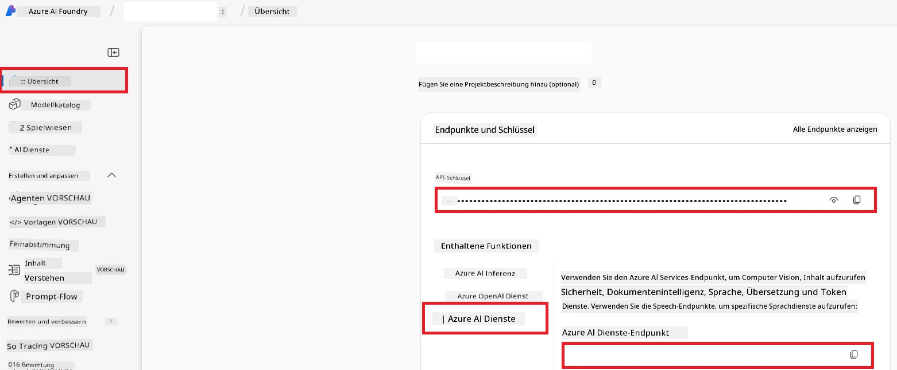

# Azure AI für Co-op Translator einrichten (Azure OpenAI & Azure AI Vision)

Dieser Leitfaden führt Sie durch die Einrichtung von Azure OpenAI für die Sprachübersetzung und Azure Computer Vision zur Analyse von Bildinhalten (die dann für bildbasierte Übersetzungen verwendet werden kann) innerhalb von Azure AI Foundry.

**Voraussetzungen:**
- Ein Azure-Konto mit einem aktiven Abonnement.
- Ausreichende Berechtigungen zur Erstellung von Ressourcen und Bereitstellungen in Ihrem Azure-Abonnement.

## Erstellen eines Azure AI-Projekts

Sie beginnen mit der Erstellung eines Azure AI-Projekts, das als zentraler Ort für die Verwaltung Ihrer KI-Ressourcen dient.

1. Navigieren Sie zu [https://ai.azure.com](https://ai.azure.com) und melden Sie sich mit Ihrem Azure-Konto an.

1. Wählen Sie **+Create**, um ein neues Projekt zu erstellen.

1. Führen Sie die folgenden Aufgaben aus:
   - Geben Sie einen **Projektnamen** ein (z.B. `CoopTranslator-Project`).
   - Wählen Sie den **AI-Hub** aus (z.B. `CoopTranslator-Hub`) (Erstellen Sie bei Bedarf einen neuen).

1. Klicken Sie auf "**Review and Create**", um Ihr Projekt einzurichten. Sie werden zur Übersichtsseite Ihres Projekts weitergeleitet.

## Azure OpenAI für Sprachübersetzung einrichten

Innerhalb Ihres Projekts stellen Sie ein Azure OpenAI-Modell bereit, das als Backend für die Textübersetzung dient.

### Navigieren zu Ihrem Projekt

Falls noch nicht geschehen, öffnen Sie Ihr neu erstelltes Projekt (z.B. `CoopTranslator-Project`) in Azure AI Foundry.

### Ein OpenAI-Modell bereitstellen

1. Wählen Sie im linken Menü Ihres Projekts unter „My assets“ **Models + endpoints**.

1. Wählen Sie **+ Deploy model**.

1. Wählen Sie **Deploy Base Model**.

1. Ihnen wird eine Liste verfügbarer Modelle angezeigt. Filtern oder suchen Sie nach einem geeigneten GPT-Modell. Wir empfehlen `gpt-4o`.

1. Wählen Sie Ihr gewünschtes Modell aus und klicken Sie auf **Confirm**.

1. Wählen Sie **Deploy**.

### Azure OpenAI-Konfiguration

Nach der Bereitstellung können Sie die Bereitstellung auf der Seite "**Models + endpoints**" auswählen, um die **REST-Endpunkt-URL**, den **Key**, den **Bereitstellungsnamen**, den **Modellnamen** und die **API-Version** zu finden. Diese werden benötigt, um das Übersetzungsmodell in Ihre Anwendung zu integrieren.

> [!NOTE]
> Sie können API-Versionen auf der Seite [API-Versionausphasung](https://learn.microsoft.com/azure/ai-services/openai/api-version-deprecation) basierend auf Ihren Anforderungen auswählen. Beachten Sie, dass die **API-Version** sich von der **Modellversion** unterscheidet, die auf der Seite **Models + endpoints** in Azure AI Foundry angezeigt wird.

## Azure Computer Vision für Bildübersetzung einrichten

Um die Übersetzung von Texten innerhalb von Bildern zu ermöglichen, müssen Sie den API-Schlüssel und den Endpunkt des Azure AI-Dienstes finden.

1. Navigieren Sie zu Ihrem Azure AI-Projekt (z.B. `CoopTranslator-Project`). Vergewissern Sie sich, dass Sie sich auf der Übersichtsseite des Projekts befinden.

### Azure AI-Dienst Konfiguration

Finden Sie den API-Schlüssel und den Endpunkt vom Azure AI-Dienst.

1. Navigieren Sie zu Ihrem Azure AI-Projekt (z.B. `CoopTranslator-Project`). Vergewissern Sie sich, dass Sie sich auf der Übersichtsseite des Projekts befinden.

1. Finden Sie den **API Key** und den **Endpoint** im Tab Azure AI Service.

    

Diese Verbindung macht die Fähigkeiten der verbundenen Azure AI Services-Ressource (einschließlich Bildanalyse) für Ihr AI Foundry-Projekt verfügbar. Sie können diese Verbindung dann in Ihren Notebooks oder Anwendungen verwenden, um Text aus Bildern zu extrahieren, der anschließend an das Azure OpenAI-Modell zur Übersetzung gesendet werden kann.

## Konsolidierung Ihrer Anmeldedaten

Bis jetzt sollten Sie folgende Angaben gesammelt haben:

**Für Azure OpenAI (Textübersetzung):**
- Azure OpenAI-Endpunkt
- Azure OpenAI-API-Schlüssel
- Azure OpenAI-Modellname (z.B. `gpt-4o`)
- Azure OpenAI-Bereitstellungsname (z.B. `cooptranslator-gpt4o`)
- Azure OpenAI-API-Version

**Für Azure AI Services (Textextraktion aus Bildern via Vision):**
- Azure AI Service-Endpunkt
- Azure AI Service-API-Schlüssel

### Beispiel: Konfiguration von Umgebungsvariablen (Vorschau)

Später, beim Aufbau Ihrer Anwendung, werden Sie diese gesammelten Anmeldedaten wahrscheinlich als Umgebungsvariablen konfigurieren. Zum Beispiel könnten Sie sie wie folgt festlegen:

```bash
# Azure AI Dienstanmeldeinformationen (Erforderlich für die Bildübersetzung)
AZURE_AI_SERVICE_API_KEY="your_azure_ai_service_api_key" # z.B., 21xasd...
AZURE_AI_SERVICE_ENDPOINT="https://your_azure_ai_service_endpoint.cognitiveservices.azure.com/"

# Optionale Fallback-Sets: doppelte Variablen mit dem Suffix _1/_2 (gleicher Index für alle Variablen im Set)
AZURE_AI_SERVICE_API_KEY_1="your_azure_ai_service_api_key_1"
AZURE_AI_SERVICE_ENDPOINT_1="https://your_azure_ai_service_endpoint_1.cognitiveservices.azure.com/"

# Azure OpenAI Anmeldeinformationen (Erforderlich für die Textübersetzung)
AZURE_OPENAI_API_KEY="your_azure_openai_api_key" # z.B., 21xasd...
AZURE_OPENAI_ENDPOINT="https://your_azure_openai_endpoint.openai.azure.com/"
AZURE_OPENAI_MODEL_NAME="your_model_name" # z.B., gpt-4o
AZURE_OPENAI_CHAT_DEPLOYMENT_NAME="your_deployment_name" # z.B., cooptranslator-gpt4o
AZURE_OPENAI_API_VERSION="your_api_version" # z.B., 2024-12-01-preview

# Optionale Fallback-Sets: das vollständige AZURE_OPENAI_* Set mit Suffix _1/_2 duplizieren (gleicher Index für alle Variablen)
```

---

### Weiterführende Literatur

- [Wie man ein Projekt in Azure AI Foundry erstellt](https://learn.microsoft.com/azure/ai-foundry/how-to/create-projects?tabs=ai-studio)
- [Wie man Azure AI-Ressourcen erstellt](https://learn.microsoft.com/azure/ai-foundry/how-to/create-azure-ai-resource?tabs=portal)
- [Wie man OpenAI-Modelle in Azure AI Foundry bereitstellt](https://learn.microsoft.com/en-us/azure/ai-foundry/how-to/deploy-models-openai)

---

<!-- CO-OP TRANSLATOR DISCLAIMER START -->
**Haftungsausschluss**:  
Dieses Dokument wurde mithilfe des KI-Übersetzungsdienstes [Co-op Translator](https://github.com/Azure/co-op-translator) übersetzt. Obwohl wir uns um Genauigkeit bemühen, beachten Sie bitte, dass automatisierte Übersetzungen Fehler oder Ungenauigkeiten enthalten können. Das Originaldokument in seiner ursprünglichen Sprache gilt als maßgebliche Quelle. Für wichtige Informationen wird eine professionelle menschliche Übersetzung empfohlen. Wir übernehmen keine Haftung für Missverständnisse oder Fehlinterpretationen, die durch die Verwendung dieser Übersetzung entstehen.
<!-- CO-OP TRANSLATOR DISCLAIMER END -->