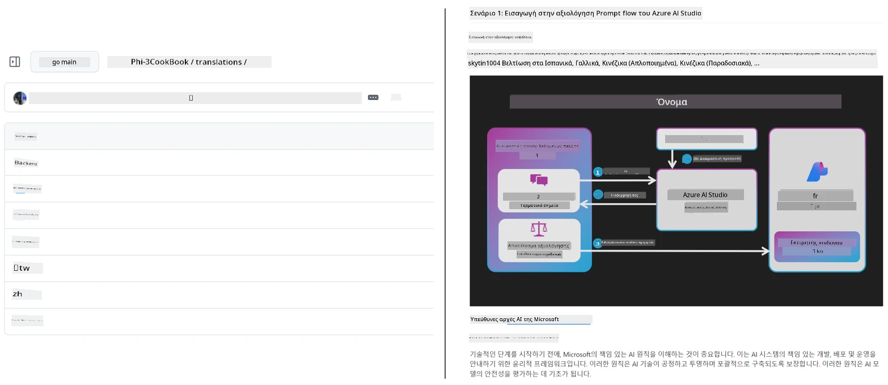
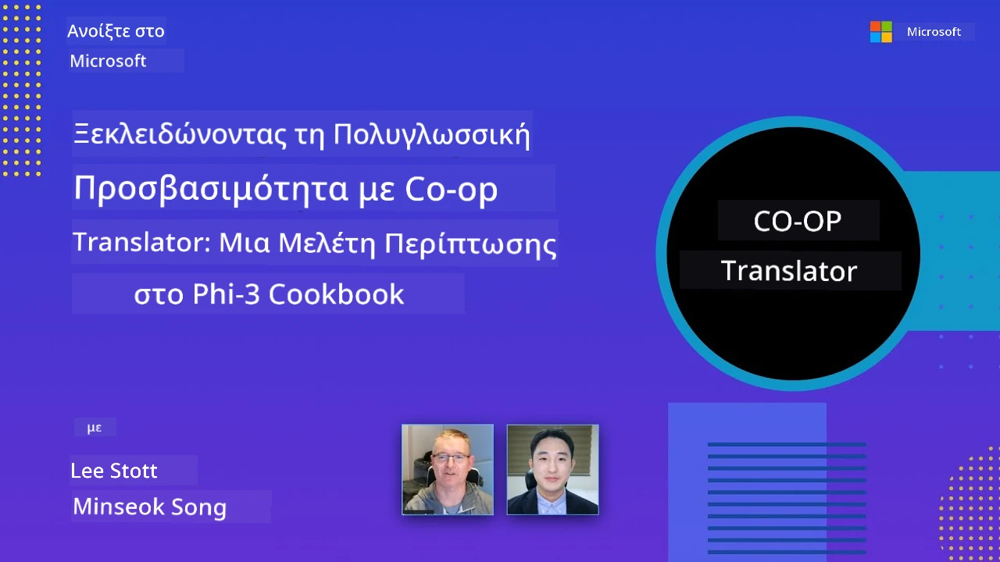

# Co-op Translator

_Αυτοματοποιήστε και διατηρήστε εύκολα τις μεταφράσεις για το εκπαιδευτικό σας περιεχόμενο στο GitHub σε πολλές γλώσσες καθώς εξελίσσεται το έργο σας._


[](https://pypi.org/project/co-op-translator/)
[](https://github.com/azure/co-op-translator/blob/main/LICENSE)
[](https://pepy.tech/project/co-op-translator)
[](https://pepy.tech/project/co-op-translator)
[](https://github.com/azure/co-op-translator/pkgs/container/co-op-translator)
[](https://github.com/psf/black)

[](https://GitHub.com/azure/co-op-translator/graphs/contributors/)
[](https://GitHub.com/azure/co-op-translator/issues/)
[](https://GitHub.com/azure/co-op-translator/pulls/)
[](http://makeapullrequest.com)

### 🌐 Υποστήριξη Πολύγλωσσου Περιεχομένου

#### Υποστηρίζεται από το [Co-op Translator](https://github.com/Azure/Co-op-Translator)

<!-- CO-OP TRANSLATOR LANGUAGES TABLE START -->
[Αραβικά](../ar/README.md) | [Μπενγκάλι](../bn/README.md) | [Βουλγαρικά](../bg/README.md) | [Βιρμανικά (Μιανμάρ)](../my/README.md) | [Κινέζικα (Απλοποιημένα)](../zh-CN/README.md) | [Κινέζικα (Παραδοσιακά, Χονγκ Κονγκ)](../zh-HK/README.md) | [Κινέζικα (Παραδοσιακά, Μακάο)](../zh-MO/README.md) | [Κινέζικα (Παραδοσιακά, Ταϊβάν)](../zh-TW/README.md) | [Κροατικά](../hr/README.md) | [Τσέχικα](../cs/README.md) | [Δανικά](../da/README.md) | [Ολλανδικά](../nl/README.md) | [Εσθονικά](../et/README.md) | [Φινλανδικά](../fi/README.md) | [Γαλλικά](../fr/README.md) | [Γερμανικά](../de/README.md) | [Ελληνικά](./README.md) | [Εβραϊκά](../he/README.md) | [Χίντι](../hi/README.md) | [Ουγγρικά](../hu/README.md) | [Ινδονησιακά](../id/README.md) | [Ιταλικά](../it/README.md) | [Ιαπωνικά](../ja/README.md) | [Κανάντα](../kn/README.md) | [Χμερ](../km/README.md) | [Κορεατικά](../ko/README.md) | [Λιθουανικά](../lt/README.md) | [Μαλαισιανά](../ms/README.md) | [Μαλαγιαλαμικά](../ml/README.md) | [Μαραθικά](../mr/README.md) | [Νεπαλικά](../ne/README.md) | [Νιγηριανά Πίτζιν](../pcm/README.md) | [Νορβηγικά](../no/README.md) | [Περσικά (Φαρσί)](../fa/README.md) | [Πολωνικά](../pl/README.md) | [Πορτογαλικά (Βραζιλία)](../pt-BR/README.md) | [Πορτογαλικά (Πορτογαλία)](../pt-PT/README.md) | [Πουντζάμπι (Γκουρμούκι)](../pa/README.md) | [Ρουμανικά](../ro/README.md) | [Ρωσικά](../ru/README.md) | [Σερβικά (Κυριλλικά)](../sr/README.md) | [Σλοβακικά](../sk/README.md) | [Σλοβενικά](../sl/README.md) | [Ισπανικά](../es/README.md) | [Σουαχίλι](../sw/README.md) | [Σουηδικά](../sv/README.md) | [Ταγκάλογκ (Φιλιππινέζικα)](../tl/README.md) | [Ταμίλ](../ta/README.md) | [Τελούγκου](../te/README.md) | [Ταϊλανδικά](../th/README.md) | [Τουρκικά](../tr/README.md) | [Ουκρανικά](../uk/README.md) | [Ουρντού](../ur/README.md) | [Βιετναμέζικα](../vi/README.md)

> **Προτιμάτε να Κλωνοποιήσετε Τοπικά;**
>
> Αυτό το αποθετήριο περιλαμβάνει πάνω από 50 μεταφράσεις γλωσσών που αυξάνουν σημαντικά το μέγεθος λήψης. Για να κλωνοποιήσετε χωρίς μεταφράσεις, χρησιμοποιήστε sparse checkout:
>
> **Bash / macOS / Linux:**
> ```bash
> git clone --filter=blob:none --sparse https://github.com/skytin1004/co-op-translator.git
> cd co-op-translator
> git sparse-checkout set --no-cone '/*' '!translations' '!translated_images'
> ```
>
> **CMD (Windows):**
> ```cmd
> git clone --filter=blob:none --sparse https://github.com/skytin1004/co-op-translator.git
> cd co-op-translator
> git sparse-checkout set --no-cone "/*" "!translations" "!translated_images"
> ```
>
> Αυτό σας προσφέρει όλα όσα χρειάζεστε για να ολοκληρώσετε το μάθημα με πολύ πιο γρήγορη λήψη.
<!-- CO-OP TRANSLATOR LANGUAGES TABLE END -->

[](https://GitHub.com/azure/co-op-translator/watchers/)
[](https://GitHub.com/azure/co-op-translator/network/)
[](https://GitHub.com/azure/co-op-translator/stargazers/)

[](https://discord.gg/nTYy5BXMWG)

[](https://codespaces.new/azure/co-op-translator)

## Επισκόπηση

Το **Co-op Translator** σας βοηθά να εντοπίσετε εύκολα το εκπαιδευτικό σας περιεχόμενο στο GitHub σε πολλαπλές γλώσσες.
Όταν ενημερώνετε τα αρχεία Markdown, τις εικόνες ή τα notebooks σας, οι μεταφράσεις συγχρονίζονται αυτόματα, διασφαλίζοντας ότι το περιεχόμενό σας παραμένει ακριβές και ενημερωμένο για μαθητές σε όλο τον κόσμο.

Παράδειγμα οργάνωσης μεταφρασμένου περιεχομένου:



## Πώς διαχειρίζεται η κατάσταση της μετάφρασης

Το Co-op Translator διαχειρίζεται το μεταφρασμένο περιεχόμενο ως **εκδόσεις λογισμικού (versioned software artifacts)**,  
όχι ως στατικά αρχεία.

Το εργαλείο παρακολουθεί την κατάσταση του μεταφρασμένου Markdown, των εικόνων και των notebooks
με χρήση **μεταδεδομένων ανά γλώσσα**.

Αυτός ο σχεδιασμός επιτρέπει στο Co-op Translator να:

- Εντοπίζει αξιόπιστα παλιές μεταφράσεις
- Αντιμετωπίζει το Markdown, τις εικόνες και τα notebooks με συνέπεια
- Κλιμακώνεται με ασφάλεια σε μεγάλα, γρήγορα εξελισσόμενα, πολύγλωσσα αποθετήρια

Με το να μοντελοποιεί τις μεταφράσεις ως διαχειριζόμενα αρχεία,
οι ροές εργασίας μετάφρασης ευθυγραμμίζονται φυσικά
με τις σύγχρονες πρακτικές διαχείρισης εξαρτήσεων και αρχείων λογισμικού.

→ [Πώς διαχειρίζεται η κατάσταση της μετάφρασης](https://techcommunity.microsoft.com/blog/azuredevcommunityblog/rethinking-documentation-translation-treating-translations-as-versioned-software/4491755)


## Γρήγορη έναρξη

```bash
# Δημιουργήστε και ενεργοποιήστε ένα εικονικό περιβάλλον (συνιστάται)
python -m venv .venv
# Windows
.venv\Scripts\activate
# macOS/Linux
source .venv/bin/activate
# Εγκαταστήστε το πακέτο
pip install co-op-translator
# Μεταφράστε
translate -l "ko ja fr" -md
```

Docker:

```bash
# Τραβήξτε την δημόσια εικόνα από το GHCR
docker pull ghcr.io/azure/co-op-translator:latest
# Εκτελέστε με τον τρέχοντα φάκελο προσαρτημένο και το .env παρεχόμενο (Bash/Zsh)
docker run --rm -it --env-file .env -v "${PWD}:/work" ghcr.io/azure/co-op-translator:latest -l "ko ja fr" -md
```

## Ελάχιστη ρύθμιση

1. Επιβεβαιώστε ότι έχετε υποστηριζόμενη έκδοση Python (τώρα 3.10-3.12). Στο poetry (pyproject.toml) αυτό γίνεται αυτόματα.
2. Δημιουργήστε ένα αρχείο `.env` χρησιμοποιώντας το πρότυπο: [.env.template](../../.env.template)
3. Διαμορφώστε έναν πάροχο LLM (Azure OpenAI ή OpenAI)
4. (Προαιρετικά) Για μετάφραση εικόνων (`-img`), ρυθμίστε το Azure AI Vision
5. (Προαιρετικά) Μπορείτε να ρυθμίσετε πολλαπλές ομάδες διαπιστευτηρίων αντιγράφοντας τις μεταβλητές με κατάληξη όπως `_1`, `_2`, κλπ. Όλες οι μεταβλητές σε μια ομάδα πρέπει να έχουν την ίδια κατάληξη.
6. (Συνιστάται) Καθαρίστε προηγούμενες μεταφράσεις για να αποφύγετε συγκρούσεις (π.χ., `translations/`)
7. (Συνιστάται) Προσθέστε μια ενότητα μεταφράσεων στο README σας χρησιμοποιώντας το [README languages template](./getting_started/README_languages_template.md)
8. Δείτε: [Ρύθμιση Azure AI](./getting_started/set-up-azure-ai.md)

## Χρήση

Μεταφράστε όλους τους υποστηριζόμενους τύπους:

```bash
translate -l "ko ja"
```

Μόνο Markdown:

```bash
translate -l "de" -md
```

Markdown + εικόνες:

```bash
translate -l "pt" -md -img
```

Μόνο notebooks:

```bash
translate -l "zh" -nb
```

Περισσότερες επιλογές: [Αναφορά εντολών](./getting_started/command-reference.md)

## Χαρακτηριστικά

- Αυτοματοποιημένη μετάφραση για Markdown, notebooks και εικόνες
- Διατηρεί τις μεταφράσεις συγχρονισμένες με τις αλλαγές πηγής
- Λειτουργεί τοπικά (CLI) ή σε CI (GitHub Actions)
- Χρησιμοποιεί Azure OpenAI ή OpenAI· προαιρετικά Azure AI Vision για εικόνες
- Διατηρεί τη μορφοποίηση και τη δομή του Markdown

## Τεκμηρίωση

- [Οδηγός γραμμής εντολών](./getting_started/command-line-guide/command-line-guide.md)
- [Οδηγός GitHub Actions (Δημόσια αποθετήρια & πρότυπα μυστικών)](./getting_started/github-actions-guide/github-actions-guide-public.md)
- [Οδηγός GitHub Actions (Αποθετήρια οργανισμού Microsoft & ρυθμίσεις επιπέδου οργανισμού)](./getting_started/github-actions-guide/github-actions-guide-org.md)
- [README languages template](./getting_started/README_languages_template.md)
- [Υποστηριζόμενες γλώσσες](./getting_started/supported-languages.md)
- [Συμμετοχή](./CONTRIBUTING.md)
- [Επίλυση προβλημάτων](./getting_started/troubleshooting.md)

### Οδηγός ειδικός για τη Microsoft
> [!NOTE]
> Μόνο για συντηρητές των αποθετηρίων “Για Αρχάριους” της Microsoft.

- [Ενημέρωση της λίστας “άλλων μαθημάτων” (μόνο για αποθετήρια MS Beginners)](./getting_started/update-other-courses.md)

## Υποστηρίξτε μας και προωθήστε τη διεθνή μάθηση

Ελάτε μαζί μας στην επανάσταση του πώς διαμοιράζεται το εκπαιδευτικό περιεχόμενο παγκοσμίως! Δώστε ένα ⭐ στο [Co-op Translator](https://github.com/azure/co-op-translator) στο GitHub και υποστηρίξτε την αποστολή μας να καταργήσουμε τα γλωσσικά εμπόδια στη μάθηση και την τεχνολογία. Το ενδιαφέρον και οι συνεισφορές σας κάνουν σημαντική διαφορά! Οι προτάσεις για κώδικα και χαρακτηριστικά είναι πάντα ευπρόσδεκτες.

### Εξερευνήστε το εκπαιδευτικό περιεχόμενο της Microsoft στη γλώσσα σας

- [LangChain4j-for-Beginners](https://github.com/microsoft/LangChain4j-for-Beginners)
- [AZD for Beginners](https://github.com/microsoft/AZD-for-beginners)
- [Edge AI for Beginners](https://github.com/microsoft/edgeai-for-beginners)
- [Model Context Protocol (MCP) For Beginners](https://github.com/microsoft/mcp-for-beginners)
- [AI Agents for Beginners](https://github.com/microsoft/ai-agents-for-beginners)
- [Generative AI for Beginners using .NET](https://github.com/microsoft/Generative-AI-for-beginners-dotnet)
- [Generative AI for Beginners](https://github.com/microsoft/generative-ai-for-beginners)
- [Generative AI for Beginners using Java](https://github.com/microsoft/generative-ai-for-beginners-java)
- [ML for Beginners](https://aka.ms/ml-beginners)
- [Data Science for Beginners](https://aka.ms/datascience-beginners)
- [AI for Beginners](https://aka.ms/ai-beginners)
- [Cybersecurity for Beginners](https://github.com/microsoft/Security-101)
- [Web Dev for Beginners](https://aka.ms/webdev-beginners)
- [IoT for Beginners](https://aka.ms/iot-beginners)
- [PhiCookBook](https://github.com/microsoft/PhiCookBook)

## Βιντεοπαρουσιάσεις

👉 Κάντε κλικ στην παρακάτω εικόνα για να παρακολουθήσετε στο YouTube.

- **Open at Microsoft**: Μια σύντομη 18λεπτη εισαγωγή και γρήγορος οδηγός για το πώς να χρησιμοποιήσετε το Co-op Translator.

  [](https://www.youtube.com/watch?v=jX_swfH_KNU)

## Συνεισφορά

Αυτό το έργο καλωσορίζει συνεισφορές και προτάσεις. Ενδιαφέρεστε να συνεισφέρετε στο Azure Co-op Translator; Παρακαλούμε δείτε το [CONTRIBUTING.md](./CONTRIBUTING.md) για οδηγίες σχετικά με το πώς μπορείτε να βοηθήσετε να γίνει το Co-op Translator πιο προσβάσιμο.

## Συμμετέχοντες
[](https://github.com/Azure/co-op-translator/graphs/contributors)

## Κώδικας Δεοντολογίας

Αυτό το έργο έχει υιοθετήσει τον [Κώδικα Δεοντολογίας Ανοιχτού Κώδικα της Microsoft](https://opensource.microsoft.com/codeofconduct/).
Για περισσότερες πληροφορίες δείτε τις [Συχνές Ερωτήσεις για τον Κώδικα Δεοντολογίας](https://opensource.microsoft.com/codeofconduct/faq/) ή
επικοινωνήστε με [opencode@microsoft.com](mailto:opencode@microsoft.com) για επιπλέον ερωτήσεις ή σχόλια.

## Υπεύθυνη Τεχνητή Νοημοσύνη

Η Microsoft δεσμεύεται να βοηθά τους πελάτες μας να χρησιμοποιούν τα προϊόντα AI υπεύθυνα, μοιράζοντας τις γνώσεις μας και δημιουργώντας συνεργασίες βασισμένες στην εμπιστοσύνη μέσω εργαλείων όπως οι Σημειώσεις Διαφάνειας και οι Αξιολογήσεις Επιπτώσεων. Πολλοί από αυτούς τους πόρους είναι διαθέσιμοι στο [https://aka.ms/RAI](https://aka.ms/RAI).
Η προσέγγιση της Microsoft για την υπεύθυνη AI βασίζεται στις αρχές AI της δικαιοσύνης, αξιοπιστίας και ασφάλειας, ιδιωτικότητας και ασφάλειας, συμπερίληψης, διαφάνειας και λογοδοσίας.

Τα μεγάλα μοντέλα φυσικής γλώσσας, εικόνας και ομιλίας – όπως αυτά που χρησιμοποιούνται σε αυτό το παράδειγμα – μπορεί να συμπεριφέρονται με τρόπους που είναι άδικοι, αναξιόπιστοι ή προσβλητικοί, προκαλώντας ζημιές. Παρακαλούμε συμβουλευτείτε τη [σημείωση διαφάνειας της υπηρεσίας Azure OpenAI](https://learn.microsoft.com/legal/cognitive-services/openai/transparency-note?tabs=text) για να ενημερωθείτε σχετικά με τους κινδύνους και τους περιορισμούς.

Η συνιστώμενη προσέγγιση για τη μείωση αυτών των κινδύνων είναι να ενσωματώσετε ένα σύστημα ασφάλειας στην αρχιτεκτονική σας που μπορεί να εντοπίζει και να αποτρέπει επιβλαβείς συμπεριφορές. Το [Azure AI Content Safety](https://learn.microsoft.com/azure/ai-services/content-safety/overview) παρέχει ένα ανεξάρτητο επίπεδο προστασίας, ικανό να ανιχνεύει επιβλαβές περιεχόμενο που δημιουργείται από τον χρήστη και από AI σε εφαρμογές και υπηρεσίες. Το Azure AI Content Safety περιλαμβάνει API για κείμενο και εικόνα που σας επιτρέπουν να ανιχνεύετε υλικό που είναι επιβλαβές. Διαθέτουμε επίσης ένα διαδραστικό Content Safety Studio που σας επιτρέπει να δείτε, να εξερευνήσετε και να δοκιμάσετε δείγματα κώδικα για την ανίχνευση επιβλαβούς περιεχομένου σε διαφορετικές μορφές. Η ακόλουθη [τεκμηρίωση γρήγορης εκκίνησης](https://learn.microsoft.com/azure/ai-services/content-safety/quickstart-text?tabs=visual-studio%2Clinux&pivots=programming-language-rest) σας καθοδηγεί στο πώς να κάνετε αιτήματα στην υπηρεσία.

Ένα άλλο σημαντικό σημείο που πρέπει να ληφθεί υπόψη είναι η συνολική απόδοση της εφαρμογής. Με εφαρμογές πολλαπλών μορφών και πολλαπλών μοντέλων, η απόδοση θεωρείται ότι το σύστημα λειτουργεί όπως αναμένετε εσείς και οι χρήστες σας, συμπεριλαμβανομένου και του να μην παράγει επιβλαβή αποτελέσματα. Είναι σημαντικό να αξιολογείτε την απόδοση της συνολικής εφαρμογής σας χρησιμοποιώντας [μετρικές ποιότητας παραγωγής και κινδύνου και ασφάλειας](https://learn.microsoft.com/azure/ai-studio/concepts/evaluation-metrics-built-in).

Μπορείτε να αξιολογήσετε την AI εφαρμογή σας στο περιβάλλον ανάπτυξής σας χρησιμοποιώντας το [prompt flow SDK](https://microsoft.github.io/promptflow/index.html). Δίνοντας είτε ένα δοκιμαστικό σύνολο δεδομένων είτε έναν στόχο, οι παραγωγές της γεννητικής AI εφαρμογής σας μετρώνται ποσοτικά με ενσωματωμένους αξιολογητές ή προσαρμοσμένους αξιολογητές της επιλογής σας. Για να ξεκινήσετε με το prompt flow sdk για να αξιολογήσετε το σύστημά σας, μπορείτε να ακολουθήσετε τον [οδηγό γρήγορης εκκίνησης](https://learn.microsoft.com/azure/ai-studio/how-to/develop/flow-evaluate-sdk). Μόλις εκτελέσετε έναν κύκλο αξιολόγησης, μπορείτε να [οπτικοποιήσετε τα αποτελέσματα στο Azure AI Studio](https://learn.microsoft.com/azure/ai-studio/how-to/evaluate-flow-results).

## Εμπορικά Σήματα

Αυτό το έργο μπορεί να περιέχει εμπορικά σήματα ή λογότυπα για έργα, προϊόντα ή υπηρεσίες. Η εξουσιοδοτημένη χρήση των εμπορικών σημάτων ή λογότυπων της Microsoft υπόκειται και πρέπει να ακολουθεί τις
[Οδηγίες Εμπορικών Σημάτων & Επωνυμιών της Microsoft](https://www.microsoft.com/en-us/legal/intellectualproperty/trademarks/usage/general).
Η χρήση εμπορικών σημάτων ή λογότυπων της Microsoft σε τροποποιημένες εκδόσεις αυτού του έργου δεν πρέπει να προκαλεί σύγχυση ή να υπονοεί χορηγία από τη Microsoft.
Οποιαδήποτε χρήση εμπορικών σημάτων ή λογότυπων τρίτων υπόκειται στις πολιτικές των τρίτων αυτών.

## Λήψη Βοήθειας

Εάν κολλήσετε ή έχετε ερωτήσεις σχετικά με τη δημιουργία εφαρμογών AI, συμμετέχετε:

[](https://discord.gg/nTYy5BXMWG)

Εάν έχετε σχόλια για το προϊόν ή σφάλματα κατά την ανάπτυξη, επισκεφθείτε:

[](https://aka.ms/foundry/forum)

---

<!-- CO-OP TRANSLATOR DISCLAIMER START -->
**Αποποίηση ευθυνών**:  
Το παρόν έγγραφο έχει μεταφραστεί χρησιμοποιώντας την υπηρεσία μετάφρασης με ΤΝ [Co-op Translator](https://github.com/Azure/co-op-translator). Ενώ επιδιώκουμε την ακρίβεια, παρακαλούμε να λάβετε υπόψη ότι οι αυτόματες μεταφράσεις ενδέχεται να περιέχουν σφάλματα ή ανακρίβειες. Το πρωτότυπο έγγραφο στη μητρική του γλώσσα πρέπει να θεωρείται η αυθεντική πηγή. Για κρίσιμες πληροφορίες, συνιστάται επαγγελματική ανθρώπινη μετάφραση. Δεν φέρουμε ευθύνη για τυχόν παρεξηγήσεις ή λανθασμένες ερμηνείες που προκύπτουν από τη χρήση αυτής της μετάφρασης.
<!-- CO-OP TRANSLATOR DISCLAIMER END -->