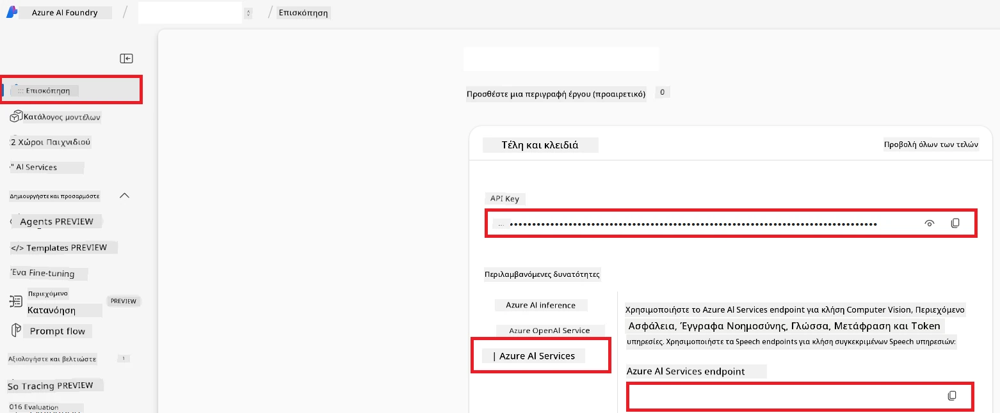

# Ρύθμιση Azure AI για το Co-op Translator (Azure OpenAI & Azure AI Vision)

Αυτός ο οδηγός σας καθοδηγεί στη ρύθμιση του Azure OpenAI για μετάφραση γλώσσας και του Azure Computer Vision για ανάλυση περιεχομένου εικόνων (το οποίο μπορεί στη συνέχεια να χρησιμοποιηθεί για μετάφραση βασισμένη σε εικόνες) μέσα στο Azure AI Foundry.

**Προαπαιτούμενα:**
- Λογαριασμός Azure με ενεργή συνδρομή.
- Επαρκή δικαιώματα για δημιουργία πόρων και αναπτύξεων στη συνδρομή Azure σας.

## Δημιουργία Έργου Azure AI

Θα ξεκινήσετε δημιουργώντας ένα Έργο Azure AI, που χρησιμεύει ως κεντρικό σημείο για τη διαχείριση των πόρων AI σας.

1. Μεταβείτε στο [https://ai.azure.com](https://ai.azure.com) και συνδεθείτε με τον λογαριασμό Azure σας.

1. Επιλέξτε **+Create** για να δημιουργήσετε ένα νέο έργο.

1. Εκτελέστε τις εξής ενέργειες:
   - Εισάγετε ένα **Όνομα Έργου** (π.χ., `CoopTranslator-Project`).
   - Επιλέξτε το **AI hub** (π.χ., `CoopTranslator-Hub`) (Δημιουργήστε νέο αν χρειάζεται).

1. Κάντε κλικ στο "**Review and Create**" για να δημιουργήσετε το έργο σας. Θα μεταβείτε στην σελίδα επισκόπησης του έργου σας.

## Ρύθμιση Azure OpenAI για Μετάφραση Γλώσσας

Μέσα στο έργο σας, θα αναπτύξετε ένα μοντέλο Azure OpenAI που θα λειτουργήσει ως backend για τη μετάφραση κειμένου.

### Μεταβείτε στο Έργο σας

Αν δεν είστε ήδη εκεί, ανοίξτε το νέο σας έργο (π.χ., `CoopTranslator-Project`) στο Azure AI Foundry.

### Αναπτύξτε ένα Μοντέλο OpenAI

1. Από το αριστερό μενού του έργου σας, κάτω από το "My assets", επιλέξτε "**Models + endpoints**".

1. Επιλέξτε **+ Deploy model**.

1. Επιλέξτε **Deploy Base Model**.

1. Θα εμφανιστεί μια λίστα διαθέσιμων μοντέλων. Φιλτράρετε ή αναζητήστε ένα κατάλληλο μοντέλο GPT. Προτείνουμε το `gpt-4o`.

1. Επιλέξτε το επιθυμητό μοντέλο και κάντε κλικ στο **Confirm**.

1. Επιλέξτε **Deploy**.

### Ρύθμιση Azure OpenAI

Μόλις αναπτυχθεί το μοντέλο, μπορείτε να επιλέξετε την ανάπτυξη από τη σελίδα "**Models + endpoints**" για να βρείτε το **REST endpoint URL**, το **Key**, το **Deployment name**, το **Model name** και την **API version**. Αυτά θα χρειαστούν για την ενσωμάτωση του μεταφραστικού μοντέλου στην εφαρμογή σας.

> [!NOTE]
> Μπορείτε να επιλέξετε εκδόσεις API από τη σελίδα [API version deprecation](https://learn.microsoft.com/azure/ai-services/openai/api-version-deprecation) ανάλογα με τις ανάγκες σας. Να γνωρίζετε ότι η **API version** διαφέρει από την **Model version** που εμφανίζεται στη σελίδα **Models + endpoints** στο Azure AI Foundry.

## Ρύθμιση Azure Computer Vision για Μετάφραση Εικόνας

Για να ενεργοποιήσετε τη μετάφραση κειμένου μέσα σε εικόνες, πρέπει να βρείτε το API Key και το Endpoint της υπηρεσίας Azure AI.

1. Μεταβείτε στο Έργο Azure AI σας (π.χ., `CoopTranslator-Project`). Βεβαιωθείτε ότι βρίσκεστε στη σελίδα επισκόπησης του έργου.

### Ρύθμιση Υπηρεσίας Azure AI

Βρείτε το API Key και το Endpoint από την Υπηρεσία Azure AI.

1. Μεταβείτε στο Έργο Azure AI σας (π.χ., `CoopTranslator-Project`). Βεβαιωθείτε ότι βρίσκεστε στη σελίδα επισκόπησης του έργου.

1. Βρείτε το **API Key** και το **Endpoint** στην καρτέλα υπηρεσίας Azure AI.

    

Αυτή η σύνδεση καθιστά διαθέσιμες τις δυνατότητες του συνδεδεμένου πόρου υπηρεσιών Azure AI (συμπεριλαμβανομένης της ανάλυσης εικόνων) στο έργο σας στο AI Foundry. Μπορείτε να χρησιμοποιήσετε αυτή τη σύνδεση στα notebooks ή τις εφαρμογές σας για να εξάγετε κείμενο από εικόνες, το οποίο στη συνέχεια μπορεί να αποσταλεί στο μοντέλο Azure OpenAI για μετάφραση.

## Συγκέντρωση των Διαπιστευτηρίων σας

Μέχρι τώρα, θα πρέπει να έχετε συλλέξει τα εξής:

**Για Azure OpenAI (Μετάφραση Κειμένου):**
- Azure OpenAI Endpoint
- Azure OpenAI API Key
- Όνομα Μοντέλου Azure OpenAI (π.χ., `gpt-4o`)
- Όνομα Ανάπτυξης Azure OpenAI (π.χ., `cooptranslator-gpt4o`)
- Έκδοση API Azure OpenAI

**Για Υπηρεσίες Azure AI (Εξαγωγή Κειμένου Εικόνας μέσω Vision):**
- Endpoint Υπηρεσίας Azure AI
- API Key Υπηρεσίας Azure AI

### Παράδειγμα: Διαμόρφωση Περιβαλλοντικών Μεταβλητών (Προεπισκόπηση)

Αργότερα, όταν θα φτιάχνετε την εφαρμογή σας, πιθανόν να τη διαμορφώσετε χρησιμοποιώντας αυτά τα διαπιστευτήρια που συλλέξατε. Για παράδειγμα, μπορεί να τα ορίσετε ως περιβαλλοντικές μεταβλητές ως εξής:

```bash
# Διαπιστευτήρια Υπηρεσίας Azure AI (Απαραίτητα για μετάφραση εικόνας)
AZURE_AI_SERVICE_API_KEY="your_azure_ai_service_api_key" # π.χ., 21xasd...
AZURE_AI_SERVICE_ENDPOINT="https://your_azure_ai_service_endpoint.cognitiveservices.azure.com/"

# Προαιρετικά σύνολα εναλλακτικής επιλογής: αντιγραφή μεταβλητών με κατάληξη _1/_2 (ίδιος δείκτης για όλες τις μεταβλητές στο σύνολο)
AZURE_AI_SERVICE_API_KEY_1="your_azure_ai_service_api_key_1"
AZURE_AI_SERVICE_ENDPOINT_1="https://your_azure_ai_service_endpoint_1.cognitiveservices.azure.com/"

# Διαπιστευτήρια Azure OpenAI (Απαραίτητα για μετάφραση κειμένου)
AZURE_OPENAI_API_KEY="your_azure_openai_api_key" # π.χ., 21xasd...
AZURE_OPENAI_ENDPOINT="https://your_azure_openai_endpoint.openai.azure.com/"
AZURE_OPENAI_MODEL_NAME="your_model_name" # π.χ., gpt-4o
AZURE_OPENAI_CHAT_DEPLOYMENT_NAME="your_deployment_name" # π.χ., cooptranslator-gpt4o
AZURE_OPENAI_API_VERSION="your_api_version" # π.χ., 2024-12-01-preview

# Προαιρετικά σύνολα εναλλακτικής επιλογής: αντιγραφή ολόκληρου του συνόλου AZURE_OPENAI_* με κατάληξη _1/_2 (ίδιος δείκτης για όλες τις μεταβλητές)
```

---

### Επιπλέον Ανάγνωση

- [Πώς να δημιουργήσετε ένα έργο στο Azure AI Foundry](https://learn.microsoft.com/azure/ai-foundry/how-to/create-projects?tabs=ai-studio)
- [Πώς να δημιουργήσετε πόρους Azure AI](https://learn.microsoft.com/azure/ai-foundry/how-to/create-azure-ai-resource?tabs=portal)
- [Πώς να αναπτύξετε μοντέλα OpenAI στο Azure AI Foundry](https://learn.microsoft.com/en-us/azure/ai-foundry/how-to/deploy-models-openai)

---

<!-- CO-OP TRANSLATOR DISCLAIMER START -->
**Αποποίηση ευθύνης**:  
Αυτό το έγγραφο έχει μεταφραστεί χρησιμοποιώντας την υπηρεσία μετάφρασης με τεχνητή νοημοσύνη [Co-op Translator](https://github.com/Azure/co-op-translator). Παρόλο που επιδιώκουμε ακρίβεια, παρακαλούμε σημειώστε ότι οι αυτοματοποιημένες μεταφράσεις ενδέχεται να περιέχουν λάθη ή ανακρίβειες. Το πρωτότυπο έγγραφο στη μητρική του γλώσσα πρέπει να θεωρείται η αυθεντική πηγή. Για κρίσιμες πληροφορίες, συνιστάται επαγγελματική ανθρώπινη μετάφραση. Δεν φέρουμε ευθύνη για οποιεσδήποτε παρεξηγήσεις ή εσφαλμένες ερμηνείες προκύψουν από τη χρήση αυτής της μετάφρασης.
<!-- CO-OP TRANSLATOR DISCLAIMER END -->