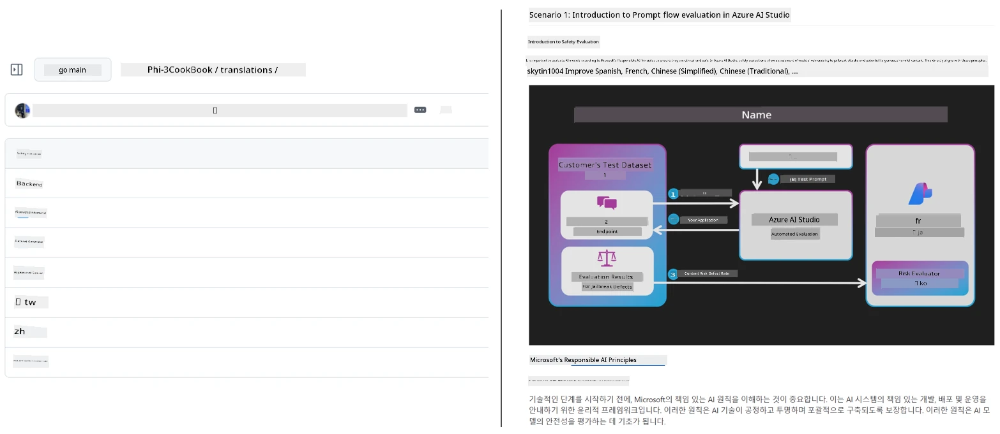

# Co-op Translator

_Easily automate and maintain translations for your educational GitHub content across multiple languages as your project evolves._


[](https://pypi.org/project/co-op-translator/)
[](https://github.com/azure/co-op-translator/blob/main/LICENSE)
[](https://pepy.tech/project/co-op-translator)
[](https://pepy.tech/project/co-op-translator)
[](https://github.com/azure/co-op-translator/pkgs/container/co-op-translator)
[](https://github.com/psf/black)

[](https://GitHub.com/azure/co-op-translator/graphs/contributors/)
[](https://GitHub.com/azure/co-op-translator/issues/)
[](https://GitHub.com/azure/co-op-translator/pulls/)
[](http://makeapullrequest.com)

### 🌐 Multi-Language Support

#### Supported by [Co-op Translator](https://github.com/Azure/Co-op-Translator)

<!-- CO-OP TRANSLATOR LANGUAGES TABLE START -->
[Arabic](../ar/README.md) | [Bengali](../bn/README.md) | [Bulgarian](../bg/README.md) | [Burmese (Myanmar)](../my/README.md) | [Chinese (Simplified)](../zh-CN/README.md) | [Chinese (Traditional, Hong Kong)](../zh-HK/README.md) | [Chinese (Traditional, Macau)](../zh-MO/README.md) | [Chinese (Traditional, Taiwan)](../zh-TW/README.md) | [Croatian](../hr/README.md) | [Czech](../cs/README.md) | [Danish](../da/README.md) | [Dutch](../nl/README.md) | [Estonian](../et/README.md) | [Finnish](../fi/README.md) | [French](../fr/README.md) | [German](../de/README.md) | [Greek](../el/README.md) | [Hebrew](../he/README.md) | [Hindi](../hi/README.md) | [Hungarian](../hu/README.md) | [Indonesian](../id/README.md) | [Italian](../it/README.md) | [Japanese](../ja/README.md) | [Kannada](../kn/README.md) | [Khmer](../km/README.md) | [Korean](../ko/README.md) | [Lithuanian](../lt/README.md) | [Malay](../ms/README.md) | [Malayalam](../ml/README.md) | [Marathi](../mr/README.md) | [Nepali](../ne/README.md) | [Nigerian Pidgin](../pcm/README.md) | [Norwegian](../no/README.md) | [Persian (Farsi)](../fa/README.md) | [Polish](../pl/README.md) | [Portuguese (Brazil)](../pt-BR/README.md) | [Portuguese (Portugal)](../pt-PT/README.md) | [Punjabi (Gurmukhi)](../pa/README.md) | [Romanian](../ro/README.md) | [Russian](../ru/README.md) | [Serbian (Cyrillic)](../sr/README.md) | [Slovak](../sk/README.md) | [Slovenian](../sl/README.md) | [Spanish](../es/README.md) | [Swahili](../sw/README.md) | [Swedish](../sv/README.md) | [Tagalog (Filipino)](../tl/README.md) | [Tamil](../ta/README.md) | [Telugu](../te/README.md) | [Thai](../th/README.md) | [Turkish](../tr/README.md) | [Ukrainian](../uk/README.md) | [Urdu](../ur/README.md) | [Vietnamese](../vi/README.md)

> **Prefer to Clone Locally?**
>
> This repository includes 50+ language translations which significantly increases the download size. To clone without translations, use sparse checkout:
>
> **Bash / macOS / Linux:**
> ```bash
> git clone --filter=blob:none --sparse https://github.com/skytin1004/co-op-translator.git
> cd co-op-translator
> git sparse-checkout set --no-cone '/*' '!translations' '!translated_images'
> ```
>
> **CMD (Windows):**
> ```cmd
> git clone --filter=blob:none --sparse https://github.com/skytin1004/co-op-translator.git
> cd co-op-translator
> git sparse-checkout set --no-cone "/*" "!translations" "!translated_images"
> ```
>
> This gives you everything you need to complete the course with a much faster download.
<!-- CO-OP TRANSLATOR LANGUAGES TABLE END -->

[](https://GitHub.com/azure/co-op-translator/watchers/)
[](https://GitHub.com/azure/co-op-translator/network/)
[](https://GitHub.com/azure/co-op-translator/stargazers/)

[](https://discord.gg/nTYy5BXMWG)

[](https://codespaces.new/azure/co-op-translator)

## Overview

**Co-op Translator** helps you localize your educational GitHub content into multiple languages effortlessly.
When you update your Markdown files, images, or notebooks, translations stay automatically synchronized, ensuring your content remains accurate and up to date for learners worldwide.

Example of how translated content is organized:



## How translation state is managed

Co-op Translator manages translated content as **versioned software artifacts**,  
not as static files.

The tool tracks the state of translated Markdown, images, and notebooks
using **language-scoped metadata**.

This design allows Co-op Translator to:

- Reliably detect outdated translations
- Treat Markdown, images, and notebooks consistently
- Scale safely across large, fast-moving, multi-language repositories

By modeling translations as managed artifacts,
translation workflows align naturally with modern
software dependency and artifact management practices.

→ [How translation state is managed](https://techcommunity.microsoft.com/blog/azuredevcommunityblog/rethinking-documentation-translation-treating-translations-as-versioned-software/4491755)


## Quick start

```bash
# Create and activate a virtual environment (recommended)
python -m venv .venv
# Windows
.venv\Scripts\activate
# macOS/Linux
source .venv/bin/activate
# Install the package
pip install co-op-translator
# Translate
translate -l "ko ja fr" -md
```

Docker:

```bash
# Pull the public image from GHCR
docker pull ghcr.io/azure/co-op-translator:latest
# Run with current folder mounted and .env provided (Bash/Zsh)
docker run --rm -it --env-file .env -v "${PWD}:/work" ghcr.io/azure/co-op-translator:latest -l "ko ja fr" -md
```

## Minimal setup

1. Assert that you have a supported Python version (currently 3.10-3.12). In poetry (pyproject.toml) this is handeled automatically.
2. Create a `.env` file using the template: [.env.template](../../.env.template)
3. Configure one LLM provider (Azure OpenAI or OpenAI)
4. (Optional) For image translation (`-img`), configure Azure AI Vision
5. (Optional) You can configure multiple credential sets by duplicating variables with suffixes like `_1`, `_2`, etc. All variables in a set must share the same suffix.
6. (Recommended) Clean up any previous translations to avoid conflicts (e.g., `translations/`)
7. (Recommended) Add a translation section to your README using the [README languages template](./getting_started/README_languages_template.md)
8. See: [Set up Azure AI](./getting_started/set-up-azure-ai.md)

## Usage

Translate all supported types:

```bash
translate -l "ko ja"
```

Only Markdown:

```bash
translate -l "de" -md
```

Markdown + images:

```bash
translate -l "pt" -md -img
```

Only notebooks:

```bash
translate -l "zh" -nb
```

More flags: [Command reference](./getting_started/command-reference.md)

## Features

- Automated translation for Markdown, notebooks, and images
- Keeps translations in sync with source changes
- Works locally (CLI) or in CI (GitHub Actions)
- Uses Azure OpenAI or OpenAI; optional Azure AI Vision for images
- Preserves Markdown formatting and structure

## Docs

- [Command-line guide](./getting_started/command-line-guide/command-line-guide.md)
- [GitHub Actions guide (Public repositories & standard secrets)](./getting_started/github-actions-guide/github-actions-guide-public.md)
- [GitHub Actions guide (Microsoft organization repositories & org-level setups)](./getting_started/github-actions-guide/github-actions-guide-org.md)
- [README languages template](./getting_started/README_languages_template.md)
- [Supported languages](./getting_started/supported-languages.md)
- [Contributing](./CONTRIBUTING.md)
- [Troubleshooting](./getting_started/troubleshooting.md)

### Microsoft-specific guide
> [!NOTE]
> For maintainers of the Microsoft “For Beginners” repositories only.

- [Updating the “other courses” list (for MS Beginners repositories only)](./getting_started/update-other-courses.md)

## Support us and foster global learning

Join us in revolutionizing how educational content is shared globally! Give [Co-op Translator](https://github.com/azure/co-op-translator) a ⭐ on GitHub and support our mission to break down language barriers in learning and technology. Your interest and contributions make a significant impact! Code contributions and feature suggestions are always welcome.

### Explore Microsoft educational content in your language

- [LangChain4j-for-Beginners](https://github.com/microsoft/LangChain4j-for-Beginners)
- [AZD for Beginners](https://github.com/microsoft/AZD-for-beginners)
- [Edge AI for Beginners](https://github.com/microsoft/edgeai-for-beginners)
- [Model Context Protocol (MCP) For Beginners](https://github.com/microsoft/mcp-for-beginners)
- [AI Agents for Beginners](https://github.com/microsoft/ai-agents-for-beginners)
- [Generative AI for Beginners using .NET](https://github.com/microsoft/Generative-AI-for-beginners-dotnet)
- [Generative AI for Beginners](https://github.com/microsoft/generative-ai-for-beginners)
- [Generative AI for Beginners using Java](https://github.com/microsoft/generative-ai-for-beginners-java)
- [ML for Beginners](https://aka.ms/ml-beginners)
- [Data Science for Beginners](https://aka.ms/datascience-beginners)
- [AI for Beginners](https://aka.ms/ai-beginners)
- [Cybersecurity for Beginners](https://github.com/microsoft/Security-101)
- [Web Dev for Beginners](https://aka.ms/webdev-beginners)
- [IoT for Beginners](https://aka.ms/iot-beginners)
- [PhiCookBook](https://github.com/microsoft/PhiCookBook)

## Video presentations

👉 Click the image below to watch on YouTube.

- **Open at Microsoft**: A brief 18-minute introduction and quick guide on how to use Co-op Translator.

  [](https://www.youtube.com/watch?v=jX_swfH_KNU)

## Contributing

This project welcomes contributions and suggestions. Interested in contributing to Azure Co-op Translator? Please see our [CONTRIBUTING.md](./CONTRIBUTING.md) for guidelines on how you can help make Co-op Translator more accessible.

## Contributors
[](https://github.com/Azure/co-op-translator/graphs/contributors)

## Code of Conduct

This project has adopted the [Microsoft Open Source Code of Conduct](https://opensource.microsoft.com/codeofconduct/).
For more information see the [Code of Conduct FAQ](https://opensource.microsoft.com/codeofconduct/faq/) or
contact [opencode@microsoft.com](mailto:opencode@microsoft.com) with any additional questions or comments.

## Responsible AI

Microsoft is committed to helping our customers use our AI products responsibly, sharing our learnings, and building trust-based partnerships through tools like Transparency Notes and Impact Assessments. Many of these resources can be found at [https://aka.ms/RAI](https://aka.ms/RAI).
Microsoft's approach to responsible AI is grounded in our AI principles of fairness, reliability and safety, privacy and security, inclusiveness, transparency, and accountability.

Large-scale natural language, image, and speech models - like the ones used in this sample - can potentially behave in ways that are unfair, unreliable, or offensive, in turn causing harms. Please consult the [Azure OpenAI service Transparency note](https://learn.microsoft.com/legal/cognitive-services/openai/transparency-note?tabs=text) to be informed about risks and limitations.

The recommended approach to mitigating these risks is to include a safety system in your architecture that can detect and prevent harmful behavior. [Azure AI Content Safety](https://learn.microsoft.com/azure/ai-services/content-safety/overview) provides an independent layer of protection, able to detect harmful user-generated and AI-generated content in applications and services. Azure AI Content Safety includes text and image APIs that allow you to detect material that is harmful. We also have an interactive Content Safety Studio that allows you to view, explore and try out sample code for detecting harmful content across different modalities. The following [quickstart documentation](https://learn.microsoft.com/azure/ai-services/content-safety/quickstart-text?tabs=visual-studio%2Clinux&pivots=programming-language-rest) guides you through making requests to the service.

Another aspect to take into account is the overall application performance. With multi-modal and multi-models applications, we consider performance to mean that the system performs as you and your users expect, including not generating harmful outputs. It's important to assess the performance of your overall application using [generation quality and risk and safety metrics](https://learn.microsoft.com/azure/ai-studio/concepts/evaluation-metrics-built-in).

You can evaluate your AI application in your development environment using the [prompt flow SDK](https://microsoft.github.io/promptflow/index.html). Given either a test dataset or a target, your generative AI application generations are quantitatively measured with built-in evaluators or custom evaluators of your choice. To get started with the prompt flow sdk to evaluate your system, you can follow the [quickstart guide](https://learn.microsoft.com/azure/ai-studio/how-to/develop/flow-evaluate-sdk). Once you execute an evaluation run, you can [visualize the results in Azure AI Studio](https://learn.microsoft.com/azure/ai-studio/how-to/evaluate-flow-results).

## Trademarks

This project may contain trademarks or logos for projects, products, or services. Authorized use of Microsoft
trademarks or logos is subject to and must follow
[Microsoft's Trademark & Brand Guidelines](https://www.microsoft.com/en-us/legal/intellectualproperty/trademarks/usage/general).
Use of Microsoft trademarks or logos in modified versions of this project must not cause confusion or imply Microsoft sponsorship.
Any use of third-party trademarks or logos are subject to those third-party's policies.

## Getting Help

If you get stuck or have any questions about building AI apps, join:

[](https://discord.gg/nTYy5BXMWG)

If you have product feedback or errors while building visit:

[](https://aka.ms/foundry/forum)

---

<!-- CO-OP TRANSLATOR DISCLAIMER START -->
**Disclaimer**:  
This document has been translated using AI translation service [Co-op Translator](https://github.com/Azure/co-op-translator). While we strive for accuracy, please be aware that automated translations may contain errors or inaccuracies. The original document in its native language should be considered the authoritative source. For critical information, professional human translation is recommended. We are not liable for any misunderstandings or misinterpretations arising from the use of this translation.
<!-- CO-OP TRANSLATOR DISCLAIMER END -->