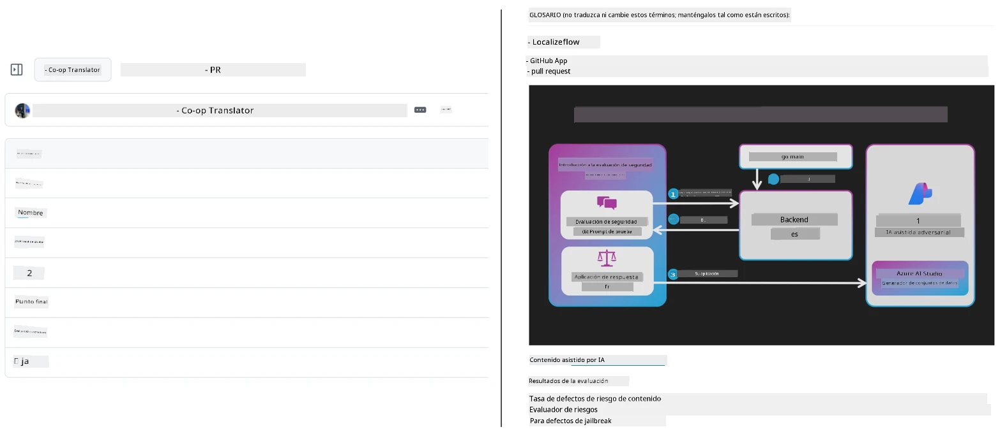
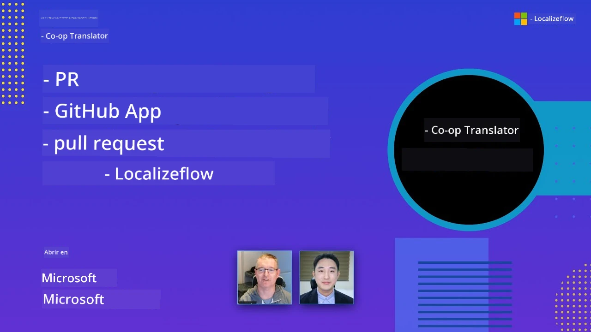

# Co-op Translator

_Automatice y mantenga fácilmente las traducciones de su contenido educativo en GitHub en múltiples idiomas a medida que evoluciona su proyecto._


[](https://pypi.org/project/co-op-translator/)
[](https://github.com/azure/co-op-translator/blob/main/LICENSE)
[](https://pepy.tech/project/co-op-translator)
[](https://pepy.tech/project/co-op-translator)
[](https://github.com/azure/co-op-translator/pkgs/container/co-op-translator)
[](https://github.com/psf/black)

[](https://GitHub.com/azure/co-op-translator/graphs/contributors/)
[](https://GitHub.com/azure/co-op-translator/issues/)
[](https://GitHub.com/azure/co-op-translator/pulls/)
[](http://makeapullrequest.com)

### 🌐 Soporte multilingüe

#### Soportado por [Co-op Translator](https://github.com/Azure/Co-op-Translator)

<!-- CO-OP TRANSLATOR LANGUAGES TABLE START -->
[Árabe](../ar/README.md) | [Bengalí](../bn/README.md) | [Búlgaro](../bg/README.md) | [Birmano (Myanmar)](../my/README.md) | [Chino (Simplificado)](../zh-CN/README.md) | [Chino (Tradicional, Hong Kong)](../zh-HK/README.md) | [Chino (Tradicional, Macao)](../zh-MO/README.md) | [Chino (Tradicional, Taiwán)](../zh-TW/README.md) | [Croata](../hr/README.md) | [Checo](../cs/README.md) | [Danés](../da/README.md) | [Holandés](../nl/README.md) | [Estonio](../et/README.md) | [Finlandés](../fi/README.md) | [Francés](../fr/README.md) | [Alemán](../de/README.md) | [Griego](../el/README.md) | [Hebreo](../he/README.md) | [Hindi](../hi/README.md) | [Húngaro](../hu/README.md) | [Indonesio](../id/README.md) | [Italiano](../it/README.md) | [Japonés](../ja/README.md) | [Kannada](../kn/README.md) | [Jemer](../km/README.md) | [Coreano](../ko/README.md) | [Lituano](../lt/README.md) | [Malayo](../ms/README.md) | [Malayalam](../ml/README.md) | [Maratí](../mr/README.md) | [Nepalí](../ne/README.md) | [Pidgin Nigeriano](../pcm/README.md) | [Noruego](../no/README.md) | [Persa (Farsi)](../fa/README.md) | [Polaco](../pl/README.md) | [Portugués (Brasil)](../pt-BR/README.md) | [Portugués (Portugal)](../pt-PT/README.md) | [Panyabí (Gurmukhi)](../pa/README.md) | [Rumano](../ro/README.md) | [Ruso](../ru/README.md) | [Serbio (Cirílico)](../sr/README.md) | [Eslovaco](../sk/README.md) | [Esloveno](../sl/README.md) | [Español](./README.md) | [Swahili](../sw/README.md) | [Sueco](../sv/README.md) | [Tagalo (Filipino)](../tl/README.md) | [Tamil](../ta/README.md) | [Telugu](../te/README.md) | [Tailandés](../th/README.md) | [Turco](../tr/README.md) | [Ucraniano](../uk/README.md) | [Urdu](../ur/README.md) | [Vietnamita](../vi/README.md)

> **¿Prefiere clonar localmente?**
>
> Este repositorio incluye traducciones en más de 50 idiomas, lo que incrementa significativamente el tamaño de la descarga. Para clonar sin traducciones, use sparse checkout:
>
> **Bash / macOS / Linux:**
> ```bash
> git clone --filter=blob:none --sparse https://github.com/Azure/co-op-translator.git
> cd co-op-translator
> git sparse-checkout set --no-cone '/*' '!translations' '!translated_images'
> ```
>
> **CMD (Windows):**
> ```cmd
> git clone --filter=blob:none --sparse https://github.com/Azure/co-op-translator.git
> cd co-op-translator
> git sparse-checkout set --no-cone "/*" "!translations" "!translated_images"
> ```
>
> Esto le da todo lo necesario para completar el curso con una descarga mucho más rápida.
<!-- CO-OP TRANSLATOR LANGUAGES TABLE END -->

[](https://GitHub.com/azure/co-op-translator/watchers/)
[](https://GitHub.com/azure/co-op-translator/network/)
[](https://GitHub.com/azure/co-op-translator/stargazers/)

[](https://discord.gg/nTYy5BXMWG)

[](https://codespaces.new/azure/co-op-translator)

## Descripción general

**Co-op Translator** le ayuda a localizar su contenido educativo en GitHub en varios idiomas sin esfuerzo.  
Cuando actualiza sus archivos Markdown, imágenes o notebooks, las traducciones se sincronizan automáticamente, asegurando que su contenido siga siendo preciso y actualizado para estudiantes en todo el mundo.

Ejemplo de cómo está organizado el contenido traducido:



## Cómo se gestiona el estado de la traducción

Co-op Translator gestiona el contenido traducido como **artefactos de software versionados**,  
no como archivos estáticos.

La herramienta rastrea el estado de Markdown traducido, imágenes y notebooks  
usando **metadatos específicos por idioma**.

Este diseño permite a Co-op Translator:

- Detectar de forma fiable traducciones desactualizadas  
- Tratar Markdown, imágenes y notebooks de manera consistente  
- Escalar de forma segura en repositorios grandes, dinámicos y multilingües  

Al modelar las traducciones como artefactos gestionados,  
los flujos de trabajo de traducción se alinean naturalmente con las prácticas modernas  
de gestión de dependencias de software y artefactos.

→ [Cómo se gestiona el estado de la traducción](https://techcommunity.microsoft.com/blog/azuredevcommunityblog/rethinking-documentation-translation-treating-translations-as-versioned-software/4491755)


## Inicio rápido

```bash
# Crear y activar un entorno virtual (recomendado)
python -m venv .venv
# Windows
.venv\Scripts\activate
# macOS/Linux
source .venv/bin/activate
# Instalar el paquete
pip install co-op-translator
# Traducir
translate -l "ko ja fr" -md
```

Docker:

```bash
# Descargar la imagen pública desde GHCR
docker pull ghcr.io/azure/co-op-translator:latest
# Ejecutar con la carpeta actual montada y el archivo .env proporcionado (Bash/Zsh)
docker run --rm -it --env-file .env -v "${PWD}:/work" ghcr.io/azure/co-op-translator:latest -l "ko ja fr" -md
```

## Configuración mínima

1. Asegúrese de tener una versión de Python soportada (actualmente 3.10-3.12). En poetry (pyproject.toml) esto se gestiona automáticamente.  
2. Cree un archivo `.env` usando la plantilla: [.env.template](../../.env.template)  
3. Configure un proveedor LLM (Azure OpenAI o OpenAI)  
4. (Opcional) Para traducción de imágenes (`-img`), configure Azure AI Vision  
5. (Opcional) Puede configurar múltiples conjuntos de credenciales duplicando variables con sufijos como `_1`, `_2`, etc. Todas las variables en un conjunto deben compartir el mismo sufijo.  
6. (Recomendado) Limpie cualquier traducción anterior para evitar conflictos (por ejemplo, `translations/`)  
7. (Recomendado) Añada una sección de traducción a su README usando la [plantilla para idiomas del README](./getting_started/README_languages_template.md)  
8. Vea: [Configurar Azure AI](./getting_started/set-up-azure-ai.md)

## Uso

Traduce todos los tipos soportados:

```bash
translate -l "ko ja"
```

Solo Markdown:

```bash
translate -l "de" -md
```

Markdown + imágenes:

```bash
translate -l "pt" -md -img
```

Solo notebooks:

```bash
translate -l "zh" -nb
```

Más opciones: [Referencia de comandos](./getting_started/command-reference.md)

## Funcionalidades

- Traducción automatizada para Markdown, notebooks e imágenes  
- Mantiene las traducciones sincronizadas con los cambios en la fuente  
- Funciona localmente (CLI) o en CI (GitHub Actions)  
- Usa Azure OpenAI u OpenAI; opcionalmente Azure AI Vision para imágenes  
- Preserva el formato y la estructura de Markdown

## Documentación

- [Guía de línea de comandos](./getting_started/command-line-guide/command-line-guide.md)  
- [Guía de GitHub Actions (repositorios públicos y secretos estándar)](./getting_started/github-actions-guide/github-actions-guide-public.md)  
- [Guía de GitHub Actions (repositorios de organización Microsoft y configuraciones a nivel de organización)](./getting_started/github-actions-guide/github-actions-guide-org.md)  
- [Plantilla para idiomas del README](./getting_started/README_languages_template.md)  
- [Idiomas soportados](./getting_started/supported-languages.md)  
- [Contribuir](./CONTRIBUTING.md)  
- [Solución de problemas](./getting_started/troubleshooting.md)

### Guía específica de Microsoft
> [!NOTE]
> Solo para mantenedores de los repositorios “Para Principiantes” de Microsoft.

- [Actualización de la lista “otros cursos” (solo para repositorios MS Beginners)](./getting_started/update-other-courses.md)

## Apóyanos y fomenta el aprendizaje global

¡Únete a nosotros para revolucionar cómo se comparte contenido educativo a nivel global! Dale una ⭐ a [Co-op Translator](https://github.com/azure/co-op-translator) en GitHub y apoya nuestra misión de derribar barreras lingüísticas en aprendizaje y tecnología. ¡Tu interés y contribuciones tienen un impacto importante! Las contribuciones de código y sugerencias de características son siempre bienvenidas.

### Explora contenido educativo de Microsoft en tu idioma

- [LangChain4j-for-Beginners](https://github.com/microsoft/LangChain4j-for-Beginners)  
- [AZD para principiantes](https://github.com/microsoft/AZD-for-beginners)  
- [Edge AI para principiantes](https://github.com/microsoft/edgeai-for-beginners)  
- [Modelo Contextual Protocolo (MCP) para principiantes](https://github.com/microsoft/mcp-for-beginners)  
- [Agentes IA para principiantes](https://github.com/microsoft/ai-agents-for-beginners)  
- [IA generativa para principiantes usando .NET](https://github.com/microsoft/Generative-AI-for-beginners-dotnet)  
- [IA generativa para principiantes](https://github.com/microsoft/generative-ai-for-beginners)  
- [IA generativa para principiantes usando Java](https://github.com/microsoft/generative-ai-for-beginners-java)  
- [ML para principiantes](https://aka.ms/ml-beginners)  
- [Ciencia de datos para principiantes](https://aka.ms/datascience-beginners)  
- [IA para principiantes](https://aka.ms/ai-beginners)  
- [Ciberseguridad para principiantes](https://github.com/microsoft/Security-101)  
- [Desarrollo web para principiantes](https://aka.ms/webdev-beginners)  
- [IoT para principiantes](https://aka.ms/iot-beginners)  
- [PhiCookBook](https://github.com/microsoft/PhiCookBook)

## Presentaciones en video

👉 Haga clic en la imagen de abajo para ver en YouTube.

- **Open at Microsoft**: Una breve introducción de 18 minutos y guía rápida sobre cómo usar Co-op Translator.

  [](https://www.youtube.com/watch?v=jX_swfH_KNU)

## Contribuyendo

Este proyecto da la bienvenida a contribuciones y sugerencias. ¿Interesado en contribuir a Azure Co-op Translator? Por favor, consulte nuestro [CONTRIBUTING.md](./CONTRIBUTING.md) para las pautas sobre cómo ayudar a que Co-op Translator sea más accesible.

## Colaboradores
[](https://github.com/Azure/co-op-translator/graphs/contributors)

## Código de Conducta

Este proyecto ha adoptado el [Código de Conducta de Código Abierto de Microsoft](https://opensource.microsoft.com/codeofconduct/).
Para más información, consulte las [Preguntas Frecuentes sobre el Código de Conducta](https://opensource.microsoft.com/codeofconduct/faq/) o
contacte a [opencode@microsoft.com](mailto:opencode@microsoft.com) con cualquier pregunta o comentario adicional.

## IA Responsable

Microsoft está comprometido a ayudar a nuestros clientes a usar nuestros productos de IA de manera responsable, compartiendo nuestros aprendizajes y construyendo alianzas basadas en la confianza a través de herramientas como Notas de Transparencia y Evaluaciones de Impacto. Muchos de estos recursos se pueden encontrar en [https://aka.ms/RAI](https://aka.ms/RAI).
El enfoque de Microsoft hacia la IA responsable se basa en nuestros principios de IA de equidad, confiabilidad y seguridad, privacidad y protección, inclusión, transparencia y responsabilidad.

Los modelos a gran escala de lenguaje natural, imagen y voz, como los usados en este ejemplo, pueden potencialmente comportarse de maneras injustas, poco confiables u ofensivas, causando daños. Por favor consulte la [nota de transparencia del servicio Azure OpenAI](https://learn.microsoft.com/legal/cognitive-services/openai/transparency-note?tabs=text) para informarse sobre riesgos y limitaciones.

El enfoque recomendado para mitigar estos riesgos es incluir un sistema de seguridad en su arquitectura que pueda detectar y prevenir comportamientos dañinos. [Azure AI Content Safety](https://learn.microsoft.com/azure/ai-services/content-safety/overview) proporciona una capa independiente de protección, capaz de detectar contenido dañino generado por usuarios y por IA en aplicaciones y servicios. Azure AI Content Safety incluye APIs de texto e imagen que permiten detectar material dañino. También contamos con un Content Safety Studio interactivo que permite ver, explorar y probar código de ejemplo para detectar contenido dañino en diferentes modalidades. La siguiente [documentación rápida](https://learn.microsoft.com/azure/ai-services/content-safety/quickstart-text?tabs=visual-studio%2Clinux&pivots=programming-language-rest) le guía paso a paso para realizar solicitudes al servicio.

Otro aspecto a tener en cuenta es el rendimiento general de la aplicación. Con aplicaciones multimodales y multimodelo, consideramos que el rendimiento significa que el sistema actúe como usted y sus usuarios esperan, incluyendo no generar resultados dañinos. Es importante evaluar el rendimiento de su aplicación general utilizando [métricas de calidad de generación y riesgo y seguridad](https://learn.microsoft.com/azure/ai-studio/concepts/evaluation-metrics-built-in).

Puede evaluar su aplicación de IA en su entorno de desarrollo usando el [prompt flow SDK](https://microsoft.github.io/promptflow/index.html). Dado un conjunto de datos de prueba o un objetivo, las generaciones de su aplicación de IA generativa se miden cuantitativamente con evaluadores incorporados o evaluadores personalizados de su elección. Para comenzar con el prompt flow sdk para evaluar su sistema, puede seguir la [guía rápida](https://learn.microsoft.com/azure/ai-studio/how-to/develop/flow-evaluate-sdk). Una vez que ejecute una evaluación, puede [visualizar los resultados en Azure AI Studio](https://learn.microsoft.com/azure/ai-studio/how-to/evaluate-flow-results).

## Marcas Registradas

Este proyecto puede contener marcas registradas o logotipos de proyectos, productos o servicios. El uso autorizado de marcas registradas o logotipos de Microsoft está sujeto a y debe seguir
[las Directrices de Marca y Marcas Registradas de Microsoft](https://www.microsoft.com/en-us/legal/intellectualproperty/trademarks/usage/general).
El uso de marcas o logotipos de Microsoft en versiones modificadas de este proyecto no debe causar confusión ni implicar patrocinio por parte de Microsoft.
Cualquier uso de marcas o logotipos de terceros está sujeto a las políticas de esos terceros.

## Obtener Ayuda

Si se queda atascado o tiene alguna pregunta sobre cómo crear aplicaciones de IA, únase a:

[](https://discord.gg/nTYy5BXMWG)

Si tiene comentarios sobre el producto o errores durante el desarrollo, visite:

[](https://aka.ms/foundry/forum)

---

<!-- CO-OP TRANSLATOR DISCLAIMER START -->
**Aviso legal**:  
Este documento ha sido traducido utilizando el servicio de traducción automática [Co-op Translator](https://github.com/Azure/co-op-translator). Aunque nos esforzamos por la exactitud, tenga en cuenta que las traducciones automáticas pueden contener errores o inexactitudes. El documento original en su idioma nativo debe considerarse la fuente autorizada. Para información crítica, se recomienda una traducción profesional realizada por humanos. No nos hacemos responsables de malentendidos o interpretaciones erróneas derivadas del uso de esta traducción.
<!-- CO-OP TRANSLATOR DISCLAIMER END -->