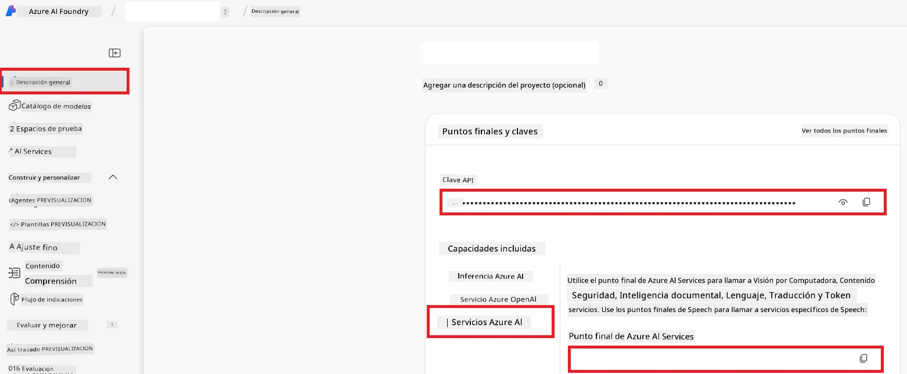

# Configurar Azure AI para Co-op Translator (Azure OpneAI y Azure AI Vision)

Esta guía te guía a través de la configuración de Azure OpenAI para la traducción de idiomas y Azure Computer Vision para el análisis de contenido de imágenes (que luego se puede usar para la traducción basada en imágenes) dentro de Azure AI Foundry.

**Requisitos previos:**
- Una cuenta de Azure con una suscripción activa.
- Permisos suficientes para crear recursos y despliegues en tu suscripción de Azure.

## Crear un Proyecto Azure AI

Comenzarás creando un Proyecto Azure AI, que actúa como un lugar central para administrar tus recursos de IA.

1. Navega a [https://ai.azure.com](https://ai.azure.com) e inicia sesión con tu cuenta de Azure.

1. Selecciona **+Crear** para crear un nuevo proyecto.

1. Realiza las siguientes tareas:
   - Ingresa un **Nombre del proyecto** (por ejemplo, `CoopTranslator-Project`).
   - Selecciona el **Hub de IA** (por ejemplo, `CoopTranslator-Hub`) (Crea uno nuevo si es necesario).

1. Haz clic en "**Revisar y Crear**" para configurar tu proyecto. Serás llevado a la página de resumen de tu proyecto.

## Configurar Azure OpenAI para Traducción de Idiomas

Dentro de tu proyecto, desplegarás un modelo Azure OpenAI para servir como backend para la traducción de texto.

### Navegar a tu Proyecto

Si no estás ya ahí, abre tu proyecto recién creado (por ejemplo, `CoopTranslator-Project`) en Azure AI Foundry.

### Desplegar un Modelo OpenAI

1. Desde el menú izquierdo de tu proyecto, bajo "Mis activos", selecciona "**Modelos + puntos finales**".

1. Selecciona **+ Desplegar modelo**.

1. Selecciona **Desplegar Modelo Base**.

1. Se te presentará una lista de modelos disponibles. Filtra o busca un modelo GPT adecuado. Recomendamos `gpt-4o`.

1. Selecciona tu modelo deseado y haz clic en **Confirmar**.

1. Selecciona **Desplegar**.

### Configuración de Azure OpenAI

Una vez desplegado, puedes seleccionar el despliegue desde la página "**Modelos + puntos finales**" para encontrar su **URL de endpoint REST**, **Clave**, **Nombre del despliegue**, **Nombre del modelo** y **Versión de API**. Estos serán necesarios para integrar el modelo de traducción en tu aplicación.

> [!NOTE]
> Puedes seleccionar versiones de API desde la página de [depreciación de versiones de API](https://learn.microsoft.com/azure/ai-services/openai/api-version-deprecation) según tus requisitos. Ten en cuenta que la **versión de API** es diferente de la **versión del modelo** que se muestra en la página **Modelos + puntos finales** en Azure AI Foundry.

## Configurar Azure Computer Vision para Traducción de Imágenes

Para habilitar la traducción de texto dentro de imágenes, necesitas encontrar la Clave API y el Endpoint del Servicio Azure AI.

1. Navega a tu Proyecto Azure AI (por ejemplo, `CoopTranslator-Project`). Asegúrate de estar en la página de resumen del proyecto.

### Configuración del Servicio Azure AI

Encuentra la Clave API y el Endpoint desde el Servicio Azure AI.

1. Navega a tu Proyecto Azure AI (por ejemplo, `CoopTranslator-Project`). Asegúrate de estar en la página de resumen del proyecto.

1. Encuentra la **Clave API** y el **Endpoint** desde la pestaña del Servicio Azure AI.

    

Esta conexión hace que las capacidades del recurso vinculado de Servicios Azure AI (incluido el análisis de imágenes) estén disponibles para tu proyecto AI Foundry. Luego puedes usar esta conexión en tus notebooks o aplicaciones para extraer texto de imágenes, que posteriormente puede enviarse al modelo Azure OpenAI para traducción.

## Consolidación de tus Credenciales

A estas alturas, deberías haber recopilado lo siguiente:

**Para Azure OpenAI (Traducción de Texto):**
- Endpoint Azure OpenAI
- Clave API Azure OpenAI
- Nombre del Modelo Azure OpenAI (por ejemplo, `gpt-4o`)
- Nombre del Despliegue Azure OpenAI (por ejemplo, `cooptranslator-gpt4o`)
- Versión de API Azure OpenAI

**Para Servicios Azure AI (Extracción de Texto en Imágenes vía Vision):**
- Endpoint Servicio Azure AI
- Clave API Servicio Azure AI

### Ejemplo: Configuración de Variables de Entorno (Vista previa)

Luego, al construir tu aplicación, probablemente la configures usando estas credenciales recopiladas. Por ejemplo, podrías establecerlas como variables de entorno de la siguiente manera:

```bash
# Credenciales del servicio Azure AI (requeridas para la traducción de imágenes)
AZURE_AI_SERVICE_API_KEY="your_azure_ai_service_api_key" # p.ej., 21xasd...
AZURE_AI_SERVICE_ENDPOINT="https://your_azure_ai_service_endpoint.cognitiveservices.azure.com/"

# Conjuntos de respaldo opcionales: variables duplicadas con sufijo _1/_2 (mismo índice para todas las variables del conjunto)
AZURE_AI_SERVICE_API_KEY_1="your_azure_ai_service_api_key_1"
AZURE_AI_SERVICE_ENDPOINT_1="https://your_azure_ai_service_endpoint_1.cognitiveservices.azure.com/"

# Credenciales de Azure OpenAI (requeridas para la traducción de texto)
AZURE_OPENAI_API_KEY="your_azure_openai_api_key" # p.ej., 21xasd...
AZURE_OPENAI_ENDPOINT="https://your_azure_openai_endpoint.openai.azure.com/"
AZURE_OPENAI_MODEL_NAME="your_model_name" # p.ej., gpt-4o
AZURE_OPENAI_CHAT_DEPLOYMENT_NAME="your_deployment_name" # p.ej., cooptranslator-gpt4o
AZURE_OPENAI_API_VERSION="your_api_version" # p.ej., 2024-12-01-preview

# Conjuntos de respaldo opcionales: duplicar el conjunto completo AZURE_OPENAI_* con sufijo _1/_2 (mismo índice para todas las variables)
```

---

### Lecturas Adicionales

- [Cómo crear un proyecto en Azure AI Foundry](https://learn.microsoft.com/azure/ai-foundry/how-to/create-projects?tabs=ai-studio)
- [Cómo crear recursos Azure AI](https://learn.microsoft.com/azure/ai-foundry/how-to/create-azure-ai-resource?tabs=portal)
- [Cómo desplegar modelos OpenAI en Azure AI Foundry](https://learn.microsoft.com/en-us/azure/ai-foundry/how-to/deploy-models-openai)

---

<!-- CO-OP TRANSLATOR DISCLAIMER START -->
**Descargo de responsabilidad**:  
Este documento ha sido traducido utilizando el servicio de traducción automática [Co-op Translator](https://github.com/Azure/co-op-translator). Aunque nos esforzamos por la precisión, tenga en cuenta que las traducciones automáticas pueden contener errores o inexactitudes. El documento original en su idioma nativo debe considerarse la fuente autorizada. Para información crítica, se recomienda una traducción profesional realizada por humanos. No nos hacemos responsables de ningún malentendido o interpretación errónea derivada del uso de esta traducción.
<!-- CO-OP TRANSLATOR DISCLAIMER END -->