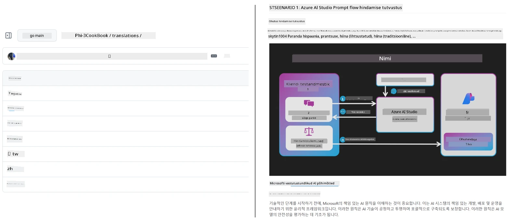
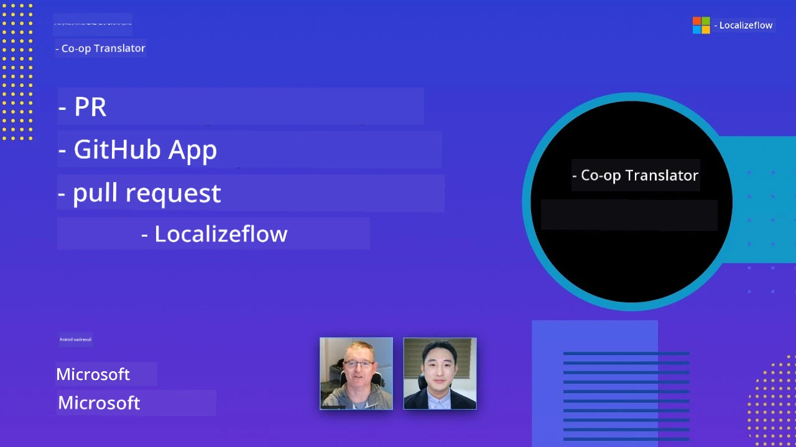

# Co-op Translator

_Lihtsalt automatiseeri ja halda tõlkeid oma haridusliku GitHubi sisu jaoks mitmes keeles, kui su projekt areneb._


[](https://pypi.org/project/co-op-translator/)
[](https://github.com/azure/co-op-translator/blob/main/LICENSE)
[](https://pepy.tech/project/co-op-translator)
[](https://pepy.tech/project/co-op-translator)
[](https://github.com/azure/co-op-translator/pkgs/container/co-op-translator)
[](https://github.com/psf/black)

[](https://GitHub.com/azure/co-op-translator/graphs/contributors/)
[](https://GitHub.com/azure/co-op-translator/issues/)
[](https://GitHub.com/azure/co-op-translator/pulls/)
[](http://makeapullrequest.com)

### 🌐 Mitmekeelne tugi

#### Toetatud [Co-op Translator](https://github.com/Azure/Co-op-Translator) poolt

<!-- CO-OP TRANSLATOR LANGUAGES TABLE START -->
[Araabia](../ar/README.md) | [Bengali](../bn/README.md) | [Bulgaaria](../bg/README.md) | [Birmani (Myanmar)](../my/README.md) | [Hiina (lihtsustatud)](../zh-CN/README.md) | [Hiina (traditsiooniline, Hongkong)](../zh-HK/README.md) | [Hiina (traditsiooniline, Macau)](../zh-MO/README.md) | [Hiina (traditsiooniline, Taiwan)](../zh-TW/README.md) | [Horvaadi](../hr/README.md) | [Tšehhi](../cs/README.md) | [Taani](../da/README.md) | [Hollandi](../nl/README.md) | [Eesti](./README.md) | [Soome](../fi/README.md) | [Prantsuse](../fr/README.md) | [Saksa](../de/README.md) | [Kreeka](../el/README.md) | [Heebrea](../he/README.md) | [Hindi](../hi/README.md) | [Ungari](../hu/README.md) | [Indoneesia](../id/README.md) | [Itaalia](../it/README.md) | [Jaapani](../ja/README.md) | [Kannada](../kn/README.md) | [Khmeri](../km/README.md) | [Korea](../ko/README.md) | [Leedu](../lt/README.md) | [Malai](../ms/README.md) | [Malajalami](../ml/README.md) | [Marathi](../mr/README.md) | [Nepali](../ne/README.md) | [Nigeeria pidžin](../pcm/README.md) | [Norra](../no/README.md) | [Pärsia (Farsi)](../fa/README.md) | [Poola](../pl/README.md) | [Portugali (Brasiilia)](../pt-BR/README.md) | [Portugali (Portugal)](../pt-PT/README.md) | [Pandžabi (Gurmukhi)](../pa/README.md) | [Rumeenia](../ro/README.md) | [Vene](../ru/README.md) | [Serbia (kirilitsa)](../sr/README.md) | [Slovaki](../sk/README.md) | [Sloveeni](../sl/README.md) | [Hispaania](../es/README.md) | [Suaheli](../sw/README.md) | [Rootsi](../sv/README.md) | [Tagalogi (Filipino)](../tl/README.md) | [Tamili](../ta/README.md) | [Telugu](../te/README.md) | [Tai](../th/README.md) | [Türgi](../tr/README.md) | [Ukraina](../uk/README.md) | [Urdu](../ur/README.md) | [Vietnami](../vi/README.md)

> **Eelistad kloonimist kohapeal?**
>
> See hoidla sisaldab üle 50 keele tõlkeid, mis suurendab oluliselt allalaadimise mahtu. Tõlgeteta kloonimiseks kasuta sparse checkouti:
>
> **Bash / macOS / Linux:**
> ```bash
> git clone --filter=blob:none --sparse https://github.com/skytin1004/co-op-translator.git
> cd co-op-translator
> git sparse-checkout set --no-cone '/*' '!translations' '!translated_images'
> ```
>
> **CMD (Windows):**
> ```cmd
> git clone --filter=blob:none --sparse https://github.com/skytin1004/co-op-translator.git
> cd co-op-translator
> git sparse-checkout set --no-cone "/*" "!translations" "!translated_images"
> ```
>
> See annab sulle kõik vajaliku kursuse lõpetamiseks palju kiirema allalaadimisega.
<!-- CO-OP TRANSLATOR LANGUAGES TABLE END -->

[](https://GitHub.com/azure/co-op-translator/watchers/)
[](https://GitHub.com/azure/co-op-translator/network/)
[](https://GitHub.com/azure/co-op-translator/stargazers/)

[](https://discord.gg/nTYy5BXMWG)

[](https://codespaces.new/azure/co-op-translator)

## Ülevaade

**Co-op Translator** aitab sul kergesti lokaliseerida oma haridusliku GitHubi sisu mitmesse keelde.  
Kui uuendad oma Markdown faile, pilte või sülearvuteid, püsivad tõlked automaatselt sünkroonis, tagades, et sinu sisu jääb kogu maailmas õppijatele täpseks ja ajakohaseks.

Näide, kuidas tõlgitud sisu on organiseeritud:



## Kuidas tõlke olekut hallatakse

Co-op Translator haldab tõlgitud sisu kui **versioonitud tarkvaraartefakte**,  
mitte staatilisi faile.

Tööriist jälgib tõlgitud Markdowni, piltide ja sülearvutite olekut  
kasutades **keelepiiratud metaandmeid**.

See disain võimaldab Co-op Translatoril:

- Usaldusväärselt tuvastada aegunud tõlkeid
- Kohtlema Markdowni, pilte ja sülearvuteid ühtselt
- Ohutult skaleerida suurtes, kiirete muudetega mitmekeelseis hoidlas

Mudeliseerides tõlkeid hallatud artefaktidena,  
tõlketeenused haakuvad loomulikult kaasaegse  
tarkvarasõltuvus- ja artefaktihaldusega.

→ [Kuidas tõlke olekut hallatakse](https://techcommunity.microsoft.com/blog/azuredevcommunityblog/rethinking-documentation-translation-treating-translations-as-versioned-software/4491755)


## Kiire algus

```bash
# Loo ja aktiveeri virtuaalne keskkond (soovitatav)
python -m venv .venv
# Windows
.venv\Scripts\activate
# macOS/Linux
source .venv/bin/activate
# Paigalda pakett
pip install co-op-translator
# Tõlgi
translate -l "ko ja fr" -md
```

Docker:

```bash
# Lae avalik pilt GHCR-ist
docker pull ghcr.io/azure/co-op-translator:latest
# Käivita praeguse kaustaga ja .env failiga (Bash/Zsh)
docker run --rm -it --env-file .env -v "${PWD}:/work" ghcr.io/azure/co-op-translator:latest -l "ko ja fr" -md
```

## Minimaalne seadistus

1. Veendu, et sul on toetatud Python versioon (praegu 3.10-3.12). Poetry-s (pyproject.toml) on see automaatselt lahendatud.  
2. Loo `.env` fail kasutades malli: [.env.template](../../.env.template)  
3. Sea sisse üks LLM pakkuja (Azure OpenAI või OpenAI)  
4. (Valikuline) Piltide tõlkimiseks (`-img`), sea sisse Azure AI Vision  
5. (Valikuline) Võid seadistada mitu autentimiskomplekti, kopeerides muutujad sufiksitega `_1`, `_2`, jne. Kõik komplekti muutujad peavad olema sama sufiksiga.  
6. (Soovituslik) Puhasta eelnevad tõlked konfliktide vältimiseks (nt `translations/`)  
7. (Soovituslik) Lisa tõlke jaotis README-sse kasutades [README keelte malli](./getting_started/README_languages_template.md)  
8. Vt: [Azure AI seadistamine](./getting_started/set-up-azure-ai.md)

## Kasutamine

Tõlgi kõik toetatud vormingud:

```bash
translate -l "ko ja"
```

Ainult Markdown:

```bash
translate -l "de" -md
```

Markdown + pildid:

```bash
translate -l "pt" -md -img
```

Ainult sülearvutid:

```bash
translate -l "zh" -nb
```

Rohkem lippe: [Käsurea viide](./getting_started/command-reference.md)

## Funktsioonid

- Automaatne tõlge Markdownile, sülearvutitele ja piltidele  
- Hoiab tõlked allikamuutustega sünkroonis  
- Töötab lokaalselt (CLI) või CI-s (GitHub Actions)  
- Kasutab Azure OpenAI-d või OpenAI-d, valikuliselt Azure AI Vision-i piltide jaoks  
- Säilitab Markdowni vorminduse ja struktuuri  

## Dokumentatsioon

- [Käsurea juhend](./getting_started/command-line-guide/command-line-guide.md)  
- [GitHub Actions juhend (avalikud hoidlad & standard salvestatud andmed)](./getting_started/github-actions-guide/github-actions-guide-public.md)  
- [GitHub Actions juhend (Microsofti organisatsiooni hoidlad & organisatsioonitasandi seadistused)](./getting_started/github-actions-guide/github-actions-guide-org.md)  
- [README keelte mall](./getting_started/README_languages_template.md)  
- [Toetatud keeled](./getting_started/supported-languages.md)  
- [Panustamine](./CONTRIBUTING.md)  
- [Probleemide lahendamine](./getting_started/troubleshooting.md)

### Microsoftile spetsiifiline juhend
> [!NOTE]
> Ainult Microsofti “For Beginners” hoidlate hooldajatele.

- [“Muude kursuste” nimekirja uuendamine (ainult MS Beginners hoidlate jaoks)](./getting_started/update-other-courses.md)

## Toeta meid ja aita kaasa globaalsele õppimisele

Liitu meiega, et muuta haridusliku sisu jagamine maailmas revolutsiooniliseks! Anna [Co-op Translator](https://github.com/azure/co-op-translator) GitHubis ⭐ ja toeta meie missiooni murda õppimises ja tehnoloogias keelebarjääre. Sinu huvi ja panused on väga olulised! Koodi panused ja funktsioonisoovitused on alati teretulnud.

### Avastage Microsofti hariduslikku sisu oma keeles

- [LangChain4j-for-Beginners](https://github.com/microsoft/LangChain4j-for-Beginners)
- [AZD for Beginners](https://github.com/microsoft/AZD-for-beginners)
- [Edge AI for Beginners](https://github.com/microsoft/edgeai-for-beginners)
- [Model Context Protocol (MCP) For Beginners](https://github.com/microsoft/mcp-for-beginners)
- [AI Agents for Beginners](https://github.com/microsoft/ai-agents-for-beginners)
- [Generative AI for Beginners using .NET](https://github.com/microsoft/Generative-AI-for-beginners-dotnet)
- [Generative AI for Beginners](https://github.com/microsoft/generative-ai-for-beginners)
- [Generative AI for Beginners using Java](https://github.com/microsoft/generative-ai-for-beginners-java)
- [ML for Beginners](https://aka.ms/ml-beginners)
- [Data Science for Beginners](https://aka.ms/datascience-beginners)
- [AI for Beginners](https://aka.ms/ai-beginners)
- [Cybersecurity for Beginners](https://github.com/microsoft/Security-101)
- [Web Dev for Beginners](https://aka.ms/webdev-beginners)
- [IoT for Beginners](https://aka.ms/iot-beginners)
- [PhiCookBook](https://github.com/microsoft/PhiCookBook)

## Videoesitlused

👉 Klõpsa alloleval pildil, et vaadata YouTube'is.

- **Open at Microsoft**: Lühike 18-minutiline sissejuhatus ja kiire juhend Co-op Translator kasutamiseks.

  [](https://www.youtube.com/watch?v=jX_swfH_KNU)

## Panustamine

See projekt võtab vastu panuseid ja soovitusi. Kas soovid panustada Azure Co-op Translatori arendamisse? Palun tutvu meie [CONTRIBUTING.md](./CONTRIBUTING.md) juhistega, kuidas aidata muuta Co-op Translatori kättesaadavamaks.

## Panustajad
[](https://github.com/Azure/co-op-translator/graphs/contributors)

## Käitumiskoodeks

See projekt on vastu võtnud [Microsofti avatud lähtekoodi käitumiskoodeksi](https://opensource.microsoft.com/codeofconduct/). 
Lisateabe saamiseks vaadake [Käitumiskoodeksi korduma kippuvad küsimused](https://opensource.microsoft.com/codeofconduct/faq/) või
võtke ühendust aadressil [opencode@microsoft.com](mailto:opencode@microsoft.com) igasuguste lisaküsimuste või kommentaaride korral.

## Vastutustundlik tehisintellekt

Microsoft on pühendunud aitama meie klientidel kasutada meie AI tooteid vastutustundlikult, jagada oma kogemusi ning luua usaldusel põhinevaid partnerlussuhteid tööriistade abil nagu Läbipaistvuse märkmed ja Mõjude hindamised. Paljud neist ressurssidest on leitavad aadressil [https://aka.ms/RAI](https://aka.ms/RAI).
Microsofti lähenemine vastutustundlikule AI-le tugineb meie AI põhimõtetel: õigluse, usaldusväärsuse ja turvalisuse, privaatsuse ja turvalisuse, kaasatuse, läbipaistvuse ning aruandekohustuse alusel.

Suures mahus loomuliku keele, pildi ja kõne mudelid - nagu need, mida selles näites kasutatakse - võivad potentsiaalselt käituda ebaõiglaselt, ebakindlalt või solvavalt ning selle tagajärjel tekitada kahju. Palun tutvuge [Azure OpenAI teenuse Läbipaistvuse märkusega](https://learn.microsoft.com/legal/cognitive-services/openai/transparency-note?tabs=text), et olla teadlik riskidest ja piirangutest.

Soovituslik lähenemine nende riskide vähendamiseks on lisada oma arhitektuuri turvasüsteem, mis suudab tuvastada ja ennetada kahjulikku käitumist. [Azure AI Content Safety](https://learn.microsoft.com/azure/ai-services/content-safety/overview) pakub sõltumatut kaitsekihte, mis suudab tuvastada kasutajate ja AI genereeritud kahjuliku sisu rakendustes ja teenustes. Azure AI Content Safety sisaldab teksti ja pildi API-sid, mis võimaldavad tuvastada kahjulikku materjali. Meil on ka interaktiivne Content Safety Studio, mis võimaldab teil vaadata, uurida ja proovida näidiskoodi kahjuliku sisu tuvastamiseks erinevates vormingutes. Järgmine [kiirkäivitusdokumentatsioon](https://learn.microsoft.com/azure/ai-services/content-safety/quickstart-text?tabs=visual-studio%2Clinux&pivots=programming-language-rest) juhendab teid, kuidas teenusele päringuid esitada.

Teine aspekt, mida tuleb arvesse võtta, on kogu rakenduse jõudlus. Mitme modaalsete ja mitme mudeliga rakendustega peame jõudluseks seda, et süsteem toimib nii, nagu teie ja teie kasutajad ootavad, sealhulgas ei tekita kahjulikke väljundeid. On oluline hinnata oma kogu rakenduse jõudlust, kasutades [loomise kvaliteedi ning riski ja turvalisuse mõõdikuid](https://learn.microsoft.com/azure/ai-studio/concepts/evaluation-metrics-built-in).

Saate oma AI-rakendust hinnata oma arenduskeskkonnas, kasutades [prompt flow SDK-d](https://microsoft.github.io/promptflow/index.html). Kasutades kas testandmekogu või sihtmärki, mõõdetakse teie generatiivse AI rakenduse tulemusi kvantitatiivselt sisseehitatud hindajate või teie valikul kohandatud hindajate abil. Prompt flow SDK-ga alustamiseks ja süsteemi hindamiseks võite järgida [kiirkäivituse juhendit](https://learn.microsoft.com/azure/ai-studio/how-to/develop/flow-evaluate-sdk). Kui hindamine on läbi viidud, saate [tulemusi visualiseerida Azure AI Studios](https://learn.microsoft.com/azure/ai-studio/how-to/evaluate-flow-results).

## Kaubamärgid

See projekt võib sisaldada kaubamärke või logosid projektide, toodete või teenuste kohta. Microsofti 
kaubamärkide või logode autoriseeritud kasutus allub ja peab järgima
[Microsofti kaubamärgi ja brändijuhiseid](https://www.microsoft.com/en-us/legal/intellectualproperty/trademarks/usage/general).
Microsofti kaubamärkide või logode kasutamine selle projekti muudetud versioonides ei tohi tekitada segadust ega viidata Microsofti sponsorlusele.
Kolmandate osapoolte kaubamärkide või logode kasutamine allub nende kolmandate osapoolte poliitikatele.

## Abi saamine

Kui teil tekib raskusi või küsimusi AI-rakenduste loomise kohta, liituge:

[](https://discord.gg/nTYy5BXMWG)

Kui teil on toodete tagasisidet või esineb vigu arendamisel, külastage:

[](https://aka.ms/foundry/forum)

---

<!-- CO-OP TRANSLATOR DISCLAIMER START -->
**Vastutusest loobumine**:
See dokument on tõlgitud kasutades tehisintellektil põhinevat tõlketeenust [Co-op Translator](https://github.com/Azure/co-op-translator). Kuigi püüame täpsust tagada, tuleb arvestada, et automaatsed tõlked võivad sisaldada vigu või ebatäpsusi. Algne dokument oma emakeeles tuleks pidada autoriteetseks allikaks. Kriitilise teabe puhul soovitatakse kasutada professionaalset inimtõlget. Me ei vastuta käesoleva tõlke kasutamisest tulenevate arusaamatuste või valesti mõistmiste eest.
<!-- CO-OP TRANSLATOR DISCLAIMER END -->