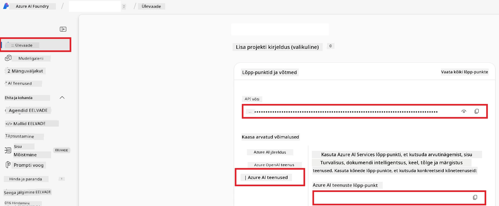

# Azure AI seadistamine Co-op Translatori jaoks (Azure OpneAI & Azure AI Vision)

See juhend juhendab teid Azure OpenAI seadistamisel keele tõlkimiseks ja Azure Arvutinägemist pildisisu analüüsimiseks (mida saab seejärel kasutada pildipõhiseks tõlkimiseks) Azure AI Foundry raames.

**Nõuded:**
- Azure konto aktiivse tellimusega.
- Piisavad õigused ressursside ja juurutuste loomiseks teie Azure tellimuses.

## Looge Azure AI projekt

Alustate Azure AI projekti loomisega, mis toimib teie tehisintellekti ressursside haldamise keskse kohana.

1. Minge lehele [https://ai.azure.com](https://ai.azure.com) ja logige sisse oma Azure kontoga.

1. Valige **+Create**, et luua uus projekt.

1. Tehke järgmised toimingud:
   - Sisestage **Projekti nimi** (nt `CoopTranslator-Project`).
   - Valige **AI hub** (nt `CoopTranslator-Hub`) (vajadusel looge uus).

1. Klõpsake "**Review and Create**", et projekt seadistada. Teile suunatakse teie projekti ülevaatelehele.

## Azure OpenAI seadistamine keele tõlkimiseks

Oma projektis juurutate Azure OpenAI mudeli, mis toimib tekstide tõlke tagapõhjana.

### Minge oma projekti

Kui te pole veel oma loodud projekti (nt `CoopTranslator-Project`) avanud, avage see Azure AI Foundrys.

### Mudeli juurutamine OpenAI jaoks

1. Oma projekti vasakpoolses menüüs, jaotises "My assets", valige "**Models + endpoints**".

1. Valige **+ Deploy model**.

1. Valige **Deploy Base Model**.

1. Esitatakse teile nimekiri saadaolevatest mudelitest. Filtreerige või otsige sobiv GPT mudel. Soovitame `gpt-4o`.

1. Valige soovitud mudel ja klõpsake **Confirm**.

1. Valige **Deploy**.

### Azure OpenAI konfiguratsioon

Pärast juurutamist saate valida juurutuse ajast "Models + endpoints" lehelt, et leida selle **REST endpoint URL**, **Key**, **Deployment name**, **Model name** ja **API version**. Neid on vaja tõlkelingi mudeli integreerimiseks teie rakendusse.

> [!NOTE]
> API versioone saate valida lehelt [API version deprecation](https://learn.microsoft.com/azure/ai-services/openai/api-version-deprecation) vastavalt oma vajadustele. Pidage meeles, et **API versioon** erineb **Mudeli versioonist**, mis on näidatud lehel **Models + endpoints** Azure AI Foundrys.

## Azure Arvutinägemise seadistamine pilditõlkeks

Tekstide tõlkimise lubamiseks piltidel peate leidma Azure AI Service API võtme ja lõpp-punkti.

1. Minge oma Azure AI projekti (nt `CoopTranslator-Project`). Veenduge, et olete projekti ülevaade lehel.

### Azure AI Service konfiguratsioon

Leidke Azure AI Service API võti ja lõpp-punkt.

1. Minge oma Azure AI projekti (nt `CoopTranslator-Project`). Veenduge, et olete projekti ülevaatelehel.

1. Leidke Azure AI Service vahekaardilt **API Key** ja **Endpoint**.

    

See ühendus teeb teie AI Foundry projekti jaoks kättesaadavaks seotud Azure AI Services ressursi võimekuse (sh pildianalüüs). Saate seda ühendust kasutada oma märkmikes või rakendustes, et pilte teksti eraldada, mis seejärel saab edastada Azure OpenAI mudelile tõlkimiseks.

## Volituste koondamine

Nüüd peaksite kogunud järgmised andmed:

**Azure OpenAI jaoks (Teksti tõlge):**
- Azure OpenAI lõpp-punkt
- Azure OpenAI API võti
- Azure OpenAI mudeli nimi (nt `gpt-4o`)
- Azure OpenAI juurutuse nimi (nt `cooptranslator-gpt4o`)
- Azure OpenAI API versioon

**Azure AI teenustele (piltide teksti eraldamine Vision’i kaudu):**
- Azure AI teenuse lõpp-punkt
- Azure AI teenuse API võti

### Näide: keskkonnamuutujate seadistamine (eelvaade)

Hiljem, rakendust ehitades, seadistate tõenäoliselt need kogutud volitused keskkonnamuutujatena järgmiselt:

```bash
# Azure AI teenuse mandaadid (nõutud pilditõlke jaoks)
AZURE_AI_SERVICE_API_KEY="your_azure_ai_service_api_key" # nt 21xasd...
AZURE_AI_SERVICE_ENDPOINT="https://your_azure_ai_service_endpoint.cognitiveservices.azure.com/"

# Valikulised varuplokid: dubleeri muutujaid sufiksiga _1/_2 (kõigi komplektis olevate muutujate jaoks sama indeks)
AZURE_AI_SERVICE_API_KEY_1="your_azure_ai_service_api_key_1"
AZURE_AI_SERVICE_ENDPOINT_1="https://your_azure_ai_service_endpoint_1.cognitiveservices.azure.com/"

# Azure OpenAI mandaadid (nõutud tekstitõlke jaoks)
AZURE_OPENAI_API_KEY="your_azure_openai_api_key" # nt 21xasd...
AZURE_OPENAI_ENDPOINT="https://your_azure_openai_endpoint.openai.azure.com/"
AZURE_OPENAI_MODEL_NAME="your_model_name" # nt gpt-4o
AZURE_OPENAI_CHAT_DEPLOYMENT_NAME="your_deployment_name" # nt cooptranslator-gpt4o
AZURE_OPENAI_API_VERSION="your_api_version" # nt 2024-12-01-preview

# Valikulised varuplokid: dubleeri kogu AZURE_OPENAI_* komplekt sufiksiga _1/_2 (kõigi muutujate jaoks sama indeks)
```

---

### Täiendav lugemine

- [Kuidas luua projekt Azure AI Foundrys](https://learn.microsoft.com/azure/ai-foundry/how-to/create-projects?tabs=ai-studio)
- [Kuidas luua Azure AI ressursse](https://learn.microsoft.com/azure/ai-foundry/how-to/create-azure-ai-resource?tabs=portal)
- [Kuidas juurutada OpenAI mudeleid Azure AI Foundrys](https://learn.microsoft.com/en-us/azure/ai-foundry/how-to/deploy-models-openai)

---

<!-- CO-OP TRANSLATOR DISCLAIMER START -->
**Vastutusest loobumine**:  
See dokument on tõlgitud kasutades tehisintellekti tõlketeenust [Co-op Translator](https://github.com/Azure/co-op-translator). Kuigi me püüdleme täpsuse poole, palun arvestage, et automaatsed tõlked võivad sisaldada vigu või ebatäpsusi. Originaaldokument selle algkeeles tuleks pidada autoriteetseks allikaks. Kriitilise teabe puhul soovitatakse kasutada professionaalset inimtõlget. Me ei vastuta käesoleva tõlke kasutamisest tekkivate arusaamatuste ega valesti tõlgendamise eest.
<!-- CO-OP TRANSLATOR DISCLAIMER END -->