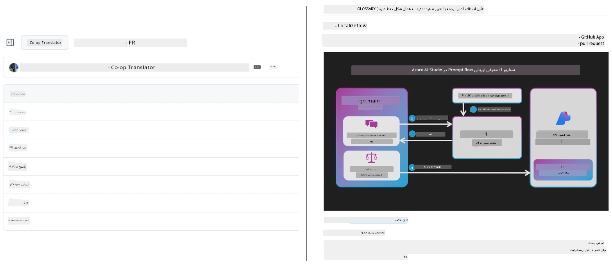
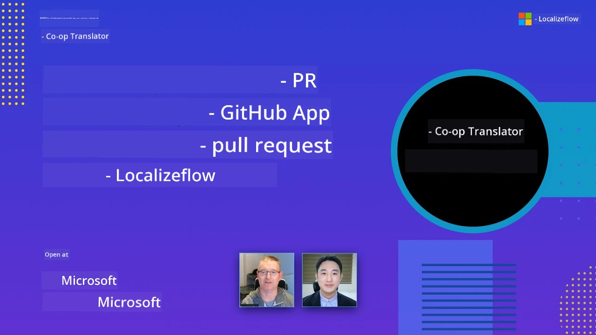

# Co-op Translator

_به آسانی ترجمه‌های محتوای آموزشی GitHub خود را در چندین زبان به صورت خودکار انجام دهید و نگهداری کنید، همگام با پیشرفت پروژه شما._


[](https://pypi.org/project/co-op-translator/)
[](https://github.com/azure/co-op-translator/blob/main/LICENSE)
[](https://pepy.tech/project/co-op-translator)
[](https://pepy.tech/project/co-op-translator)
[](https://github.com/azure/co-op-translator/pkgs/container/co-op-translator)
[](https://github.com/psf/black)

[](https://GitHub.com/azure/co-op-translator/graphs/contributors/)
[](https://GitHub.com/azure/co-op-translator/issues/)
[](https://GitHub.com/azure/co-op-translator/pulls/)
[](http://makeapullrequest.com)

### 🌐 پشتیبانی چندزبانه

#### پشتیبانی شده توسط [Co-op Translator](https://github.com/Azure/Co-op-Translator)

<!-- CO-OP TRANSLATOR LANGUAGES TABLE START -->
[عربی](../ar/README.md) | [بنگالی](../bn/README.md) | [بلغاری](../bg/README.md) | [برمه‌ای (میانمار)](../my/README.md) | [چینی (ساده شده)](../zh-CN/README.md) | [چینی (سنتی، هنگ کنگ)](../zh-HK/README.md) | [چینی (سنتی، ماکائو)](../zh-MO/README.md) | [چینی (سنتی، تایوان)](../zh-TW/README.md) | [کرواسی](../hr/README.md) | [چکی](../cs/README.md) | [دانمارکی](../da/README.md) | [هلندی](../nl/README.md) | [استونیایی](../et/README.md) | [فنلاندی](../fi/README.md) | [فرانسوی](../fr/README.md) | [آلمانی](../de/README.md) | [یونانی](../el/README.md) | [عبری](../he/README.md) | [هندی](../hi/README.md) | [مجارستانی](../hu/README.md) | [اندونزیایی](../id/README.md) | [ایتالیایی](../it/README.md) | [ژاپنی](../ja/README.md) | [کانادا](../kn/README.md) | [خمر](../km/README.md) | [کره‌ای](../ko/README.md) | [لیتوانی](../lt/README.md) | [مالایی](../ms/README.md) | [مالایالام](../ml/README.md) | [مراتی](../mr/README.md) | [نپالی](../ne/README.md) | [پیدجین نیجریه](../pcm/README.md) | [نروژی](../no/README.md) | [فارسی (Farsi)](./README.md) | [لهستانی](../pl/README.md) | [پرتغالی (برزیل)](../pt-BR/README.md) | [پرتغالی (پرتغال)](../pt-PT/README.md) | [پنجابی (گورموقی)](../pa/README.md) | [رومانیایی](../ro/README.md) | [روسی](../ru/README.md) | [صربی (سیریلیک)](../sr/README.md) | [اسلواکی](../sk/README.md) | [اسلوونیایی](../sl/README.md) | [اسپانیایی](../es/README.md) | [سواحیلی](../sw/README.md) | [سوئدی](../sv/README.md) | [تاگالوگ (فیلیپینی)](../tl/README.md) | [تامیل](../ta/README.md) | [تلگو](../te/README.md) | [تایلندی](../th/README.md) | [ترکی](../tr/README.md) | [اوکراینی](../uk/README.md) | [اردو](../ur/README.md) | [ویتنامی](../vi/README.md)

> **ترجیح می‌دهید به صورت محلی کلون کنید؟**
>
> این مخزن شامل بیش از ۵۰ زبان ترجمه شده است که اندازه دانلود را به طور قابل توجهی افزایش می‌دهد. برای کلون بدون ترجمه‌ها، از sparse checkout استفاده کنید:
>
> **Bash / macOS / Linux:**
> ```bash
> git clone --filter=blob:none --sparse https://github.com/Azure/co-op-translator.git
> cd co-op-translator
> git sparse-checkout set --no-cone '/*' '!translations' '!translated_images'
> ```
>
> **CMD (ویندوز):**
> ```cmd
> git clone --filter=blob:none --sparse https://github.com/Azure/co-op-translator.git
> cd co-op-translator
> git sparse-checkout set --no-cone "/*" "!translations" "!translated_images"
> ```
>
> این به شما همه چیز لازم برای تکمیل دوره را با دانلود بسیار سریع‌تر می‌دهد.
<!-- CO-OP TRANSLATOR LANGUAGES TABLE END -->

[](https://GitHub.com/azure/co-op-translator/watchers/)
[](https://GitHub.com/azure/co-op-translator/network/)
[](https://GitHub.com/azure/co-op-translator/stargazers/)

[](https://discord.gg/nTYy5BXMWG)

[](https://codespaces.new/azure/co-op-translator)

## مرور کلی

**Co-op Translator** به شما کمک می‌کند محتوای آموزشی GitHub خود را به چند زبان به آسانی بومی‌سازی کنید.  
هر زمان که فایل‌های Markdown، تصاویر یا دفترچه‌های یادداشت خود را به‌روزرسانی کنید، ترجمه‌ها به صورت خودکار همگام‌سازی می‌شوند و اطمینان حاصل می‌شود که محتوای شما برای یادگیرندگان سراسر جهان دقیق و به‌روز باقی می‌ماند.

نمونه ای از چگونگی سازماندهی محتوای ترجمه شده:



## نحوه مدیریت وضعیت ترجمه

Co-op Translator محتوای ترجمه شده را به عنوان **آرتیفکت‌های نرم‌افزاری نسخه‌بندی شده** مدیریت می‌کند،  
نه به عنوان فایل‌های ایستا.

این ابزار وضعیت ترجمه‌های Markdown، تصاویر و دفترچه‌های یادداشت را  
با استفاده از **اطلاعات متادیتای خاص زبان** رصد می‌کند.

این طراحی به Co-op Translator اجازه می‌دهد:

- به طور قابل اعتماد ترجمه‌های قدیمی را تشخیص دهد  
- با Markdown، تصاویر و دفترچه‌های یادداشت به صورت یکپارچه رفتار کند  
- در مخازن بزرگ، پرتکاپو و چندزبانه به صورت ایمن مقیاس‌پذیر باشد

با مدل کردن ترجمه‌ها به عنوان آرتیفکت‌های مدیریت شده،  
فرآیندهای کاری ترجمه به طور طبیعی با روش‌های مدرن  
مدیریت وابستگی‌ها و آرتیفکت‌های نرم‌افزاری همسو می‌شوند.

→ [نحوه مدیریت وضعیت ترجمه](https://techcommunity.microsoft.com/blog/azuredevcommunityblog/rethinking-documentation-translation-treating-translations-as-versioned-software/4491755)


## شروع سریع

```bash
# ایجاد و فعال‌سازی یک محیط مجازی (توصیه شده)
python -m venv .venv
# ویندوز
.venv\Scripts\activate
# مک‌اواس/لینوکس
source .venv/bin/activate
# نصب بسته
pip install co-op-translator
# ترجمه کنید
translate -l "ko ja fr" -md
```

Docker:

```bash
# تصویر عمومی را از GHCR بکشید
docker pull ghcr.io/azure/co-op-translator:latest
# با قرار دادن پوشه فعلی به عنوان درایو متصل و ارائه فایل .env اجرا کنید (Bash/Zsh)
docker run --rm -it --env-file .env -v "${PWD}:/work" ghcr.io/azure/co-op-translator:latest -l "ko ja fr" -md
```

## تنظیمات حداقلی

1. اطمینان حاصل کنید که نسخه پایتون پشتیبانی شده را دارید (در حال حاضر 3.10-3.12). در poetry (pyproject.toml) این به طور خودکار مدیریت می‌شود.
2. یک فایل `.env` با استفاده از قالب: [.env.template](../../.env.template) بسازید
3. یک ارائه‌دهنده LLM (Azure OpenAI یا OpenAI) را پیکربندی کنید
4. (اختیاری) برای ترجمه تصاویر (`-img`)، Azure AI Vision را پیکربندی کنید
5. (اختیاری) می‌توانید مجموعه‌های متعددی از اطلاعات ورود (credentials) را با دوپلیکیت کردن متغیرها با پسوندهایی مانند `_1`، `_2` و غیره تنظیم کنید. همه متغیرها در یک مجموعه باید پسوند یکسانی داشته باشند.
6. (توصیه شده) هر ترجمه قبلی را برای جلوگیری از تضاد پاکسازی کنید (مثل `translations/`)
7. (توصیه شده) بخشی برای ترجمه به فایل README خود اضافه کنید با استفاده از [قالب زبان‌های README](./getting_started/README_languages_template.md)
8. مشاهده: [راه‌اندازی Azure AI](./getting_started/set-up-azure-ai.md)

## نحوه استفاده

ترجمه همه انواع پشتیبانی شده:

```bash
translate -l "ko ja"
```

فقط Markdown:

```bash
translate -l "de" -md
```

Markdown + تصاویر:

```bash
translate -l "pt" -md -img
```

فقط دفترچه‌ها:

```bash
translate -l "zh" -nb
```

پرچم‌های بیشتر: [مرجع دستورات](./getting_started/command-reference.md)

## ویژگی‌ها

- ترجمه خودکار برای Markdown، دفترچه‌ها و تصاویر  
- هماهنگ نگه داشتن ترجمه‌ها با تغییرات منبع  
- اجرای محلی (CLI) یا در CI (GitHub Actions)  
- استفاده از Azure OpenAI یا OpenAI؛ اختیاری Azure AI Vision برای تصاویر  
- حفظ قالب‌بندی و ساختار Markdown

## مستندات

- [راهنمای خط فرمان](./getting_started/command-line-guide/command-line-guide.md)
- [راهنمای GitHub Actions (مخازن عمومی و اسرار استاندارد)](./getting_started/github-actions-guide/github-actions-guide-public.md)
- [راهنمای GitHub Actions (مخازن سازمانی مایکروسافت و تنظیمات سطح سازمان)](./getting_started/github-actions-guide/github-actions-guide-org.md)
- [قالب زبان‌های README](./getting_started/README_languages_template.md)
- [زبان‌های پشتیبانی شده](./getting_started/supported-languages.md)
- [همکاری در پروژه](./CONTRIBUTING.md)
- [عیب‌یابی](./getting_started/troubleshooting.md)

### راهنمای ویژه مایکروسافت
> [!NOTE]
> فقط برای نگه‌داران مخازن «برای مبتدیان» مایکروسافت.

- [به‌روزرسانی فهرست «دوره‌های دیگر» (فقط برای مخازن MS Beginners)](./getting_started/update-other-courses.md)

## ما را حمایت کنید و یادگیری جهانی را ارتقا دهید

به ما بپیوندید تا نحوه اشتراک‌گذاری محتوای آموزشی در سطح جهانی را متحول کنیم! به [Co-op Translator](https://github.com/azure/co-op-translator) در GitHub ستاره دهید و از ماموریت ما برای شکستن موانع زبانی در یادگیری و فناوری حمایت کنید. علاقه و مشارکت شما تأثیر بزرگی دارد! همکاری در کد و پیشنهاد ویژگی‌ها همیشه خوش‌آمد است.

### محتوای آموزشی مایکروسافت را به زبان خود کاوش کنید

- [LangChain4j-for-Beginners](https://github.com/microsoft/LangChain4j-for-Beginners)
- [AZD for Beginners](https://github.com/microsoft/AZD-for-beginners)
- [Edge AI for Beginners](https://github.com/microsoft/edgeai-for-beginners)
- [Model Context Protocol (MCP) For Beginners](https://github.com/microsoft/mcp-for-beginners)
- [AI Agents for Beginners](https://github.com/microsoft/ai-agents-for-beginners)
- [Generative AI for Beginners using .NET](https://github.com/microsoft/Generative-AI-for-beginners-dotnet)
- [Generative AI for Beginners](https://github.com/microsoft/generative-ai-for-beginners)
- [Generative AI for Beginners using Java](https://github.com/microsoft/generative-ai-for-beginners-java)
- [ML for Beginners](https://aka.ms/ml-beginners)
- [Data Science for Beginners](https://aka.ms/datascience-beginners)
- [AI for Beginners](https://aka.ms/ai-beginners)
- [Cybersecurity for Beginners](https://github.com/microsoft/Security-101)
- [Web Dev for Beginners](https://aka.ms/webdev-beginners)
- [IoT for Beginners](https://aka.ms/iot-beginners)
- [PhiCookBook](https://github.com/microsoft/PhiCookBook)

## ویدئوهای معرفی

👉 برای مشاهده در یوتیوب روی تصویر زیر کلیک کنید.

- **آغاز به کار در مایکروسافت**: معرفی کوتاه ۱۸ دقیقه‌ای و راهنمای سریع برای استفاده از Co-op Translator.

  [](https://www.youtube.com/watch?v=jX_swfH_KNU)

## همکاری

این پروژه از مشارکت‌ها و پیشنهادات استقبال می‌کند. علاقه‌مند به همکاری در Azure Co-op Translator هستید؟ لطفاً بخش [CONTRIBUTING.md](./CONTRIBUTING.md) ما را برای دستورالعمل‌های کمک در در دسترس‌تر کردن Co-op Translator مشاهده کنید.

## مشارکت‌کنندگان
[](https://github.com/Azure/co-op-translator/graphs/contributors)

## قوانین رفتار

این پروژه قوانین رفتار [کد منبع باز مایکروسافت](https://opensource.microsoft.com/codeofconduct/) را پذیرفته است.
برای اطلاعات بیشتر به [پرسش‌های متداول قوانین رفتار](https://opensource.microsoft.com/codeofconduct/faq/) مراجعه کنید یا
برای سوالات یا نظرات بیشتر با [opencode@microsoft.com](mailto:opencode@microsoft.com) تماس بگیرید.

## هوش مصنوعی مسئولانه

مایکروسافت متعهد است که به مشتریان خود در استفاده مسئولانه از محصولات هوش مصنوعی‌مان کمک کند، تجربیات خود را به اشتراک بگذارد و از طریق ابزارهایی مانند یادداشت‌های شفافیت و ارزیابی‌های تأثیر، شراکت‌های مبتنی بر اعتماد ایجاد کند. بسیاری از این منابع را می‌توانید در [https://aka.ms/RAI](https://aka.ms/RAI) پیدا کنید.
رویکرد مایکروسافت به هوش مصنوعی مسئولانه بر اصول هوش مصنوعی ما شامل عدالت، اطمینان و ایمنی، حریم خصوصی و امنیت، شمول، شفافیت و پاسخگویی استوار است.

مدل‌های زبان طبیعی، تصویر و گفتار در مقیاس بزرگ - مانند مدل‌های استفاده‌شده در این نمونه - ممکن است به گونه‌ای رفتار کنند که ناعادلانه، غیرقابل اطمینان یا توهین‌آمیز باشد که به نوبه خود باعث آسیب‌هایی می‌شود. لطفاً یادداشت شفافیت سرویس Azure OpenAI را در [Azure OpenAI service Transparency note](https://learn.microsoft.com/legal/cognitive-services/openai/transparency-note?tabs=text) مطالعه کنید تا درباره ریسک‌ها و محدودیت‌ها مطلع شوید.

روش پیشنهادی برای کاهش این ریسک‌ها، استفاده از یک سیستم ایمنی در معماری شما است که می‌تواند رفتار مضر را شناسایی و جلوگیری کند. [Azure AI Content Safety](https://learn.microsoft.com/azure/ai-services/content-safety/overview) یک لایه محافظتی مستقل فراهم می‌کند که قادر به تشخیص محتوای مضر تولیدشده توسط کاربران و هوش مصنوعی در برنامه‌ها و خدمات است. Azure AI Content Safety شامل APIهای متن و تصویر است که به شما اجازه می‌دهد مواد مضر را شناسایی کنید. همچنین ما یک استودیوی تعاملی Content Safety داریم که اجازه می‌دهد نمونه کدهای شناسایی محتوای مضر در حالت‌های مختلف را مشاهده، بررسی و آزمایش کنید. مستندات شروع سریع زیر [quickstart documentation](https://learn.microsoft.com/azure/ai-services/content-safety/quickstart-text?tabs=visual-studio%2Clinux&pivots=programming-language-rest) شما را در ارسال درخواست‌ها به سرویس راهنمایی می‌کند.

جنبه دیگری که باید در نظر گرفته شود عملکرد کلی برنامه است. در برنامه‌های چندمودال و چندمدل، عملکرد به معنای اجرای سیستم طبق انتظار شما و کاربران شما است، از جمله عدم تولید خروجی‌های مضر. ارزیابی عملکرد کلی برنامه با استفاده از [معیارهای کیفیت تولید و ریسک و ایمنی](https://learn.microsoft.com/azure/ai-studio/concepts/evaluation-metrics-built-in) اهمیت دارد.

می‌توانید برنامه هوش مصنوعی خود را در محیط توسعه خود با استفاده از [prompt flow SDK](https://microsoft.github.io/promptflow/index.html) ارزیابی کنید. با داشتن یک مجموعه داده آزمایشی یا هدف، تولیدهای برنامه هوش مصنوعی شما به صورت کمی با ارزیاب‌های داخلی یا ارزیاب‌های سفارشی شما اندازه‌گیری می‌شود. برای شروع با prompt flow sdk برای ارزیابی سیستم خود می‌توانید راهنمای [quickstart guide](https://learn.microsoft.com/azure/ai-studio/how-to/develop/flow-evaluate-sdk) را دنبال کنید. پس از اجرای یک ارزیابی، می‌توانید [نتایج را در Azure AI Studio مشاهده کنید](https://learn.microsoft.com/azure/ai-studio/how-to/evaluate-flow-results).

## علائم تجاری

این پروژه ممکن است شامل علائم تجاری یا لوگوهایی برای پروژه‌ها، محصولات یا خدمات باشد. استفاده مجاز از علائم تجاری یا لوگوهای مایکروسافت باید مطابق با
[راهنمای علائم تجاری و برند مایکروسافت](https://www.microsoft.com/en-us/legal/intellectualproperty/trademarks/usage/general) باشد.
استفاده از علائم تجاری یا لوگوهای مایکروسافت در نسخه‌های تغییر یافته این پروژه نباید موجب سردرگمی شود یا دلالت بر حمایت مایکروسافت داشته باشد.
هرگونه استفاده از علائم تجاری یا لوگوهای شخص ثالث تابع سیاست‌های آن اشخاص ثالث است.

## دریافت کمک

اگر در ساخت برنامه‌های هوش مصنوعی به مشکل برخوردید یا سوالی داشتید، به گروه زیر بپیوندید:

[](https://discord.gg/nTYy5BXMWG)

اگر بازخورد محصول یا خطاهایی هنگام ساخت دارید به اینجا مراجعه کنید:

[](https://aka.ms/foundry/forum)

---

<!-- CO-OP TRANSLATOR DISCLAIMER START -->
**سلب مسئولیت**:  
این سند با استفاده از سرویس ترجمه هوش مصنوعی [Co-op Translator](https://github.com/Azure/co-op-translator) ترجمه شده است. در حالی که ما به دقت تلاش می‌کنیم، لطفاً توجه داشته باشید که ترجمه‌های خودکار ممکن است حاوی اشتباهات یا نادرستی‌ها باشند. سند اصلی به زبان بومی آن باید به عنوان منبع معتبر در نظر گرفته شود. برای اطلاعات حیاتی، استفاده از ترجمه حرفه‌ای انسانی توصیه می‌شود. ما مسئول هیچ گونه سوءتفاهم یا تفسیر نادرستی که ناشی از استفاده از این ترجمه باشد، نیستیم.
<!-- CO-OP TRANSLATOR DISCLAIMER END -->