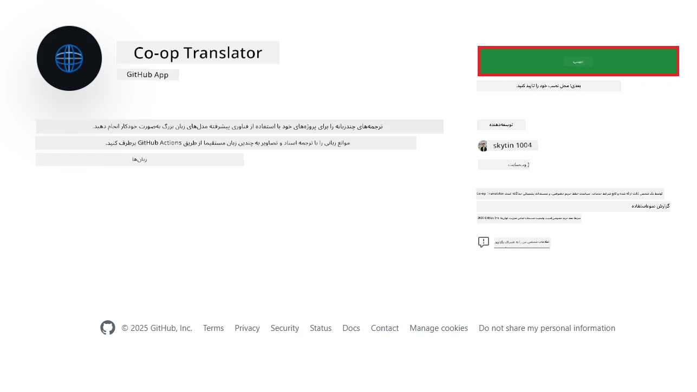
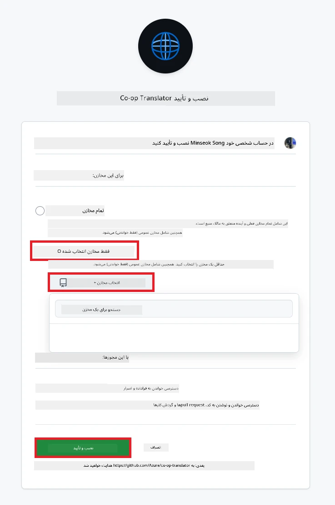
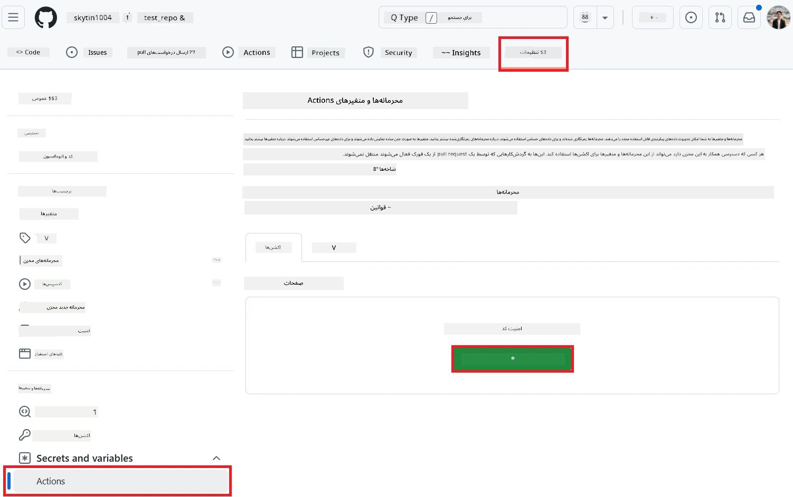
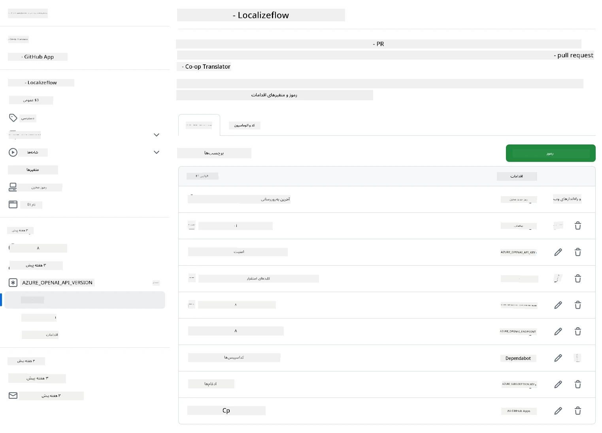

# استفاده از اکشن Co-op Translator در گیت‌هاب (راهنمای سازمانی)

**مخاطب هدف:** این راهنما برای **کاربران داخلی مایکروسافت** یا **تیم‌هایی که به مدارک لازم برای اپلیکیشن آماده Co-op Translator در گیت‌هاب دسترسی دارند** یا می‌توانند اپلیکیشن اختصاصی خود را بسازند، تهیه شده است.

مستندسازی مخزن خود را به‌راحتی با اکشن Co-op Translator در گیت‌هاب به‌صورت خودکار ترجمه کنید. این راهنما شما را قدم‌به‌قدم برای راه‌اندازی اکشن راهنمایی می‌کند تا هر زمان که فایل‌های مارک‌داون یا تصاویر منبع شما تغییر کند، به‌طور خودکار درخواست pull با ترجمه‌های به‌روزشده ایجاد شود.

> [!IMPORTANT]
> 
> **انتخاب راهنمای مناسب:**
>
> این راهنما راه‌اندازی با استفاده از **GitHub App ID و کلید خصوصی** را توضیح می‌دهد. معمولاً زمانی به این روش "راهنمای سازمانی" نیاز دارید که: **دسترسی‌های `GITHUB_TOKEN` محدود شده باشد:** تنظیمات سازمان یا مخزن شما دسترسی‌های پیش‌فرض داده‌شده به `GITHUB_TOKEN` استاندارد را محدود کرده باشد. به‌ویژه اگر `GITHUB_TOKEN` اجازه دسترسی‌های `write` لازم (مانند `contents: write` یا `pull-requests: write`) را نداشته باشد، روند کار در [راهنمای عمومی](./github-actions-guide-public.md) به دلیل کمبود دسترسی شکست می‌خورد. استفاده از یک GitHub App اختصاصی با دسترسی‌های مشخص این محدودیت را دور می‌زند.
>
> **اگر شرایط بالا شامل حال شما نمی‌شود:**
>
> اگر `GITHUB_TOKEN` استاندارد در مخزن شما دسترسی کافی دارد (یعنی محدودیت سازمانی ندارید)، لطفاً از **[راهنمای عمومی با استفاده از GITHUB_TOKEN](./github-actions-guide-public.md)** استفاده کنید. راهنمای عمومی نیازی به دریافت یا مدیریت App ID یا کلید خصوصی ندارد و فقط به `GITHUB_TOKEN` و دسترسی‌های مخزن متکی است.

## پیش‌نیازها

قبل از پیکربندی اکشن گیت‌هاب، مطمئن شوید که مدارک لازم برای سرویس هوش مصنوعی را آماده دارید.

**۱. الزامی: مدارک مدل زبانی هوش مصنوعی**
شما به مدارک یکی از مدل‌های زبانی پشتیبانی‌شده نیاز دارید:

- **Azure OpenAI**: نیاز به Endpoint، API Key، نام مدل/استقرار و نسخه API دارد.
- **OpenAI**: نیاز به API Key دارد (اختیاری: Org ID، Base URL، Model ID).
- برای جزئیات بیشتر به [مدل‌ها و سرویس‌های پشتیبانی‌شده](../../../../README.md) مراجعه کنید.
- راهنمای راه‌اندازی: [راه‌اندازی Azure OpenAI](../set-up-resources/set-up-azure-openai.md).

**۲. اختیاری: مدارک Computer Vision (برای ترجمه تصاویر)**

- فقط در صورتی لازم است که نیاز به ترجمه متن داخل تصاویر دارید.
- **Azure Computer Vision**: نیاز به Endpoint و Subscription Key دارد.
- اگر ارائه نشود، اکشن به‌صورت پیش‌فرض در [حالت فقط مارک‌داون](../markdown-only-mode.md) اجرا می‌شود.
- راهنمای راه‌اندازی: [راه‌اندازی Azure Computer Vision](../set-up-resources/set-up-azure-computer-vision.md).

## راه‌اندازی و پیکربندی

برای پیکربندی اکشن Co-op Translator در مخزن خود مراحل زیر را دنبال کنید:

### گام ۱: نصب و پیکربندی احراز هویت GitHub App

این روند از احراز هویت GitHub App برای تعامل امن با مخزن شما (مثلاً ایجاد pull request) به نمایندگی از شما استفاده می‌کند. یکی از گزینه‌های زیر را انتخاب کنید:

#### **گزینه A: نصب اپلیکیشن آماده Co-op Translator (برای استفاده داخلی مایکروسافت)**

1. به صفحه [Co-op Translator GitHub App](https://github.com/apps/co-op-translator) بروید.

1. روی **Install** کلیک کنید و حساب یا سازمانی که مخزن هدف شما در آن قرار دارد را انتخاب کنید.

    

1. گزینه **Only select repositories** را انتخاب کنید و مخزن هدف خود (مثلاً `PhiCookBook`) را انتخاب کنید. روی **Install** کلیک کنید. ممکن است نیاز به احراز هویت داشته باشید.

    

1. **دریافت مدارک اپلیکیشن (فرآیند داخلی لازم):** برای اینکه روند کار بتواند به‌عنوان اپلیکیشن احراز هویت کند، به دو مورد نیاز دارید که توسط تیم Co-op Translator ارائه می‌شود:
  - **App ID:** شناسه منحصربه‌فرد اپلیکیشن Co-op Translator. App ID این است: `1164076`.
  - **کلید خصوصی:** باید **تمام محتوای** فایل کلید خصوصی `.pem` را از مسئول مربوطه دریافت کنید. **این کلید را مانند رمز عبور محرمانه نگه دارید.**

1. به گام ۲ بروید.

#### **گزینه B: استفاده از GitHub App اختصاصی خودتان**

- اگر ترجیح می‌دهید، می‌توانید GitHub App اختصاصی خود را بسازید و پیکربندی کنید. مطمئن شوید که دسترسی Read & write به Contents و Pull requests دارد. به App ID و کلید خصوصی تولیدشده نیاز خواهید داشت.

### گام ۲: پیکربندی Secrets مخزن

شما باید مدارک GitHub App و مدارک سرویس هوش مصنوعی خود را به‌عنوان secrets رمزنگاری‌شده در تنظیمات مخزن اضافه کنید.

1. به مخزن هدف خود در گیت‌هاب بروید (مثلاً `PhiCookBook`).

1. به **Settings** > **Secrets and variables** > **Actions** بروید.

1. زیر **Repository secrets**، برای هر secret زیر روی **New repository secret** کلیک کنید.

   

**Secrets الزامی (برای احراز هویت GitHub App):**

| نام Secret            | توضیحات                                         | منبع مقدار                                      |
| :------------------- | :----------------------------------------------- | :----------------------------------------------- |
| `GH_APP_ID`          | App ID اپلیکیشن GitHub (از گام ۱)               | تنظیمات GitHub App                              |
| `GH_APP_PRIVATE_KEY` | **تمام محتوای** فایل `.pem` دانلودشده           | فایل `.pem` (از گام ۱)                          |

**Secrets سرویس هوش مصنوعی (همه موارد مرتبط با پیش‌نیازها را اضافه کنید):**

| نام Secret                          | توضیحات                                   | منبع مقدار                     |
| :---------------------------------- | :---------------------------------------- | :----------------------------- |
| `AZURE_AI_SERVICE_API_KEY`            | کلید سرویس Azure AI (Computer Vision)      | Azure AI Foundry               |
| `AZURE_AI_SERVICE_ENDPOINT`         | Endpoint سرویس Azure AI (Computer Vision)  | Azure AI Foundry               |
| `AZURE_OPENAI_API_KEY`              | کلید سرویس Azure OpenAI                   | Azure AI Foundry               |
| `AZURE_OPENAI_ENDPOINT`             | Endpoint سرویس Azure OpenAI                | Azure AI Foundry               |
| `AZURE_OPENAI_MODEL_NAME`           | نام مدل Azure OpenAI شما                   | Azure AI Foundry               |
| `AZURE_OPENAI_CHAT_DEPLOYMENT_NAME` | نام استقرار Azure OpenAI شما               | Azure AI Foundry               |
| `AZURE_OPENAI_API_VERSION`          | نسخه API برای Azure OpenAI                 | Azure AI Foundry               |
| `OPENAI_API_KEY`                    | API Key برای OpenAI                        | OpenAI Platform                |
| `OPENAI_ORG_ID`                     | شناسه سازمان OpenAI                        | OpenAI Platform                |
| `OPENAI_CHAT_MODEL_ID`              | شناسه مدل خاص OpenAI                       | OpenAI Platform                |
| `OPENAI_BASE_URL`                   | Base URL سفارشی OpenAI API                 | OpenAI Platform                |



### گام ۳: ساخت فایل Workflow

در نهایت، فایل YAML که روند خودکار را تعریف می‌کند بسازید.

1. در ریشه مخزن خود، اگر پوشه `.github/workflows/` وجود ندارد، آن را بسازید.

1. داخل `.github/workflows/`، فایلی به نام `co-op-translator.yml` بسازید.

1. محتوای زیر را در co-op-translator.yml قرار دهید.

```
name: Co-op Translator

on:
  push:
    branches:
      - main

jobs:
  co-op-translator:
    runs-on: ubuntu-latest

    permissions:
      contents: write
      pull-requests: write

    steps:
      - name: Checkout repository
        uses: actions/checkout@v4
        with:
          fetch-depth: 0

      - name: Set up Python
        uses: actions/setup-python@v4
        with:
          python-version: '3.10'

      - name: Install Co-op Translator
        run: |
          python -m pip install --upgrade pip
          pip install co-op-translator

      - name: Run Co-op Translator
        env:
          PYTHONIOENCODING: utf-8
          # Azure AI Service Credentials
          AZURE_AI_SERVICE_API_KEY: ${{ secrets.AZURE_AI_SERVICE_API_KEY }}
          AZURE_AI_SERVICE_ENDPOINT: ${{ secrets.AZURE_AI_SERVICE_ENDPOINT }}

          # Azure OpenAI Credentials
          AZURE_OPENAI_API_KEY: ${{ secrets.AZURE_OPENAI_API_KEY }}
          AZURE_OPENAI_ENDPOINT: ${{ secrets.AZURE_OPENAI_ENDPOINT }}
          AZURE_OPENAI_MODEL_NAME: ${{ secrets.AZURE_OPENAI_MODEL_NAME }}
          AZURE_OPENAI_CHAT_DEPLOYMENT_NAME: ${{ secrets.AZURE_OPENAI_CHAT_DEPLOYMENT_NAME }}
          AZURE_OPENAI_API_VERSION: ${{ secrets.AZURE_OPENAI_API_VERSION }}

          # OpenAI Credentials
          OPENAI_API_KEY: ${{ secrets.OPENAI_API_KEY }}
          OPENAI_ORG_ID: ${{ secrets.OPENAI_ORG_ID }}
          OPENAI_CHAT_MODEL_ID: ${{ secrets.OPENAI_CHAT_MODEL_ID }}
          OPENAI_BASE_URL: ${{ secrets.OPENAI_BASE_URL }}
        run: |
          # =====================================================================
          # IMPORTANT: Set your target languages here (REQUIRED CONFIGURATION)
          # =====================================================================
          # Example: Translate to Spanish, French, German. Add -y to auto-confirm.
          translate -l "es fr de" -y  # <--- MODIFY THIS LINE with your desired languages

      - name: Authenticate GitHub App
        id: generate_token
        uses: tibdex/github-app-token@v1
        with:
          app_id: ${{ secrets.GH_APP_ID }}
          private_key: ${{ secrets.GH_APP_PRIVATE_KEY }}

      - name: Create Pull Request with translations
        uses: peter-evans/create-pull-request@v5
        with:
          token: ${{ steps.generate_token.outputs.token }}
          commit-message: "🌐 Update translations via Co-op Translator"
          title: "🌐 Update translations via Co-op Translator"
          body: |
            This PR updates translations for recent changes to the main branch.

            ### 📋 Changes included
            - Translated contents are available in the `translations/` directory
            - Translated images are available in the `translated_images/` directory

            ---
            🌐 Automatically generated by the [Co-op Translator](https://github.com/Azure/co-op-translator) GitHub Action.
          branch: update-translations
          base: main
          labels: translation, automated-pr
          delete-branch: true
          add-paths: |
            translations/
            translated_images/

```

4.  **شخصی‌سازی Workflow:**
  - **[!IMPORTANT] زبان‌های هدف:** در مرحله `Run Co-op Translator`، **حتماً لیست کد زبان‌ها** در دستور `translate -l "..." -y` را مطابق نیاز پروژه خود بازبینی و ویرایش کنید. لیست نمونه (`ar de es...`) باید جایگزین یا اصلاح شود.
  - **Trigger (`on:`):** در حال حاضر روی هر push به `main` اجرا می‌شود. برای مخازن بزرگ، می‌توانید یک فیلتر `paths:` اضافه کنید (مثال کامنت‌شده در YAML را ببینید) تا فقط هنگام تغییر فایل‌های مرتبط (مثلاً مستندات منبع) اجرا شود و زمان اجرای runner را ذخیره کنید.
  - **جزئیات PR:** در صورت نیاز، `commit-message`، `title`، `body`، نام `branch` و `labels` را در مرحله `Create Pull Request` شخصی‌سازی کنید.

## مدیریت و تمدید مدارک

- **امنیت:** همیشه مدارک حساس (کلیدهای API، کلیدهای خصوصی) را به‌صورت secrets در GitHub Actions ذخیره کنید. هرگز آن‌ها را در فایل workflow یا کد مخزن قرار ندهید.
- **[!IMPORTANT] تمدید کلید (کاربران داخلی مایکروسافت):** توجه داشته باشید که کلید Azure OpenAI مورد استفاده در مایکروسافت ممکن است سیاست تمدید اجباری (مثلاً هر ۵ ماه) داشته باشد. حتماً secrets مربوط به GitHub (`AZURE_OPENAI_...`) را **قبل از انقضا** به‌روزرسانی کنید تا از شکست workflow جلوگیری شود.

## اجرای Workflow

> [!WARNING]  
> **محدودیت زمانی Runner میزبانی‌شده گیت‌هاب:**  
> Runnerهای میزبانی‌شده مانند `ubuntu-latest` حداکثر **۶ ساعت زمان اجرا** دارند.  
> برای مخازن مستندات بزرگ، اگر فرآیند ترجمه بیش از ۶ ساعت طول بکشد، workflow به‌طور خودکار متوقف می‌شود.  
> برای جلوگیری از این موضوع:  
> - از **runner اختصاصی** استفاده کنید (بدون محدودیت زمانی)  
> - تعداد زبان‌های هدف در هر اجرا را کاهش دهید

پس از ادغام فایل `co-op-translator.yml` در شاخه اصلی (یا شاخه‌ای که در `on:` مشخص شده)، workflow به‌طور خودکار هر زمان که تغییراتی به آن شاخه push شود (و با فیلتر `paths` مطابقت داشته باشد، اگر تنظیم شده باشد) اجرا می‌شود.

اگر ترجمه‌ها تولید یا به‌روزرسانی شوند، اکشن به‌طور خودکار یک Pull Request با تغییرات ایجاد می‌کند تا شما آن را بازبینی و ادغام کنید.

---

**سلب مسئولیت**:
این سند با استفاده از سرویس ترجمه هوش مصنوعی [Co-op Translator](https://github.com/Azure/co-op-translator) ترجمه شده است. اگرچه ما برای دقت تلاش می‌کنیم، لطفاً توجه داشته باشید که ترجمه‌های خودکار ممکن است شامل خطا یا نادقتی باشند. نسخه اصلی سند به زبان مادری آن باید به عنوان منبع معتبر در نظر گرفته شود. برای اطلاعات حساس، ترجمه انسانی حرفه‌ای توصیه می‌شود. ما هیچ مسئولیتی در قبال سوء تفاهم یا تفسیر نادرست ناشی از استفاده از این ترجمه نداریم.