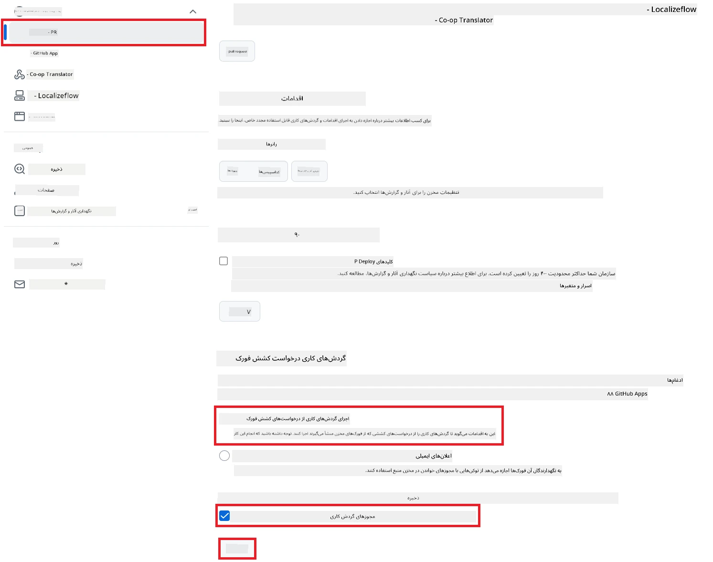

# استفاده از اکشن Co-op Translator در گیت‌هاب (راه‌اندازی عمومی)

**مخاطبان هدف:** این راهنما برای کاربران اکثر مخازن عمومی یا خصوصی مناسب است که مجوزهای استاندارد GitHub Actions کافی هستند. این راه‌اندازی از `GITHUB_TOKEN` داخلی استفاده می‌کند.

مستندات مخزن خود را به‌راحتی با اکشن Co-op Translator در گیت‌هاب ترجمه کنید. این راهنما مراحل راه‌اندازی اکشن را توضیح می‌دهد تا هر زمان که فایل‌های مارک‌داون یا تصاویر منبع شما تغییر کنند، به‌طور خودکار درخواست Pull با ترجمه‌های به‌روزرسانی‌شده ایجاد شود.

> [!IMPORTANT]
>
> **انتخاب راهنمای مناسب:**
>
> این راهنما **راه‌اندازی ساده‌تر با استفاده از `GITHUB_TOKEN` استاندارد** را توضیح می‌دهد. این روش برای اکثر کاربران توصیه می‌شود چون نیازی به مدیریت کلید خصوصی GitHub App ندارد.
>

## پیش‌نیازها

قبل از پیکربندی اکشن گیت‌هاب، مطمئن شوید که اطلاعات لازم برای سرویس هوش مصنوعی را آماده دارید.

**۱. ضروری: اطلاعات مدل زبان هوش مصنوعی**
شما باید اطلاعات یکی از مدل‌های زبان پشتیبانی‌شده را داشته باشید:

- **Azure OpenAI**: نیازمند Endpoint، API Key، نام مدل/استقرار، نسخه API.
- **OpenAI**: نیازمند API Key، (اختیاری: Org ID، Base URL، Model ID).
- برای جزئیات بیشتر به [مدل‌ها و سرویس‌های پشتیبانی‌شده](../../../../README.md) مراجعه کنید.

**۲. اختیاری: اطلاعات AI Vision (برای ترجمه تصویر)**

- فقط اگر نیاز به ترجمه متن داخل تصاویر دارید لازم است.
- **Azure AI Vision**: نیازمند Endpoint و Subscription Key.
- اگر وارد نشود، اکشن به حالت [فقط مارک‌داون](../markdown-only-mode.md) می‌رود.

## راه‌اندازی و پیکربندی

برای پیکربندی اکشن Co-op Translator در مخزن خود با استفاده از `GITHUB_TOKEN` استاندارد، مراحل زیر را دنبال کنید.

### مرحله ۱: آشنایی با احراز هویت (استفاده از `GITHUB_TOKEN`)

این گردش‌کار از `GITHUB_TOKEN` داخلی که توسط GitHub Actions ارائه می‌شود استفاده می‌کند. این توکن به‌طور خودکار مجوزهای لازم را برای تعامل با مخزن شما بر اساس تنظیمات مرحله ۳ فراهم می‌کند.

### مرحله ۲: پیکربندی اسرار مخزن

فقط کافی است اطلاعات سرویس هوش مصنوعی خود را به‌عنوان اسرار رمزگذاری‌شده در تنظیمات مخزن وارد کنید.

۱.  به مخزن موردنظر خود در گیت‌هاب بروید.
۲.  به **Settings** > **Secrets and variables** > **Actions** بروید.
۳.  زیر بخش **Repository secrets**، برای هر سرویس هوش مصنوعی موردنیاز، روی **New repository secret** کلیک کنید.

     *(مرجع تصویر: محل افزودن اسرار را نشان می‌دهد)*

**اسرار موردنیاز سرویس هوش مصنوعی (همه موارد مرتبط با پیش‌نیازها را اضافه کنید):**

| نام راز                             | توضیحات                                   | منبع مقدار                        |
| :---------------------------------- | :---------------------------------------- | :------------------------------- |
| `AZURE_AI_SERVICE_API_KEY`            | کلید سرویس Azure AI (Computer Vision)      | Azure AI Foundry شما               |
| `AZURE_AI_SERVICE_ENDPOINT`         | Endpoint سرویس Azure AI (Computer Vision)  | Azure AI Foundry شما               |
| `AZURE_OPENAI_API_KEY`              | کلید سرویس Azure OpenAI                   | Azure AI Foundry شما               |
| `AZURE_OPENAI_ENDPOINT`             | Endpoint سرویس Azure OpenAI                | Azure AI Foundry شما               |
| `AZURE_OPENAI_MODEL_NAME`           | نام مدل Azure OpenAI شما                   | Azure AI Foundry شما               |
| `AZURE_OPENAI_CHAT_DEPLOYMENT_NAME` | نام استقرار Azure OpenAI شما               | Azure AI Foundry شما               |
| `AZURE_OPENAI_API_VERSION`          | نسخه API برای Azure OpenAI                 | Azure AI Foundry شما               |
| `OPENAI_API_KEY`                    | کلید API برای OpenAI                       | پلتفرم OpenAI شما                  |
| `OPENAI_ORG_ID`                     | شناسه سازمان OpenAI (اختیاری)              | پلتفرم OpenAI شما                  |
| `OPENAI_CHAT_MODEL_ID`              | شناسه مدل خاص OpenAI (اختیاری)             | پلتفرم OpenAI شما                  |
| `OPENAI_BASE_URL`                   | Base URL سفارشی API OpenAI (اختیاری)       | پلتفرم OpenAI شما                  |

### مرحله ۳: پیکربندی مجوزهای گردش‌کار

اکشن گیت‌هاب برای بررسی کد و ایجاد Pull Request به مجوزهایی از طریق `GITHUB_TOKEN` نیاز دارد.

۱.  در مخزن خود به **Settings** > **Actions** > **General** بروید.
۲.  به بخش **Workflow permissions** بروید.
۳.  گزینه **Read and write permissions** را انتخاب کنید. این گزینه مجوزهای `contents: write` و `pull-requests: write` را برای این گردش‌کار فعال می‌کند.
۴.  مطمئن شوید که گزینه **Allow GitHub Actions to create and approve pull requests** فعال باشد.
۵.  روی **Save** کلیک کنید.



### مرحله ۴: ساخت فایل گردش‌کار

در نهایت، فایل YAML گردش‌کار را با استفاده از `GITHUB_TOKEN` بسازید.

۱.  در ریشه مخزن خود، اگر پوشه `.github/workflows/` وجود ندارد، آن را بسازید.
۲.  داخل `.github/workflows/`، فایلی با نام `co-op-translator.yml` بسازید.
۳.  محتوای زیر را داخل `co-op-translator.yml` قرار دهید.

```yaml
name: Co-op Translator

on:
  push:
    branches:
      - main

jobs:
  co-op-translator:
    runs-on: ubuntu-latest

    permissions:
      contents: write
      pull-requests: write

    steps:
      - name: Checkout repository
        uses: actions/checkout@v4
        with:
          fetch-depth: 0

      - name: Set up Python
        uses: actions/setup-python@v4
        with:
          python-version: '3.10'

      - name: Install Co-op Translator
        run: |
          python -m pip install --upgrade pip
          pip install co-op-translator

      - name: Run Co-op Translator
        env:
          PYTHONIOENCODING: utf-8
          # === AI Service Credentials ===
          AZURE_AI_SERVICE_API_KEY: ${{ secrets.AZURE_AI_SERVICE_API_KEY }}
          AZURE_AI_SERVICE_ENDPOINT: ${{ secrets.AZURE_AI_SERVICE_ENDPOINT }}
          AZURE_OPENAI_API_KEY: ${{ secrets.AZURE_OPENAI_API_KEY }}
          AZURE_OPENAI_ENDPOINT: ${{ secrets.AZURE_OPENAI_ENDPOINT }}
          AZURE_OPENAI_MODEL_NAME: ${{ secrets.AZURE_OPENAI_MODEL_NAME }}
          AZURE_OPENAI_CHAT_DEPLOYMENT_NAME: ${{ secrets.AZURE_OPENAI_CHAT_DEPLOYMENT_NAME }}
          AZURE_OPENAI_API_VERSION: ${{ secrets.AZURE_OPENAI_API_VERSION }}
          OPENAI_API_KEY: ${{ secrets.OPENAI_API_KEY }}
          OPENAI_ORG_ID: ${{ secrets.OPENAI_ORG_ID }}
          OPENAI_CHAT_MODEL_ID: ${{ secrets.OPENAI_CHAT_MODEL_ID }}
          OPENAI_BASE_URL: ${{ secrets.OPENAI_BASE_URL }}
        run: |
          # =====================================================================
          # IMPORTANT: Set your target languages here (REQUIRED CONFIGURATION)
          # =====================================================================
          # Example: Translate to Spanish, French, German. Add -y to auto-confirm.
          translate -l "es fr de" -y  # <--- MODIFY THIS LINE with your desired languages

      - name: Create Pull Request with translations
        uses: peter-evans/create-pull-request@v5
        with:
          token: ${{ secrets.GITHUB_TOKEN }}
          commit-message: "🌐 Update translations via Co-op Translator"
          title: "🌐 Update translations via Co-op Translator"
          body: |
            This PR updates translations for recent changes to the main branch.

            ### 📋 Changes included
            - Translated contents are available in the `translations/` directory
            - Translated images are available in the `translated_images/` directory

            ---
            🌐 Automatically generated by the [Co-op Translator](https://github.com/Azure/co-op-translator) GitHub Action.
          branch: update-translations
          base: main
          labels: translation, automated-pr
          delete-branch: true
          add-paths: |
            translations/
            translated_images/
```
4.  **شخصی‌سازی گردش‌کار:**
  - **[!IMPORTANT] زبان‌های هدف:** در مرحله `Run Co-op Translator`، **حتماً لیست کدهای زبان** داخل دستور `translate -l "..." -y` را بررسی و مطابق نیاز پروژه خود تغییر دهید. لیست نمونه (`ar de es...`) باید جایگزین یا اصلاح شود.
  - **Trigger (`on:`):** در حال حاضر گردش‌کار با هر push به `main` اجرا می‌شود. برای مخازن بزرگ، می‌توانید فیلتر `paths:` را اضافه کنید (نمونه کامنت‌شده در YAML را ببینید) تا فقط هنگام تغییر فایل‌های مرتبط (مثلاً مستندات منبع) اجرا شود و زمان اجرای Runner را ذخیره کنید.
  - **جزئیات PR:** در مرحله `Create Pull Request`، پیام commit، عنوان، توضیحات، نام شاخه و برچسب‌ها را در صورت نیاز شخصی‌سازی کنید.

## اجرای گردش‌کار

> [!WARNING]  
> **محدودیت زمان اجرای Runner گیت‌هاب:**  
> Runnerهای میزبانی‌شده توسط گیت‌هاب مثل `ubuntu-latest` حداکثر **۶ ساعت زمان اجرا** دارند.  
> اگر ترجمه مخزن‌های بزرگ‌تر بیش از ۶ ساعت طول بکشد، گردش‌کار به‌طور خودکار متوقف می‌شود.  
> برای جلوگیری از این مشکل:  
> - از **Runner شخصی** استفاده کنید (بدون محدودیت زمانی)  
> - تعداد زبان‌های هدف در هر اجرا را کاهش دهید

پس از ادغام فایل `co-op-translator.yml` در شاخه اصلی (یا شاخه‌ای که در trigger `on:` مشخص شده)، گردش‌کار به‌طور خودکار هر زمان که تغییراتی به آن شاخه push شود (و با فیلتر `paths` مطابقت داشته باشد، اگر تنظیم شده باشد) اجرا خواهد شد.

---

**سلب مسئولیت**:
این سند با استفاده از سرویس ترجمه هوش مصنوعی [Co-op Translator](https://github.com/Azure/co-op-translator) ترجمه شده است. اگرچه ما برای دقت تلاش می‌کنیم، لطفاً توجه داشته باشید که ترجمه‌های خودکار ممکن است شامل خطا یا نادقتی باشند. نسخه اصلی سند به زبان مادری آن باید به عنوان منبع معتبر در نظر گرفته شود. برای اطلاعات حساس، ترجمه انسانی حرفه‌ای توصیه می‌شود. ما هیچ مسئولیتی در قبال سوءتفاهم یا تفسیر نادرست ناشی از استفاده از این ترجمه نداریم.