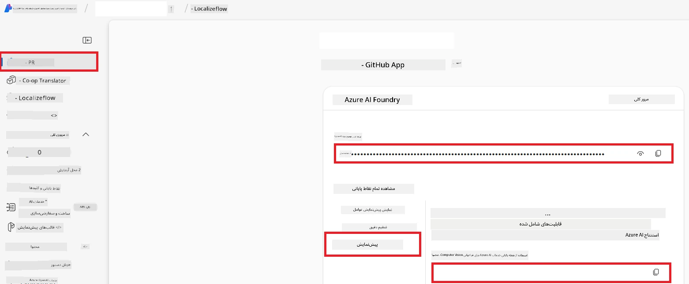

# راه‌اندازی Azure AI برای Co-op Translator (Azure OpneAI و Azure AI Vision)

این راهنما شما را در تنظیم Azure OpenAI برای ترجمه زبان و Azure Computer Vision برای تحلیل محتوای تصویر (که سپس می‌تواند برای ترجمه مبتنی بر تصویر استفاده شود) در Azure AI Foundry راهنمایی می‌کند.

**پیش‌نیازها:**
- حساب Azure با اشتراک فعال.
- مجوزهای کافی برای ایجاد منابع و استقرارها در اشتراک Azure خود.

## ایجاد یک پروژه Azure AI

شما با ایجاد یک پروژه Azure AI شروع خواهید کرد که به عنوان یک مکان مرکزی برای مدیریت منابع AI شما عمل می‌کند.

1. به [https://ai.azure.com](https://ai.azure.com) بروید و با حساب Azure خود وارد شوید.

1. گزینه **+Create** را برای ایجاد یک پروژه جدید انتخاب کنید.

1. کارهای زیر را انجام دهید:
   - یک **نام پروژه** وارد کنید (مثلاً `CoopTranslator-Project`).
   - **AI hub** را انتخاب کنید (مثلاً `CoopTranslator-Hub`) (در صورت نیاز یک مورد جدید ایجاد کنید).

1. روی "**Review and Create**" کلیک کنید تا پروژه شما تنظیم شود. به صفحه مرور پروژه شما هدایت خواهید شد.

## تنظیم Azure OpenAI برای ترجمه زبان

در پروژه خود، یک مدل Azure OpenAI را مستقر خواهید کرد تا به عنوان بک‌اند برای ترجمه متن خدمت کند.

### رفتن به پروژه خود

اگر هنوز وارد نشده‌اید، پروژه تازه ایجاد شده خود (مثلاً `CoopTranslator-Project`) را در Azure AI Foundry باز کنید.

### استقرار یک مدل OpenAI

1. از منوی سمت چپ پروژه خود، در بخش "My assets"، گزینه "**Models + endpoints**" را انتخاب کنید.

1. گزینه **+ Deploy model** را انتخاب کنید.

1. گزینه **Deploy Base Model** را انتخاب کنید.

1. فهرستی از مدل‌های موجود نمایش داده می‌شود. یک مدل GPT مناسب را فیلتر یا جستجو کنید. ما `gpt-4o` را توصیه می‌کنیم.

1. مدل مورد نظر خود را انتخاب و روی **Confirm** کلیک کنید.

1. گزینه **Deploy** را انتخاب کنید.

### پیکربندی Azure OpenAI

پس از استقرار، می‌توانید از صفحه "**Models + endpoints**" استقرار مورد نظر خود را انتخاب کرده و **URL نقطه پایانی REST**، **کلید**، **نام استقرار**، **نام مدل** و **نسخه API** آن را بیابید. این موارد برای ادغام مدل ترجمه در برنامه شما لازم است.

> [!NOTE]
> شما می‌توانید نسخه‌های API را از صفحه [API version deprecation](https://learn.microsoft.com/azure/ai-services/openai/api-version-deprecation) بر اساس نیازهای خود انتخاب کنید. توجه داشته باشید که **نسخه API** متفاوت از **نسخه مدل** است که در صفحه **Models + endpoints** در Azure AI Foundry نمایش داده می‌شود.

## تنظیم Azure Computer Vision برای ترجمه تصاویر

برای فعال‌سازی ترجمه متن داخل تصاویر، باید کلید API و نقطه پایانی سرویس Azure AI را پیدا کنید.

1. به پروژه Azure AI خود بروید (مثلاً `CoopTranslator-Project`). مطمئن شوید که در صفحه مرور پروژه هستید.

### پیکربندی سرویس Azure AI

کلید API و نقطه پایانی را از سرویس Azure AI پیدا کنید.

1. به پروژه Azure AI خود بروید (مثلاً `CoopTranslator-Project`). مطمئن شوید که در صفحه مرور پروژه هستید.

1. از تب سرویس Azure AI، **کلید API** و **نقطه پایانی** را بیابید.

    

این اتصال امکانات منبع سرویس Azure AI مرتبط (شامل تحلیل تصویر) را در پروژه AI Foundry شما فراهم می‌کند. سپس می‌توانید از این اتصال در نوت‌بوک‌ها یا برنامه‌های خود برای استخراج متن از تصاویر استفاده کنید، که بعداً می‌توان آن را برای ترجمه به مدل Azure OpenAI ارسال کرد.

## گردآوری مدارک احراز هویت شما

اکنون باید موارد زیر را جمع‌آوری کرده باشید:

**برای Azure OpenAI (ترجمه متن):**
- نقطه پایانی Azure OpenAI
- کلید API Azure OpenAI
- نام مدل Azure OpenAI (مثلاً `gpt-4o`)
- نام استقرار Azure OpenAI (مثلاً `cooptranslator-gpt4o`)
- نسخه API Azure OpenAI

**برای سرویس‌های Azure AI (استخراج متن از تصویر از طریق Vision):**
- نقطه پایانی سرویس Azure AI
- کلید API سرویس Azure AI

### نمونه: پیکربندی متغیر محیطی (نسخه پیش‌نمایش)

بعداً، هنگام ساخت برنامه خود، احتمالاً آن را با استفاده از این مدارک جمع‌آوری‌شده پیکربندی خواهید کرد. برای مثال، ممکن است آن‌ها را به صورت متغیرهای محیطی به این شکل تنظیم کنید:

```bash
# اطلاعات ورود سرویس هوش مصنوعی آژور (الزامی برای ترجمه تصویر)
AZURE_AI_SERVICE_API_KEY="your_azure_ai_service_api_key" # به عنوان مثال، 21xasd...
AZURE_AI_SERVICE_ENDPOINT="https://your_azure_ai_service_endpoint.cognitiveservices.azure.com/"

# مجموعه‌های جایگزین اختیاری: متغیرهای تکراری با پسوند _1/_2 (ایندکس یکسان برای همه متغیرها در مجموعه)
AZURE_AI_SERVICE_API_KEY_1="your_azure_ai_service_api_key_1"
AZURE_AI_SERVICE_ENDPOINT_1="https://your_azure_ai_service_endpoint_1.cognitiveservices.azure.com/"

# اطلاعات ورود Azure OpenAI (الزامی برای ترجمه متن)
AZURE_OPENAI_API_KEY="your_azure_openai_api_key" # به عنوان مثال، 21xasd...
AZURE_OPENAI_ENDPOINT="https://your_azure_openai_endpoint.openai.azure.com/"
AZURE_OPENAI_MODEL_NAME="your_model_name" # به عنوان مثال، gpt-4o
AZURE_OPENAI_CHAT_DEPLOYMENT_NAME="your_deployment_name" # به عنوان مثال، cooptranslator-gpt4o
AZURE_OPENAI_API_VERSION="your_api_version" # به عنوان مثال، 2024-12-01-preview

# مجموعه‌های جایگزین اختیاری: مجموعه کامل AZURE_OPENAI_* را با پسوند _1/_2 تکرار کنید (ایندکس یکسان برای همه متغیرها)
```

---

### مطالعه بیشتر

- [چگونه پروژه‌ای در Azure AI Foundry ایجاد کنیم](https://learn.microsoft.com/azure/ai-foundry/how-to/create-projects?tabs=ai-studio)
- [چگونه منابع Azure AI بسازیم](https://learn.microsoft.com/azure/ai-foundry/how-to/create-azure-ai-resource?tabs=portal)
- [چگونه مدل‌های OpenAI را در Azure AI Foundry مستقر کنیم](https://learn.microsoft.com/en-us/azure/ai-foundry/how-to/deploy-models-openai)

---

<!-- CO-OP TRANSLATOR DISCLAIMER START -->
**سلب مسئولیت**:  
این سند با استفاده از سرویس ترجمه ماشینی [Co-op Translator](https://github.com/Azure/co-op-translator) ترجمه شده است. در حالی که ما برای دقت تلاش می‌کنیم، لطفاً توجه داشته باشید که ترجمه‌های خودکار ممکن است شامل خطاها یا نادرستی‌هایی باشند. سند اصلی به زبان بومی آن باید به عنوان منبع معتبر در نظر گرفته شود. برای اطلاعات حیاتی، ترجمه حرفه‌ای انسانی پیشنهاد می‌شود. ما مسئول هیچ گونه سوء تفاهم یا تفسیر نادرست ناشی از استفاده از این ترجمه نیستیم.
<!-- CO-OP TRANSLATOR DISCLAIMER END -->