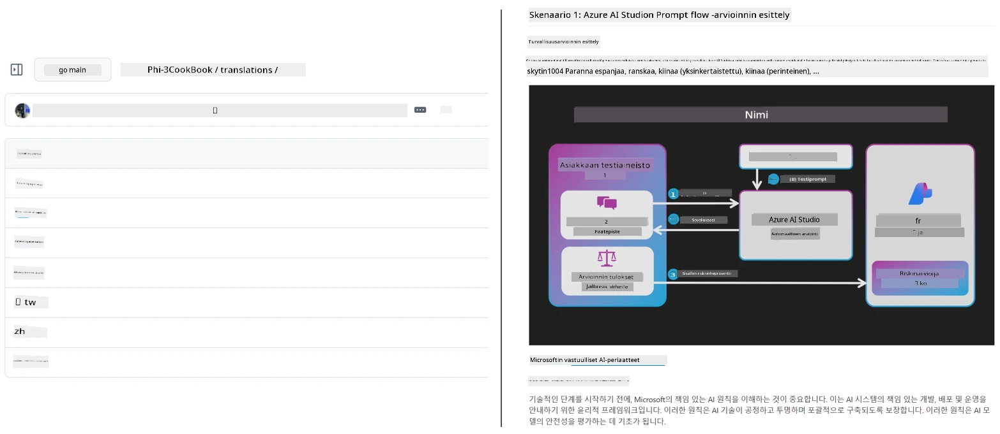
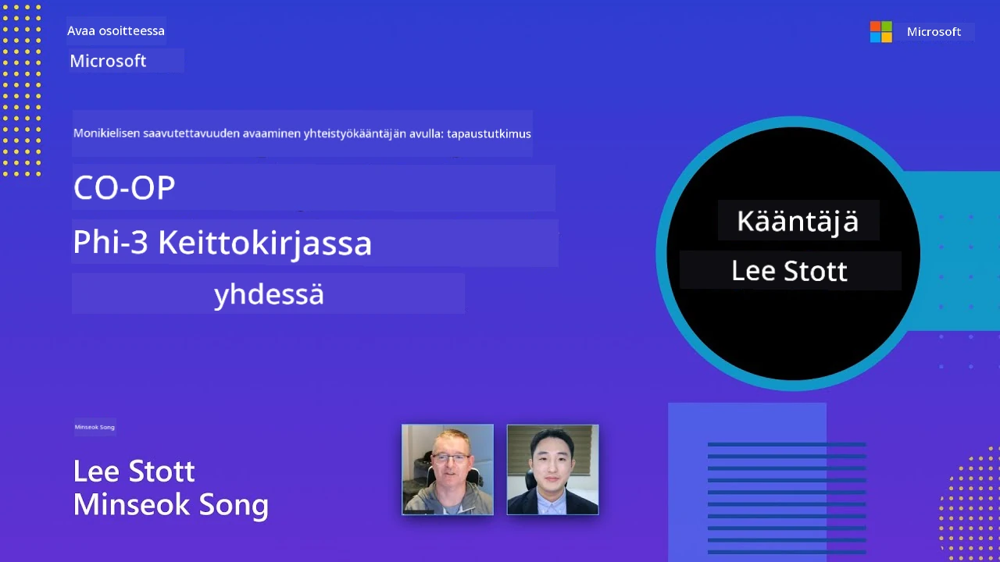

# Co-op Translator

_Suosittuja kieliä tukevan opetussisällön GitHub-käännösten helppo automatisointi ja ylläpito projektin kehittyessä._


[](https://pypi.org/project/co-op-translator/)
[](https://github.com/azure/co-op-translator/blob/main/LICENSE)
[](https://pepy.tech/project/co-op-translator)
[](https://pepy.tech/project/co-op-translator)
[](https://github.com/azure/co-op-translator/pkgs/container/co-op-translator)
[](https://github.com/psf/black)

[](https://GitHub.com/azure/co-op-translator/graphs/contributors/)
[](https://GitHub.com/azure/co-op-translator/issues/)
[](https://GitHub.com/azure/co-op-translator/pulls/)
[](http://makeapullrequest.com)

### 🌐 Monikielinen tuki

#### Tuettu [Co-op Translator](https://github.com/Azure/Co-op-Translator) -työkalulla

<!-- CO-OP TRANSLATOR LANGUAGES TABLE START -->
[Arabic](../ar/README.md) | [Bengali](../bn/README.md) | [Bulgarian](../bg/README.md) | [Burmese (Myanmar)](../my/README.md) | [Chinese (Simplified)](../zh-CN/README.md) | [Chinese (Traditional, Hong Kong)](../zh-HK/README.md) | [Chinese (Traditional, Macau)](../zh-MO/README.md) | [Chinese (Traditional, Taiwan)](../zh-TW/README.md) | [Croatian](../hr/README.md) | [Czech](../cs/README.md) | [Danish](../da/README.md) | [Dutch](../nl/README.md) | [Estonian](../et/README.md) | [Finnish](./README.md) | [French](../fr/README.md) | [German](../de/README.md) | [Greek](../el/README.md) | [Hebrew](../he/README.md) | [Hindi](../hi/README.md) | [Hungarian](../hu/README.md) | [Indonesian](../id/README.md) | [Italian](../it/README.md) | [Japanese](../ja/README.md) | [Kannada](../kn/README.md) | [Khmer](../km/README.md) | [Korean](../ko/README.md) | [Lithuanian](../lt/README.md) | [Malay](../ms/README.md) | [Malayalam](../ml/README.md) | [Marathi](../mr/README.md) | [Nepali](../ne/README.md) | [Nigerian Pidgin](../pcm/README.md) | [Norwegian](../no/README.md) | [Persian (Farsi)](../fa/README.md) | [Polish](../pl/README.md) | [Portuguese (Brazil)](../pt-BR/README.md) | [Portuguese (Portugal)](../pt-PT/README.md) | [Punjabi (Gurmukhi)](../pa/README.md) | [Romanian](../ro/README.md) | [Russian](../ru/README.md) | [Serbian (Cyrillic)](../sr/README.md) | [Slovak](../sk/README.md) | [Slovenian](../sl/README.md) | [Spanish](../es/README.md) | [Swahili](../sw/README.md) | [Swedish](../sv/README.md) | [Tagalog (Filipino)](../tl/README.md) | [Tamil](../ta/README.md) | [Telugu](../te/README.md) | [Thai](../th/README.md) | [Turkish](../tr/README.md) | [Ukrainian](../uk/README.md) | [Urdu](../ur/README.md) | [Vietnamese](../vi/README.md)

> **Haluatko kloonata paikallisesti?**
>
> Tämä repositorio sisältää yli 50 kielikäännöstä, mikä lisää merkittävästi latauskokoa. Jos haluat kloonata ilman käännöksiä, käytä sparse checkout -toimintoa:
>
> **Bash / macOS / Linux:**
> ```bash
> git clone --filter=blob:none --sparse https://github.com/skytin1004/co-op-translator.git
> cd co-op-translator
> git sparse-checkout set --no-cone '/*' '!translations' '!translated_images'
> ```
>
> **CMD (Windows):**
> ```cmd
> git clone --filter=blob:none --sparse https://github.com/skytin1004/co-op-translator.git
> cd co-op-translator
> git sparse-checkout set --no-cone "/*" "!translations" "!translated_images"
> ```
>
> Tämä antaa kaiken tarvitsemasi kurssin suorittamiseen huomattavasti nopeammalla latauksella.
<!-- CO-OP TRANSLATOR LANGUAGES TABLE END -->

[](https://GitHub.com/azure/co-op-translator/watchers/)
[](https://GitHub.com/azure/co-op-translator/network/)
[](https://GitHub.com/azure/co-op-translator/stargazers/)

[](https://discord.gg/nTYy5BXMWG)

[](https://codespaces.new/azure/co-op-translator)

## Yleiskuvaus

**Co-op Translator** auttaa sinua lokalisoimaan opetussisältösi GitHubissa useille kielille vaivattomasti.  
Kun päivität Markdown-tiedostoja, kuvia tai muistikirjoja, käännökset pysyvät automaattisesti synkronoituna, varmistaen sisällön tarkkuuden ja ajantasaisuuden oppijoille ympäri maailmaa.

Esimerkki siitä, miten käännetty sisältö on järjestetty:



## Kuinka käännösten tila hallitaan

Co-op Translator hallinnoi käännettyä sisältöä **versionhallittuina ohjelmistoartefakteina**,  
ei staattisina tiedostoina.

Työkalu seuraa käännetyn Markdownin, kuvien ja muistikirjojen tilaa  
käyttäen **kielikohtaisia metatietoja**.

Tämä rakenne mahdollistaa Co-op Translatorille:

- Vanhojen käännösten luotettavan tunnistamisen  
- Markdownin, kuvien ja muistikirjojen yhdenmukaisen käsittelyn  
- Turvallisen skaalaamisen suurissa, nopeasti liikkuvissa monikielisissä repozitorioissa  

Mallintamalla käännökset hallituiksi artefakteiksi,  
käännösprosessit vastaavat luonnollisesti nykyaikaisia  
ohjelmiston riippuvuus- ja artefaktienhallintakäytänteitä.

→ [Kuinka käännösten tila hallitaan](https://techcommunity.microsoft.com/blog/azuredevcommunityblog/rethinking-documentation-translation-treating-translations-as-versioned-software/4491755)


## Pikakäynnistys

```bash
# Luo ja aktivoi virtuaaliympäristö (suositeltavaa)
python -m venv .venv
# Windows
.venv\Scripts\activate
# macOS/Linux
source .venv/bin/activate
# Asenna paketti
pip install co-op-translator
# Käännä
translate -l "ko ja fr" -md
```

Docker:

```bash
# Vedä julkinen kuva GHCR:stä
docker pull ghcr.io/azure/co-op-translator:latest
# Suorita nykyinen kansio liitettynä ja .env tiedosto annettuna (Bash/Zsh)
docker run --rm -it --env-file .env -v "${PWD}:/work" ghcr.io/azure/co-op-translator:latest -l "ko ja fr" -md
```

## Minimiasennus

1. Varmista, että käytössäsi on tuettu Python-versio (tällä hetkellä 3.10–3.12). Poetryssa (pyproject.toml) tämä hoituu automaattisesti.  
2. Luo `.env`-tiedosto mallin mukaan: [.env.template](../../.env.template)  
3. Määritä yksi LLM-palveluntarjoaja (Azure OpenAI tai OpenAI)  
4. (Valinnainen) Kuvien käännöstä varten (`-img`), konfiguroi Azure AI Vision  
5. (Valinnainen) Voit määrittää useita tunnistetietoryhmiä kopioimalla muuttujat päätteillä kuten `_1`, `_2` jne. Kaikkien ryhmän muuttujien on oltava samalla päätteellä.  
6. (Suositeltu) Puhdista aiemmat käännökset mahdollisten konfliktien välttämiseksi (esim. `translations/`)  
7. (Suositeltu) Lisää käännösosio README-tiedostoosi käyttäen [README-kielipohjaa](./getting_started/README_languages_template.md)  
8. Katso: [Azure AI:n käyttöönotto](./getting_started/set-up-azure-ai.md)

## Käyttö

Käännä kaikki tuetut tyypit:

```bash
translate -l "ko ja"
```

Vain Markdown:

```bash
translate -l "de" -md
```

Markdown + kuvat:

```bash
translate -l "pt" -md -img
```

Vain muistikirjat:

```bash
translate -l "zh" -nb
```

Lisäasetukset: [Komentojen referenssi](./getting_started/command-reference.md)

## Ominaisuudet

- Käännösten automaatio Markdownille, muistikirjoille ja kuville  
- Käännökset pysyvät synkronoituna lähdemuuttumien kanssa  
- Toimii paikallisesti (CLI) tai CI:ssa (GitHub Actions)  
- Käyttää Azure OpenAI:ta tai OpenAI:ta; kuville valinnainen Azure AI Vision  
- Säilyttää Markdownin muotoilun ja rakenteen

## Dokumentaatio

- [Komentoriviohje](./getting_started/command-line-guide/command-line-guide.md)
- [GitHub Actions -opas (julkiset repositoriot & tavalliset salaisuudet)](./getting_started/github-actions-guide/github-actions-guide-public.md)
- [GitHub Actions -opas (Microsoft-organisaation repositoriot & organisaatiotason asetukset)](./getting_started/github-actions-guide/github-actions-guide-org.md)
- [README kielipohja](./getting_started/README_languages_template.md)
- [Tuetut kielet](./getting_started/supported-languages.md)
- [Osallistuminen](./CONTRIBUTING.md)
- [Vianmääritys](./getting_started/troubleshooting.md)

### Microsoftille suunnattu opas
> [!NOTE]
> Vain Microsoftin ”For Beginners” -repositorion ylläpitäjille.

- [”Other courses” -listan päivittäminen (vain MS Beginners -repositoriolle)](./getting_started/update-other-courses.md)

## Tue meitä ja edistä maailmanlaajuista oppimista

Liity mukaan muuttamaan opetussisällön globaalia jakelua! Anna [Co-op Translatorille](https://github.com/azure/co-op-translator) tähti GitHubissa ja tue tehtäväämme rikkoa kielimuurit oppimisessa ja teknologiassa. Kiinnostuksesi ja panoksesi ovat merkittäviä! Koodipanokset ja ominaisuusehdotukset ovat aina tervetulleita.

### Tutustu Microsoftin opetussisältöön omalla kielelläsi

- [LangChain4j-for-Beginners](https://github.com/microsoft/LangChain4j-for-Beginners)
- [AZD for Beginners](https://github.com/microsoft/AZD-for-beginners)
- [Edge AI for Beginners](https://github.com/microsoft/edgeai-for-beginners)
- [Model Context Protocol (MCP) For Beginners](https://github.com/microsoft/mcp-for-beginners)
- [AI Agents for Beginners](https://github.com/microsoft/ai-agents-for-beginners)
- [Generative AI for Beginners using .NET](https://github.com/microsoft/Generative-AI-for-beginners-dotnet)
- [Generative AI for Beginners](https://github.com/microsoft/generative-ai-for-beginners)
- [Generative AI for Beginners using Java](https://github.com/microsoft/generative-ai-for-beginners-java)
- [ML for Beginners](https://aka.ms/ml-beginners)
- [Data Science for Beginners](https://aka.ms/datascience-beginners)
- [AI for Beginners](https://aka.ms/ai-beginners)
- [Cybersecurity for Beginners](https://github.com/microsoft/Security-101)
- [Web Dev for Beginners](https://aka.ms/webdev-beginners)
- [IoT for Beginners](https://aka.ms/iot-beginners)
- [PhiCookBook](https://github.com/microsoft/PhiCookBook)

## Videoesittelyt

👉 Klikkaa alla olevaa kuvaa katsoaksesi YouTubessa.

- **Open at Microsoft**: Lyhyt 18 minuutin esittely ja pikakäyttöopas Co-op Translatorin käyttöön.

  [](https://www.youtube.com/watch?v=jX_swfH_KNU)

## Osallistu

Tässä projektissa toivotetaan tervetulleiksi kontribuutiot ja ehdotukset. Haluatko osallistua Azure Co-op Translatorin kehittämiseen? Katso ohjeet [CONTRIBUTING.md](./CONTRIBUTING.md) -tiedostosta, miten voit auttaa tekemään Co-op Translatorista entistä saavutettavamman.

## Tekijät
[](https://github.com/Azure/co-op-translator/graphs/contributors)

## Vaatimustenmukaisuusohje

Tämä projekti on ottanut käyttöön [Microsoft Open Source Code of Conduct](https://opensource.microsoft.com/codeofconduct/).
Lisätietoja saat lukemalla [Code of Conduct FAQ](https://opensource.microsoft.com/codeofconduct/faq/) -kohdan tai ottamalla yhteyttä sähköpostitse osoitteeseen [opencode@microsoft.com](mailto:opencode@microsoft.com) kaikissa lisäkysymyksissä tai kommentteissa.

## Vastuullinen tekoäly

Microsoft sitoutuu auttamaan asiakkaitaan käyttämään tekoälytuotteitamme vastuullisesti, jakamaan oppimamme asiat ja rakentamaan luottamukseen perustuvia kumppanuuksia työkaluilla, kuten Transparency Notes ja Impact Assessments. Monet näistä resursseista löytyvät osoitteesta [https://aka.ms/RAI](https://aka.ms/RAI).
Microsoftin vastuullisen tekoälyn lähestymistapa perustuu tekoälyperiaatteisiimme: reiluus, luotettavuus ja turvallisuus, yksityisyys ja tietoturva, osallistavuus, läpinäkyvyys ja vastuullisuus.

Suurten luontoisten kielten, kuvien ja puheen mallien - kuten tässä esimerkissä käytettyjen - käyttäytyminen saattaa olla epäoikeudenmukaista, epäluotettavaa tai loukkaavaa, mikä voi aiheuttaa haittoja. Tutustu [Azure OpenAI palvelun Transparency note](https://learn.microsoft.com/legal/cognitive-services/openai/transparency-note?tabs=text) saadaksesi tietoa riskeistä ja rajoituksista.

Suositeltu tapa vähentää näitä riskejä on sisällyttää arkkitehtuuriisi turvallisuusjärjestelmä, joka voi havaita ja estää haitallisen käyttäytymisen. [Azure AI Content Safety](https://learn.microsoft.com/azure/ai-services/content-safety/overview) tarjoaa itsenäisen suojakerroksen, joka pystyy tunnistamaan haitallisen käyttäjän ja tekoälyn tuottaman sisällön sovelluksissa ja palveluissa. Azure AI Content Safety sisältää tekstin ja kuvien API:t, joiden avulla voit havaita haitallista aineistoa. Meillä on myös interaktiivinen Content Safety Studio, jossa voit katsella, tutkia ja kokeilla mallikoodeja haitallisen sisällön tunnistamiseen eri muodoissa. Seuraava [alkuopas](https://learn.microsoft.com/azure/ai-services/content-safety/quickstart-text?tabs=visual-studio%2Clinux&pivots=programming-language-rest) ohjaa sinut palvelun käyttöpyyntöjen tekemiseen.

Toinen huomioon otettava seikka on sovelluksen kokonaisvaltainen suorituskyky. Monimuotoisissa ja monimallipohjaisissa sovelluksissa suorituskyvyllä tarkoitetaan järjestelmän toimintaa odotusten mukaisesti niin, että se ei tuota haitallisia tuloksia. On tärkeää arvioida sovelluksesi kokonaisvaltainen suorituskyky käyttämällä [generoinnin laatua sekä riski- ja turvallisuusmittareita](https://learn.microsoft.com/azure/ai-studio/concepts/evaluation-metrics-built-in).

Voit arvioida tekoälysovellustasi kehitysympäristössä käyttämällä [prompt flow SDK:ta](https://microsoft.github.io/promptflow/index.html). Testidatan tai tavoitteen perusteella generatiivisen tekoälysovelluksesi tuotokset mitataan kvantitatiivisesti sisäänrakennetuilla tai omilla arvioijillasi. Tämän SDK:n käyttöön pääset tutustumaan [aloitusoppaan](https://learn.microsoft.com/azure/ai-studio/how-to/develop/flow-evaluate-sdk) avulla. Kun suoritat arviointiajon, voit [visualisoida tulokset Azure AI Studiossa](https://learn.microsoft.com/azure/ai-studio/how-to/evaluate-flow-results).

## Tavara- ja palvelumerkit

Tämä projekti saattaa sisältää tavara- tai palvelumerkkejä tai logoja projekteista, tuotteista tai palveluista. Microsoftin tavara- tai palvelumerkkien valtuutettu käyttö on Microsoftin [Trademark & Brand Guidelines](https://www.microsoft.com/en-us/legal/intellectualproperty/trademarks/usage/general) -ohjeiden alaista ja sen mukaan tulee toimia.
Microsoftin tavara- tai palvelumerkkien käyttäminen muokatuissa versioissa tästä projektista ei saa aiheuttaa sekaannuksia tai antaa väärää kuvaa Microsoftin sponsoroinnista.
Kolmannen osapuolen tavara- ja palvelumerkkien käyttöä säätelevät kyseisten osapuolten omat käytännöt.

## Apua

Jos jumitut tai sinulla on kysymyksiä tekoälysovellusten rakentamisesta, liity:

[](https://discord.gg/nTYy5BXMWG)

Jos sinulla on tuotetäydennys- tai virheilmoituksia rakentamisen aikana, käy:

[](https://aka.ms/foundry/forum)

---

<!-- CO-OP TRANSLATOR DISCLAIMER START -->
**Vastuuvapauslauseke**:  
Tämä asiakirja on käännetty käyttämällä tekoälypohjaista käännöspalvelua [Co-op Translator](https://github.com/Azure/co-op-translator). Vaikka pyrimme tarkkuuteen, ota huomioon, että automaattikäännöksissä saattaa esiintyä virheitä tai epätarkkuuksia. Alkuperäistä asiakirjaa sen omalla kielellä tulee pitää auktoritatiivisena lähteenä. Tärkeissä asioissa suositellaan ammattimaista ihmiskäännöstä. Emme ole vastuussa mahdollisista väärinymmärryksistä tai tulkinnoista, jotka johtuvat tämän käännöksen käytöstä.
<!-- CO-OP TRANSLATOR DISCLAIMER END -->