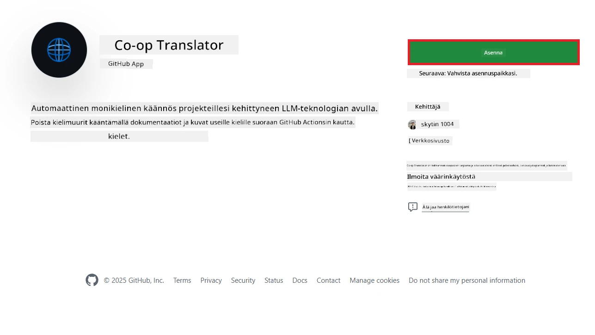
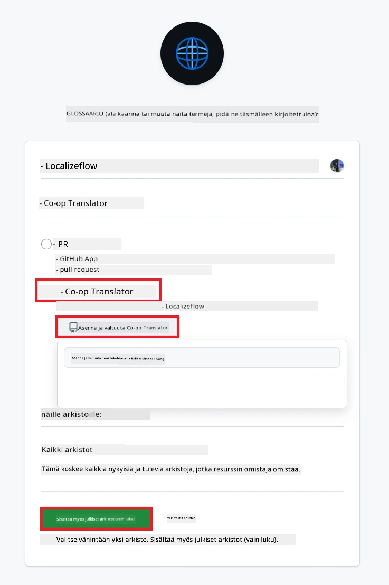
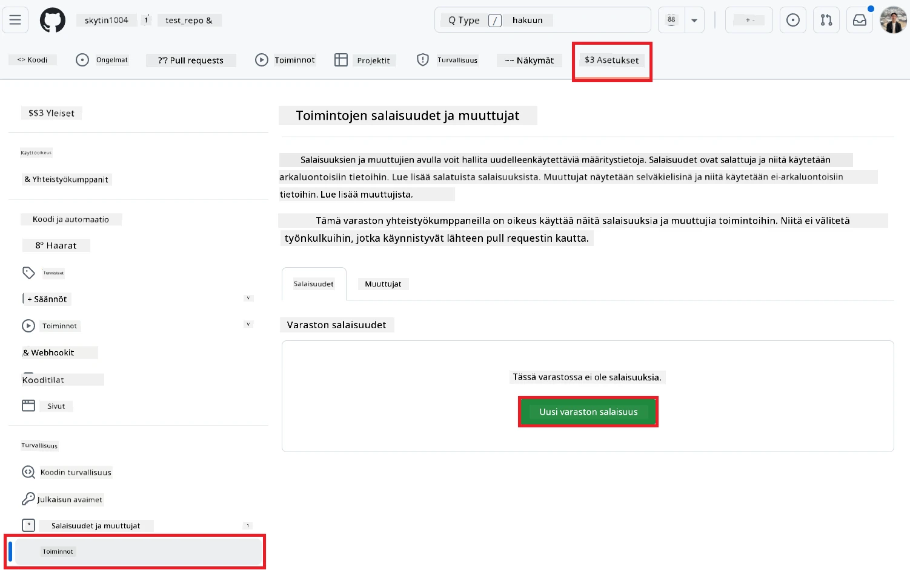
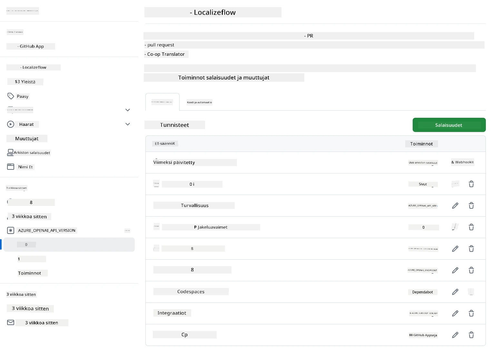

# Co-op Translator GitHub Actionin käyttö (Organisaation opas)

**Kohderyhmä:** Tämä opas on tarkoitettu **Microsoftin sisäisille käyttäjille** tai **tiimeille, joilla on pääsy valmiiksi rakennettuun Co-op Translator GitHub Appiin** tai jotka voivat luoda oman mukautetun GitHub Appin.

Automatisoi repositoriosi dokumentaation kääntäminen helposti Co-op Translator GitHub Actionin avulla. Tämä opas ohjaa sinut läpi toiminnon käyttöönoton, jolloin se luo automaattisesti pull requestit päivitettyjen käännösten kanssa aina, kun lähde-Markdown-tiedostot tai kuvat muuttuvat.

> [!IMPORTANT]
> 
> **Valitse oikea opas:**
>
> Tässä oppaassa kuvataan käyttöönotto **GitHub App ID:n ja Private Keyn** avulla. Tarvitset yleensä tämän "Organisaation oppaan" menetelmän, jos: **`GITHUB_TOKEN`-oikeudet ovat rajoitettuja:** Organisaatiosi tai repositoriosi asetukset rajoittavat oletusoikeuksia, jotka myönnetään tavalliselle `GITHUB_TOKEN`:lle. Erityisesti, jos `GITHUB_TOKEN`:lla ei ole tarvittavia `write`-oikeuksia (kuten `contents: write` tai `pull-requests: write`), [Julkisen oppaan](./github-actions-guide-public.md) työnkulku epäonnistuu riittämättömien oikeuksien vuoksi. Erillisen GitHub Appin käyttö, jolle on myönnetty oikeudet, ohittaa tämän rajoituksen.
>
> **Jos yllä oleva ei koske sinua:**
>
> Jos tavallisella `GITHUB_TOKEN`:lla on riittävät oikeudet repositoriossasi (eli organisaatiorajoitukset eivät estä sinua), käytä **[Julkista opasta GITHUB_TOKENilla](./github-actions-guide-public.md)**. Julkinen opas ei vaadi App ID:n tai Private Keyn hankintaa tai hallintaa, vaan käyttää pelkästään tavallista `GITHUB_TOKEN`:ia ja repositorion oikeuksia.

## Esivaatimukset

Ennen GitHub Actionin konfigurointia varmista, että sinulla on tarvittavat AI-palvelun tunnukset valmiina.

**1. Pakollinen: AI-kielimallin tunnukset**
Tarvitset tunnukset vähintään yhteen tuettuun kielimalliin:

- **Azure OpenAI**: Vaatii Endpointin, API Keyn, mallin/deploymentin nimet, API-version.
- **OpenAI**: Vaatii API Keyn, (Valinnainen: Org ID, Base URL, Model ID).
- Katso [Tuetut mallit ja palvelut](../../../../README.md) lisätietoja varten.
- Käyttöönotto-ohje: [Azure OpenAI:n käyttöönotto](../set-up-resources/set-up-azure-openai.md).

**2. Valinnainen: Computer Vision -tunnukset (kuvien kääntämiseen)**

- Tarvitaan vain, jos haluat kääntää kuviin upotettua tekstiä.
- **Azure Computer Vision**: Vaatii Endpointin ja Subscription Keyn.
- Jos et anna näitä, toiminto käyttää oletuksena [vain Markdown-tilaa](../markdown-only-mode.md).
- Käyttöönotto-ohje: [Azure Computer Visionin käyttöönotto](../set-up-resources/set-up-azure-computer-vision.md).

## Käyttöönotto ja konfigurointi

Seuraa näitä ohjeita Co-op Translator GitHub Actionin konfiguroimiseksi repositoriossasi:

### Vaihe 1: Asenna ja konfiguroi GitHub App -autentikointi

Työnkulku käyttää GitHub App -autentikointia, jotta se voi turvallisesti toimia repositoriossasi (esim. luoda pull requesteja) puolestasi. Valitse yksi vaihtoehto:

#### **Vaihtoehto A: Asenna valmiiksi rakennettu Co-op Translator GitHub App (Microsoftin sisäinen käyttö)**

1. Siirry [Co-op Translator GitHub App](https://github.com/apps/co-op-translator) -sivulle.

1. Valitse **Install** ja valitse tili tai organisaatio, jossa kohderepositoriosi sijaitsee.

    

1. Valitse **Only select repositories** ja valitse kohderepositoriosi (esim. `PhiCookBook`). Klikkaa **Install**. Sinua voidaan pyytää tunnistautumaan.

    

1. **Hanki App-tunnukset (sisäinen prosessi):** Jotta työnkulku voi tunnistautua sovelluksena, tarvitset kaksi Co-op Translator -tiimin antamaa tietoa:
  - **App ID:** Co-op Translator -sovelluksen yksilöllinen tunniste. App ID on: `1164076`.
  - **Private Key:** Sinun täytyy hankkia **koko `.pem`-yksityisavaintiedoston sisältö** ylläpitäjältä. **Säilytä tämä avain kuin salasana ja pidä se turvassa.**

1. Jatka vaiheeseen 2.

#### **Vaihtoehto B: Käytä omaa mukautettua GitHub Appia**

- Voit halutessasi luoda ja konfiguroida oman GitHub Appin. Varmista, että sillä on luku- ja kirjoitusoikeudet Contents- ja Pull requests -kohteisiin. Tarvitset App ID:n ja generoidun Private Keyn.

### Vaihe 2: Konfiguroi repositorion salaisuudet

Sinun tulee lisätä GitHub Appin tunnukset ja AI-palvelun tunnukset salattuina salaisuuksina repositoriosi asetuksiin.

1. Siirry kohde-GitHub-repositoriosi sivulle (esim. `PhiCookBook`).

1. Mene **Settings** > **Secrets and variables** > **Actions**.

1. **Repository secrets** -kohdassa klikkaa **New repository secret** jokaiselle alla listatulle salaisuudelle.

   

**Pakolliset salaisuudet (GitHub App -autentikointiin):**

| Salaisuuden nimi     | Kuvaus                                            | Arvon lähde                                   |
| :------------------- | :------------------------------------------------ | :--------------------------------------------- |
| `GH_APP_ID`          | GitHub Appin App ID (vaiheesta 1)                 | GitHub Appin asetukset                        |
| `GH_APP_PRIVATE_KEY` | Ladatun `.pem`-tiedoston **koko sisältö**         | `.pem`-tiedosto (vaiheesta 1)                 |

**AI-palvelun salaisuudet (lisää KAIKKI, jotka koskevat esivaatimuksiasi):**

| Salaisuuden nimi                     | Kuvaus                                    | Arvon lähde                  |
| :----------------------------------- | :---------------------------------------- | :--------------------------- |
| `AZURE_AI_SERVICE_API_KEY`           | Azure AI Service -avain (Computer Vision) | Azure AI Foundry             |
| `AZURE_AI_SERVICE_ENDPOINT`          | Azure AI Service -endpoint (Computer Vision) | Azure AI Foundry          |
| `AZURE_OPENAI_API_KEY`               | Azure OpenAI -palvelun avain              | Azure AI Foundry             |
| `AZURE_OPENAI_ENDPOINT`              | Azure OpenAI -palvelun endpoint           | Azure AI Foundry             |
| `AZURE_OPENAI_MODEL_NAME`            | Azure OpenAI -mallin nimi                 | Azure AI Foundry             |
| `AZURE_OPENAI_CHAT_DEPLOYMENT_NAME`  | Azure OpenAI -deploymentin nimi           | Azure AI Foundry             |
| `AZURE_OPENAI_API_VERSION`           | Azure OpenAI -API-versio                  | Azure AI Foundry             |
| `OPENAI_API_KEY`                     | OpenAI API Key                            | OpenAI Platform              |
| `OPENAI_ORG_ID`                      | OpenAI Organisaatio ID                    | OpenAI Platform              |
| `OPENAI_CHAT_MODEL_ID`               | OpenAI-mallin ID                          | OpenAI Platform              |
| `OPENAI_BASE_URL`                    | Mukautettu OpenAI API Base URL            | OpenAI Platform              |



### Vaihe 3: Luo työnkulun tiedosto

Lopuksi luo YAML-tiedosto, joka määrittelee automaattisen työnkulun.

1. Luo repositoriosi juureen `.github/workflows/`-hakemisto, jos sitä ei ole.

1. Luo `.github/workflows/`-hakemistoon tiedosto nimeltä `co-op-translator.yml`.

1. Liitä seuraava sisältö tiedostoon co-op-translator.yml.

```
name: Co-op Translator

on:
  push:
    branches:
      - main

jobs:
  co-op-translator:
    runs-on: ubuntu-latest

    permissions:
      contents: write
      pull-requests: write

    steps:
      - name: Checkout repository
        uses: actions/checkout@v4
        with:
          fetch-depth: 0

      - name: Set up Python
        uses: actions/setup-python@v4
        with:
          python-version: '3.10'

      - name: Install Co-op Translator
        run: |
          python -m pip install --upgrade pip
          pip install co-op-translator

      - name: Run Co-op Translator
        env:
          PYTHONIOENCODING: utf-8
          # Azure AI Service Credentials
          AZURE_AI_SERVICE_API_KEY: ${{ secrets.AZURE_AI_SERVICE_API_KEY }}
          AZURE_AI_SERVICE_ENDPOINT: ${{ secrets.AZURE_AI_SERVICE_ENDPOINT }}

          # Azure OpenAI Credentials
          AZURE_OPENAI_API_KEY: ${{ secrets.AZURE_OPENAI_API_KEY }}
          AZURE_OPENAI_ENDPOINT: ${{ secrets.AZURE_OPENAI_ENDPOINT }}
          AZURE_OPENAI_MODEL_NAME: ${{ secrets.AZURE_OPENAI_MODEL_NAME }}
          AZURE_OPENAI_CHAT_DEPLOYMENT_NAME: ${{ secrets.AZURE_OPENAI_CHAT_DEPLOYMENT_NAME }}
          AZURE_OPENAI_API_VERSION: ${{ secrets.AZURE_OPENAI_API_VERSION }}

          # OpenAI Credentials
          OPENAI_API_KEY: ${{ secrets.OPENAI_API_KEY }}
          OPENAI_ORG_ID: ${{ secrets.OPENAI_ORG_ID }}
          OPENAI_CHAT_MODEL_ID: ${{ secrets.OPENAI_CHAT_MODEL_ID }}
          OPENAI_BASE_URL: ${{ secrets.OPENAI_BASE_URL }}
        run: |
          # =====================================================================
          # IMPORTANT: Set your target languages here (REQUIRED CONFIGURATION)
          # =====================================================================
          # Example: Translate to Spanish, French, German. Add -y to auto-confirm.
          translate -l "es fr de" -y  # <--- MODIFY THIS LINE with your desired languages

      - name: Authenticate GitHub App
        id: generate_token
        uses: tibdex/github-app-token@v1
        with:
          app_id: ${{ secrets.GH_APP_ID }}
          private_key: ${{ secrets.GH_APP_PRIVATE_KEY }}

      - name: Create Pull Request with translations
        uses: peter-evans/create-pull-request@v5
        with:
          token: ${{ steps.generate_token.outputs.token }}
          commit-message: "🌐 Update translations via Co-op Translator"
          title: "🌐 Update translations via Co-op Translator"
          body: |
            This PR updates translations for recent changes to the main branch.

            ### 📋 Changes included
            - Translated contents are available in the `translations/` directory
            - Translated images are available in the `translated_images/` directory

            ---
            🌐 Automatically generated by the [Co-op Translator](https://github.com/Azure/co-op-translator) GitHub Action.
          branch: update-translations
          base: main
          labels: translation, automated-pr
          delete-branch: true
          add-paths: |
            translations/
            translated_images/

```

4.  **Mukauta työnkulkua:**
  - **[!IMPORTANT] Kohdekielet:** `Run Co-op Translator` -vaiheessa sinun **TÄYTYY tarkistaa ja muokata kielikoodien listaa** `translate -l "..." -y` -komennossa projektisi tarpeiden mukaan. Esimerkkilista (`ar de es...`) tulee korvata tai säätää.
  - **Trigger (`on:`):** Nykyinen trigger käynnistyy jokaisesta pushista `main`-haaraan. Suurissa repositorioissa harkitse `paths:`-suodattimen lisäämistä (katso kommentoitu esimerkki YAMLissa), jotta työnkulku käynnistyy vain, kun relevantit tiedostot (esim. lähdedokumentaatio) muuttuvat – näin säästät runner-minuutteja.
  - **PR-tiedot:** Mukauta `commit-message`, `title`, `body`, `branch`-nimi ja `labels` `Create Pull Request` -vaiheessa tarvittaessa.

## Tunnusten hallinta ja uusiminen

- **Turvallisuus:** Säilytä aina arkaluontoiset tunnukset (API-avaimet, yksityisavaimet) GitHub Actionsin salaisuuksina. Älä koskaan paljasta niitä työnkulun tiedostossa tai repositorion koodissa.
- **[!IMPORTANT] Avaimen uusiminen (Microsoftin sisäiset käyttäjät):** Huomioi, että Azure OpenAI -avain saattaa vaatia pakollisen uusimisen (esim. 5 kuukauden välein). Muista päivittää vastaavat GitHub-salaisuudet (`AZURE_OPENAI_...`-avaimet) **ennen niiden vanhenemista**, jotta työnkulku ei epäonnistu.

## Työnkulun suorittaminen

> [!WARNING]  
> **GitHub-hostatun runnerin aikaraja:**  
> GitHub-hostatut runnerit kuten `ubuntu-latest` voivat suorittaa työnkulun **enintään 6 tuntia**.  
> Jos dokumentaatiorepositoriosi on suuri ja käännösprosessi kestää yli 6 tuntia, työnkulku keskeytetään automaattisesti.  
> Tämän välttämiseksi harkitse:  
> - **Oman runnerin** käyttöä (ei aikarajaa)  
> - Kohdekielien määrän vähentämistä per ajo

Kun `co-op-translator.yml`-tiedosto on yhdistetty päähaaraan (tai siihen haaraan, jonka määritit `on:`-triggerissä), työnkulku käynnistyy automaattisesti aina, kun muutoksia pusketaan kyseiseen haaraan (ja täyttävät mahdollisen `paths`-suodattimen).

Jos käännöksiä luodaan tai päivitetään, toiminto luo automaattisesti Pull Requestin, joka sisältää muutokset ja on valmis tarkistettavaksi ja yhdistettäväksi.

---

**Vastuuvapauslauseke**:
Tämä asiakirja on käännetty käyttämällä tekoälypohjaista käännöspalvelua [Co-op Translator](https://github.com/Azure/co-op-translator). Vaikka pyrimme tarkkuuteen, huomioithan, että automaattiset käännökset voivat sisältää virheitä tai epätarkkuuksia. Alkuperäistä asiakirjaa sen alkuperäisellä kielellä tulee pitää ensisijaisena lähteenä. Kriittisissä tapauksissa suositellaan ammattimaista ihmiskääntäjää. Emme ole vastuussa tämän käännöksen käytöstä mahdollisesti aiheutuvista väärinkäsityksistä tai tulkintavirheistä.