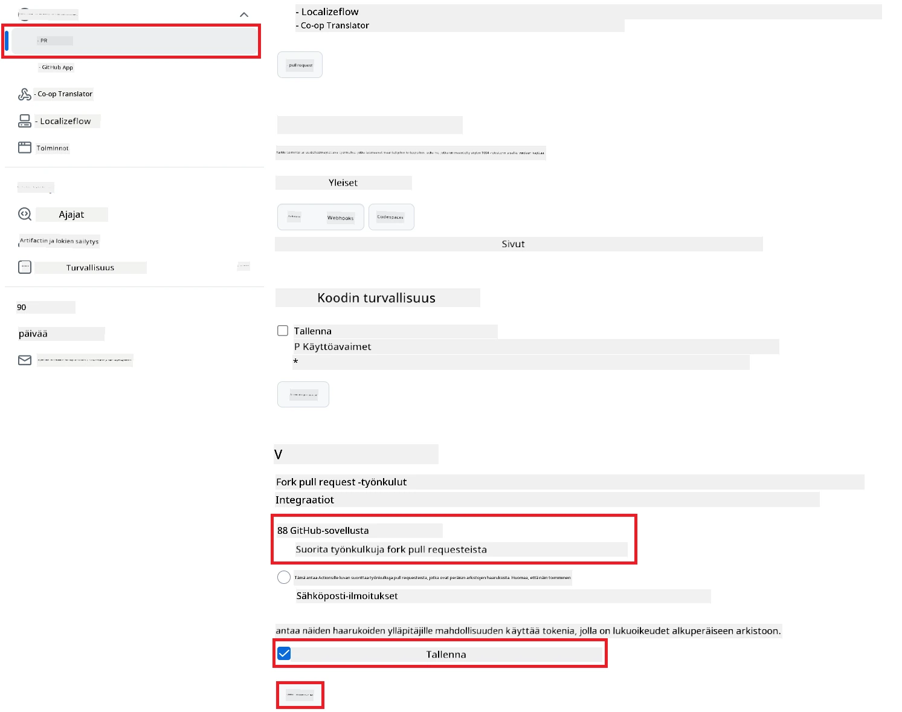

# Co-op Translator GitHub Actionin käyttö (Julkinen käyttöönotto)

**Kohderyhmä:** Tämä ohje on tarkoitettu käyttäjille useimmissa julkisissa tai yksityisissä repositorioissa, joissa GitHub Actionsin oletusoikeudet riittävät. Se hyödyntää sisäänrakennettua `GITHUB_TOKEN`-tunnusta.

Automatisoi repositoriosi dokumentaation kääntäminen vaivattomasti Co-op Translator GitHub Actionin avulla. Tämä ohje opastaa, kuinka otat toiminnon käyttöön niin, että aina kun lähde-Markdown-tiedostosi tai kuvasi muuttuvat, luodaan automaattisesti pull requestit päivitetyillä käännöksillä.

> [!IMPORTANT]
>
> **Oikean ohjeen valinta:**
>
> Tämä ohje käsittelee **yksinkertaisempaa käyttöönottoa käyttäen tavallista `GITHUB_TOKEN`-tunnusta**. Tätä tapaa suositellaan useimmille käyttäjille, koska se ei vaadi arkaluontoisten GitHub App -yksityisavainten hallintaa.
>

## Esivaatimukset

Ennen GitHub Actionin määrittämistä varmista, että sinulla on tarvittavat AI-palvelun tunnukset valmiina.

**1. Pakollinen: AI-kielimallin tunnukset**
Tarvitset tunnukset vähintään yhteen tuettuun kielimalliin:

- **Azure OpenAI**: Tarvitsee päätepisteen, API-avaimen, mallin/jakelun nimet, API-version.
- **OpenAI**: Tarvitsee API-avaimen, (valinnainen: organisaatio-ID, Base URL, mallin ID).
- Katso [Tuetut mallit ja palvelut](../../../../README.md) lisätietoja varten.

**2. Valinnainen: AI Vision -tunnukset (kuvien kääntämiseen)**

- Tarvitaan vain, jos haluat kääntää kuviin upotettua tekstiä.
- **Azure AI Vision**: Tarvitsee päätepisteen ja tilausavaimen.
- Jos näitä ei anneta, toiminto käyttää oletuksena [vain Markdown -tilaa](../markdown-only-mode.md).

## Käyttöönotto ja määritys

Seuraa näitä ohjeita määrittääksesi Co-op Translator GitHub Actionin repositoriossasi käyttäen tavallista `GITHUB_TOKEN`-tunnusta.

### Vaihe 1: Ymmärrä todennus (Käyttäen `GITHUB_TOKEN`)

Tämä työnkulku käyttää GitHub Actionsin tarjoamaa sisäänrakennettua `GITHUB_TOKEN`-tunnusta. Tämä tunnus antaa työnkululle automaattisesti oikeudet toimia repositoriossasi vaiheessa 3 määritettyjen asetusten mukaisesti.

### Vaihe 2: Määritä repositorion salaisuudet

Sinun tarvitsee lisätä vain **AI-palvelun tunnukset** salattuina salaisuuksina repositoriosi asetuksiin.

1.  Siirry haluamaasi GitHub-repositorioon.
2.  Mene kohtaan **Settings** > **Secrets and variables** > **Actions**.
3.  **Repository secrets** -kohdassa klikkaa **New repository secret** jokaiselle alla listatulle AI-palvelun salaisuudelle.

     *(Kuvaviite: Näyttää, mistä salaisuudet lisätään)*

**Tarvittavat AI-palvelun salaisuudet (Lisää KAIKKI, jotka koskevat esivaatimuksiasi):**

| Salaisuuden nimi                         | Kuvaus                               | Arvon lähde                     |
| :---------------------------------- | :---------------------------------------- | :------------------------------- |
| `AZURE_AI_SERVICE_API_KEY`            | Azure AI Service -avain (Computer Vision)  | Azure AI Foundry               |
| `AZURE_AI_SERVICE_ENDPOINT`         | Azure AI Service -päätepiste (Computer Vision) | Azure AI Foundry               |
| `AZURE_OPENAI_API_KEY`              | Azure OpenAI -palvelun avain              | Azure AI Foundry               |
| `AZURE_OPENAI_ENDPOINT`             | Azure OpenAI -palvelun päätepiste         | Azure AI Foundry               |
| `AZURE_OPENAI_MODEL_NAME`           | Azure OpenAI -mallin nimi              | Azure AI Foundry               |
| `AZURE_OPENAI_CHAT_DEPLOYMENT_NAME` | Azure OpenAI -jakelun nimi         | Azure AI Foundry               |
| `AZURE_OPENAI_API_VERSION`          | Azure OpenAI -API-versio              | Azure AI Foundry               |
| `OPENAI_API_KEY`                    | OpenAI:n API-avain                        | OpenAI Platform              |
| `OPENAI_ORG_ID`                     | OpenAI-organisaatio-ID (valinnainen)         | OpenAI Platform              |
| `OPENAI_CHAT_MODEL_ID`              | Tietty OpenAI-mallin ID (valinnainen)       | OpenAI Platform              |
| `OPENAI_BASE_URL`                   | Mukautettu OpenAI API Base URL (valinnainen)     | OpenAI Platform              |

### Vaihe 3: Määritä työnkulun oikeudet

GitHub Action tarvitsee `GITHUB_TOKEN`-tunnuksen kautta oikeudet koodin noutamiseen ja pull requestien luomiseen.

1.  Repositoriossasi mene kohtaan **Settings** > **Actions** > **General**.
2.  Selaa alas kohtaan **Workflow permissions**.
3.  Valitse **Read and write permissions**. Tämä antaa `GITHUB_TOKEN`-tunnukselle tarvittavat `contents: write` ja `pull-requests: write` -oikeudet tätä työnkulkua varten.
4.  Varmista, että **Allow GitHub Actions to create and approve pull requests** -valintaruutu on **valittuna**.
5.  Valitse **Save**.



### Vaihe 4: Luo työnkulun tiedosto

Lopuksi luo YAML-tiedosto, joka määrittelee automatisoidun työnkulun käyttäen `GITHUB_TOKEN`-tunnusta.

1.  Repositoriosi juureen luo kansio `.github/workflows/`, jos sitä ei vielä ole.
2.  Kansion `.github/workflows/` sisälle luo tiedosto nimeltä `co-op-translator.yml`.
3.  Liitä seuraava sisältö tiedostoon `co-op-translator.yml`.

```yaml
name: Co-op Translator

on:
  push:
    branches:
      - main

jobs:
  co-op-translator:
    runs-on: ubuntu-latest

    permissions:
      contents: write
      pull-requests: write

    steps:
      - name: Checkout repository
        uses: actions/checkout@v4
        with:
          fetch-depth: 0

      - name: Set up Python
        uses: actions/setup-python@v4
        with:
          python-version: '3.10'

      - name: Install Co-op Translator
        run: |
          python -m pip install --upgrade pip
          pip install co-op-translator

      - name: Run Co-op Translator
        env:
          PYTHONIOENCODING: utf-8
          # === AI Service Credentials ===
          AZURE_AI_SERVICE_API_KEY: ${{ secrets.AZURE_AI_SERVICE_API_KEY }}
          AZURE_AI_SERVICE_ENDPOINT: ${{ secrets.AZURE_AI_SERVICE_ENDPOINT }}
          AZURE_OPENAI_API_KEY: ${{ secrets.AZURE_OPENAI_API_KEY }}
          AZURE_OPENAI_ENDPOINT: ${{ secrets.AZURE_OPENAI_ENDPOINT }}
          AZURE_OPENAI_MODEL_NAME: ${{ secrets.AZURE_OPENAI_MODEL_NAME }}
          AZURE_OPENAI_CHAT_DEPLOYMENT_NAME: ${{ secrets.AZURE_OPENAI_CHAT_DEPLOYMENT_NAME }}
          AZURE_OPENAI_API_VERSION: ${{ secrets.AZURE_OPENAI_API_VERSION }}
          OPENAI_API_KEY: ${{ secrets.OPENAI_API_KEY }}
          OPENAI_ORG_ID: ${{ secrets.OPENAI_ORG_ID }}
          OPENAI_CHAT_MODEL_ID: ${{ secrets.OPENAI_CHAT_MODEL_ID }}
          OPENAI_BASE_URL: ${{ secrets.OPENAI_BASE_URL }}
        run: |
          # =====================================================================
          # IMPORTANT: Set your target languages here (REQUIRED CONFIGURATION)
          # =====================================================================
          # Example: Translate to Spanish, French, German. Add -y to auto-confirm.
          translate -l "es fr de" -y  # <--- MODIFY THIS LINE with your desired languages

      - name: Create Pull Request with translations
        uses: peter-evans/create-pull-request@v5
        with:
          token: ${{ secrets.GITHUB_TOKEN }}
          commit-message: "🌐 Update translations via Co-op Translator"
          title: "🌐 Update translations via Co-op Translator"
          body: |
            This PR updates translations for recent changes to the main branch.

            ### 📋 Changes included
            - Translated contents are available in the `translations/` directory
            - Translated images are available in the `translated_images/` directory

            ---
            🌐 Automatically generated by the [Co-op Translator](https://github.com/Azure/co-op-translator) GitHub Action.
          branch: update-translations
          base: main
          labels: translation, automated-pr
          delete-branch: true
          add-paths: |
            translations/
            translated_images/
```
4.  **Muokkaa työnkulkua:**
  - **[!IMPORTANT] Kohdekielet:** `Run Co-op Translator` -vaiheessa sinun **TÄYTYY tarkistaa ja muokata kielikoodien listaa** `translate -l "..." -y` -komennossa vastaamaan projektisi tarpeita. Esimerkkilista (`ar de es...`) tulee korvata tai säätää.
  - **Laukaisin (`on:`):** Nykyinen laukaiseva ehto suorittaa työnkulun jokaisella `main`-haaran pushilla. Suurissa repositorioissa harkitse `paths:`-suodattimen lisäämistä (katso kommentoitu esimerkki YAML-tiedostossa), jotta työnkulku ajetaan vain, kun olennaiset tiedostot (esim. lähdedokumentaatio) muuttuvat – näin säästät ajokertoja.
  - **PR-tiedot:** Muokkaa tarvittaessa `commit-message`, `title`, `body`, `branch`-nimeä ja `labels`-tunnisteita `Create Pull Request` -vaiheessa.

## Työnkulun suorittaminen

> [!WARNING]  
> **GitHub-hostatun runnerin aikaraja:**  
> GitHubin tarjoamilla runner-palvelimilla, kuten `ubuntu-latest`, on **enimmäissuoritusaika 6 tuntia**.  
> Jos dokumentaatiorepositoriosi on suuri ja käännösprosessi kestää yli 6 tuntia, työnkulku keskeytetään automaattisesti.  
> Tämän välttämiseksi harkitse:  
> - **Oman runnerin** käyttöä (ei aikarajaa)  
> - Kohdekielten määrän vähentämistä per ajo

Kun `co-op-translator.yml`-tiedosto on yhdistetty päähaaraan (tai siihen haaraan, jonka olet määrittänyt `on:`-laukaisimessa), työnkulku käynnistyy automaattisesti aina, kun muutoksia pusketaan kyseiseen haaraan (ja täyttävät mahdollisen `paths`-suodattimen ehdot).

---

**Vastuuvapauslauseke**:
Tämä asiakirja on käännetty käyttämällä tekoälypohjaista käännöspalvelua [Co-op Translator](https://github.com/Azure/co-op-translator). Vaikka pyrimme tarkkuuteen, huomioithan, että automaattiset käännökset voivat sisältää virheitä tai epätarkkuuksia. Alkuperäistä asiakirjaa sen alkuperäisellä kielellä tulee pitää ensisijaisena lähteenä. Kriittisissä tapauksissa suositellaan ammattimaista ihmiskääntäjää. Emme ole vastuussa tämän käännöksen käytöstä mahdollisesti aiheutuvista väärinkäsityksistä tai tulkintavirheistä.