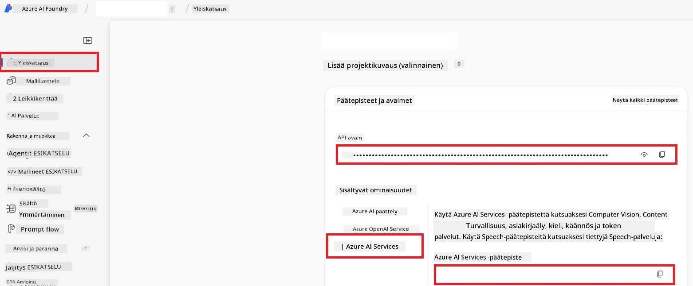

# Aseta Azure AI Co-op Translatorille (Azure OpenAI & Azure AI Vision)

Tämä opas opastaa sinut Azure OpenAI:n käyttöönottoon kielenkääntämistä varten ja Azure Computer Visionin käyttöönottoon kuvasisällön analysointia varten (jota voidaan sitten käyttää kuvapohjaiseen kääntämiseen) Azure AI Foundryssa.

**Esivaatimukset:**
- Azure-tili aktiivisella tilauksella.
- Riittävät oikeudet resurssien ja käyttöönottojen luomiseen Azure-tililläsi.

## Luo Azure AI -projekti

Aloitat luomalla Azure AI -projektin, joka toimii keskuspaikkana AI-resurssiesi hallintaan.

1. Siirry osoitteeseen [https://ai.azure.com](https://ai.azure.com) ja kirjaudu sisään Azure-tililläsi.

1. Valitse **+Create** luodaksesi uuden projektin.

1. Suorita seuraavat tehtävät:
   - Syötä **Projektin nimi** (esim. `CoopTranslator-Project`).
   - Valitse **AI-hubi** (esim. `CoopTranslator-Hub`) (Luo uusi tarvittaessa).

1. Napsauta "**Review and Create**" asettaaksesi projektisi. Sinut ohjataan projektisi yleiskatsaus-sivulle.

## Aseta Azure OpenAI kielenkääntämiseen

Projektisi sisällä otat käyttöön Azure OpenAI -mallin, joka toimii tekstikäännösten taustapalvelimena.

### Siirry projektiisi

Jos et ole siellä jo, avaa juuri luomasi projekti (esim. `CoopTranslator-Project`) Azure AI Foundryssa.

### Ota käyttöön OpenAI-malli

1. Projektisi vasemman reunan valikosta, "My assets" -kohdan alta, valitse "**Models + endpoints**".

1. Valitse **+ Deploy model**.

1. Valitse **Deploy Base Model**.

1. Näet listan saatavilla olevista malleista. Suodata tai hae sopiva GPT-malli. Suosittelemme `gpt-4o`:ta.

1. Valitse haluamasi malli ja napsauta **Confirm**.

1. Valitse **Deploy**.

### Azure OpenAI -konfiguraatio

Kun käyttöönotto on tehty, voit valita käyttöönoton "**Models + endpoints**" -sivulta nähdäksesi sen **REST-päätepisteen URL-osoitteen**, **Avaimen**, **Käyttöönoton nimen**, **Mallin nimen** ja **API-version**. Näitä tarvitaan käännösmallin integroimiseksi sovellukseesi.

> [!NOTE]
> Voit valita API-versioita [API version deprecation](https://learn.microsoft.com/azure/ai-services/openai/api-version-deprecation) -sivulta vaatimustesi mukaan. Huomioi, että **API-versio** eroaa Azure AI Foundryn "**Models + endpoints**" sivulla näkyvästä **Malliversiosta**.

## Aseta Azure Computer Vision kuvakäännöstä varten

Kuvissa olevan tekstin kääntämisen mahdollistamiseksi tarvitset Azure AI Service API -avaimen ja päätepisteen.

1. Siirry Azure AI -projektiisi (esim. `CoopTranslator-Project`). Varmista, että olet projektin yleiskatsaus-sivulla.

### Azure AI Service -konfiguraatio

Löydä API-avain ja päätepiste Azure AI Service -välilehdeltä.

1. Siirry Azure AI -projektiisi (esim. `CoopTranslator-Project`). Varmista, että olet projektin yleiskatsaus-sivulla.

1. Löydä **API-avain** ja **Päätepiste** Azure AI Service -välilehdeltä.

    

Tämä yhteys tekee linkitetyn Azure AI Services -resurssin ominaisuudet (mukaan lukien kuvan analysointi) käytettäviksi AI Foundry -projektissasi. Voit sitten käyttää tätä yhteyttä muistikirjoissasi tai sovelluksissasi kuvan tekstin poimimiseen, jonka voi myöhemmin lähettää Azure OpenAI -mallille käännettäväksi.

## Vahvista tunnistetietosi

Nyt sinulla tulisi olla seuraavat tunnistetiedot:

**Azure OpenAI (tekstikäännös):**
- Azure OpenAI -päätepiste
- Azure OpenAI API-avain
- Azure OpenAI -mallin nimi (esim. `gpt-4o`)
- Azure OpenAI käyttöönoton nimi (esim. `cooptranslator-gpt4o`)
- Azure OpenAI API-versio

**Azure AI Services (kuvatekstin poiminta Vision avulla):**
- Azure AI Service -päätepiste
- Azure AI Service API-avain

### Esimerkki: Ympäristömuuttujien konfigurointi (Preview)

Myöhemmin sovellusta rakentaessasi määrität todennäköisesti nämä kerätyt tunnistetiedot ympäristömuuttujina esimerkiksi näin:

```bash
# Azure AI -palvelun tunnistetiedot (vaaditaan kuvan kääntämiseen)
AZURE_AI_SERVICE_API_KEY="your_azure_ai_service_api_key" # esim. 21xasd...
AZURE_AI_SERVICE_ENDPOINT="https://your_azure_ai_service_endpoint.cognitiveservices.azure.com/"

# Valinnaiset varajoukot: kopioi muuttujat liitteellä _1/_2 (sama indeksi kaikille joukon muuttujille)
AZURE_AI_SERVICE_API_KEY_1="your_azure_ai_service_api_key_1"
AZURE_AI_SERVICE_ENDPOINT_1="https://your_azure_ai_service_endpoint_1.cognitiveservices.azure.com/"

# Azure OpenAI -tunnistetiedot (vaaditaan tekstin kääntämiseen)
AZURE_OPENAI_API_KEY="your_azure_openai_api_key" # esim. 21xasd...
AZURE_OPENAI_ENDPOINT="https://your_azure_openai_endpoint.openai.azure.com/"
AZURE_OPENAI_MODEL_NAME="your_model_name" # esim. gpt-4o
AZURE_OPENAI_CHAT_DEPLOYMENT_NAME="your_deployment_name" # esim. cooptranslator-gpt4o
AZURE_OPENAI_API_VERSION="your_api_version" # esim. 2024-12-01-preview

# Valinnaiset varajoukot: kopioi koko AZURE_OPENAI_* -sarja liitteellä _1/_2 (sama indeksi kaikille muuttujille)
```

---

### Lisälukemista

- [Kuinka luoda projekti Azure AI Foundryssa](https://learn.microsoft.com/azure/ai-foundry/how-to/create-projects?tabs=ai-studio)
- [Kuinka luoda Azure AI -resursseja](https://learn.microsoft.com/azure/ai-foundry/how-to/create-azure-ai-resource?tabs=portal)
- [Kuinka ottaa käyttöön OpenAI-malleja Azure AI Foundryssa](https://learn.microsoft.com/en-us/azure/ai-foundry/how-to/deploy-models-openai)

---

<!-- CO-OP TRANSLATOR DISCLAIMER START -->
**Vastuuvapauslauseke**:  
Tämä asiakirja on käännetty käyttämällä tekoälypohjaista käännöspalvelua [Co-op Translator](https://github.com/Azure/co-op-translator). Pyrimme tarkkuuteen, mutta huomioithan, että automaattisissa käännöksissä saattaa esiintyä virheitä tai epätarkkuuksia. Alkuperäinen asiakirja sen alkuperäiskielellä katsotaan viralliseksi lähteeksi. Tärkeissä asioissa suositellaan ammattimaista ihmiskääntäjää. Emme ole vastuussa tämän käännöksen käytöstä johtuvista väärinymmärryksistä tai tulkinnoista.
<!-- CO-OP TRANSLATOR DISCLAIMER END -->