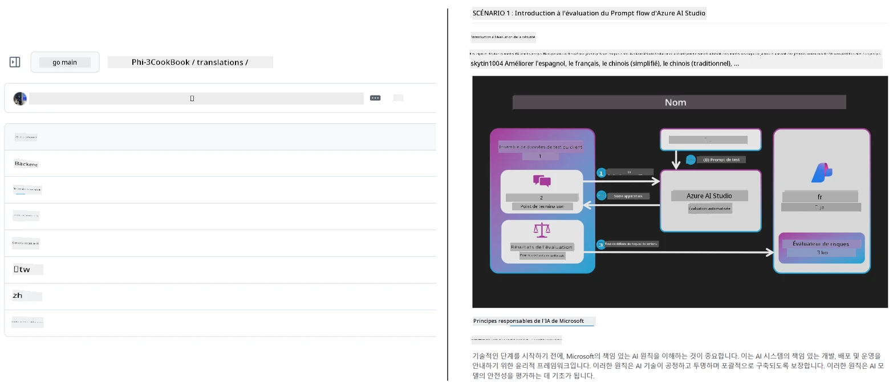
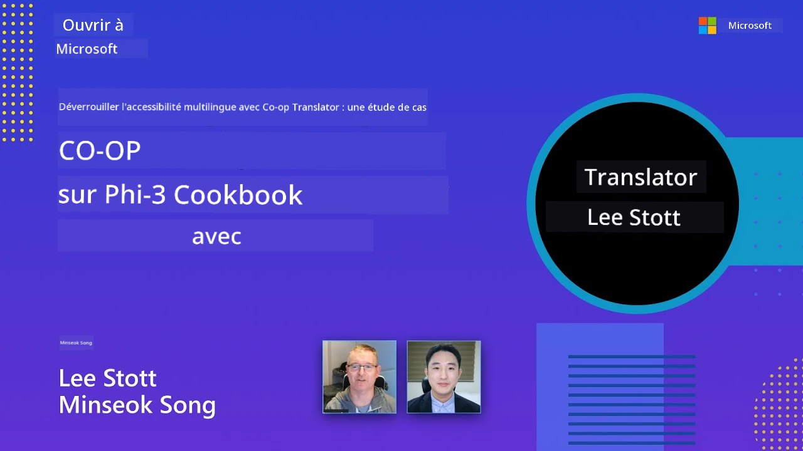

# Co-op Translator

_Automatisez facilement et maintenez les traductions de vos contenus éducatifs GitHub dans plusieurs langues au fur et à mesure de l'évolution de votre projet._


[](https://pypi.org/project/co-op-translator/)
[](https://github.com/azure/co-op-translator/blob/main/LICENSE)
[](https://pepy.tech/project/co-op-translator)
[](https://pepy.tech/project/co-op-translator)
[](https://github.com/azure/co-op-translator/pkgs/container/co-op-translator)
[](https://github.com/psf/black)

[](https://GitHub.com/azure/co-op-translator/graphs/contributors/)
[](https://GitHub.com/azure/co-op-translator/issues/)
[](https://GitHub.com/azure/co-op-translator/pulls/)
[](http://makeapullrequest.com)

### 🌐 Support Multilingue

#### Pris en charge par [Co-op Translator](https://github.com/Azure/Co-op-Translator)

<!-- CO-OP TRANSLATOR LANGUAGES TABLE START -->
[Arabic](../ar/README.md) | [Bengali](../bn/README.md) | [Bulgarian](../bg/README.md) | [Burmese (Myanmar)](../my/README.md) | [Chinese (Simplified)](../zh-CN/README.md) | [Chinese (Traditional, Hong Kong)](../zh-HK/README.md) | [Chinese (Traditional, Macau)](../zh-MO/README.md) | [Chinese (Traditional, Taiwan)](../zh-TW/README.md) | [Croatian](../hr/README.md) | [Czech](../cs/README.md) | [Danish](../da/README.md) | [Dutch](../nl/README.md) | [Estonian](../et/README.md) | [Finnish](../fi/README.md) | [French](./README.md) | [German](../de/README.md) | [Greek](../el/README.md) | [Hebrew](../he/README.md) | [Hindi](../hi/README.md) | [Hungarian](../hu/README.md) | [Indonesian](../id/README.md) | [Italian](../it/README.md) | [Japanese](../ja/README.md) | [Kannada](../kn/README.md) | [Khmer](../km/README.md) | [Korean](../ko/README.md) | [Lithuanian](../lt/README.md) | [Malay](../ms/README.md) | [Malayalam](../ml/README.md) | [Marathi](../mr/README.md) | [Nepali](../ne/README.md) | [Nigerian Pidgin](../pcm/README.md) | [Norwegian](../no/README.md) | [Persian (Farsi)](../fa/README.md) | [Polish](../pl/README.md) | [Portuguese (Brazil)](../pt-BR/README.md) | [Portuguese (Portugal)](../pt-PT/README.md) | [Punjabi (Gurmukhi)](../pa/README.md) | [Romanian](../ro/README.md) | [Russian](../ru/README.md) | [Serbian (Cyrillic)](../sr/README.md) | [Slovak](../sk/README.md) | [Slovenian](../sl/README.md) | [Spanish](../es/README.md) | [Swahili](../sw/README.md) | [Swedish](../sv/README.md) | [Tagalog (Filipino)](../tl/README.md) | [Tamil](../ta/README.md) | [Telugu](../te/README.md) | [Thai](../th/README.md) | [Turkish](../tr/README.md) | [Ukrainian](../uk/README.md) | [Urdu](../ur/README.md) | [Vietnamese](../vi/README.md)

> **Vous préférez cloner localement ?**
>
> Ce dépôt comprend plus de 50 traductions linguistiques ce qui augmente significativement la taille du téléchargement. Pour cloner sans les traductions, utilisez le sparse checkout :
>
> **Bash / macOS / Linux :**
> ```bash
> git clone --filter=blob:none --sparse https://github.com/skytin1004/co-op-translator.git
> cd co-op-translator
> git sparse-checkout set --no-cone '/*' '!translations' '!translated_images'
> ```
>
> **CMD (Windows) :**
> ```cmd
> git clone --filter=blob:none --sparse https://github.com/skytin1004/co-op-translator.git
> cd co-op-translator
> git sparse-checkout set --no-cone "/*" "!translations" "!translated_images"
> ```
>
> Cela vous donne tout le nécessaire pour suivre le cours avec un téléchargement beaucoup plus rapide.
<!-- CO-OP TRANSLATOR LANGUAGES TABLE END -->

[](https://GitHub.com/azure/co-op-translator/watchers/)
[](https://GitHub.com/azure/co-op-translator/network/)
[](https://GitHub.com/azure/co-op-translator/stargazers/)

[](https://discord.gg/nTYy5BXMWG)

[](https://codespaces.new/azure/co-op-translator)

## Vue d'ensemble

**Co-op Translator** vous aide à localiser vos contenus éducatifs GitHub en plusieurs langues sans effort.
Lorsque vous mettez à jour vos fichiers Markdown, images ou notebooks, les traductions restent automatiquement synchronisées, garantissant que votre contenu reste précis et à jour pour les apprenants du monde entier.

Exemple de l’organisation du contenu traduit :



## Comment l’état de la traduction est géré

Co-op Translator gère le contenu traduit en tant qu’**artefacts logiciels versionnés**,  
et non comme des fichiers statiques.

L’outil suit l’état des fichiers Markdown traduits, des images, et des notebooks
en utilisant des **métadonnées spécifiques aux langues**.

Cette conception permet à Co-op Translator de :

- Détecter de manière fiable les traductions obsolètes
- Traiter de façon cohérente Markdown, images et notebooks
- Evoluer en sécurité dans de grands dépôts multilingues à évolution rapide

En modélisant les traductions comme des artefacts gérés,
les flux de travail de traduction s’alignent naturellement avec les
pratiques modernes de gestion des dépendances et des artefacts logiciels.

→ [Comment l’état de la traduction est géré](https://techcommunity.microsoft.com/blog/azuredevcommunityblog/rethinking-documentation-translation-treating-translations-as-versioned-software/4491755)


## Démarrage rapide

```bash
# Créez et activez un environnement virtuel (recommandé)
python -m venv .venv
# Windows
.venv\Scripts\activate
# macOS/Linux
source .venv/bin/activate
# Installez le paquet
pip install co-op-translator
# Traduire
translate -l "ko ja fr" -md
```

Docker :

```bash
# Télécharger l'image publique depuis GHCR
docker pull ghcr.io/azure/co-op-translator:latest
# Exécuter avec le dossier actuel monté et le fichier .env fourni (Bash/Zsh)
docker run --rm -it --env-file .env -v "${PWD}:/work" ghcr.io/azure/co-op-translator:latest -l "ko ja fr" -md
```

## Configuration minimale

1. Vérifiez que vous disposez d’une version Python prise en charge (actuellement 3.10-3.12). Dans poetry (pyproject.toml), ceci est géré automatiquement.
2. Créez un fichier `.env` en utilisant le modèle : [.env.template](../../.env.template)
3. Configurez un fournisseur LLM (Azure OpenAI ou OpenAI)
4. (Optionnel) Pour la traduction d’images (`-img`), configurez Azure AI Vision
5. (Optionnel) Vous pouvez configurer plusieurs ensembles d’identifiants en dupliquant les variables avec des suffixes comme `_1`, `_2`, etc. Toutes les variables d’un ensemble doivent partager le même suffixe.
6. (Recommandé) Nettoyez toutes les traductions précédentes pour éviter les conflits (exemple : `translations/`)
7. (Recommandé) Ajoutez une section de traduction à votre README en utilisant le [modèle README languages](./getting_started/README_languages_template.md)
8. Voir : [Configurer Azure AI](./getting_started/set-up-azure-ai.md)

## Utilisation

Traduire tous les types supportés :

```bash
translate -l "ko ja"
```

Markdown uniquement :

```bash
translate -l "de" -md
```

Markdown + images :

```bash
translate -l "pt" -md -img
```

Notebooks uniquement :

```bash
translate -l "zh" -nb
```

Plus d’options : [Référence des commandes](./getting_started/command-reference.md)

## Fonctionnalités

- Traduction automatisée de Markdown, notebooks et images
- Maintient les traductions synchronisées avec les changements source
- Fonctionne localement (CLI) ou en CI (GitHub Actions)
- Utilise Azure OpenAI ou OpenAI ; Azure AI Vision optionnel pour les images
- Préserve le formatage et la structure Markdown

## Documentation

- [Guide en ligne de commande](./getting_started/command-line-guide/command-line-guide.md)
- [Guide GitHub Actions (Dépôts publics et secrets standards)](./getting_started/github-actions-guide/github-actions-guide-public.md)
- [Guide GitHub Actions (Dépôts organisationnels Microsoft & configurations niveau org)](./getting_started/github-actions-guide/github-actions-guide-org.md)
- [Modèle README languages](./getting_started/README_languages_template.md)
- [Langues supportées](./getting_started/supported-languages.md)
- [Contribuer](./CONTRIBUTING.md)
- [Dépannage](./getting_started/troubleshooting.md)

### Guide spécifique Microsoft
> [!NOTE]
> Pour les mainteneurs des dépôts Microsoft “For Beginners” uniquement.

- [Mise à jour de la liste des “autres cours” (uniquement pour les dépôts MS Beginners)](./getting_started/update-other-courses.md)

## Soutenez-nous et favorisez l’apprentissage global

Rejoignez-nous pour révolutionner la façon dont le contenu éducatif est partagé dans le monde ! Donnez une étoile ⭐ à [Co-op Translator](https://github.com/azure/co-op-translator) sur GitHub et soutenez notre mission de briser les barrières linguistiques dans l’apprentissage et la technologie. Votre intérêt et vos contributions font une différence significative ! Les contributions de code et suggestions de fonctionnalités sont toujours les bienvenues.

### Explorez le contenu éducatif Microsoft dans votre langue

- [LangChain4j-for-Beginners](https://github.com/microsoft/LangChain4j-for-Beginners)
- [AZD for Beginners](https://github.com/microsoft/AZD-for-beginners)
- [Edge AI for Beginners](https://github.com/microsoft/edgeai-for-beginners)
- [Model Context Protocol (MCP) For Beginners](https://github.com/microsoft/mcp-for-beginners)
- [AI Agents for Beginners](https://github.com/microsoft/ai-agents-for-beginners)
- [Generative AI for Beginners using .NET](https://github.com/microsoft/Generative-AI-for-beginners-dotnet)
- [Generative AI for Beginners](https://github.com/microsoft/generative-ai-for-beginners)
- [Generative AI for Beginners using Java](https://github.com/microsoft/generative-ai-for-beginners-java)
- [ML for Beginners](https://aka.ms/ml-beginners)
- [Data Science for Beginners](https://aka.ms/datascience-beginners)
- [AI for Beginners](https://aka.ms/ai-beginners)
- [Cybersecurity for Beginners](https://github.com/microsoft/Security-101)
- [Web Dev for Beginners](https://aka.ms/webdev-beginners)
- [IoT for Beginners](https://aka.ms/iot-beginners)
- [PhiCookBook](https://github.com/microsoft/PhiCookBook)

## Présentations vidéo

👉 Cliquez sur l’image ci-dessous pour regarder sur YouTube.

- **Open at Microsoft** : Une brève introduction de 18 minutes et un guide rapide sur comment utiliser Co-op Translator.

  [](https://www.youtube.com/watch?v=jX_swfH_KNU)

## Contribuer

Ce projet accueille contributions et suggestions. Intéressé par contribuer à Azure Co-op Translator ? Merci de consulter notre [CONTRIBUTING.md](./CONTRIBUTING.md) pour les directives sur comment aider à rendre Co-op Translator plus accessible.

## Contributeurs
[](https://github.com/Azure/co-op-translator/graphs/contributors)

## Code de conduite

Ce projet a adopté le [Code de conduite Open Source de Microsoft](https://opensource.microsoft.com/codeofconduct/).
Pour plus d’informations, consultez la [FAQ sur le Code de conduite](https://opensource.microsoft.com/codeofconduct/faq/) ou
contactez [opencode@microsoft.com](mailto:opencode@microsoft.com) pour toute question ou commentaire supplémentaire.

## IA responsable

Microsoft s’engage à aider ses clients à utiliser nos produits d’IA de manière responsable, à partager nos enseignements et à établir des partenariats basés sur la confiance grâce à des outils tels que les Notes de transparence et les Évaluations d’impact. Beaucoup de ces ressources sont disponibles sur [https://aka.ms/RAI](https://aka.ms/RAI).
L’approche de Microsoft en matière d’IA responsable repose sur nos principes d’IA : équité, fiabilité et sécurité, confidentialité et sécurité, inclusivité, transparence et responsabilité.

Les modèles de langage naturel, d’image et de reconnaissance vocale à grande échelle – comme ceux utilisés dans cet exemple – peuvent potentiellement se comporter de manière injuste, peu fiable ou offensante, ce qui peut engendrer des préjudices. Veuillez consulter la [note de transparence du service Azure OpenAI](https://learn.microsoft.com/legal/cognitive-services/openai/transparency-note?tabs=text) pour être informé des risques et des limites.

L’approche recommandée pour atténuer ces risques est d’inclure un système de sécurité dans votre architecture capable de détecter et prévenir les comportements nuisibles. [Azure AI Content Safety](https://learn.microsoft.com/azure/ai-services/content-safety/overview) fournit une couche de protection indépendante, capable de détecter le contenu nuisible généré par les utilisateurs ou par l’IA dans les applications et services. Azure AI Content Safety inclut des API de texte et d’image qui permettent de détecter le contenu nuisible. Nous proposons également un Content Safety Studio interactif qui vous permet de visualiser, d’explorer et d’essayer des exemples de code pour détecter du contenu nuisible selon différentes modalités. La [documentation de démarrage rapide](https://learn.microsoft.com/azure/ai-services/content-safety/quickstart-text?tabs=visual-studio%2Clinux&pivots=programming-language-rest) suivante vous guide pour effectuer des requêtes vers le service.

Un autre aspect à prendre en compte est la performance globale de l’application. Avec les applications multimodales et utilisant plusieurs modèles, la performance signifie que le système fonctionne comme vous et vos utilisateurs l’attendez, y compris en ne générant pas de sorties nuisibles. Il est important d’évaluer la performance globale de votre application en utilisant les [métriques de qualité de génération, de risque et de sécurité](https://learn.microsoft.com/azure/ai-studio/concepts/evaluation-metrics-built-in).

Vous pouvez évaluer votre application d’IA dans votre environnement de développement en utilisant le [prompt flow SDK](https://microsoft.github.io/promptflow/index.html). À partir d’un ensemble de données de test ou d’une cible, les générations de votre application d’IA générative sont mesurées quantitativement avec des évaluateurs intégrés ou personnalisés selon votre choix. Pour commencer à utiliser le prompt flow sdk pour évaluer votre système, vous pouvez suivre le [guide de démarrage rapide](https://learn.microsoft.com/azure/ai-studio/how-to/develop/flow-evaluate-sdk). Une fois que vous avez exécuté une évaluation, vous pouvez [visualiser les résultats dans Azure AI Studio](https://learn.microsoft.com/azure/ai-studio/how-to/evaluate-flow-results).

## Marques commerciales

Ce projet peut contenir des marques commerciales ou logos de projets, produits ou services. L’utilisation autorisée des marques commerciales ou logos Microsoft est soumise et doit respecter
les [Directives de marque et de branding de Microsoft](https://www.microsoft.com/en-us/legal/intellectualproperty/trademarks/usage/general).
L’utilisation des marques commerciales ou logos Microsoft dans des versions modifiées de ce projet ne doit pas créer de confusion ni laisser entendre un parrainage de Microsoft.
Toute utilisation de marques ou logos tiers est soumise aux politiques de ces tiers.

## Obtenir de l’aide

Si vous êtes bloqué ou avez des questions sur la création d’applications IA, rejoignez :

[](https://discord.gg/nTYy5BXMWG)

Si vous avez des retours sur le produit ou rencontrez des erreurs lors du développement, visitez :

[](https://aka.ms/foundry/forum)

---

<!-- CO-OP TRANSLATOR DISCLAIMER START -->
**Avertissement** :  
Ce document a été traduit à l'aide du service de traduction automatique [Co-op Translator](https://github.com/Azure/co-op-translator). Bien que nous nous efforcions d'assurer l'exactitude, veuillez noter que les traductions automatisées peuvent contenir des erreurs ou des inexactitudes. Le document original dans sa langue maternelle doit être considéré comme la source faisant foi. Pour les informations critiques, une traduction professionnelle réalisée par un humain est recommandée. Nous ne sommes pas responsables des malentendus ou des mauvaises interprétations résultant de l'utilisation de cette traduction.
<!-- CO-OP TRANSLATOR DISCLAIMER END -->