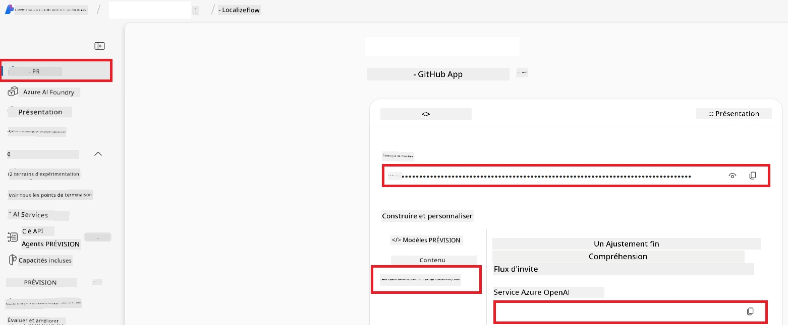

# Configurer Azure AI pour Co-op Translator (Azure OpneAI & Azure AI Vision)

Ce guide vous accompagne dans la configuration d’Azure OpenAI pour la traduction linguistique et Azure Computer Vision pour l’analyse de contenu d’images (qui peut ensuite être utilisé pour la traduction basée sur l’image) au sein d’Azure AI Foundry.

**Prérequis :**
- Un compte Azure avec un abonnement actif.
- Des permissions suffisantes pour créer des ressources et des déploiements dans votre abonnement Azure.

## Créer un projet Azure AI

Vous commencerez par créer un projet Azure AI, qui sert de lieu central pour gérer vos ressources IA.

1. Allez sur [https://ai.azure.com](https://ai.azure.com) et connectez-vous avec votre compte Azure.

1. Sélectionnez **+Create** pour créer un nouveau projet.

1. Effectuez les tâches suivantes :
   - Saisissez un **Nom du projet** (par exemple, `CoopTranslator-Project`).
   - Sélectionnez le **Hub IA** (par exemple, `CoopTranslator-Hub`) (Créez-en un nouveau si nécessaire).

1. Cliquez sur "**Review and Create**" pour configurer votre projet. Vous serez redirigé vers la page de présentation de votre projet.

## Configurer Azure OpenAI pour la traduction linguistique

Dans votre projet, vous déploierez un modèle Azure OpenAI qui servira de backend pour la traduction de texte.

### Naviguer vers votre projet

Si vous n’y êtes pas déjà, ouvrez votre projet nouvellement créé (par exemple, `CoopTranslator-Project`) dans Azure AI Foundry.

### Déployer un modèle OpenAI

1. Dans le menu de gauche de votre projet, sous "My assets", sélectionnez "**Models + endpoints**".

1. Sélectionnez **+ Deploy model**.

1. Sélectionnez **Deploy Base Model**.

1. Une liste de modèles disponibles vous sera présentée. Filtrez ou recherchez un modèle GPT approprié. Nous recommandons `gpt-4o`.

1. Sélectionnez le modèle souhaité et cliquez sur **Confirm**.

1. Sélectionnez **Deploy**.

### Configuration Azure OpenAI

Une fois déployé, vous pouvez sélectionner le déploiement depuis la page "**Models + endpoints**" pour trouver son **URL de point de terminaison REST**, **Clé**, **Nom de déploiement**, **Nom du modèle** et **Version API**. Ces informations seront nécessaires pour intégrer le modèle de traduction dans votre application.

> [!NOTE]
> Vous pouvez sélectionner les versions API depuis la page [API version deprecation](https://learn.microsoft.com/azure/ai-services/openai/api-version-deprecation) en fonction de vos besoins. Notez que la **version API** est différente de la **version du modèle** affichée sur la page **Models + endpoints** dans Azure AI Foundry.

## Configurer Azure Computer Vision pour la traduction d’images

Pour permettre la traduction de texte présent dans les images, vous devez trouver la clé d’API Azure AI Service et son point de terminaison.

1. Naviguez vers votre projet Azure AI (par exemple, `CoopTranslator-Project`). Assurez-vous d’être sur la page de présentation du projet.

### Configuration du service Azure AI

Trouvez la clé d’API et le point de terminaison dans le service Azure AI.

1. Naviguez vers votre projet Azure AI (par exemple, `CoopTranslator-Project`). Assurez-vous d’être sur la page de présentation du projet.

1. Trouvez la **Clé d’API** et le **Point de terminaison** dans l’onglet Azure AI Service.

    

Cette connexion rend les fonctionnalités de la ressource Azure AI Services liée (y compris l’analyse d’images) disponibles pour votre projet AI Foundry. Vous pouvez alors utiliser cette connexion dans vos notebooks ou applications pour extraire le texte des images, qui peut ensuite être envoyé au modèle Azure OpenAI pour traduction.

## Consolider vos identifiants

Vous devriez maintenant avoir rassemblé les éléments suivants :

**Pour Azure OpenAI (Traduction de texte) :**
- Point de terminaison Azure OpenAI
- Clé API Azure OpenAI
- Nom du modèle Azure OpenAI (par exemple, `gpt-4o`)
- Nom du déploiement Azure OpenAI (par exemple, `cooptranslator-gpt4o`)
- Version API Azure OpenAI

**Pour Azure AI Services (Extraction de texte d’image via Vision) :**
- Point de terminaison Azure AI Service
- Clé API Azure AI Service

### Exemple : Configuration des variables d’environnement (aperçu)

Plus tard, lors du développement de votre application, vous configurerez probablement celle-ci en utilisant ces identifiants collectés. Par exemple, vous pourriez les définir en variables d’environnement comme suit :

```bash
# Identifiants du service Azure AI (requis pour la traduction d'images)
AZURE_AI_SERVICE_API_KEY="your_azure_ai_service_api_key" # par ex., 21xasd...
AZURE_AI_SERVICE_ENDPOINT="https://your_azure_ai_service_endpoint.cognitiveservices.azure.com/"

# Jeux de secours optionnels : dupliquer les variables avec le suffixe _1/_2 (même indice pour toutes les variables du jeu)
AZURE_AI_SERVICE_API_KEY_1="your_azure_ai_service_api_key_1"
AZURE_AI_SERVICE_ENDPOINT_1="https://your_azure_ai_service_endpoint_1.cognitiveservices.azure.com/"

# Identifiants Azure OpenAI (requis pour la traduction de texte)
AZURE_OPENAI_API_KEY="your_azure_openai_api_key" # par ex., 21xasd...
AZURE_OPENAI_ENDPOINT="https://your_azure_openai_endpoint.openai.azure.com/"
AZURE_OPENAI_MODEL_NAME="your_model_name" # par ex., gpt-4o
AZURE_OPENAI_CHAT_DEPLOYMENT_NAME="your_deployment_name" # par ex., cooptranslator-gpt4o
AZURE_OPENAI_API_VERSION="your_api_version" # par ex., 2024-12-01-preview

# Jeux de secours optionnels : dupliquer l'ensemble complet AZURE_OPENAI_* avec le suffixe _1/_2 (même indice pour toutes les variables)
```

---

### Lectures complémentaires

- [Comment créer un projet dans Azure AI Foundry](https://learn.microsoft.com/azure/ai-foundry/how-to/create-projects?tabs=ai-studio)
- [Comment créer des ressources Azure AI](https://learn.microsoft.com/azure/ai-foundry/how-to/create-azure-ai-resource?tabs=portal)
- [Comment déployer des modèles OpenAI dans Azure AI Foundry](https://learn.microsoft.com/en-us/azure/ai-foundry/how-to/deploy-models-openai)

---

<!-- CO-OP TRANSLATOR DISCLAIMER START -->
**Avertissement** :  
Ce document a été traduit à l’aide du service de traduction automatisée [Co-op Translator](https://github.com/Azure/co-op-translator). Bien que nous nous efforçons d’assurer l’exactitude, veuillez noter que les traductions automatiques peuvent contenir des erreurs ou des inexactitudes. Le document original dans sa langue native doit être considéré comme la source faisant foi. Pour des informations critiques, une traduction professionnelle humaine est recommandée. Nous ne sommes pas responsables des malentendus ou des mauvaises interprétations résultant de l’utilisation de cette traduction.
<!-- CO-OP TRANSLATOR DISCLAIMER END -->