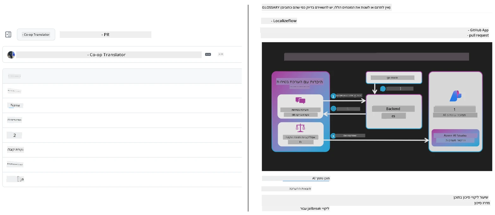
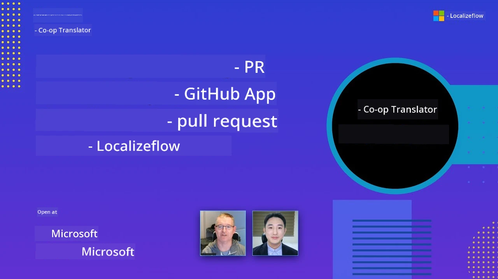

# Co-op Translator

_האוטומציה והתחזוקה הקלות של תרגומים עבור התוכן החינוכי שלך ב-GitHub במגוון שפות ככל שהפרויקט שלך מתפתח._


[](https://pypi.org/project/co-op-translator/)
[](https://github.com/azure/co-op-translator/blob/main/LICENSE)
[](https://pepy.tech/project/co-op-translator)
[](https://pepy.tech/project/co-op-translator)
[](https://github.com/azure/co-op-translator/pkgs/container/co-op-translator)
[](https://github.com/psf/black)

[](https://GitHub.com/azure/co-op-translator/graphs/contributors/)
[](https://GitHub.com/azure/co-op-translator/issues/)
[](https://GitHub.com/azure/co-op-translator/pulls/)
[](http://makeapullrequest.com)

### 🌐 תמיכה מרובת שפות

#### נתמך על ידי [Co-op Translator](https://github.com/Azure/Co-op-Translator)

<!-- CO-OP TRANSLATOR LANGUAGES TABLE START -->
[Arabic](../ar/README.md) | [Bengali](../bn/README.md) | [Bulgarian](../bg/README.md) | [Burmese (Myanmar)](../my/README.md) | [Chinese (Simplified)](../zh-CN/README.md) | [Chinese (Traditional, Hong Kong)](../zh-HK/README.md) | [Chinese (Traditional, Macau)](../zh-MO/README.md) | [Chinese (Traditional, Taiwan)](../zh-TW/README.md) | [Croatian](../hr/README.md) | [Czech](../cs/README.md) | [Danish](../da/README.md) | [Dutch](../nl/README.md) | [Estonian](../et/README.md) | [Finnish](../fi/README.md) | [French](../fr/README.md) | [German](../de/README.md) | [Greek](../el/README.md) | [Hebrew](./README.md) | [Hindi](../hi/README.md) | [Hungarian](../hu/README.md) | [Indonesian](../id/README.md) | [Italian](../it/README.md) | [Japanese](../ja/README.md) | [Kannada](../kn/README.md) | [Khmer](../km/README.md) | [Korean](../ko/README.md) | [Lithuanian](../lt/README.md) | [Malay](../ms/README.md) | [Malayalam](../ml/README.md) | [Marathi](../mr/README.md) | [Nepali](../ne/README.md) | [Nigerian Pidgin](../pcm/README.md) | [Norwegian](../no/README.md) | [Persian (Farsi)](../fa/README.md) | [Polish](../pl/README.md) | [Portuguese (Brazil)](../pt-BR/README.md) | [Portuguese (Portugal)](../pt-PT/README.md) | [Punjabi (Gurmukhi)](../pa/README.md) | [Romanian](../ro/README.md) | [Russian](../ru/README.md) | [Serbian (Cyrillic)](../sr/README.md) | [Slovak](../sk/README.md) | [Slovenian](../sl/README.md) | [Spanish](../es/README.md) | [Swahili](../sw/README.md) | [Swedish](../sv/README.md) | [Tagalog (Filipino)](../tl/README.md) | [Tamil](../ta/README.md) | [Telugu](../te/README.md) | [Thai](../th/README.md) | [Turkish](../tr/README.md) | [Ukrainian](../uk/README.md) | [Urdu](../ur/README.md) | [Vietnamese](../vi/README.md)

> **מעדיפים לשכפל מקומית?**
>
> מאגר זה כולל למעלה מ-50 תרגומים בשפות שונות, מה שמגדיל משמעותית את גודל ההורדה. לשכפל ללא התרגומים, השתמשו ב-sparse checkout:
>
> **Bash / macOS / Linux:**
> ```bash
> git clone --filter=blob:none --sparse https://github.com/skytin1004/co-op-translator.git
> cd co-op-translator
> git sparse-checkout set --no-cone '/*' '!translations' '!translated_images'
> ```
>
> **CMD (Windows):**
> ```cmd
> git clone --filter=blob:none --sparse https://github.com/skytin1004/co-op-translator.git
> cd co-op-translator
> git sparse-checkout set --no-cone "/*" "!translations" "!translated_images"
> ```
>
> כך תקבלו את כל מה שצריך כדי להשלים את הקורס עם הורדה הרבה יותר מהירה.
<!-- CO-OP TRANSLATOR LANGUAGES TABLE END -->

[](https://GitHub.com/azure/co-op-translator/watchers/)
[](https://GitHub.com/azure/co-op-translator/network/)
[](https://GitHub.com/azure/co-op-translator/stargazers/)

[](https://discord.gg/nTYy5BXMWG)

[](https://codespaces.new/azure/co-op-translator)

## סקירה כללית

**Co-op Translator** עוזר לך ללוקלז את התוכן החינוכי שלך ב-GitHub למספר שפות בקלות.
כאשר אתה מעדכן את קבצי ה-Markdown, התמונות או המחברות, התרגומים נשמרים מסונכרנים אוטומטית, ומבטיחים שהתוכן שלך מדויק ומעודכן עבור לומדים ברחבי העולם.

דוגמה לאופן שבו תוכן מתורגם מאורגן:



## כיצד מנוהל מצב התרגום

Co-op Translator מנהל תוכן מתורגם כ**רכיבי תוכנה בעלות גרסאות**,  
ולא כקבצים סטטיים.

הכלי עוקב אחר מצב ה-Markdown, תמונות והמחברות המתורגמות
באמצעות **מטא-נתונים בטווח שפה**.

עיצוב זה מאפשר ל-Co-op Translator ל:

- לזהות בביטחון תרגומים מיושנים
- לטפל בקבצי Markdown, בתמונות ובמחברות בעקביות
- להרחיב בבטחה במאגרים מרובי שפות שנעים במהירות

על ידי דגם של תרגומים כרכיבים מנוהלים,
זרימות עבודה של תרגום מתיישרות באופן טבעי עם
שיטות ניהול תלות ורכיבים מודרניים בתוכנה.

→ [כיצד מנוהל מצב התרגום](https://techcommunity.microsoft.com/blog/azuredevcommunityblog/rethinking-documentation-translation-treating-translations-as-versioned-software/4491755)


## התחלה מהירה

```bash
# צור והפעל סביבה וירטואלית (מומלץ)
python -m venv .venv
# חלונות
.venv\Scripts\activate
# מק או לינוקס
source .venv/bin/activate
# התקן את החבילה
pip install co-op-translator
# תרגם
translate -l "ko ja fr" -md
```

Docker:

```bash
# משוך את התמונה הציבורית מ-GHCR
docker pull ghcr.io/azure/co-op-translator:latest
# הרץ עם התיקיה הנוכחית מותקנת וקובץ .env שסופק (Bash/Zsh)
docker run --rm -it --env-file .env -v "${PWD}:/work" ghcr.io/azure/co-op-translator:latest -l "ko ja fr" -md
```

## הגדרה מינימלית

1. וודא שיש לך גרסת Python נתמכת (כעת 3.10-3.12). ב-poetry (pyproject.toml) זה מטופל אוטומטית.
2. צור קובץ `.env` באמצעות התבנית: [.env.template](../../.env.template)
3. הגדר ספק LLM אחד (Azure OpenAI או OpenAI)
4. (אופציונלי) לתרגום תמונות (`-img`), הגדר Azure AI Vision
5. (אופציונלי) ניתן להגדיר מערכי אישורים מרובים על ידי שכפול משתנים עם סיומות כגון `_1`, `_2` וכו'. כל המשתנים במערך חייבים לשתף את אותה סיומת.
6. (מומלץ) נקה תרגומים קודמים כדי למנוע קונפליקטים (לדוגמה, `translations/`)
7. (מומלץ) הוסף חלק תרגום ל-README שלך באמצעות תבנית [README languages template](./getting_started/README_languages_template.md)
8. ראה: [הגדרת Azure AI](./getting_started/set-up-azure-ai.md)

## שימוש

תרגם את כל הסוגים הנתמכים:

```bash
translate -l "ko ja"
```

רק Markdown:

```bash
translate -l "de" -md
```

Markdown + תמונות:

```bash
translate -l "pt" -md -img
```

רק מחברות:

```bash
translate -l "zh" -nb
```

דגלים נוספים: [Command reference](./getting_started/command-reference.md)

## תכונות

- תרגום אוטומטי ל-Markdown, מחברות ותמונות
- שומר על סנכרון תרגומים עם שינויים במקור
- פועל מקומית (CLI) או ב-CI (GitHub Actions)
- משתמש ב-Azure OpenAI או OpenAI; אופציונלי Azure AI Vision לתמונות
- שומר על פורמט ומבנה Markdown

## תיעוד

- [מדריך שורת פקודה](./getting_started/command-line-guide/command-line-guide.md)
- [מדריך GitHub Actions (מאגרי ציבור וסודות סטנדרטיים)](./getting_started/github-actions-guide/github-actions-guide-public.md)
- [מדריך GitHub Actions (מאגרי ארגון Microsoft והגדרות ברמת הארגון)](./getting_started/github-actions-guide/github-actions-guide-org.md)
- [תבנית שפות README](./getting_started/README_languages_template.md)
- [שפות נתמכות](./getting_started/supported-languages.md)
- [תרומה](./CONTRIBUTING.md)
- [פתרון תקלות](./getting_started/troubleshooting.md)

### מדריך ייחודי ל-Microsoft
> [!NOTE]
> רק למנהלי מאגרי "עבור מתחילים" של Microsoft.

- [עדכון רשימת "קורסים אחרים" (רק למאגרי MS Beginners)](./getting_started/update-other-courses.md)

## תמכו בנו וקידמו למידה עולמית

הצטרפו אלינו במהפכה של שיתוף תוכן חינוכי ברחבי העולם! תנו ל-[Co-op Translator](https://github.com/azure/co-op-translator) כוכב ⭐ ב-GitHub ותמכו במשימה שלנו לפרוץ מחסומי שפה בלמידה וטכנולוגיה. ההתעניינות והתרומות שלכם יוצרות השפעה משמעותית! תרומות קוד והצעות לתכונות מתקבלות בברכה תמיד.

### גלו תוכן חינוכי של Microsoft בשפתכם

- [LangChain4j-for-Beginners](https://github.com/microsoft/LangChain4j-for-Beginners)
- [AZD for Beginners](https://github.com/microsoft/AZD-for-beginners)
- [Edge AI for Beginners](https://github.com/microsoft/edgeai-for-beginners)
- [Model Context Protocol (MCP) For Beginners](https://github.com/microsoft/mcp-for-beginners)
- [AI Agents for Beginners](https://github.com/microsoft/ai-agents-for-beginners)
- [Generative AI for Beginners using .NET](https://github.com/microsoft/Generative-AI-for-beginners-dotnet)
- [Generative AI for Beginners](https://github.com/microsoft/generative-ai-for-beginners)
- [Generative AI for Beginners using Java](https://github.com/microsoft/generative-ai-for-beginners-java)
- [ML for Beginners](https://aka.ms/ml-beginners)
- [Data Science for Beginners](https://aka.ms/datascience-beginners)
- [AI for Beginners](https://aka.ms/ai-beginners)
- [Cybersecurity for Beginners](https://github.com/microsoft/Security-101)
- [Web Dev for Beginners](https://aka.ms/webdev-beginners)
- [IoT for Beginners](https://aka.ms/iot-beginners)
- [PhiCookBook](https://github.com/microsoft/PhiCookBook)

## מצגות וידאו

👉 לחץ על התמונה למטה לצפייה ב-YouTube.

- **Open at Microsoft**: מבוא קצר של 18 דקות ומדריך מהיר לשימוש ב-Co-op Translator.

  [](https://www.youtube.com/watch?v=jX_swfH_KNU)

## תרומה

הפרויקט מקבל בברכה תרומות והצעות. מעוניין לתרום ל-Azure Co-op Translator? אנא עיין ב-[CONTRIBUTING.md](./CONTRIBUTING.md) להנחיות כיצד תוכל לעזור להפוך את Co-op Translator לנגיש יותר.

## תורמים
[](https://github.com/Azure/co-op-translator/graphs/contributors)

## קוד התנהגות

הפרויקט הזה אימץ את [קוד ההתנהגות בקוד פתוח של מיקרוסופט](https://opensource.microsoft.com/codeofconduct/).
למידע נוסף ראו את [שאלות נפוצות על קוד ההתנהגות](https://opensource.microsoft.com/codeofconduct/faq/) או צרו קשר ב-[opencode@microsoft.com](mailto:opencode@microsoft.com) בכל שאלה או הערה נוספת.

## בינה מלאכותית אחראית

מיקרוסופט מחויבת לסייע ללקוחותינו להשתמש במוצרי ה-AI שלנו באחריות, לשתף את הלקחים שלנו, ולבנות שותפויות מבוססות אמון באמצעות כלים כמו הערות שקיפות והערכות השפעה. ניתן למצוא משאבים רבים ב-[https://aka.ms/RAI](https://aka.ms/RAI).
הגישה של מיקרוסופט לבינה מלאכותית אחראית מבוססת על עקרונות ה-AI שלנו הכוללים צדק, אמינות ובטיחות, פרטיות ואבטחה, הכללה, שקיפות ואחריות.

מודלים רחבי היקף לשפה טבעית, תמונה ודיבור – כמו אלו המשמשים בדוגמה זו – עלולים להתנהג בדרכים לא צודקות, לא אמינות, או פוגעניות, מה שעלול לגרום לנזקים. אנא העיפו מבט ב-[הערת השקיפות של שירות Azure OpenAI](https://learn.microsoft.com/legal/cognitive-services/openai/transparency-note?tabs=text) כדי להתעדכן לגבי סיכונים ומגבלות.

הגישה המומלצת למזעור סיכונים אלה היא לכלול מערכת בטיחות בארכיטקטורה שלכם שיכולה לזהות ולמנוע התנהגות מזיקה. [Azure AI Content Safety](https://learn.microsoft.com/azure/ai-services/content-safety/overview) מספק שכבה עצמאית של הגנה, המסוגלת לזהות תוכן מזיק שנוצר על ידי משתמש או על ידי AI ביישומים ובשירותים. Azure AI Content Safety כולל ממשקי API לטקסט ולתמונה שמאפשרים לזהות חומרות מזיקות. יש לנו גם סטודיו אינטראקטיבי של Content Safety שמאפשר לכם לצפות, לחקור ולנסות קוד דוגמה לזיהוי תוכן מזיק במולטימודלים שונים. התיעוד הבא ל[התחלה מהירה](https://learn.microsoft.com/azure/ai-services/content-safety/quickstart-text?tabs=visual-studio%2Clinux&pivots=programming-language-rest) מאתחל אתכם לבצע בקשות לשירות.

היבט נוסף שיש לקחת בחשבון הוא ביצועי היישום הכוללים. עם יישומים מרובי מודאליות ומרובי מודלים, אנו מתייחסים לביצועים במשמעות שהמערכת פועלת כמצופה על ידכם ועל ידי המשתמשים שלכם, כולל אי יצירת פלט מזיק. חשוב להעריך את ביצועי היישום הכולל שלכם באמצעות [מדדי איכות ייצור וסיכון ובטיחות](https://learn.microsoft.com/azure/ai-studio/concepts/evaluation-metrics-built-in).

ניתן להעריך את יישום ה-AI שלכם בסביבת הפיתוח שלכם באמצעות [prompt flow SDK](https://microsoft.github.io/promptflow/index.html). בין אם בבסיס נתוני בדיקה או ביעד, דורגות יישומי ה-AI ההולכים שלכם נמדדות כמותית באמצעות מעריכים מובנים או מותאמים אישית לבחירתכם. כדי להתחיל עם prompt flow SDK להערכת המערכת שלכם, תוכלו לעקוב אחרי [מדריך התחלה מהירה](https://learn.microsoft.com/azure/ai-studio/how-to/develop/flow-evaluate-sdk). לאחר שתבצעו ריצה של הערכה, תוכלו [לראות את התוצאות ב-Azure AI Studio](https://learn.microsoft.com/azure/ai-studio/how-to/evaluate-flow-results).

## סימני מסחר

פרויקט זה עשוי להכיל סימני מסחר או לוגואים של פרויקטים, מוצרים או שירותים. השימוש המורשה בסימני מסחר או לוגואים של מיקרוסופט כפוף וצריך לעמוד ב-
[הנחיות סימני המסחר והמותג של מיקרוסופט](https://www.microsoft.com/en-us/legal/intellectualproperty/trademarks/usage/general).
שימוש בסימני מסחר או לוגואים של מיקרוסופט בגרסאות מותאמות של פרויקט זה לא יגרום לבלבול או יביע חסות של מיקרוסופט.
כל שימוש בסימני מסחר או לוגואים של צד שלישי כפוף למדיניות אותם צדדים שלישיים.

## קבלת עזרה

אם אתם נתקעים או יש לכם שאלות לגבי בניית אפליקציות AI, הצטרפו אל:

[](https://discord.gg/nTYy5BXMWG)

אם יש לכם משוב על מוצר או שגיאות בבנייה, בקרו ב:

[](https://aka.ms/foundry/forum)

---

<!-- CO-OP TRANSLATOR DISCLAIMER START -->
**כתב ויתור אחריות**:  
מסמך זה תורגם באמצעות שירות תרגום אוטומטי [Co-op Translator](https://github.com/Azure/co-op-translator). בעוד שאנו שואפים לדייק, יש לקחת בחשבון כי תרגומים אוטומטיים עלולים להכיל שגיאות או אי-דיוקים. יש להתייחס למסמך המקורי בשפתו המקורית כמקור הסמכות. למידע קריטי מומלץ להיעזר בתרגום מקצועי אנושי. אנו לא אחראים לכל אי-הבנה או פרשנות שגויה הנובעת מהשימוש בתרגום זה.
<!-- CO-OP TRANSLATOR DISCLAIMER END -->