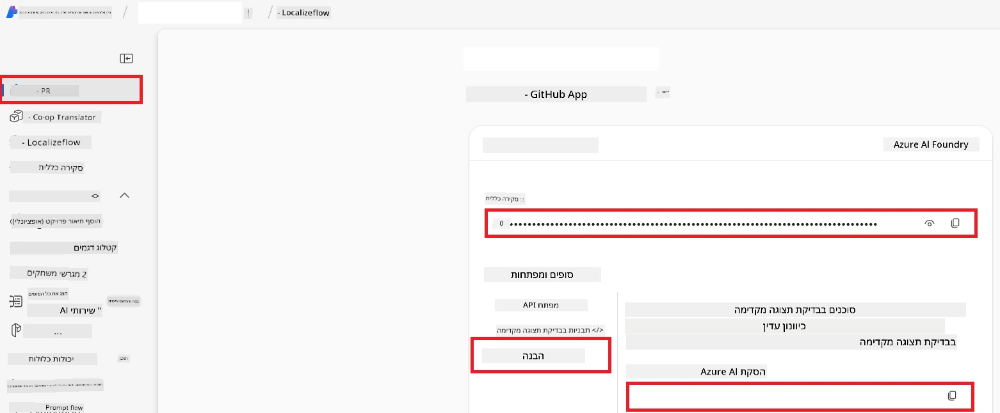

# הגדרת Azure AI עבור Co-op Translator (Azure OpneAI ו-Azure AI Vision)

מדריך זה יסביר כיצד להגדיר Azure OpenAI לתרגום שפות ו-Azure Computer Vision לניתוח תוכן תמונות (שניתן להשתמש בהם אחר כך לתרגום מבוסס תמונה) בתוך Azure AI Foundry.

**דרישות מוקדמות:**
- חשבון Azure עם מנוי פעיל.
- הרשאות מספקות ליצירת משאבים ופריסות במנוי ה-Azure שלך.

## יצירת פרויקט Azure AI

תתחיל ביצירת פרויקט Azure AI, שמשמש כמקום מרכזי לניהול משאבי ה-AI שלך.

1. נווט ל-[https://ai.azure.com](https://ai.azure.com) והתחבר עם חשבון ה-Azure שלך.

1. בחר **+Create** ליצירת פרויקט חדש.

1. בצע את הפעולות הבאות:
   - הזן **שם פרויקט** (למשל, `CoopTranslator-Project`).
   - בחר את **AI hub** (למשל, `CoopTranslator-Hub`) (צור חדש אם יש צורך).

1. לחץ על "**Review and Create**" כדי להקים את הפרויקט שלך. תועבר לעמוד הסיכום של הפרויקט.

## הגדרת Azure OpenAI לתרגום שפות

בתוך הפרויקט שלך, תפרוס מודל Azure OpenAI שישמש כגב לתרגום טקסט.

### נווט לפרויקט שלך

אם אינך נמצא שם כבר, פתח את הפרויקט שיצרת זה עתה (למשל, `CoopTranslator-Project`) ב-Azure AI Foundry.

### פריסת מודל OpenAI

1. מתפריט שמאל של הפרויקט שלך, תחת "My assets", בחר "**Models + endpoints**".

1. בחר **+ Deploy model**.

1. בחר **Deploy Base Model**.

1. יוצג בפניך רשימת מודלים זמינים. סנן או חפש מודל GPT מתאים. אנו ממליצים על `gpt-4o`.

1. בחר את המודל הרצוי ולחץ על **Confirm**.

1. בחר **Deploy**.

### תצורת Azure OpenAI

לאחר הפריסה, תוכל לבחור בפריסה מעמוד "**Models + endpoints**" כדי למצוא את **כתובת ה-REST**, **המפתח**, **שם הפריסה**, **שם המודל** ו-**גרסת ה-API**. פרטים אלה יידרשו לשילוב מודל התרגום באפליקציה שלך.

> [!NOTE]
> ניתן לבחור גרסאות API מעמוד [API version deprecation](https://learn.microsoft.com/azure/ai-services/openai/api-version-deprecation) על פי הצרכים שלך. שים לב כי **גרסת ה-API** שונה מגרסת המודל המוצגת בעמוד **Models + endpoints** ב-Azure AI Foundry.

## הגדרת Azure Computer Vision לתרגום מתוך תמונות

כדי לאפשר תרגום טקסט בתמונות, יש למצוא את מפתח ה-API וכתובת הקצה של שירות Azure AI.

1. נווט לפרויקט Azure AI שלך (למשל, `CoopTranslator-Project`). ודא שאתה בעמוד הסיכום של הפרויקט.

### תצורת שירות Azure AI

מצא את מפתח ה-API וכתובת הקצה משירות Azure AI.

1. נווט לפרויקט Azure AI שלך (למשל, `CoopTranslator-Project`). ודא שאתה בעמוד הסיכום של הפרויקט.

1. מצא את **מפתח ה-API** ואת **כתובת הקצה** בכרטיסיית שירות Azure AI.

    

חיבור זה מאפשר את יכולות המשאב המקושר של Azure AI Services (כולל ניתוח תמונה) בפרויקט ה-AI Foundry שלך. ניתן להשתמש בחיבור זה במחברות או באפליקציות שלך כדי לחלץ טקסט מתוך תמונות, שניתן לשלוח לאחר מכן למודל Azure OpenAI לתרגום.

## איחוד האישורים שלך

כעת, עליך לאסוף את הפרטים הבאים:

**ל-Azure OpenAI (תרגום טקסט):**
- כתובת הקצה של Azure OpenAI
- מפתח API של Azure OpenAI
- שם המודל של Azure OpenAI (למשל, `gpt-4o`)
- שם פריסת Azure OpenAI (למשל, `cooptranslator-gpt4o`)
- גרסת API של Azure OpenAI

**ל-Azure AI Services (חילוץ טקסט מתוך תמונה דרך Vision):**
- כתובת הקצה של שירות Azure AI
- מפתח API של שירות Azure AI

### דוגמה: תצורת משתנה סביבה (תצוגה מקדימה)

בהמשך, כאשר תבנה את האפליקציה שלך, סביר שתקבע את האישורים הללו כממשתני סביבה כך:

```bash
# קרדנציאלים של שירות Azure AI (נדרש לתרגום תמונות)
AZURE_AI_SERVICE_API_KEY="your_azure_ai_service_api_key" # לדוגמה, 21xasd...
AZURE_AI_SERVICE_ENDPOINT="https://your_azure_ai_service_endpoint.cognitiveservices.azure.com/"

# ערכות גיבוי אופציונליות: שכפול משתנים עם הסיומת _1/_2 (אותו אינדקס עבור כל המשתנים בערכה)
AZURE_AI_SERVICE_API_KEY_1="your_azure_ai_service_api_key_1"
AZURE_AI_SERVICE_ENDPOINT_1="https://your_azure_ai_service_endpoint_1.cognitiveservices.azure.com/"

# קרדנציאלים של Azure OpenAI (נדרש לתרגום טקסט)
AZURE_OPENAI_API_KEY="your_azure_openai_api_key" # לדוגמה, 21xasd...
AZURE_OPENAI_ENDPOINT="https://your_azure_openai_endpoint.openai.azure.com/"
AZURE_OPENAI_MODEL_NAME="your_model_name" # לדוגמה, gpt-4o
AZURE_OPENAI_CHAT_DEPLOYMENT_NAME="your_deployment_name" # לדוגמה, cooptranslator-gpt4o
AZURE_OPENAI_API_VERSION="your_api_version" # לדוגמה, 2024-12-01-preview

# ערכות גיבוי אופציונליות: שכפול כל ערכת AZURE_OPENAI_* עם הסיומת _1/_2 (אותו אינדקס עבור כל המשתנים)
```

---

### קריאות נוספות

- [כיצד ליצור פרויקט ב-Azure AI Foundry](https://learn.microsoft.com/azure/ai-foundry/how-to/create-projects?tabs=ai-studio)
- [כיצד ליצור משאבי Azure AI](https://learn.microsoft.com/azure/ai-foundry/how-to/create-azure-ai-resource?tabs=portal)
- [כיצד לפרוס מודלי OpenAI ב-Azure AI Foundry](https://learn.microsoft.com/en-us/azure/ai-foundry/how-to/deploy-models-openai)

---

<!-- CO-OP TRANSLATOR DISCLAIMER START -->
**כתב ויתור**:  
מסמך זה תורגם באמצעות שירות תרגום בינה מלאכותית [Co-op Translator](https://github.com/Azure/co-op-translator). אנו שואפים לדיוק, אך יש לשים לב כי תרגומים ממוחשבים עלולים להכיל שגיאות או אי דיוקים. יש להתייחס למסמך המקורי בשפת המקור כמקור הסמכותי. למידע קריטי מומלץ תרגום מקצועי על ידי אדם. אנו לא נושאים באחריות על כל אי הבנה או פרשנות שגויה הנובעת משימוש בתרגום זה.
<!-- CO-OP TRANSLATOR DISCLAIMER END -->