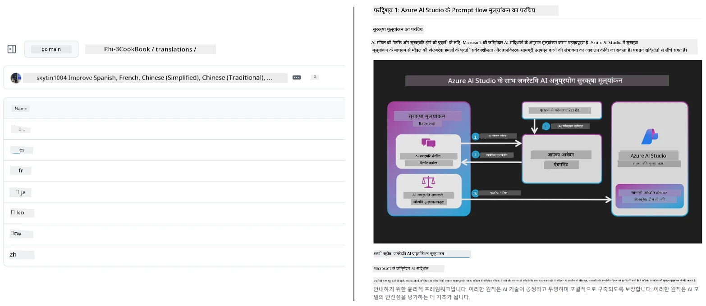
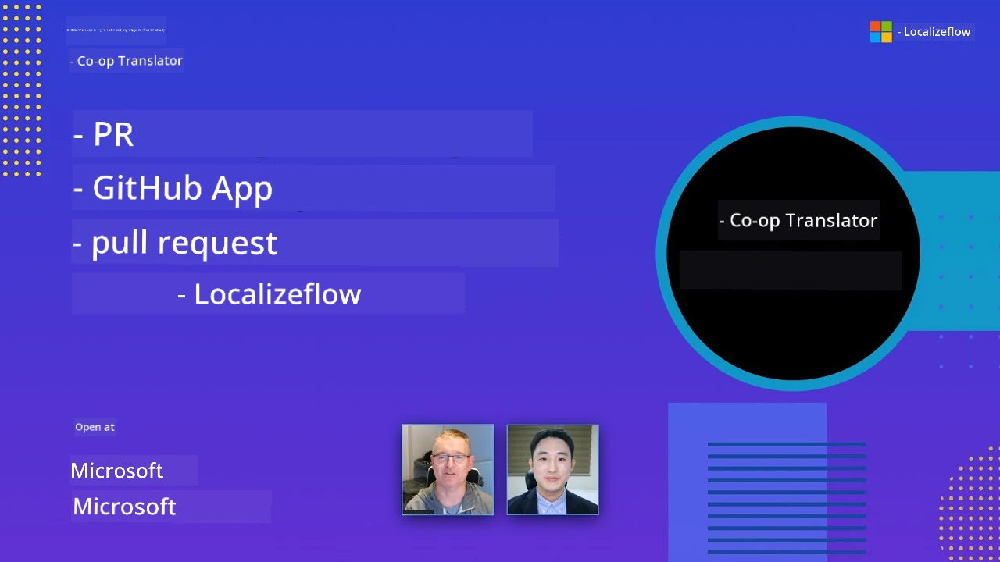

# Co-op Translator

_अपने शैक्षिक GitHub कंटेंट के लिए कई भाषाओं में अनुवाद को आसानी से स्वचालित और बनाए रखें जैसे-जैसे आपका प्रोजेक्ट विकसित होता है।_


[](https://pypi.org/project/co-op-translator/)
[](https://github.com/azure/co-op-translator/blob/main/LICENSE)
[](https://pepy.tech/project/co-op-translator)
[](https://pepy.tech/project/co-op-translator)
[](https://github.com/azure/co-op-translator/pkgs/container/co-op-translator)
[](https://github.com/psf/black)

[](https://GitHub.com/azure/co-op-translator/graphs/contributors/)
[](https://GitHub.com/azure/co-op-translator/issues/)
[](https://GitHub.com/azure/co-op-translator/pulls/)
[](http://makeapullrequest.com)

### 🌐 मल्टी-भाषा समर्थन

#### [Co-op Translator](https://github.com/Azure/Co-op-Translator) द्वारा समर्थित

<!-- CO-OP TRANSLATOR LANGUAGES TABLE START -->
[Arabic](../ar/README.md) | [Bengali](../bn/README.md) | [Bulgarian](../bg/README.md) | [Burmese (Myanmar)](../my/README.md) | [Chinese (Simplified)](../zh-CN/README.md) | [Chinese (Traditional, Hong Kong)](../zh-HK/README.md) | [Chinese (Traditional, Macau)](../zh-MO/README.md) | [Chinese (Traditional, Taiwan)](../zh-TW/README.md) | [Croatian](../hr/README.md) | [Czech](../cs/README.md) | [Danish](../da/README.md) | [Dutch](../nl/README.md) | [Estonian](../et/README.md) | [Finnish](../fi/README.md) | [French](../fr/README.md) | [German](../de/README.md) | [Greek](../el/README.md) | [Hebrew](../he/README.md) | [Hindi](./README.md) | [Hungarian](../hu/README.md) | [Indonesian](../id/README.md) | [Italian](../it/README.md) | [Japanese](../ja/README.md) | [Kannada](../kn/README.md) | [Khmer](../km/README.md) | [Korean](../ko/README.md) | [Lithuanian](../lt/README.md) | [Malay](../ms/README.md) | [Malayalam](../ml/README.md) | [Marathi](../mr/README.md) | [Nepali](../ne/README.md) | [Nigerian Pidgin](../pcm/README.md) | [Norwegian](../no/README.md) | [Persian (Farsi)](../fa/README.md) | [Polish](../pl/README.md) | [Portuguese (Brazil)](../pt-BR/README.md) | [Portuguese (Portugal)](../pt-PT/README.md) | [Punjabi (Gurmukhi)](../pa/README.md) | [Romanian](../ro/README.md) | [Russian](../ru/README.md) | [Serbian (Cyrillic)](../sr/README.md) | [Slovak](../sk/README.md) | [Slovenian](../sl/README.md) | [Spanish](../es/README.md) | [Swahili](../sw/README.md) | [Swedish](../sv/README.md) | [Tagalog (Filipino)](../tl/README.md) | [Tamil](../ta/README.md) | [Telugu](../te/README.md) | [Thai](../th/README.md) | [Turkish](../tr/README.md) | [Ukrainian](../uk/README.md) | [Urdu](../ur/README.md) | [Vietnamese](../vi/README.md)

> **स्थानीय रूप से क्लोन करना पसंद है?**
>
> इस रिपॉजिटरी में 50+ भाषा अनुवाद शामिल हैं जो डाउनलोड आकार को काफी बढ़ाता है। बिना अनुवाद के क्लोन करने के लिए, sparse checkout का उपयोग करें:
>
> **Bash / macOS / Linux:**
> ```bash
> git clone --filter=blob:none --sparse https://github.com/skytin1004/co-op-translator.git
> cd co-op-translator
> git sparse-checkout set --no-cone '/*' '!translations' '!translated_images'
> ```
>
> **CMD (Windows):**
> ```cmd
> git clone --filter=blob:none --sparse https://github.com/skytin1004/co-op-translator.git
> cd co-op-translator
> git sparse-checkout set --no-cone "/*" "!translations" "!translated_images"
> ```
>
> इससे आपको कोर्स पूरा करने के लिए आवश्यक सभी सामग्री बहुत तेज़ डाउनलोड के साथ मिलती है।
<!-- CO-OP TRANSLATOR LANGUAGES TABLE END -->

[](https://GitHub.com/azure/co-op-translator/watchers/)
[](https://GitHub.com/azure/co-op-translator/network/)
[](https://GitHub.com/azure/co-op-translator/stargazers/)

[](https://discord.gg/nTYy5BXMWG)

[](https://codespaces.new/azure/co-op-translator)

## अवलोकन

**Co-op Translator** आपकी शैक्षिक GitHub सामग्री को कई भाषाओं में बिना किसी कठिनाई के स्थानीयकृत करने में मदद करता है।  
जब आप अपने Markdown फ़ाइलों, चित्रों, या नोटबुक को अपडेट करते हैं, तो अनुवाद स्वचालित रूप से सिंक्रनाइज़ रहेंगे, जिससे आपकी सामग्री विश्वभर के शिक्षार्थियों के लिए सटीक और अद्यतित बनी रहती है।

अनुवादित सामग्री कैसे व्यवस्थित होती है इसका उदाहरण:



## अनुवाद स्थिति कैसे प्रबंधित की जाती है

Co-op Translator अनुवादित सामग्री को **संस्करणबद्ध सॉफ्टवेयर कलाकृतियों** के रूप में प्रबंधित करता है,  
स्थिर फ़ाइलों के रूप में नहीं।

यह टूल अनुवादित Markdown, चित्र, और नोटबुक की स्थिति को  
**भाषा-विशिष्ट मेटाडेटा** का उपयोग करके ट्रैक करता है।

यह डिज़ाइन Co-op Translator को सक्षम बनाता है:

- पुरानी अनुवादों का भरोसेमंद पता लगाने के लिए
- Markdown, चित्र, और नोटबुक को समान रूप से व्यवहार करने के लिए
- बड़े, तेज़ी से बढ़ते, बहुभाषी रिपॉजिटरी में सुरक्षित रूप से स्केल करने के लिए

अनुवादों को प्रबंधित कलाकृतियों के रूप में मॉडल करके,  
अनुवाद कार्यप्रवाह आधुनिक  
सॉफ्टवेयर निर्भरता और कलाकृति प्रबंधन प्रथाओं के साथ स्वाभाविक रूप से मेल खाते हैं।

→ [अनुवाद स्थिति कैसे प्रबंधित की जाती है](https://techcommunity.microsoft.com/blog/azuredevcommunityblog/rethinking-documentation-translation-treating-translations-as-versioned-software/4491755)


## त्वरित प्रारंभ

```bash
# एक वर्चुअल पर्यावरण बनाएँ और सक्रिय करें (अनुशंसित)
python -m venv .venv
# विंडोज
.venv\Scripts\activate
# मैकओएस/लिनक्स
source .venv/bin/activate
# पैकेज स्थापित करें
pip install co-op-translator
# अनुवाद करें
translate -l "ko ja fr" -md
```

Docker:

```bash
# GHCR से सार्वजनिक इमेज खींचें
docker pull ghcr.io/azure/co-op-translator:latest
# वर्तमान फ़ोल्डर माउंट किए गए और .env प्रदान किए गए साथ चलाएँ (Bash/Zsh)
docker run --rm -it --env-file .env -v "${PWD}:/work" ghcr.io/azure/co-op-translator:latest -l "ko ja fr" -md
```

## न्यूनतम सेटअप

1. सत्यापित करें कि आपके पास समर्थित Python संस्करण है (वर्तमान में 3.10-3.12)। poetry (pyproject.toml) में यह स्वचालित रूप से संचालित होता है।  
2. एक `.env` फ़ाइल बनाएँ टेम्पलेट से: [.env.template](../../.env.template)  
3. एक LLM प्रोवाइडर कॉन्फ़िगर करें (Azure OpenAI या OpenAI)  
4. (वैकल्पिक) छवि अनुवाद के लिए (`-img`), Azure AI Vision कॉन्फ़िगर करें  
5. (वैकल्पिक) आप कई प्रमाणपत्र सेट कॉन्फ़िगर कर सकते हैं, जैसे `_1`, `_2` आदि उपसर्ग के साथ चर डुप्लिकेट करके। एक सेट में सभी वेरिएबल्स का समान उपसर्ग होना चाहिए।  
6. (अनुशंसित) किसी भी पिछले अनुवादों को साफ़ करें ताकि टकराव न हो (जैसे `translations/`)  
7. (अनुशंसित) अपने README में अनुवाद अनुभाग जोड़ें [README भाषाएँ टेम्पलेट](./getting_started/README_languages_template.md) का उपयोग करके  
8. देखें: [Azure AI सेटअप करें](./getting_started/set-up-azure-ai.md)

## उपयोग

सभी समर्थित प्रकारों का अनुवाद करें:

```bash
translate -l "ko ja"
```

केवल Markdown:

```bash
translate -l "de" -md
```

Markdown + छवियाँ:

```bash
translate -l "pt" -md -img
```

केवल नोटबुक:

```bash
translate -l "zh" -nb
```

अधिक विकल्प: [कमांड संदर्भ](./getting_started/command-reference.md)

## विशेषताएँ

- Markdown, नोटबुक, और छवियों के लिए स्वचालित अनुवाद  
- अनुवाद स्रोत परिवर्तनों के साथ सिंक्रनाइज़ रहते हैं  
- लोकल (CLI) या CI (GitHub Actions) में कार्य करता है  
- Azure OpenAI या OpenAI का उपयोग करता है; छवियों के लिए वैकल्पिक Azure AI Vision  
- Markdown स्वरूपण और संरचना को बरकरार रखता है

## दस्तावेज़

- [कमांड-लाइन गाइड](./getting_started/command-line-guide/command-line-guide.md)  
- [GitHub Actions गाइड (सार्वजनिक रिपॉजिटरीज और मानक सीक्रेट्स)](./getting_started/github-actions-guide/github-actions-guide-public.md)  
- [GitHub Actions गाइड (Microsoft संगठन रिपॉजिटरीज और संगठन-स्तर सेटअप)](./getting_started/github-actions-guide/github-actions-guide-org.md)  
- [README भाषाएँ टेम्पलेट](./getting_started/README_languages_template.md)  
- [समर्थित भाषाएँ](./getting_started/supported-languages.md)  
- [योगदान करना](./CONTRIBUTING.md)  
- [समस्या निवारण](./getting_started/troubleshooting.md)

### माइक्रोसॉफ्ट-विशिष्ट गाइड
> [!NOTE]
> केवल माइक्रोसॉफ्ट “For Beginners” रिपॉजिटरीज के मेंटेनरों के लिए।

- [“other courses” सूची अपडेट करना (केवल MS Beginners रिपॉजिटरीज के लिए)](./getting_started/update-other-courses.md)

## हमारा समर्थन करें और वैश्विक शिक्षा को बढ़ावा दें

हमारे साथ जुड़ें और विश्व स्तर पर शैक्षिक सामग्री साझा करने के तरीके में क्रांति लाएं! [Co-op Translator](https://github.com/azure/co-op-translator) को GitHub पर ⭐ दें और सीखने और प्रौद्योगिकी में भाषा बाधाओं को तोड़ने के हमारे मिशन का समर्थन करें। आपका Interesse और योगदान महत्वपूर्ण प्रभाव डालता है! कोड योगदान और फीचर सुझाव हमेशा स्वागत योग्य हैं।

### अपनी भाषा में Microsoft शैक्षिक सामग्री का अन्वेषण करें

- [LangChain4j-for-Beginners](https://github.com/microsoft/LangChain4j-for-Beginners)
- [AZD for Beginners](https://github.com/microsoft/AZD-for-beginners)
- [Edge AI for Beginners](https://github.com/microsoft/edgeai-for-beginners)
- [Model Context Protocol (MCP) For Beginners](https://github.com/microsoft/mcp-for-beginners)
- [AI Agents for Beginners](https://github.com/microsoft/ai-agents-for-beginners)
- [Generative AI for Beginners using .NET](https://github.com/microsoft/Generative-AI-for-beginners-dotnet)
- [Generative AI for Beginners](https://github.com/microsoft/generative-ai-for-beginners)
- [Generative AI for Beginners using Java](https://github.com/microsoft/generative-ai-for-beginners-java)
- [ML for Beginners](https://aka.ms/ml-beginners)
- [Data Science for Beginners](https://aka.ms/datascience-beginners)
- [AI for Beginners](https://aka.ms/ai-beginners)
- [Cybersecurity for Beginners](https://github.com/microsoft/Security-101)
- [Web Dev for Beginners](https://aka.ms/webdev-beginners)
- [IoT for Beginners](https://aka.ms/iot-beginners)
- [PhiCookBook](https://github.com/microsoft/PhiCookBook)

## वीडियो प्रस्तुतियाँ

👉 नीचे की छवि पर क्लिक करके YouTube पर देखें।

- **Open at Microsoft**: Co-op Translator कैसे उपयोग करें, इसका संक्षिप्त 18-मिनट परिचय और त्वरित गाइड।

  [](https://www.youtube.com/watch?v=jX_swfH_KNU)

## योगदान देना

यह प्रोजेक्ट योगदान और सुझावों का स्वागत करता है। Azure Co-op Translator में योगदान देने के इच्छुक हैं? कृपया हमारी [CONTRIBUTING.md](./CONTRIBUTING.md) देखें ताकि आप जान सकें कि Co-op Translator को अधिक सुलभ बनाने में आप कैसे मदद कर सकते हैं।

## योगदानकर्ता
[](https://github.com/Azure/co-op-translator/graphs/contributors)

## आचार संहिता

इस परियोजना ने [Microsoft Open Source Code of Conduct](https://opensource.microsoft.com/codeofconduct/) को अपनाया है।  
अधिक जानकारी के लिए [आचार संहिता FAQ](https://opensource.microsoft.com/codeofconduct/faq/) देखें या  
अतिरिक्त प्रश्नों या टिप्पणियों के लिए [opencode@microsoft.com](mailto:opencode@microsoft.com) से संपर्क करें।

## जिम्मेदार AI

Microsoft हमारे ग्राहकों को हमारे AI उत्पादों का जिम्मेदारीपूर्वक उपयोग करने में मदद करने, हमारे अनुभव साझा करने, और Transparency Notes और Impact Assessments जैसे उपकरणों के माध्यम से विश्वास-आधारित साझेदारियां बनाने के लिए प्रतिबद्ध है। इन संसाधनों में से कई आपको [https://aka.ms/RAI](https://aka.ms/RAI) पर मिलेंगे।  
Microsoft का जिम्मेदार AI के प्रति दृष्टिकोण हमारे AI सिद्धांतों जैसे निष्पक्षता, विश्वसनीयता और सुरक्षा, गोपनीयता और सुरक्षा, समावेशन, पारदर्शिता, और जवाबदेही पर आधारित है।

बड़े पैमाने पर प्राकृतिक भाषा, चित्र, और भाषण मॉडल - जैसे कि इस नमूने में उपयोग किए गए मॉडल - ऐसे तरीकों से व्यवहार कर सकते हैं जो अनियायत्त, अविश्वसनीय, या आपत्तिजनक हो सकते हैं, जिससे नुकसान हो सकता है। कृपया जोखिमों और सीमाओं के बारे में जानने के लिए [Azure OpenAI सेवा पारदर्शिता नोट](https://learn.microsoft.com/legal/cognitive-services/openai/transparency-note?tabs=text) देखें।

इन जोखिमों को कम करने के लिए सुझाया गया तरीका यह है कि आपकी वास्तुकला में एक सुरक्षा प्रणाली शामिल हो जो हानिकारक व्यवहार का पता लगा सके और उसे रोक सके। [Azure AI Content Safety](https://learn.microsoft.com/azure/ai-services/content-safety/overview) एक स्वतंत्र सुरक्षा परत प्रदान करता है, जो अनुप्रयोगों और सेवाओं में हानिकारक उपयोगकर्ता-जनित और AI-जनित सामग्री का पता लगाने में सक्षम है। Azure AI Content Safety में टेक्स्ट और छवि API शामिल हैं जो हानिकारक सामग्री का पता लगाने की अनुमति देते हैं। हमारे पास एक इंटरैक्टिव Content Safety Studio भी है जो आपको विभिन्न माध्यमों में हानिकारक सामग्री का पता लगाने के लिए नमूना कोड देखने, खोजने और आज़माने की सुविधा देता है। निम्नलिखित [तत्काल-प्रारंभ दस्तावेज़](https://learn.microsoft.com/azure/ai-services/content-safety/quickstart-text?tabs=visual-studio%2Clinux&pivots=programming-language-rest) आपको सेवा के लिए अनुरोध करने में मार्गदर्शन करता है।

एक और पहलू जिसे ध्यान में रखना है वह है समग्र अनुप्रयोग प्रदर्शन। बहु-मोडल और बहु-मॉडल अनुप्रयोगों के साथ, हम प्रदर्शन को ऐसा मानते हैं कि सिस्टम आपके और आपके उपयोगकर्ताओं की अपेक्षा के अनुसार काम करे, जिसमें हानिकारक आउटपुट न बनाना भी शामिल है। अपने पूरे अनुप्रयोग के प्रदर्शन का मूल्यांकन करना महत्वपूर्ण है, इसके लिए [उत्पादन गुणवत्ता और जोखिम और सुरक्षा मीट्रिक्स](https://learn.microsoft.com/azure/ai-studio/concepts/evaluation-metrics-built-in) का उपयोग करें।

आप अपने विकास वातावरण में अपने AI अनुप्रयोग का मूल्यांकन [prompt flow SDK](https://microsoft.github.io/promptflow/index.html) का उपयोग करके कर सकते हैं। परीक्षण डेटासेट या लक्ष्य के आधार पर, आपके जनरेटिव AI अनुप्रयोग की पीढ़ियों को अंतर्निर्मित मूल्यांककों या आपकी पसंद के कस्टम मूल्यांककों के साथ मात्रात्मक रूप से मापा जाता है। अपने सिस्टम का मूल्यांकन करने के लिए prompt flow sdk के साथ शुरुआत करने के लिए, आप [तत्काल-प्रारंभ मार्गदर्शिका](https://learn.microsoft.com/azure/ai-studio/how-to/develop/flow-evaluate-sdk) का पालन कर सकते हैं। एक बार जब आप मूल्यांकन चलाते हैं, तो आप [Azure AI Studio में परिणामों को विज़ुअलाइज़ कर सकते हैं](https://learn.microsoft.com/azure/ai-studio/how-to/evaluate-flow-results)।

## ट्रेडमार्क

इस परियोजना में प्रोजेक्ट्स, उत्पादों, या सेवाओं के ट्रेडमार्क या लोगो हो सकते हैं। Microsoft ट्रेडमार्क या लोगो के अधिकृत उपयोग के लिए [Microsoft's Trademark & Brand Guidelines](https://www.microsoft.com/en-us/legal/intellectualproperty/trademarks/usage/general) का पालन करना और अनुसरण करना आवश्यक है।  
इस परियोजना के संशोधित संस्करणों में Microsoft ट्रेडमार्क या लोगो के उपयोग से भ्रम पैदा नहीं होना चाहिए या Microsoft के प्रायोजन का संकेत नहीं देना चाहिए।  
तीसरे पक्ष के ट्रेडमार्क या लोगो के उपयोग संबंधित तीसरे पक्ष की नीतियों के अधीन हैं।

## सहायता प्राप्त करें

यदि आप अटक जाते हैं या AI ऐप बनाने के बारे में कोई प्रश्न हैं, तो शामिल हों:

[](https://discord.gg/nTYy5BXMWG)

यदि आपके पास उत्पाद प्रतिक्रिया या निर्माण के दौरान त्रुटियां हैं तो विजिट करें:

[](https://aka.ms/foundry/forum)

---

<!-- CO-OP TRANSLATOR DISCLAIMER START -->
**अस्वीकरण**:
इस दस्तावेज़ का अनुवाद AI अनुवाद सेवा [Co-op Translator](https://github.com/Azure/co-op-translator) का उपयोग करके किया गया है। जबकि हम सटीकता के लिए प्रयासरत हैं, कृपया ध्यान दें कि स्वचालित अनुवाद में त्रुटियाँ या अशुद्धियाँ हो सकती हैं। मूल दस्तावेज़ अपनी मूल भाषा में प्रामाणिक स्रोत माना जाना चाहिए। महत्वपूर्ण जानकारी के लिए, पेशेवर मानव अनुवाद की सिफारिश की जाती है। इस अनुवाद के उपयोग से उत्पन्न किसी भी गलतफहमी या गलत व्याख्या के लिए हम जिम्मेदार नहीं हैं।
<!-- CO-OP TRANSLATOR DISCLAIMER END -->