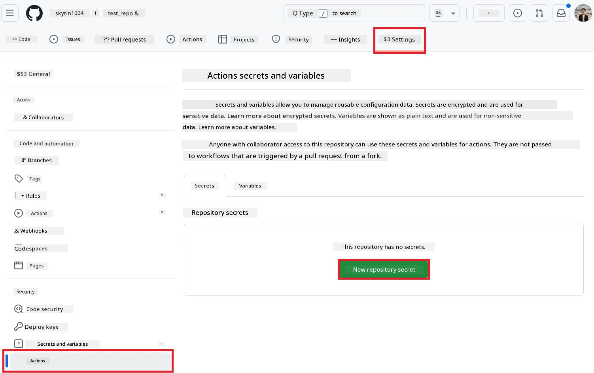
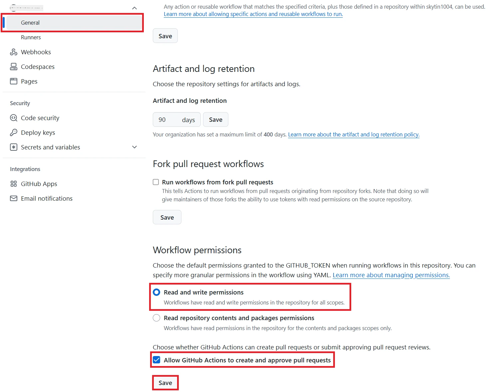

# Co-op Translator GitHub Action का उपयोग करना (पब्लिक सेटअप)

**लक्ष्य दर्शक:** यह गाइड उन उपयोगकर्ताओं के लिए है जो अधिकतर सार्वजनिक या निजी रिपॉजिटरी में काम करते हैं, जहाँ सामान्य GitHub Actions परमिशन पर्याप्त हैं। इसमें बिल्ट-इन `GITHUB_TOKEN` का उपयोग किया गया है।

अपने रिपॉजिटरी की डाक्यूमेंटेशन का अनुवाद Co-op Translator GitHub Action के जरिए आसानी से ऑटोमेट करें। यह गाइड आपको एक्शन सेटअप करने की प्रक्रिया समझाता है, जिससे आपके सोर्स Markdown फाइल या इमेज में बदलाव होने पर अपने आप अपडेटेड अनुवाद के साथ पुल रिक्वेस्ट बन जाए।

> [!IMPORTANT]
>
> **सही गाइड चुनना:**
>
> यह गाइड **साधारण सेटअप को विस्तार से बताता है जिसमें स्टैंडर्ड `GITHUB_TOKEN` का उपयोग होता है**। यह अधिकतर उपयोगकर्ताओं के लिए सुझाया गया तरीका है क्योंकि इसमें संवेदनशील GitHub App Private Keys को मैनेज करने की जरूरत नहीं होती।
>

## आवश्यकताएँ

GitHub Action को कॉन्फ़िगर करने से पहले, सुनिश्चित करें कि आपके पास जरूरी AI सेवा की क्रेडेंशियल्स उपलब्ध हैं।

**1. जरूरी: AI भाषा मॉडल क्रेडेंशियल्स**
आपको कम से कम एक सपोर्टेड Language Model के लिए क्रेडेंशियल्स चाहिए:

- **Azure OpenAI**: Endpoint, API Key, Model/Deployment Names, API Version चाहिए।
- **OpenAI**: API Key चाहिए, (वैकल्पिक: Org ID, Base URL, Model ID)।
- विवरण के लिए देखें [Supported Models and Services](../../../../README.md)।

**2. वैकल्पिक: AI Vision क्रेडेंशियल्स (इमेज अनुवाद के लिए)**

- केवल तब जरूरी है जब आपको इमेज के अंदर के टेक्स्ट का अनुवाद करना हो।
- **Azure AI Vision**: Endpoint और Subscription Key चाहिए।
- अगर नहीं दिया गया, तो एक्शन [Markdown-only mode](../markdown-only-mode.md) पर डिफॉल्ट हो जाएगा।

## सेटअप और कॉन्फ़िगरेशन

नीचे दिए गए स्टेप्स को फॉलो करें ताकि Co-op Translator GitHub Action को अपने रिपॉजिटरी में स्टैंडर्ड `GITHUB_TOKEN` के साथ कॉन्फ़िगर किया जा सके।

### स्टेप 1: ऑथेंटिकेशन समझें (`GITHUB_TOKEN` का उपयोग)

यह वर्कफ़्लो GitHub Actions द्वारा प्रदान किया गया बिल्ट-इन `GITHUB_TOKEN` उपयोग करता है। यह टोकन वर्कफ़्लो को आपके रिपॉजिटरी के साथ इंटरैक्ट करने की परमिशन अपने आप देता है, जैसा कि **स्टेप 3** में सेटिंग्स के अनुसार कॉन्फ़िगर किया गया है।

### स्टेप 2: रिपॉजिटरी सीक्रेट्स कॉन्फ़िगर करें

आपको केवल अपनी **AI सेवा की क्रेडेंशियल्स** को अपने रिपॉजिटरी सेटिंग्स में एन्क्रिप्टेड सीक्रेट्स के रूप में जोड़ना है।

1.  अपने टारगेट GitHub रिपॉजिटरी पर जाएँ।
2.  **Settings** > **Secrets and variables** > **Actions** पर जाएँ।
3.  **Repository secrets** के तहत, नीचे दी गई हर जरूरी AI सेवा सीक्रेट के लिए **New repository secret** पर क्लिक करें।

     *(इमेज संदर्भ: यहाँ सीक्रेट्स कैसे जोड़ें)*

**जरूरी AI सेवा सीक्रेट्स (अपने आवश्यकताओं के अनुसार सभी जोड़ें):**

| सीक्रेट नाम                         | विवरण                               | वैल्यू स्रोत                     |
| :---------------------------------- | :---------------------------------- | :------------------------------ |
| `AZURE_AI_SERVICE_API_KEY`            | Azure AI Service (Computer Vision) के लिए Key  | आपका Azure AI Foundry               |
| `AZURE_AI_SERVICE_ENDPOINT`         | Azure AI Service (Computer Vision) के लिए Endpoint | आपका Azure AI Foundry               |
| `AZURE_OPENAI_API_KEY`              | Azure OpenAI सेवा के लिए Key              | आपका Azure AI Foundry               |
| `AZURE_OPENAI_ENDPOINT`             | Azure OpenAI सेवा के लिए Endpoint         | आपका Azure AI Foundry               |
| `AZURE_OPENAI_MODEL_NAME`           | आपका Azure OpenAI Model Name              | आपका Azure AI Foundry               |
| `AZURE_OPENAI_CHAT_DEPLOYMENT_NAME` | आपका Azure OpenAI Deployment Name         | आपका Azure AI Foundry               |
| `AZURE_OPENAI_API_VERSION`          | Azure OpenAI के लिए API Version           | आपका Azure AI Foundry               |
| `OPENAI_API_KEY`                    | OpenAI के लिए API Key                     | आपका OpenAI Platform              |
| `OPENAI_ORG_ID`                     | OpenAI Organization ID (वैकल्पिक)         | आपका OpenAI Platform              |
| `OPENAI_CHAT_MODEL_ID`              | विशेष OpenAI model ID (वैकल्पिक)          | आपका OpenAI Platform              |
| `OPENAI_BASE_URL`                   | कस्टम OpenAI API Base URL (वैकल्पिक)      | आपका OpenAI Platform              |

### स्टेप 3: वर्कफ़्लो परमिशन कॉन्फ़िगर करें

GitHub Action को `GITHUB_TOKEN` के जरिए कोड चेकआउट और पुल रिक्वेस्ट बनाने की परमिशन चाहिए।

1.  अपने रिपॉजिटरी में जाएँ, **Settings** > **Actions** > **General** पर जाएँ।
2.  नीचे स्क्रॉल करें और **Workflow permissions** सेक्शन देखें।
3.  **Read and write permissions** चुनें। इससे `GITHUB_TOKEN` को इस वर्कफ़्लो के लिए जरूरी `contents: write` और `pull-requests: write` परमिशन मिलती है।
4.  **Allow GitHub Actions to create and approve pull requests** का चेकबॉक्स **चेक** करें।
5.  **Save** चुनें।



### स्टेप 4: वर्कफ़्लो फाइल बनाएं

अंत में, YAML फाइल बनाएं जो `GITHUB_TOKEN` का उपयोग करके ऑटोमेटेड वर्कफ़्लो को परिभाषित करती है।

1.  अपने रिपॉजिटरी के रूट डायरेक्टरी में `.github/workflows/` डायरेक्टरी बनाएं (अगर नहीं है)।
2.  `.github/workflows/` के अंदर `co-op-translator.yml` नाम से फाइल बनाएं।
3.  नीचे दिया गया कंटेंट `co-op-translator.yml` में पेस्ट करें।

```yaml
name: Co-op Translator

on:
  push:
    branches:
      - main

jobs:
  co-op-translator:
    runs-on: ubuntu-latest

    permissions:
      contents: write
      pull-requests: write

    steps:
      - name: Checkout repository
        uses: actions/checkout@v4
        with:
          fetch-depth: 0

      - name: Set up Python
        uses: actions/setup-python@v4
        with:
          python-version: '3.10'

      - name: Install Co-op Translator
        run: |
          python -m pip install --upgrade pip
          pip install co-op-translator

      - name: Run Co-op Translator
        env:
          PYTHONIOENCODING: utf-8
          # === AI Service Credentials ===
          AZURE_AI_SERVICE_API_KEY: ${{ secrets.AZURE_AI_SERVICE_API_KEY }}
          AZURE_AI_SERVICE_ENDPOINT: ${{ secrets.AZURE_AI_SERVICE_ENDPOINT }}
          AZURE_OPENAI_API_KEY: ${{ secrets.AZURE_OPENAI_API_KEY }}
          AZURE_OPENAI_ENDPOINT: ${{ secrets.AZURE_OPENAI_ENDPOINT }}
          AZURE_OPENAI_MODEL_NAME: ${{ secrets.AZURE_OPENAI_MODEL_NAME }}
          AZURE_OPENAI_CHAT_DEPLOYMENT_NAME: ${{ secrets.AZURE_OPENAI_CHAT_DEPLOYMENT_NAME }}
          AZURE_OPENAI_API_VERSION: ${{ secrets.AZURE_OPENAI_API_VERSION }}
          OPENAI_API_KEY: ${{ secrets.OPENAI_API_KEY }}
          OPENAI_ORG_ID: ${{ secrets.OPENAI_ORG_ID }}
          OPENAI_CHAT_MODEL_ID: ${{ secrets.OPENAI_CHAT_MODEL_ID }}
          OPENAI_BASE_URL: ${{ secrets.OPENAI_BASE_URL }}
        run: |
          # =====================================================================
          # IMPORTANT: Set your target languages here (REQUIRED CONFIGURATION)
          # =====================================================================
          # Example: Translate to Spanish, French, German. Add -y to auto-confirm.
          translate -l "es fr de" -y  # <--- MODIFY THIS LINE with your desired languages

      - name: Create Pull Request with translations
        uses: peter-evans/create-pull-request@v5
        with:
          token: ${{ secrets.GITHUB_TOKEN }}
          commit-message: "🌐 Update translations via Co-op Translator"
          title: "🌐 Update translations via Co-op Translator"
          body: |
            This PR updates translations for recent changes to the main branch.

            ### 📋 Changes included
            - Translated contents are available in the `translations/` directory
            - Translated images are available in the `translated_images/` directory

            ---
            🌐 Automatically generated by the [Co-op Translator](https://github.com/Azure/co-op-translator) GitHub Action.
          branch: update-translations
          base: main
          labels: translation, automated-pr
          delete-branch: true
          add-paths: |
            translations/
            translated_images/
```

4.  **वर्कफ़्लो को कस्टमाइज़ करें:**
  - **[!IMPORTANT] टारगेट भाषाएँ:** `Run Co-op Translator` स्टेप में, आपको **भाषा कोड्स की लिस्ट** को `translate -l "..." -y` कमांड में अपनी प्रोजेक्ट की जरूरत के अनुसार जरूर बदलना या एडिट करना है। उदाहरण वाली लिस्ट (`ar de es...`) को बदलना या एडजस्ट करना जरूरी है।
  - **ट्रिगर (`on:`):** अभी का ट्रिगर हर बार `main` पर पुश होने पर चलता है। बड़े रिपॉजिटरी के लिए, YAML में दिए गए कमेंटेड उदाहरण की तरह `paths:` फिल्टर जोड़ें ताकि वर्कफ़्लो केवल जरूरी फाइल (जैसे सोर्स डाक्यूमेंटेशन) बदलने पर ही चले, जिससे रनर मिनट्स बचें।
  - **PR विवरण:** अगर जरूरत हो तो `Create Pull Request` स्टेप में `commit-message`, `title`, `body`, `branch` नाम और `labels` को कस्टमाइज़ करें।

## वर्कफ़्लो चलाना

> [!WARNING]  
> **GitHub-hosted Runner समय सीमा:**  
> GitHub-hosted रनर जैसे `ubuntu-latest` की **अधिकतम रनिंग समय सीमा 6 घंटे** है।  
> अगर आपके डाक्यूमेंटेशन रिपॉजिटरी बहुत बड़े हैं और अनुवाद प्रक्रिया 6 घंटे से ज्यादा हो जाती है, तो वर्कफ़्लो अपने आप बंद हो जाएगा।  
> इससे बचने के लिए:  
> - **Self-hosted runner** का उपयोग करें (कोई समय सीमा नहीं)  
> - हर रन में टारगेट भाषाओं की संख्या कम करें

जब `co-op-translator.yml` फाइल आपके मुख्य ब्रांच (या `on:` ट्रिगर में दी गई ब्रांच) में मर्ज हो जाती है, तो वर्कफ़्लो अपने आप चलेगा जब भी उस ब्रांच में बदलाव पुश किए जाएँ (और अगर `paths` फिल्टर कॉन्फ़िगर किया है तो उसके अनुसार)।

---

**अस्वीकरण**:
इस दस्तावेज़ का अनुवाद AI अनुवाद सेवा [Co-op Translator](https://github.com/Azure/co-op-translator) का उपयोग करके किया गया है। जबकि हम सटीकता के लिए प्रयास करते हैं, कृपया ध्यान दें कि स्वचालित अनुवादों में त्रुटियाँ या गलतियाँ हो सकती हैं। मूल दस्तावेज़ को उसकी मूल भाषा में ही प्राधिकृत स्रोत माना जाना चाहिए। महत्वपूर्ण जानकारी के लिए, पेशेवर मानव अनुवाद की सिफारिश की जाती है। इस अनुवाद के उपयोग से उत्पन्न किसी भी गलतफहमी या गलत व्याख्या के लिए हम उत्तरदायी नहीं हैं।