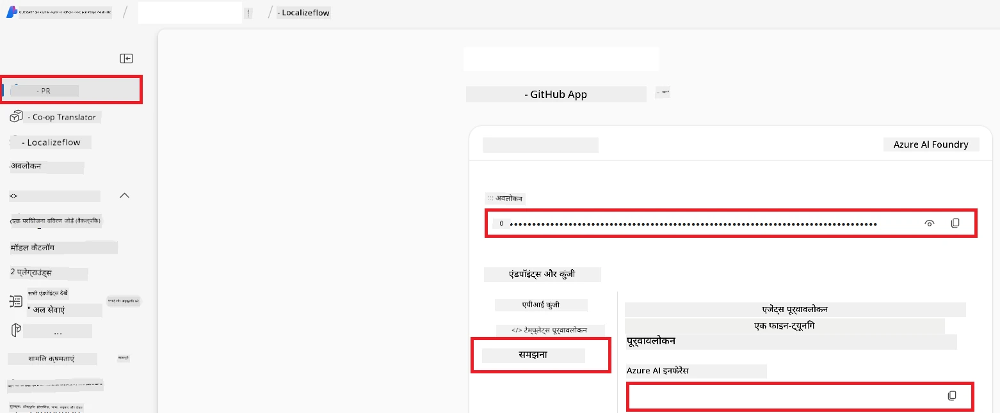

# Co-op Translator के लिए Azure AI सेट अप करें (Azure OpneAI & Azure AI Vision)

यह गाइड आपको Azure AI Foundry के भीतर भाषा अनुवाद के लिए Azure OpenAI और छवि-आधारित अनुवाद के लिए छवि सामग्री विश्लेषण हेतु Azure Computer Vision सेट अप करने के लिए निर्देश देता है।

**पूर्वापेक्षाएँ:**
- एक सक्रिय सदस्यता वाली Azure खाता।
- आपकी Azure सदस्यता में संसाधन और डिप्लॉयमेंट बनाने के लिए पर्याप्त अनुमतियाँ।

## एक Azure AI प्रोजेक्ट बनाएं

आप एक Azure AI प्रोजेक्ट बनाकर शुरू करेंगे, जो आपकी AI संसाधनों के प्रबंधन के लिए एक केंद्रीय स्थान के रूप में कार्य करता है।

1. [https://ai.azure.com](https://ai.azure.com) पर जाएँ और अपने Azure खाते से साइन इन करें।

1. नया प्रोजेक्ट बनाने के लिए **+Create** चुनें।

1. निम्न कार्य करें:
   - एक **Project name** दर्ज करें (उदा. `CoopTranslator-Project`)।
   - **AI hub** चुनें (उदा. `CoopTranslator-Hub`) (यदि आवश्यक हो तो नया बनाएं)।

1. अपने प्रोजेक्ट को सेट अप करने के लिए "**Review and Create**" पर क्लिक करें। आपको आपके प्रोजेक्ट के अवलोकन पृष्ठ पर ले जाया जाएगा।

## भाषा अनुवाद के लिए Azure OpenAI सेट अप करें

अपने प्रोजेक्ट के भीतर, आप पाठ अनुवाद के बैकेंड के रूप में सेवा देने के लिए Azure OpenAI मॉडल डिप्लॉय करेंगे।

### अपने प्रोजेक्ट तक जाएं

यदि आप पहले से वहां नहीं हैं, तो अपने नए बनाए गए प्रोजेक्ट (उदा. `CoopTranslator-Project`) को Azure AI Foundry में खोलें।

### एक OpenAI मॉडल डिप्लॉय करें

1. अपने प्रोजेक्ट के बाएँ मेनू से, "My assets" के अंतर्गत, "**Models + endpoints**" चुनें।

1. **+ Deploy model** चुनें।

1. **Deploy Base Model** चुनें।

1. आपको उपलब्ध मॉडलों की सूची दी जाएगी। एक उपयुक्त GPT मॉडल को फ़िल्टर करें या खोजें। हम `gpt-4o` की सिफारिश करते हैं।

1. अपना वांछित मॉडल चुनें और **Confirm** पर क्लिक करें।

1. **Deploy** चुनें।

### Azure OpenAI कॉन्फ़िगरेशन

डिप्लॉय हो जाने के बाद, आप "**Models + endpoints**" पृष्ठ से डिप्लॉयमेंट चुन सकते हैं ताकि उसका **REST endpoint URL**, **Key**, **Deployment name**, **Model name** और **API version** मिल सके। इनकी जरूरत आपके आवेदन में अनुवाद मॉडल को एकीकृत करने के लिए पड़ेगी।

> [!NOTE]
> आप अपनी आवश्यकताओं के अनुसार [API version deprecation](https://learn.microsoft.com/azure/ai-services/openai/api-version-deprecation) पृष्ठ से API संस्करण चुन सकते हैं। ध्यान दें कि **API version** Azure AI Foundry में **Models + endpoints** पृष्ठ पर दिखाए गए **Model version** से अलग होता है।

## छवि अनुवाद के लिए Azure Computer Vision सेट अप करें

छवियों में पाठ के अनुवाद को सक्षम करने के लिए, आपको Azure AI सेवा की API कुंजी और Endpoint खोजनी होगी।

1. अपने Azure AI प्रोजेक्ट (उदा. `CoopTranslator-Project`) पर नेविगेट करें। सुनिश्चित करें कि आप प्रोजेक्ट अवलोकन पृष्ठ पर हैं।

### Azure AI सेवा कॉन्फ़िगरेशन

Azure AI सेवा से API कुंजी और Endpoint खोजें।

1. अपने Azure AI प्रोजेक्ट (उदा. `CoopTranslator-Project`) पर नेविगेट करें। सुनिश्चित करें कि आप प्रोजेक्ट अवलोकन पृष्ठ पर हैं।

1. Azure AI सेवा टैब से **API Key** और **Endpoint** खोजें।

    

यह कनेक्शन आपके AI Foundry प्रोजेक्ट को लिंक किए गए Azure AI सेवाओं के संसाधन (जिसमें छवि विश्लेषण शामिल है) की क्षमताएं उपलब्ध कराता है। आप फिर इस कनेक्शन का उपयोग अपनी नोटबुक या एप्लिकेशन में छवियों से पाठ निकालने के लिए कर सकते हैं, जिसे बाद में अनुवाद के लिए Azure OpenAI मॉडल को भेजा जा सकता है।

## अपने क्रेडेंशियल्स का समेकन

इस समय तक, आपको निम्नलिखित इकट्ठा कर लेना चाहिए:

**Azure OpenAI (पाठ अनुवाद) के लिए:**
- Azure OpenAI Endpoint
- Azure OpenAI API Key
- Azure OpenAI Model Name (उदा. `gpt-4o`)
- Azure OpenAI Deployment Name (उदा. `cooptranslator-gpt4o`)
- Azure OpenAI API Version

**Azure AI सेवाओं (दृष्टि के माध्यम से छवि पाठ निष्कर्षण) के लिए:**
- Azure AI Service Endpoint
- Azure AI Service API Key

### उदाहरण: पर्यावरण चर कॉन्फ़िगरेशन (पूर्वावलोकन)

बाद में, जब आप अपना आवेदन बनाएंगे, तो आप इन संग्रहित क्रेडेंशियल्स का उपयोग कर इसे कॉन्फ़िगर करेंगे। उदाहरण के लिए, आप इन्हें पर्यावरण चर के रूप में इस प्रकार सेट कर सकते हैं:

```bash
# Azure AI सेवा क्रेडेंशियल्स (चित्र अनुवाद के लिए आवश्यक)
AZURE_AI_SERVICE_API_KEY="your_azure_ai_service_api_key" # उदाहरण के लिए, 21xasd...
AZURE_AI_SERVICE_ENDPOINT="https://your_azure_ai_service_endpoint.cognitiveservices.azure.com/"

# वैकल्पिक फॉलबैक सेट: प्रत्यय _1/_2 के साथ पुनरावृत्ति वाले चर (सेट में सभी चर के लिए समान सूचकांक)
AZURE_AI_SERVICE_API_KEY_1="your_azure_ai_service_api_key_1"
AZURE_AI_SERVICE_ENDPOINT_1="https://your_azure_ai_service_endpoint_1.cognitiveservices.azure.com/"

# Azure OpenAI क्रेडेंशियल्स (पाठ अनुवाद के लिए आवश्यक)
AZURE_OPENAI_API_KEY="your_azure_openai_api_key" # उदाहरण के लिए, 21xasd...
AZURE_OPENAI_ENDPOINT="https://your_azure_openai_endpoint.openai.azure.com/"
AZURE_OPENAI_MODEL_NAME="your_model_name" # उदाहरण के लिए, gpt-4o
AZURE_OPENAI_CHAT_DEPLOYMENT_NAME="your_deployment_name" # उदाहरण के लिए, cooptranslator-gpt4o
AZURE_OPENAI_API_VERSION="your_api_version" # उदाहरण के लिए, 2024-12-01-preview

# वैकल्पिक फॉलबैक सेट: पूर्ण AZURE_OPENAI_* सेट को प्रत्यय _1/_2 के साथ डुप्लिकेट करें (सभी वेरिएबल्स के लिए समान सूचकांक)
```

---

### आगे पढ़ें

- [Azure AI Foundry में प्रोजेक्ट कैसे बनाएँ](https://learn.microsoft.com/azure/ai-foundry/how-to/create-projects?tabs=ai-studio)
- [Azure AI संसाधन कैसे बनाएँ](https://learn.microsoft.com/azure/ai-foundry/how-to/create-azure-ai-resource?tabs=portal)
- [Azure AI Foundry में OpenAI मॉडल कैसे डिप्लॉय करें](https://learn.microsoft.com/en-us/azure/ai-foundry/how-to/deploy-models-openai)

---

<!-- CO-OP TRANSLATOR DISCLAIMER START -->
**अस्वीकरण**:  
यह दस्तावेज़ AI अनुवाद सेवा [Co-op Translator](https://github.com/Azure/co-op-translator) का उपयोग करके अनूदित किया गया है। जबकि हम सटीकता के लिए प्रयासरत हैं, कृपया ध्यान दें कि स्वचालित अनुवाद में त्रुटियाँ या अशुद्धियाँ हो सकती हैं। मूल दस्तावेज़ अपनी मूल भाषा में ही प्राधिकृत स्रोत माना जाना चाहिए। महत्वपूर्ण जानकारी के लिए, पेशेवर मानव अनुवाद की अनुशंसा की जाती है। इस अनुवाद के उपयोग से उत्पन्न होने वाली किसी भी गलतफहमी या गलत व्याख्या के लिए हम जिम्मेदार नहीं हैं।
<!-- CO-OP TRANSLATOR DISCLAIMER END -->