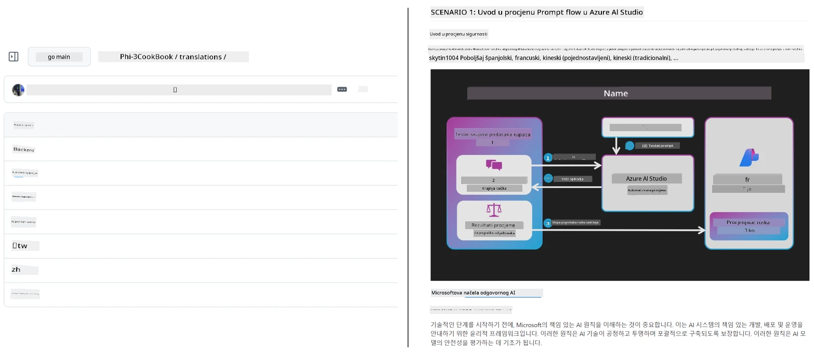
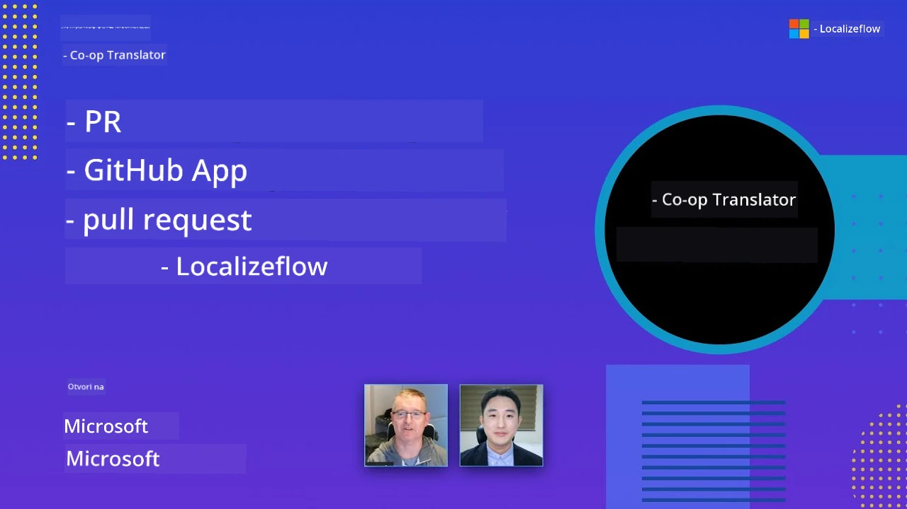

# Co-op Translator

_Lako automatizirajte i održavajte prijevode vašeg edukativnog GitHub sadržaja na više jezika dok vaš projekt napreduje._


[](https://pypi.org/project/co-op-translator/)
[](https://github.com/azure/co-op-translator/blob/main/LICENSE)
[](https://pepy.tech/project/co-op-translator)
[](https://pepy.tech/project/co-op-translator)
[](https://github.com/azure/co-op-translator/pkgs/container/co-op-translator)
[](https://github.com/psf/black)

[](https://GitHub.com/azure/co-op-translator/graphs/contributors/)
[](https://GitHub.com/azure/co-op-translator/issues/)
[](https://GitHub.com/azure/co-op-translator/pulls/)
[](http://makeapullrequest.com)

### 🌐 Podrška za više jezika

#### Podržano od [Co-op Translator](https://github.com/Azure/Co-op-Translator)

<!-- CO-OP TRANSLATOR LANGUAGES TABLE START -->
[Arabic](../ar/README.md) | [Bengali](../bn/README.md) | [Bulgarian](../bg/README.md) | [Burmese (Myanmar)](../my/README.md) | [Chinese (Simplified)](../zh-CN/README.md) | [Chinese (Traditional, Hong Kong)](../zh-HK/README.md) | [Chinese (Traditional, Macau)](../zh-MO/README.md) | [Chinese (Traditional, Taiwan)](../zh-TW/README.md) | [Croatian](./README.md) | [Czech](../cs/README.md) | [Danish](../da/README.md) | [Dutch](../nl/README.md) | [Estonian](../et/README.md) | [Finnish](../fi/README.md) | [French](../fr/README.md) | [German](../de/README.md) | [Greek](../el/README.md) | [Hebrew](../he/README.md) | [Hindi](../hi/README.md) | [Hungarian](../hu/README.md) | [Indonesian](../id/README.md) | [Italian](../it/README.md) | [Japanese](../ja/README.md) | [Kannada](../kn/README.md) | [Khmer](../km/README.md) | [Korean](../ko/README.md) | [Lithuanian](../lt/README.md) | [Malay](../ms/README.md) | [Malayalam](../ml/README.md) | [Marathi](../mr/README.md) | [Nepali](../ne/README.md) | [Nigerian Pidgin](../pcm/README.md) | [Norwegian](../no/README.md) | [Persian (Farsi)](../fa/README.md) | [Polish](../pl/README.md) | [Portuguese (Brazil)](../pt-BR/README.md) | [Portuguese (Portugal)](../pt-PT/README.md) | [Punjabi (Gurmukhi)](../pa/README.md) | [Romanian](../ro/README.md) | [Russian](../ru/README.md) | [Serbian (Cyrillic)](../sr/README.md) | [Slovak](../sk/README.md) | [Slovenian](../sl/README.md) | [Spanish](../es/README.md) | [Swahili](../sw/README.md) | [Swedish](../sv/README.md) | [Tagalog (Filipino)](../tl/README.md) | [Tamil](../ta/README.md) | [Telugu](../te/README.md) | [Thai](../th/README.md) | [Turkish](../tr/README.md) | [Ukrainian](../uk/README.md) | [Urdu](../ur/README.md) | [Vietnamese](../vi/README.md)

> **Preferirate li klonirati lokalno?**
>
> Ovaj repozitorij uključuje prijevode na preko 50 jezika, što značajno povećava veličinu preuzimanja. Za kloniranje bez prijevoda, koristite sparse checkout:
>
> **Bash / macOS / Linux:**
> ```bash
> git clone --filter=blob:none --sparse https://github.com/Azure/co-op-translator.git
> cd co-op-translator
> git sparse-checkout set --no-cone '/*' '!translations' '!translated_images'
> ```
>
> **CMD (Windows):**
> ```cmd
> git clone --filter=blob:none --sparse https://github.com/Azure/co-op-translator.git
> cd co-op-translator
> git sparse-checkout set --no-cone "/*" "!translations" "!translated_images"
> ```
>
> Ovo vam daje sve što vam treba za dovršetak tečaja s puno bržim preuzimanjem.
<!-- CO-OP TRANSLATOR LANGUAGES TABLE END -->

[](https://GitHub.com/azure/co-op-translator/watchers/)
[](https://GitHub.com/azure/co-op-translator/network/)
[](https://GitHub.com/azure/co-op-translator/stargazers/)

[](https://discord.gg/nTYy5BXMWG)

[](https://codespaces.new/azure/co-op-translator)

## Pregled

**Co-op Translator** vam pomaže jednostavno lokalizirati vaš edukativni GitHub sadržaj na više jezika.  
Kad ažurirate vaše Markdown datoteke, slike ili bilježnice, prijevodi se automatski sinkroniziraju, osiguravajući da vaš sadržaj ostane točan i ažuran za učenike širom svijeta.

Primjer kako je organiziran prevedeni sadržaj:



## Kako se upravlja stanjem prijevoda

Co-op Translator upravlja prevedenim sadržajem kao **verzioniranim softverskim artefaktima**,  
a ne kao statične datoteke.

Alat prati stanje prevedenih Markdown datoteka, slika i bilježnica  
koristeći **metapodatke s ograničenjem na jezik**.

Ovaj dizajn omogućuje Co-op Translatoru da:

- Pouzdano otkrije zastarjele prijevode  
- Polazi od konzistentnog tretmana Markdowna, slika i bilježnica  
- Sigurno skalira preko velikih, brzo mijenjajućih repozitorija s više jezika

Modeliranjem prijevoda kao upravljanih artefakata,  
prijevodni tijekovi rada prirodno se usklađuju s modernim praksama  
upravljanja softverskim ovisnostima i artefaktima.

→ [Kako se upravlja stanjem prijevoda](https://techcommunity.microsoft.com/blog/azuredevcommunityblog/rethinking-documentation-translation-treating-translations-as-versioned-software/4491755)


## Brzi početak

```bash
# Kreirajte i aktivirajte virtualno okruženje (preporučeno)
python -m venv .venv
# Windows
.venv\Scripts\activate
# macOS/Linux
source .venv/bin/activate
# Instalirajte paket
pip install co-op-translator
# Prevedi
translate -l "ko ja fr" -md
```

Docker:

```bash
# Povucite javnu sliku s GHCR-a
docker pull ghcr.io/azure/co-op-translator:latest
# Pokrenite s montiranom trenutnom mapom i pruženom .env datotekom (Bash/Zsh)
docker run --rm -it --env-file .env -v "${PWD}:/work" ghcr.io/azure/co-op-translator:latest -l "ko ja fr" -md
```

## Minimalna postavka

1. Provjerite imate li podržanu verziju Pythona (trenutno 3.10-3.12). U poetry (pyproject.toml) to se automatski rješava.
2. Kreirajte `.env` datoteku koristeći predložak: [.env.template](../../.env.template)
3. Konfigurirajte jednog LLM pružatelja (Azure OpenAI ili OpenAI)
4. (Neobavezno) Za prijevod slika (`-img`), konfigurirajte Azure AI Vision
5. (Neobavezno) Možete konfigurirati više skupova vjerodajnica dupliciranjem varijabli s sufiksima poput `_1`, `_2` itd. Sve varijable u jednom skupu moraju imati isti sufiks.
6. (Preporučeno) Očistite prethodne prijevode kako biste izbjegli sukobe (npr. `translations/`)
7. (Preporučeno) Dodajte odjeljak za prijevod u vaš README koristeći [README predložak jezika](./getting_started/README_languages_template.md)
8. Pogledajte: [Postavljanje Azure AI](./getting_started/set-up-azure-ai.md)

## Upotreba

Prevedite sve podržane tipove:

```bash
translate -l "ko ja"
```

Samo Markdown:

```bash
translate -l "de" -md
```

Markdown + slike:

```bash
translate -l "pt" -md -img
```

Samo bilježnice:

```bash
translate -l "zh" -nb
```

Više zastavica: [Referenca naredbi](./getting_started/command-reference.md)

## Značajke

- Automatizirani prijevod za Markdown, bilježnice i slike
- Održava prijevode sinkroniziranim sa izmjenama izvora
- Radi lokalno (CLI) ili u CI (GitHub Actions)
- Koristi Azure OpenAI ili OpenAI; opcionalno Azure AI Vision za slike
- Čuva formate i strukturu Markdowna

## Dokumentacija

- [Vodič za naredbeni redak](./getting_started/command-line-guide/command-line-guide.md)
- [Vodič za GitHub Actions (javni repozitoriji i standardni tajni ključevi)](./getting_started/github-actions-guide/github-actions-guide-public.md)
- [Vodič za GitHub Actions (Microsoftovi organizacijski repozitoriji i postavke na razini organizacije)](./getting_started/github-actions-guide/github-actions-guide-org.md)
- [README predložak jezika](./getting_started/README_languages_template.md)
- [Podržani jezici](./getting_started/supported-languages.md)
- [Doprinos](./CONTRIBUTING.md)
- [Rješavanje poteškoća](./getting_started/troubleshooting.md)

### Microsoft specifični vodič
> [!NOTE]
> Samo za održavatelje Microsoftovih repozitorija "Za početnike".

- [Ažuriranje liste "ostalih tečajeva" (samo za MS Beginners repozitorije)](./getting_started/update-other-courses.md)

## Podržite nas i potaknite globalno učenje

Pridružite se u revoluciji dijeljenja edukativnog sadržaja širom svijeta! Dajte [Co-op Translator](https://github.com/azure/co-op-translator) ⭐ na GitHubu i podržite našu misiju uklanjanja jezičnih barijera u učenju i tehnologiji. Vaše zanimanje i doprinosi imaju velik utjecaj! Kodni doprinosi i prijedlozi za značajke su uvijek dobrodošli.

### Istražite Microsoft edukativni sadržaj na svom jeziku

- [LangChain4j-for-Beginners](https://github.com/microsoft/LangChain4j-for-Beginners)
- [AZD for Beginners](https://github.com/microsoft/AZD-for-beginners)
- [Edge AI for Beginners](https://github.com/microsoft/edgeai-for-beginners)
- [Model Context Protocol (MCP) For Beginners](https://github.com/microsoft/mcp-for-beginners)
- [AI Agents for Beginners](https://github.com/microsoft/ai-agents-for-beginners)
- [Generative AI for Beginners using .NET](https://github.com/microsoft/Generative-AI-for-beginners-dotnet)
- [Generative AI for Beginners](https://github.com/microsoft/generative-ai-for-beginners)
- [Generative AI for Beginners using Java](https://github.com/microsoft/generative-ai-for-beginners-java)
- [ML for Beginners](https://aka.ms/ml-beginners)
- [Data Science for Beginners](https://aka.ms/datascience-beginners)
- [AI for Beginners](https://aka.ms/ai-beginners)
- [Cybersecurity for Beginners](https://github.com/microsoft/Security-101)
- [Web Dev for Beginners](https://aka.ms/webdev-beginners)
- [IoT for Beginners](https://aka.ms/iot-beginners)
- [PhiCookBook](https://github.com/microsoft/PhiCookBook)

## Video prezentacije

👉 Kliknite sliku ispod za gledanje na YouTube-u.

- **Open at Microsoft**: Kratki 18-minutni uvod i brzi vodič kako koristiti Co-op Translator.

  [](https://www.youtube.com/watch?v=jX_swfH_KNU)

## Doprinos

Ovaj projekt pozdravlja doprinose i prijedloge. Zainteresirani ste za doprinos Azure Co-op Translatoru? Molimo pogledajte naš [CONTRIBUTING.md](./CONTRIBUTING.md) za smjernice o tome kako možete pomoći da Co-op Translator bude pristupačniji.

## Doprinositelji
[](https://github.com/Azure/co-op-translator/graphs/contributors)

## Kodeks ponašanja

Ovaj projekt je usvojio [Microsoft Open Source Code of Conduct](https://opensource.microsoft.com/codeofconduct/).
Za više informacija pogledajte [Često postavljana pitanja o kodeksu ponašanja](https://opensource.microsoft.com/codeofconduct/faq/) ili
kontaktirajte [opencode@microsoft.com](mailto:opencode@microsoft.com) za dodatna pitanja ili komentare.

## Odgovorni AI

Microsoft je posvećen pomaganju našim korisnicima da odgovorno koriste naše AI proizvode, dijeleći svoja saznanja i gradeći partnerske odnose temeljene na povjerenju putem alata poput Transparency Notes i Impact Assessments. Mnogi od ovih resursa mogu se pronaći na [https://aka.ms/RAI](https://aka.ms/RAI).
Microsoftov pristup odgovornom AI temelji se na našim AI načelima pravičnosti, pouzdanosti i sigurnosti, privatnosti i zaštite, uključivosti, transparentnosti i odgovornosti.

Modeli velikih razmjera za prirodni jezik, slike i govor - kao oni korišteni u ovom primjeru - potencijalno se mogu ponašati na načine koji su nepravedni, nepouzdani ili uvredljivi, što može izazvati štetu. Molimo konzultirajte [Azure OpenAI service Transparency note](https://learn.microsoft.com/legal/cognitive-services/openai/transparency-note?tabs=text) kako biste bili informirani o rizicima i ograničenjima.

Preporučeni pristup za ublažavanje tih rizika je uključivanje sigurnosnog sustava u vašu arhitekturu koji može otkriti i spriječiti štetno ponašanje. [Azure AI Content Safety](https://learn.microsoft.com/azure/ai-services/content-safety/overview) pruža nezavisan sloj zaštite, sposoban otkriti štetni sadržaj koji je generiran od strane korisnika i AI-ja u aplikacijama i uslugama. Azure AI Content Safety uključuje API-je za tekst i slike koji vam omogućuju prepoznavanje štetnog materijala. Također imamo interaktivni Content Safety Studio koji vam omogućuje pregled, istraživanje i isprobavanje primjera koda za otkrivanje štetnog sadržaja kroz različite modalitete. Sljedeća [dokumentacija za brzo pokretanje](https://learn.microsoft.com/azure/ai-services/content-safety/quickstart-text?tabs=visual-studio%2Clinux&pivots=programming-language-rest) vodi vas kroz proces upita prema usluzi.

Još jedan aspekt koji treba uzeti u obzir je ukupna izvedba aplikacije. Kod višemodalnih i višemodelskih aplikacija, izvedba znači da sustav radi onako kako vi i vaši korisnici očekujete, uključujući da ne generira štetne rezultate. Važno je procijeniti izvedbu vaše ukupne aplikacije koristeći [mjere kvalitete generiranja i rizika i sigurnosti](https://learn.microsoft.com/azure/ai-studio/concepts/evaluation-metrics-built-in).

Možete evaluirati vašu AI aplikaciju u vašem razvojnom okruženju koristeći [prompt flow SDK](https://microsoft.github.io/promptflow/index.html). Bilo s testnim skupom podataka ili ciljem, generacije vaše generativne AI aplikacije kvantitativno se mjere ugrađenim evaluatorima ili prilagođenim evaluatorima po vašem izboru. Za početak s prompt flow sdk za procjenu vašeg sustava možete slijediti [vodič za brzo pokretanje](https://learn.microsoft.com/azure/ai-studio/how-to/develop/flow-evaluate-sdk). Nakon što izvršite evaluaciju, možete [vizualizirati rezultate u Azure AI Studio](https://learn.microsoft.com/azure/ai-studio/how-to/evaluate-flow-results).

## Zaštitni znakovi

Ovaj projekt može sadržavati zaštitne znakove ili logotipe za projekte, proizvode ili usluge. Ovlaštena upotreba Microsoftovih
zaštitnih znakova ili logotipa podliježe i mora se pridržavati
[Microsoftovih smjernica za zaštitne znakove i marke](https://www.microsoft.com/en-us/legal/intellectualproperty/trademarks/usage/general).
Upotreba Microsoftovih zaštitnih znakova ili logotipa u izmijenjenim verzijama ovog projekta ne smije dovesti do zabune niti implicirati sponzorstvo Microsofta.
Svaka uporaba zaštitnih znakova ili logotipa trećih strana podliježe pravilima tih trećih strana.

## Dobivanje pomoći

Ako zapnete ili imate bilo kakvih pitanja o izgradnji AI aplikacija, pridružite se:

[](https://discord.gg/nTYy5BXMWG)

Ako imate povratne informacije o proizvodu ili greške tijekom izrade posjetite:

[](https://aka.ms/foundry/forum)

---

<!-- CO-OP TRANSLATOR DISCLAIMER START -->
**Odricanje od odgovornosti**:  
Ovaj dokument preveden je korištenjem AI prevoditeljske usluge [Co-op Translator](https://github.com/Azure/co-op-translator). Iako nastojimo postići točnost, imajte na umu da automatski prijevodi mogu sadržavati pogreške ili netočnosti. Izvorni dokument na izvornom jeziku treba se smatrati autoritativnim izvorom. Za kritične informacije preporučuje se profesionalni ljudski prijevod. Nismo odgovorni za bilo kakve nesporazume ili pogrešne interpretacije koje proizlaze iz upotrebe ovog prijevoda.
<!-- CO-OP TRANSLATOR DISCLAIMER END -->