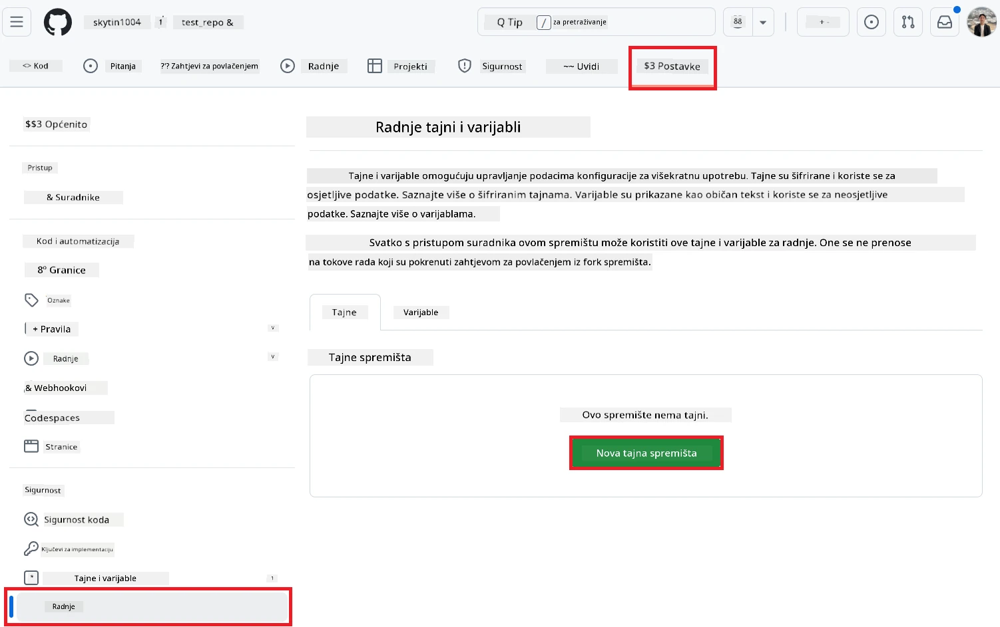
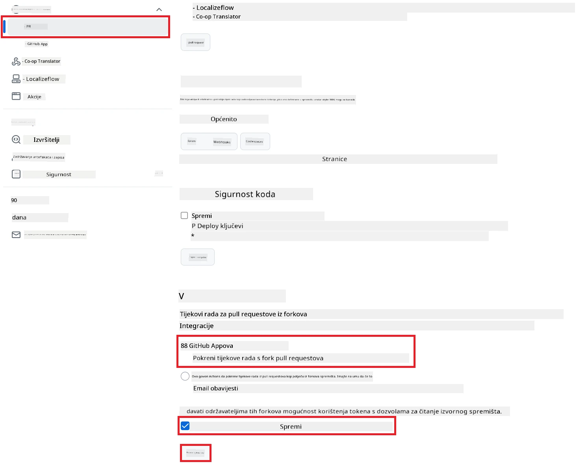

# Korištenje Co-op Translator GitHub Actiona (Javna postava)

**Ciljana publika:** Ovaj vodič namijenjen je korisnicima u većini javnih ili privatnih repozitorija gdje su standardne GitHub Actions dozvole dovoljne. Koristi ugrađeni `GITHUB_TOKEN`.

Automatizirajte prijevod dokumentacije vašeg repozitorija bez napora koristeći Co-op Translator GitHub Action. Ovaj vodič vas vodi kroz postavljanje akcije koja automatski stvara pull requestove s ažuriranim prijevodima svaki put kad se promijene izvorne Markdown datoteke ili slike.

> [!IMPORTANT]
>
> **Odabir pravog vodiča:**
>
> Ovaj vodič opisuje **jednostavnije postavljanje koristeći standardni `GITHUB_TOKEN`**. Ovo je preporučena metoda za većinu korisnika jer ne zahtijeva upravljanje osjetljivim privatnim ključevima GitHub aplikacije.
>

## Preduvjeti

Prije konfiguracije GitHub Actiona, osigurajte da imate spremne potrebne vjerodajnice AI servisa.

**1. Obavezno: Vjerodajnice AI jezičnog modela**
Potrebne su vam vjerodajnice za barem jedan podržani jezični model:

- **Azure OpenAI**: Potreban je Endpoint, API ključ, naziv modela/deploymenta, verzija API-ja.
- **OpenAI**: Potreban je API ključ, (Opcionalno: Org ID, Base URL, Model ID).
- Pogledajte [Podržani modeli i servisi](../../../../README.md) za detalje.

**2. Opcionalno: Vjerodajnice AI Vision (za prijevod slika)**

- Potrebno samo ako želite prevoditi tekst unutar slika.
- **Azure AI Vision**: Potreban je Endpoint i Subscription Key.
- Ako nije navedeno, akcija radi u [samo Markdown načinu](../markdown-only-mode.md).

## Postavljanje i konfiguracija

Slijedite ove korake za konfiguraciju Co-op Translator GitHub Actiona u vašem repozitoriju koristeći standardni `GITHUB_TOKEN`.

### Korak 1: Razumijevanje autentifikacije (Korištenje `GITHUB_TOKEN`)

Ovaj workflow koristi ugrađeni `GITHUB_TOKEN` koji pruža GitHub Actions. Ovaj token automatski daje dozvole workflowu za interakciju s vašim repozitorijem na temelju postavki konfiguriranih u **Koraku 3**.

### Korak 2: Konfigurirajte tajne repozitorija

Potrebno je dodati samo **vjerodajnice AI servisa** kao šifrirane tajne u postavkama repozitorija.

1.  Otvorite svoj ciljani GitHub repozitorij.
2.  Idite na **Settings** > **Secrets and variables** > **Actions**.
3.  Pod **Repository secrets**, kliknite **New repository secret** za svaku potrebnu AI tajnu navedenu dolje.

     *(Referenca slike: Prikazuje gdje dodati tajne)*

**Potrebne AI tajne (Dodajte SVE koje su relevantne prema vašim preduvjetima):**

| Naziv tajne                         | Opis                                      | Izvor vrijednosti                  |
| :---------------------------------- | :---------------------------------------- | :------------------------------- |
| `AZURE_AI_SERVICE_API_KEY`            | Ključ za Azure AI Service (Computer Vision)  | Vaš Azure AI Foundry               |
| `AZURE_AI_SERVICE_ENDPOINT`         | Endpoint za Azure AI Service (Computer Vision) | Vaš Azure AI Foundry               |
| `AZURE_OPENAI_API_KEY`              | Ključ za Azure OpenAI servis              | Vaš Azure AI Foundry               |
| `AZURE_OPENAI_ENDPOINT`             | Endpoint za Azure OpenAI servis           | Vaš Azure AI Foundry               |
| `AZURE_OPENAI_MODEL_NAME`           | Naziv vašeg Azure OpenAI modela           | Vaš Azure AI Foundry               |
| `AZURE_OPENAI_CHAT_DEPLOYMENT_NAME` | Naziv vašeg Azure OpenAI deploymenta      | Vaš Azure AI Foundry               |
| `AZURE_OPENAI_API_VERSION`          | Verzija API-ja za Azure OpenAI            | Vaš Azure AI Foundry               |
| `OPENAI_API_KEY`                    | API ključ za OpenAI                       | Vaša OpenAI platforma              |
| `OPENAI_ORG_ID`                     | OpenAI organizacijski ID (opcionalno)     | Vaša OpenAI platforma              |
| `OPENAI_CHAT_MODEL_ID`              | Specifični OpenAI model ID (opcionalno)   | Vaša OpenAI platforma              |
| `OPENAI_BASE_URL`                   | Prilagođeni OpenAI API Base URL (opcionalno) | Vaša OpenAI platforma              |

### Korak 3: Postavite dozvole workflowa

GitHub Actionu su potrebne dozvole putem `GITHUB_TOKEN` za preuzimanje koda i kreiranje pull requestova.

1.  U repozitoriju idite na **Settings** > **Actions** > **General**.
2.  Skrolajte do sekcije **Workflow permissions**.
3.  Odaberite **Read and write permissions**. Ovo daje `GITHUB_TOKEN` potrebne `contents: write` i `pull-requests: write` dozvole za ovaj workflow.
4.  Provjerite da je kvačica na **Allow GitHub Actions to create and approve pull requests** **uključena**.
5.  Kliknite **Save**.



### Korak 4: Kreirajte workflow datoteku

Na kraju, kreirajte YAML datoteku koja definira automatizirani workflow koristeći `GITHUB_TOKEN`.

1.  U korijenskom direktoriju repozitorija, kreirajte `.github/workflows/` direktorij ako ne postoji.
2.  Unutar `.github/workflows/`, kreirajte datoteku naziva `co-op-translator.yml`.
3.  Zalijepite sljedeći sadržaj u `co-op-translator.yml`.

```yaml
name: Co-op Translator

on:
  push:
    branches:
      - main

jobs:
  co-op-translator:
    runs-on: ubuntu-latest

    permissions:
      contents: write
      pull-requests: write

    steps:
      - name: Checkout repository
        uses: actions/checkout@v4
        with:
          fetch-depth: 0

      - name: Set up Python
        uses: actions/setup-python@v4
        with:
          python-version: '3.10'

      - name: Install Co-op Translator
        run: |
          python -m pip install --upgrade pip
          pip install co-op-translator

      - name: Run Co-op Translator
        env:
          PYTHONIOENCODING: utf-8
          # === AI Service Credentials ===
          AZURE_AI_SERVICE_API_KEY: ${{ secrets.AZURE_AI_SERVICE_API_KEY }}
          AZURE_AI_SERVICE_ENDPOINT: ${{ secrets.AZURE_AI_SERVICE_ENDPOINT }}
          AZURE_OPENAI_API_KEY: ${{ secrets.AZURE_OPENAI_API_KEY }}
          AZURE_OPENAI_ENDPOINT: ${{ secrets.AZURE_OPENAI_ENDPOINT }}
          AZURE_OPENAI_MODEL_NAME: ${{ secrets.AZURE_OPENAI_MODEL_NAME }}
          AZURE_OPENAI_CHAT_DEPLOYMENT_NAME: ${{ secrets.AZURE_OPENAI_CHAT_DEPLOYMENT_NAME }}
          AZURE_OPENAI_API_VERSION: ${{ secrets.AZURE_OPENAI_API_VERSION }}
          OPENAI_API_KEY: ${{ secrets.OPENAI_API_KEY }}
          OPENAI_ORG_ID: ${{ secrets.OPENAI_ORG_ID }}
          OPENAI_CHAT_MODEL_ID: ${{ secrets.OPENAI_CHAT_MODEL_ID }}
          OPENAI_BASE_URL: ${{ secrets.OPENAI_BASE_URL }}
        run: |
          # =====================================================================
          # IMPORTANT: Set your target languages here (REQUIRED CONFIGURATION)
          # =====================================================================
          # Example: Translate to Spanish, French, German. Add -y to auto-confirm.
          translate -l "es fr de" -y  # <--- MODIFY THIS LINE with your desired languages

      - name: Create Pull Request with translations
        uses: peter-evans/create-pull-request@v5
        with:
          token: ${{ secrets.GITHUB_TOKEN }}
          commit-message: "🌐 Update translations via Co-op Translator"
          title: "🌐 Update translations via Co-op Translator"
          body: |
            This PR updates translations for recent changes to the main branch.

            ### 📋 Changes included
            - Translated contents are available in the `translations/` directory
            - Translated images are available in the `translated_images/` directory

            ---
            🌐 Automatically generated by the [Co-op Translator](https://github.com/Azure/co-op-translator) GitHub Action.
          branch: update-translations
          base: main
          labels: translation, automated-pr
          delete-branch: true
          add-paths: |
            translations/
            translated_images/
```
4.  **Prilagodite workflow:**
  - **[!IMPORTANT] Ciljani jezici:** U koraku `Run Co-op Translator` **OBAVEZNO pregledajte i izmijenite popis jezičnih kodova** unutar naredbe `translate -l "..." -y` prema potrebama vašeg projekta. Primjer popisa (`ar de es...`) treba zamijeniti ili prilagoditi.
  - **Okidač (`on:`):** Trenutni okidač pokreće workflow na svaki push na `main`. Za velike repozitorije, razmislite o dodavanju `paths:` filtera (vidi komentirani primjer u YAML-u) kako bi se workflow pokretao samo kad se promijene relevantne datoteke (npr. izvorna dokumentacija), čime štedite vrijeme izvođenja.
  - **Detalji PR-a:** Prilagodite `commit-message`, `title`, `body`, naziv `branch`a i `labels` u koraku `Create Pull Request` po potrebi.

## Pokretanje workflowa

> [!WARNING]  
> **Ograničenje vremena za GitHub-hosted runner:**  
> GitHub-hosted runneri poput `ubuntu-latest` imaju **maksimalno vrijeme izvođenja od 6 sati**.  
> Za velike repozitorije s dokumentacijom, ako proces prevođenja premaši 6 sati, workflow će automatski biti prekinut.  
> Da biste to spriječili, razmislite o:  
> - Korištenju **self-hosted runnera** (nema ograničenja vremena)  
> - Smanjenju broja ciljanih jezika po pokretanju

Kada se datoteka `co-op-translator.yml` spoji na vaš glavni branch (ili branch naveden u `on:` okidaču), workflow će se automatski pokrenuti svaki put kad se promjene pošalju na taj branch (i odgovaraju `paths` filteru, ako je konfiguriran).

---

**Odricanje od odgovornosti**:
Ovaj dokument je preveden pomoću AI usluge za prevođenje [Co-op Translator](https://github.com/Azure/co-op-translator). Iako nastojimo osigurati točnost, imajte na umu da automatski prijevodi mogu sadržavati pogreške ili netočnosti. Izvorni dokument na svom izvornom jeziku treba smatrati mjerodavnim izvorom. Za ključne informacije preporučuje se profesionalni ljudski prijevod. Ne preuzimamo odgovornost za bilo kakva nesporazume ili pogrešna tumačenja koja proizlaze iz korištenja ovog prijevoda.