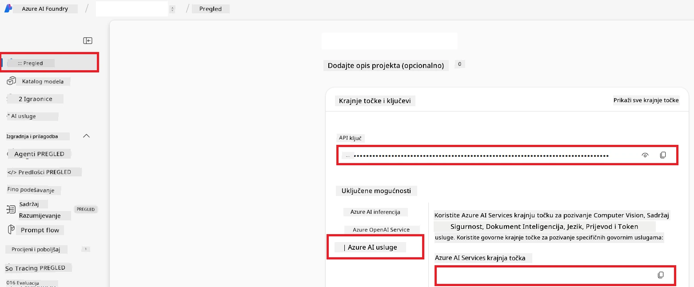

# Postavljanje Azure AI za Co-op Translator (Azure OpneAI & Azure AI Vision)

Ovaj vodič vodi vas kroz postavljanje Azure OpenAI za jezični prijevod i Azure Computer Vision za analizu sadržaja slike (koju zatim možete koristiti za prijevod temeljen na slici) unutar Azure AI Foundry.

**Preduvjeti:**
- Azure račun s aktivnom pretplatom.
- Dovoljna dopuštenja za kreiranje resursa i implementacija u vašoj Azure pretplati.

## Kreiranje Azure AI projekta

Počet ćete kreiranjem Azure AI projekta, koji djeluje kao središnje mjesto za upravljanje vašim AI resursima.

1. Idite na [https://ai.azure.com](https://ai.azure.com) i prijavite se sa svojim Azure računom.

1. Odaberite **+Create** za kreiranje novog projekta.

1. Obavite sljedeće zadatke:
   - Unesite **Ime projekta** (npr. `CoopTranslator-Project`).
   - Odaberite **AI hub** (npr. `CoopTranslator-Hub`) (ako je potrebno, kreirajte novi).

1. Kliknite "**Review and Create**" za postavljanje vašeg projekta. Bit ćete preusmjereni na preglednu stranicu vašeg projekta.

## Postavljanje Azure OpenAI za jezični prijevod

Unutar vašeg projekta implementirat ćete Azure OpenAI model koji će služiti kao pozadina za prijevod teksta.

### Otvorite svoj projekt

Ako već niste, otvorite novokreirani projekt (npr. `CoopTranslator-Project`) u Azure AI Foundry.

### Implementirajte OpenAI model

1. U lijevom izborniku svog projekta, pod "My assets", odaberite "**Models + endpoints**".

1. Odaberite **+ Deploy model**.

1. Odaberite **Deploy Base Model**.

1. Prikazat će vam se popis dostupnih modela. Filtrirajte ili pretražite odgovarajući GPT model. Preporučujemo `gpt-4o`.

1. Odaberite željeni model i kliknite **Confirm**.

1. Odaberite **Deploy**.

### Konfiguracija Azure OpenAI

Nakon implementacije, možete odabrati implementaciju sa stranice "**Models + endpoints**" da biste pronašli njezin **REST endpoint URL**, **Key**, **Ime implementacije**, **Ime modela** i **API verziju**. Tu će vam informacije trebati za integraciju modela prijevoda u vašu aplikaciju.

> [!NOTE]
> API verzije možete odabrati s [API version deprecation](https://learn.microsoft.com/azure/ai-services/openai/api-version-deprecation) stranice prema vašim potrebama. Imajte na umu da se **API verzija** razlikuje od **verzije modela** koja je prikazana na stranici **Models + endpoints** u Azure AI Foundry.

## Postavljanje Azure Computer Vision za prijevod teksta na slikama

Da biste omogućili prijevod teksta unutar slika, trebate pronaći Azure AI Service API ključ i Endpoint.

1. Idite u svoj Azure AI Projekt (npr. `CoopTranslator-Project`). Provjerite da ste na preglednoj stranici projekta.

### Konfiguracija Azure AI usluge

Pronađite API ključ i Endpoint na kartici Azure AI Service.

1. Idite u svoj Azure AI Projekt (npr. `CoopTranslator-Project`). Provjerite da ste na preglednoj stranici projekta.

1. Pronađite **API Key** i **Endpoint** na kartici Azure AI Service.

    

Ova veza omogućuje mogućnosti povezane Azure AI Services resursa (uključujući analizu slika) dostupnima vašem AI Foundry projektu. Zatim ovu vezu možete koristiti u svojim bilježnicama ili aplikacijama za izdvajanje teksta iz slika, koji se potom može poslati Azure OpenAI modelu radi prijevoda.

## Konsolidacija vaših vjerodajnica

Do sada biste trebali prikupiti sljedeće:

**Za Azure OpenAI (prijevod teksta):**
- Azure OpenAI Endpoint
- Azure OpenAI API ključ
- Naziv Azure OpenAI modela (npr. `gpt-4o`)
- Naziv Azure OpenAI implementacije (npr. `cooptranslator-gpt4o`)
- Azure OpenAI API verzija

**Za Azure AI usluge (izdvajanje teksta sa slika putem Vision):**
- Endpoint Azure AI usluge
- API ključ Azure AI usluge

### Primjer: Konfiguracija varijabli okoline (Preview)

Kasnije, pri izradi vaše aplikacije, vjerojatno ćete ga konfigurirati koristeći prikupljene vjerodajnice. Primjerice, mogli biste ih postaviti kao varijable okoline ovako:

```bash
# Azure AI vjerodajnice usluge (potrebno za prijevod slika)
AZURE_AI_SERVICE_API_KEY="your_azure_ai_service_api_key" # npr., 21xasd...
AZURE_AI_SERVICE_ENDPOINT="https://your_azure_ai_service_endpoint.cognitiveservices.azure.com/"

# Opcionalni rezervni skupovi: duplirajte varijable s nastavkom _1/_2 (isti indeks za sve varijable u skupu)
AZURE_AI_SERVICE_API_KEY_1="your_azure_ai_service_api_key_1"
AZURE_AI_SERVICE_ENDPOINT_1="https://your_azure_ai_service_endpoint_1.cognitiveservices.azure.com/"

# Azure OpenAI vjerodajnice (potrebno za prijevod teksta)
AZURE_OPENAI_API_KEY="your_azure_openai_api_key" # npr., 21xasd...
AZURE_OPENAI_ENDPOINT="https://your_azure_openai_endpoint.openai.azure.com/"
AZURE_OPENAI_MODEL_NAME="your_model_name" # npr., gpt-4o
AZURE_OPENAI_CHAT_DEPLOYMENT_NAME="your_deployment_name" # npr., cooptranslator-gpt4o
AZURE_OPENAI_API_VERSION="your_api_version" # npr., 2024-12-01-preview

# Opcionalni rezervni skupovi: duplirajte cijeli AZURE_OPENAI_* skup s nastavkom _1/_2 (isti indeks za sve varijable)
```

---

### Dodatna literatura

- [Kako kreirati projekt u Azure AI Foundry](https://learn.microsoft.com/azure/ai-foundry/how-to/create-projects?tabs=ai-studio)
- [Kako kreirati Azure AI resurse](https://learn.microsoft.com/azure/ai-foundry/how-to/create-azure-ai-resource?tabs=portal)
- [Kako implementirati OpenAI modele u Azure AI Foundry](https://learn.microsoft.com/en-us/azure/ai-foundry/how-to/deploy-models-openai)

---

<!-- CO-OP TRANSLATOR DISCLAIMER START -->
**Odricanje od odgovornosti**:  
Ovaj dokument je preveden pomoću AI usluge za prijevod [Co-op Translator](https://github.com/Azure/co-op-translator). Iako nastojimo biti točni, imajte na umu da automatski prijevodi mogu sadržavati pogreške ili netočnosti. Izvorni dokument na njegovom izvornom jeziku treba se smatrati autoritativnim izvorom. Za kritične informacije preporučuje se profesionalni ljudski prijevod. Ne snosimo odgovornost za bilo kakva nesporazuma ili pogrešne interpretacije koje proizlaze iz korištenja ovog prijevoda.
<!-- CO-OP TRANSLATOR DISCLAIMER END -->