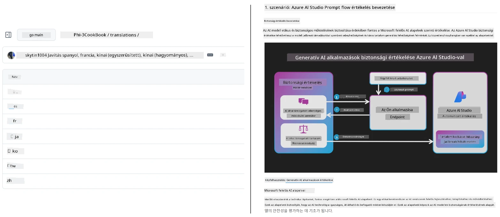
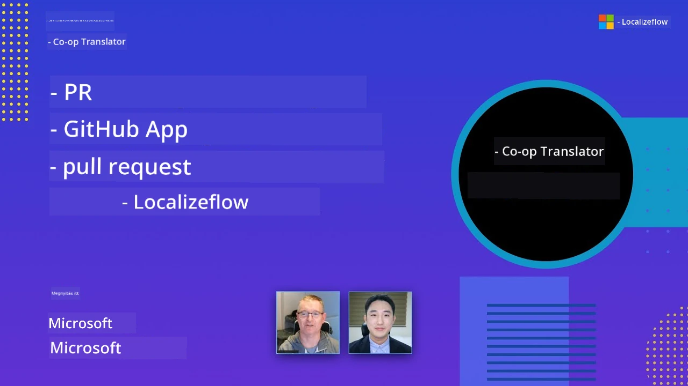

# Co-op Translator

_Könnyedén automatizálhatja és tarthatja karban az oktatási GitHub tartalmai fordításait több nyelven, miközben a projektje fejlődik._


[](https://pypi.org/project/co-op-translator/)
[](https://github.com/azure/co-op-translator/blob/main/LICENSE)
[](https://pepy.tech/project/co-op-translator)
[](https://pepy.tech/project/co-op-translator)
[](https://github.com/azure/co-op-translator/pkgs/container/co-op-translator)
[](https://github.com/psf/black)

[](https://GitHub.com/azure/co-op-translator/graphs/contributors/)
[](https://GitHub.com/azure/co-op-translator/issues/)
[](https://GitHub.com/azure/co-op-translator/pulls/)
[](http://makeapullrequest.com)

### 🌐 Többnyelvű támogatás

#### A [Co-op Translator](https://github.com/Azure/Co-op-Translator) támogatásával

<!-- CO-OP TRANSLATOR LANGUAGES TABLE START -->
[Arabic](../ar/README.md) | [Bengali](../bn/README.md) | [Bulgarian](../bg/README.md) | [Burmese (Myanmar)](../my/README.md) | [Chinese (Simplified)](../zh-CN/README.md) | [Chinese (Traditional, Hong Kong)](../zh-HK/README.md) | [Chinese (Traditional, Macau)](../zh-MO/README.md) | [Chinese (Traditional, Taiwan)](../zh-TW/README.md) | [Croatian](../hr/README.md) | [Czech](../cs/README.md) | [Danish](../da/README.md) | [Dutch](../nl/README.md) | [Estonian](../et/README.md) | [Finnish](../fi/README.md) | [French](../fr/README.md) | [German](../de/README.md) | [Greek](../el/README.md) | [Hebrew](../he/README.md) | [Hindi](../hi/README.md) | [Hungarian](./README.md) | [Indonesian](../id/README.md) | [Italian](../it/README.md) | [Japanese](../ja/README.md) | [Kannada](../kn/README.md) | [Khmer](../km/README.md) | [Korean](../ko/README.md) | [Lithuanian](../lt/README.md) | [Malay](../ms/README.md) | [Malayalam](../ml/README.md) | [Marathi](../mr/README.md) | [Nepali](../ne/README.md) | [Nigerian Pidgin](../pcm/README.md) | [Norwegian](../no/README.md) | [Persian (Farsi)](../fa/README.md) | [Polish](../pl/README.md) | [Portuguese (Brazil)](../pt-BR/README.md) | [Portuguese (Portugal)](../pt-PT/README.md) | [Punjabi (Gurmukhi)](../pa/README.md) | [Romanian](../ro/README.md) | [Russian](../ru/README.md) | [Serbian (Cyrillic)](../sr/README.md) | [Slovak](../sk/README.md) | [Slovenian](../sl/README.md) | [Spanish](../es/README.md) | [Swahili](../sw/README.md) | [Swedish](../sv/README.md) | [Tagalog (Filipino)](../tl/README.md) | [Tamil](../ta/README.md) | [Telugu](../te/README.md) | [Thai](../th/README.md) | [Turkish](../tr/README.md) | [Ukrainian](../uk/README.md) | [Urdu](../ur/README.md) | [Vietnamese](../vi/README.md)

> **Inkább helyileg szeretné klónozni?**
>
> Ez a tárhely 50+ nyelvi fordítást tartalmaz, ami jelentősen növeli a letöltési méretet. A fordítások nélküli klónozáshoz használja a sparse checkoutot:
>
> **Bash / macOS / Linux:**
> ```bash
> git clone --filter=blob:none --sparse https://github.com/skytin1004/co-op-translator.git
> cd co-op-translator
> git sparse-checkout set --no-cone '/*' '!translations' '!translated_images'
> ```
>
> **CMD (Windows):**
> ```cmd
> git clone --filter=blob:none --sparse https://github.com/skytin1004/co-op-translator.git
> cd co-op-translator
> git sparse-checkout set --no-cone "/*" "!translations" "!translated_images"
> ```
>
> Ezzel mindent megkap, amire szüksége van a tanfolyam elvégzéséhez jóval gyorsabb letöltéssel.
<!-- CO-OP TRANSLATOR LANGUAGES TABLE END -->

[](https://GitHub.com/azure/co-op-translator/watchers/)
[](https://GitHub.com/azure/co-op-translator/network/)
[](https://GitHub.com/azure/co-op-translator/stargazers/)

[](https://discord.gg/nTYy5BXMWG)

[](https://codespaces.new/azure/co-op-translator)

## Áttekintés

A **Co-op Translator** segít, hogy oktatási GitHub tartalmait több nyelvre könnyedén lokalizálja.  
Ha frissíti a Markdown fájlokat, képeket vagy jegyzetfüzeteket, a fordítások automatikusan szinkronban maradnak, így tartalma pontos és naprakész marad a világ minden táján tanulók számára.

Példa arra, hogyan van rendezve a lefordított tartalom:



## Hogyan kezeli a fordítási állapotot

A Co-op Translator a lefordított tartalmakat **verziózott szoftveres elemekként** kezeli,  
nem statikus fájlokként.

Az eszköz a lefordított Markdown, képek és jegyzetfüzetek állapotát **nyelvi szintű metaadatokkal** követi nyomon.

Ez a kialakítás lehetővé teszi a Co-op Translator számára hogy:

- Megbízhatóan észlelje az elavult fordításokat
- Egységesen kezelje a Markdown, képek és jegyzetfüzeteket
- Biztonságosan skálázódjon nagy, gyorsan változó, többnyelvű tárolók esetében

Mivel a fordításokat kezelt elemekként modellezi,  
a fordítási munkafolyamatok természetes módon illeszkednek a modern  
szoftverfüggőségi és elemkezelési gyakorlatokhoz.

→ [Hogyan kezeli a fordítási állapotot](https://techcommunity.microsoft.com/blog/azuredevcommunityblog/rethinking-documentation-translation-treating-translations-as-versioned-software/4491755)


## Gyors kezdés

```bash
# Hozzon létre és aktiváljon egy virtuális környezetet (ajánlott)
python -m venv .venv
# Windows
.venv\Scripts\activate
# macOS/Linux
source .venv/bin/activate
# Telepítse a csomagot
pip install co-op-translator
# Fordítás
translate -l "ko ja fr" -md
```

Docker:

```bash
# Húzza le a nyilvános képet a GHCR-ről
docker pull ghcr.io/azure/co-op-translator:latest
# Futtassa az aktuális mappát csatolva és .env fájl biztosítva (Bash/Zsh)
docker run --rm -it --env-file .env -v "${PWD}:/work" ghcr.io/azure/co-op-translator:latest -l "ko ja fr" -md
```

## Minimális beállítás

1. Győződjön meg róla, hogy támogatott Python verziót használ (jelenleg 3.10-3.12). Poetry (pyproject.toml) esetén ez automatikusan kezelve van.
2. Hozzon létre egy `.env` fájlt a sablon alapján: [.env.template](../../.env.template)
3. Konfiguráljon egy LLM szolgáltatót (Azure OpenAI vagy OpenAI)
4. (Opcionális) Képfordításhoz (`-img`) állítsa be az Azure AI Vision szolgáltatást
5. (Opcionális) Több hitelesítő adat készlet is beállítható duplikált változókkal, mint például `_1`, `_2` stb. Minden változónak ugyanazzal a kiegészítéssel kell rendelkeznie egy készleten belül.
6. (Ajánlott) Tisztítsa meg a korábbi fordításokat az esetleges ütközések elkerülése érdekében (pl. `translations/`)
7. (Ajánlott) Adjon hozzá egy fordítási szekciót a README-hez a [README nyelvi sablon](./getting_started/README_languages_template.md) segítségével
8. Lásd: [Azure AI beállítása](./getting_started/set-up-azure-ai.md)

## Használat

Fordítsa le az összes támogatott típust:

```bash
translate -l "ko ja"
```

Csak Markdown:

```bash
translate -l "de" -md
```

Markdown + képek:

```bash
translate -l "pt" -md -img
```

Csak jegyzetfüzetek:

```bash
translate -l "zh" -nb
```

További kapcsolók: [Parancsok referencia](./getting_started/command-reference.md)

## Jellemzők

- Automatikus fordítás Markdown, jegyzetfüzetek és képek esetén
- A fordítások szinkronban tartása a forrásváltozásokkal
- Működik helyben (CLI) vagy CI-ben (GitHub Actions)
- Használja az Azure OpenAI vagy OpenAI szolgáltatást; opcionálisan Azure AI Vision-t képekhez
- Megőrzi a Markdown formázást és struktúrát

## Dokumentáció

- [Parancssori útmutató](./getting_started/command-line-guide/command-line-guide.md)
- [GitHub Actions útmutató (Publikus tárolók és standard titkok)](./getting_started/github-actions-guide/github-actions-guide-public.md)
- [GitHub Actions útmutató (Microsoft szervezeti tárolók és szervezeti szintű beállítások)](./getting_started/github-actions-guide/github-actions-guide-org.md)
- [README nyelvi sablon](./getting_started/README_languages_template.md)
- [Támogatott nyelvek](./getting_started/supported-languages.md)
- [Hozzájárulás](./CONTRIBUTING.md)
- [Hibaelhárítás](./getting_started/troubleshooting.md)

### Microsoft-specifikus útmutató
> [!NOTE]
> Csak a Microsoft „Kezdőknek” tárolók fenntartói számára.

- [„Más tanfolyamok” lista frissítése (csak MS Kezdő tárolókhoz)](./getting_started/update-other-courses.md)

## Támogass minket és ösztönözd a globális tanulást

Csatlakozz hozzánk, hogy forradalmasítsuk az oktatási tartalmak globális megosztását! Adj egy ⭐-t a [Co-op Translator](https://github.com/azure/co-op-translator) projektnek a GitHubon, és támogasd küldetésünket, hogy ledöntsük a nyelvi akadályokat a tanulás és a technológia területén. Az érdeklődésed és hozzájárulásaid jelentős hatással vannak! Kódhozzájárulásokat és funkciójavaslatokat mindig szívesen fogadunk.

### Fedezd fel a Microsoft oktatási tartalmait a saját nyelveden

- [LangChain4j-for-Beginners](https://github.com/microsoft/LangChain4j-for-Beginners)
- [AZD for Beginners](https://github.com/microsoft/AZD-for-beginners)
- [Edge AI for Beginners](https://github.com/microsoft/edgeai-for-beginners)
- [Model Context Protocol (MCP) For Beginners](https://github.com/microsoft/mcp-for-beginners)
- [AI Agents for Beginners](https://github.com/microsoft/ai-agents-for-beginners)
- [Generative AI for Beginners using .NET](https://github.com/microsoft/Generative-AI-for-beginners-dotnet)
- [Generative AI for Beginners](https://github.com/microsoft/generative-ai-for-beginners)
- [Generative AI for Beginners using Java](https://github.com/microsoft/generative-ai-for-beginners-java)
- [ML for Beginners](https://aka.ms/ml-beginners)
- [Data Science for Beginners](https://aka.ms/datascience-beginners)
- [AI for Beginners](https://aka.ms/ai-beginners)
- [Cybersecurity for Beginners](https://github.com/microsoft/Security-101)
- [Web Dev for Beginners](https://aka.ms/webdev-beginners)
- [IoT for Beginners](https://aka.ms/iot-beginners)
- [PhiCookBook](https://github.com/microsoft/PhiCookBook)

## Videó bemutatók

👉 Kattintson az alábbi képre a YouTube megtekintéséhez.

- **Open at Microsoft**: Egy rövid, 18 perces bevezető és gyors útmutató a Co-op Translator használatához.

  [](https://www.youtube.com/watch?v=jX_swfH_KNU)

## Hozzájárulás

Ez a projekt szívesen fogad hozzájárulásokat és javaslatokat. Érdekli, hogy hozzájáruljon az Azure Co-op Translatorhoz? Kérjük, tekintse meg a [CONTRIBUTING.md](./CONTRIBUTING.md) dokumentumot a Co-op Translator szélesebb körű elérhetőségének támogatásához.

## Közreműködők
[](https://github.com/Azure/co-op-translator/graphs/contributors)

## Magatartási kódex

Ez a projekt elfogadta a [Microsoft Nyílt Forráskódú Magatartási Kódexét](https://opensource.microsoft.com/codeofconduct/).
További információkért lásd a [Magatartási kódex GYIK](https://opensource.microsoft.com/codeofconduct/faq/) oldalt, vagy
keresse a [opencode@microsoft.com](mailto:opencode@microsoft.com) címet további kérdésekkel vagy észrevételekkel.

## Felelős mesterséges intelligencia

A Microsoft elkötelezett amellett, hogy ügyfeleinket felelősségteljesen segítsük mesterséges intelligencia termékeink használatában, megosszuk tapasztalatainkat, és bizalomra épülő partnerségeket építsünk olyan eszközökön keresztül, mint az Átláthatósági Jegyzetek és Hatásértékelések. Ezen erőforrások nagy része megtalálható a [https://aka.ms/RAI](https://aka.ms/RAI) oldalon.
A Microsoft felelős mesterséges intelligenciához való hozzáállása az igazságosság, megbízhatóság és biztonság, adatvédelem és biztonság, befogadás, átláthatóság és elszámoltathatóság AI elvein alapul.

A nagyszabású természetes nyelvi, képi és beszédbeli modellek — mint amilyenek ebben a mintában is használatosak — potenciálisan igazságtalan, megbízhatatlan vagy sértő módon viselkedhetnek, ami károkat okozhat. Kérjük, tekintse meg az [Azure OpenAI szolgáltatás Átláthatósági jegyzetét](https://learn.microsoft.com/legal/cognitive-services/openai/transparency-note?tabs=text), hogy tájékozódjon a kockázatokról és korlátokról.

A kockázatok enyhítésére ajánlott megközelítés, hogy tartalmazzon egy biztonsági rendszert az architektúrájában, amely képes észlelni és megelőzni a káros viselkedést. Az [Azure AI Tartalombiztonság](https://learn.microsoft.com/azure/ai-services/content-safety/overview) egy független védelmi réteget biztosít, amely képes felismerni a káros felhasználói és AI által generált tartalmat az alkalmazásokban és szolgáltatásokban. Az Azure AI Tartalombiztonság tartalmaz szöveg- és képi API-kat, amelyekkel felderítheti a káros anyagokat. Emellett rendelkezünk egy interaktív Tartalombiztonsági Stúdióval, amely lehetővé teszi a káros tartalom különböző modalitások szerinti észleléséhez szolgáló minta kódok megtekintését, felfedezését és kipróbálását. A következő [gyorstalpaló dokumentáció](https://learn.microsoft.com/azure/ai-services/content-safety/quickstart-text?tabs=visual-studio%2Clinux&pivots=programming-language-rest) végigvezeti a szolgáltatásnak szánt kérések készítésében.

Egy másik fontos szempont az alkalmazás teljesítménye. Többmodális és többmodell alkalmazások esetén a teljesítményt úgy értjük, hogy a rendszer úgy működik, ahogy Ön és felhasználói elvárják, beleértve azt is, hogy nem generál káros kimeneteket. Fontos az alkalmazás teljesítményének értékelése a [generálási minőség és kockázat- és biztonsági mérőszámok segítségével](https://learn.microsoft.com/azure/ai-studio/concepts/evaluation-metrics-built-in).

AI-alkalmazását értékelheti fejlesztési környezetében a [prompt flow SDK](https://microsoft.github.io/promptflow/index.html) segítségével. Adjon meg tesztadatokat vagy célt, és generatív AI alkalmazása generálásai mennyiségileg mérhetők beépített vagy egyedi értékelőkkel. Kezdéshez a prompt flow SDK-val az értékeléshez kövesse a [gyorstalpaló útmutatót](https://learn.microsoft.com/azure/ai-studio/how-to/develop/flow-evaluate-sdk). Értékelési futtatás végrehajtását követően az eredményeket [megjelenítheti az Azure AI Studioban](https://learn.microsoft.com/azure/ai-studio/how-to/evaluate-flow-results).

## Védjegyek

Ez a projekt tartalmazhat védjegyeket vagy logókat projektekhez, termékekhez vagy szolgáltatásokhoz. A Microsoft
védjegyek vagy logók engedélyezett használata a
[Microsoft védjegy- és márkairányelveinek](https://www.microsoft.com/en-us/legal/intellectualproperty/trademarks/usage/general) betartását igényli.
A Microsoft védjegyek vagy logók módosított változatokban történő használata nem okozhat zavart, illetve nem sugallhat Microsoft támogatást.
Harmadik fél védjegyeinek vagy logóinak használata a harmadik fél szabályzatainak alá tartozik.

## Segítségkérés

Ha elakad vagy kérdése van AI alkalmazások fejlesztésével kapcsolatban, csatlakozzon:

[](https://discord.gg/nTYy5BXMWG)

Ha termék visszajelzést vagy hibákat tapasztal fejlesztés közben, látogassa meg:

[](https://aka.ms/foundry/forum)

---

<!-- CO-OP TRANSLATOR DISCLAIMER START -->
**Nyilatkozat**:  
Ezt a dokumentumot az AI fordító szolgáltatás, a [Co-op Translator](https://github.com/Azure/co-op-translator) segítségével fordítottuk le. Bár az pontosságra törekszünk, kérjük, vegye figyelembe, hogy az automatikus fordítások hibákat vagy pontatlanságokat tartalmazhatnak. Az eredeti dokumentum a saját nyelvén tekintendő hiteles forrásnak. Kritikus információk esetén professzionális emberi fordítást javasolunk. Nem vállalunk felelősséget az ebből a fordításból eredő félreértésekért vagy téves értelmezésekért.
<!-- CO-OP TRANSLATOR DISCLAIMER END -->