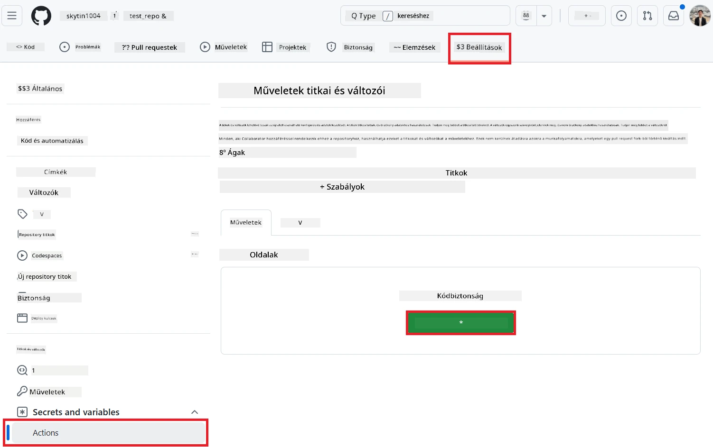
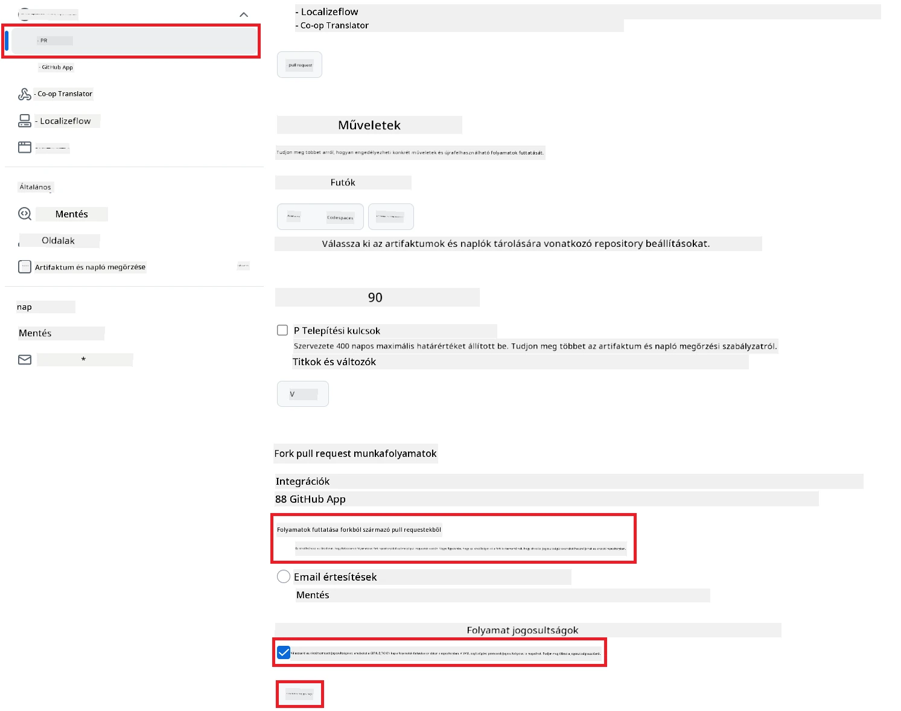

# A Co-op Translator GitHub Action használata (Nyilvános beállítás)

**Célközönség:** Ez az útmutató azoknak szól, akik nyilvános vagy privát repókban dolgoznak, ahol a szokásos GitHub Actions jogosultságok elegendőek. A beépített `GITHUB_TOKEN`-t használja.

Automatizáld a repód dokumentációjának fordítását egyszerűen a Co-op Translator GitHub Action segítségével. Ez az útmutató lépésről lépésre bemutatja, hogyan állítsd be az actiont, hogy automatikusan létrehozzon pull requesteket a frissített fordításokkal, amikor a forrás Markdown fájlok vagy képek módosulnak.

> [!IMPORTANT]
>
> **A megfelelő útmutató kiválasztása:**
>
> Ez az útmutató a **egyszerűbb beállítást mutatja be a szokásos `GITHUB_TOKEN` használatával**. Ez a legtöbb felhasználónak ajánlott, mivel nem kell érzékeny GitHub App Private Key-eket kezelni.
>

## Előfeltételek

Mielőtt beállítanád a GitHub Actiont, győződj meg róla, hogy rendelkezel a szükséges AI szolgáltatás hitelesítő adataival.

**1. Szükséges: AI nyelvi modell hitelesítő adatok**
Legalább egy támogatott nyelvi modellhez szükséged lesz hitelesítő adatokra:

- **Azure OpenAI**: Endpoint, API kulcs, Modell/Deployment nevek, API verzió szükséges.
- **OpenAI**: API kulcs, (Opcionális: Org ID, Base URL, Modell ID).
- Részletekért lásd: [Támogatott modellek és szolgáltatások](../../../../README.md).

**2. Opcionális: AI Vision hitelesítő adatok (képek fordításához)**

- Csak akkor szükséges, ha képeken lévő szöveget is fordítani szeretnél.
- **Azure AI Vision**: Endpoint és Subscription Key szükséges.
- Ha nem adod meg, az action [csak Markdown módot](../markdown-only-mode.md) használ.

## Beállítás és konfiguráció

Kövesd az alábbi lépéseket a Co-op Translator GitHub Action beállításához a repódban a szokásos `GITHUB_TOKEN` használatával.

### 1. lépés: Hitelesítés megértése (`GITHUB_TOKEN` használata)

Ez a workflow a GitHub Actions által biztosított beépített `GITHUB_TOKEN`-t használja. Ez a token automatikusan megadja a szükséges jogosultságokat a workflow-nak, hogy a repóddal dolgozzon, a **3. lépésben** beállítottak szerint.

### 2. lépés: Repó titkok konfigurálása

Csak az **AI szolgáltatás hitelesítő adataidat** kell titkosított titokként hozzáadni a repó beállításaihoz.

1.  Nyisd meg a cél GitHub repódat.
2.  Menj a **Settings** > **Secrets and variables** > **Actions** menüpontra.
3.  A **Repository secrets** alatt kattints a **New repository secret** gombra minden szükséges AI szolgáltatás titokhoz az alábbiak közül.

     *(Kép: Itt tudsz titkokat hozzáadni)*

**Szükséges AI szolgáltatás titkok (Add hozzá mindet, ami az előfeltételeid alapján kell):**

| Titok neve                         | Leírás                               | Érték forrása                     |
| :---------------------------------- | :----------------------------------- | :------------------------------- |
| `AZURE_AI_SERVICE_API_KEY`            | Azure AI Service kulcs (Computer Vision)  | Azure AI Foundry-dban találod               |
| `AZURE_AI_SERVICE_ENDPOINT`         | Azure AI Service endpoint (Computer Vision) | Azure AI Foundry-dban találod               |
| `AZURE_OPENAI_API_KEY`              | Azure OpenAI szolgáltatás kulcsa              | Azure AI Foundry-dban találod               |
| `AZURE_OPENAI_ENDPOINT`             | Azure OpenAI szolgáltatás endpointja         | Azure AI Foundry-dban találod               |
| `AZURE_OPENAI_MODEL_NAME`           | Azure OpenAI modell neve              | Azure AI Foundry-dban találod               |
| `AZURE_OPENAI_CHAT_DEPLOYMENT_NAME` | Azure OpenAI deployment neve         | Azure AI Foundry-dban találod               |
| `AZURE_OPENAI_API_VERSION`          | Azure OpenAI API verzió              | Azure AI Foundry-dban találod               |
| `OPENAI_API_KEY`                    | OpenAI API kulcs                        | OpenAI Platformodon              |
| `OPENAI_ORG_ID`                     | OpenAI szervezet ID (Opcionális)         | OpenAI Platformodon              |
| `OPENAI_CHAT_MODEL_ID`              | Konkrét OpenAI modell ID (Opcionális)       | OpenAI Platformodon              |
| `OPENAI_BASE_URL`                   | Egyedi OpenAI API Base URL (Opcionális)     | OpenAI Platformodon              |

### 3. lépés: Workflow jogosultságok beállítása

A GitHub Actionnek jogosultságot kell adni a `GITHUB_TOKEN`-on keresztül, hogy ki tudja csekkolni a kódot és pull requesteket tudjon létrehozni.

1.  A repódban menj a **Settings** > **Actions** > **General** menüpontra.
2.  Görgess le a **Workflow permissions** szekcióhoz.
3.  Válaszd a **Read and write permissions** lehetőséget. Ez megadja a szükséges `contents: write` és `pull-requests: write` jogosultságokat a workflow-nak.
4.  Győződj meg róla, hogy a **Allow GitHub Actions to create and approve pull requests** jelölőnégyzet **be van pipálva**.
5.  Kattints a **Save** gombra.



### 4. lépés: Workflow fájl létrehozása

Végül hozd létre a YAML fájlt, ami definiálja az automatizált workflow-t a `GITHUB_TOKEN` használatával.

1.  A repód gyökérkönyvtárában hozd létre a `.github/workflows/` mappát, ha még nincs.
2.  A `.github/workflows/` mappában hozz létre egy `co-op-translator.yml` nevű fájlt.
3.  Illeszd be az alábbi tartalmat a `co-op-translator.yml`-be.

```yaml
name: Co-op Translator

on:
  push:
    branches:
      - main

jobs:
  co-op-translator:
    runs-on: ubuntu-latest

    permissions:
      contents: write
      pull-requests: write

    steps:
      - name: Checkout repository
        uses: actions/checkout@v4
        with:
          fetch-depth: 0

      - name: Set up Python
        uses: actions/setup-python@v4
        with:
          python-version: '3.10'

      - name: Install Co-op Translator
        run: |
          python -m pip install --upgrade pip
          pip install co-op-translator

      - name: Run Co-op Translator
        env:
          PYTHONIOENCODING: utf-8
          # === AI Service Credentials ===
          AZURE_AI_SERVICE_API_KEY: ${{ secrets.AZURE_AI_SERVICE_API_KEY }}
          AZURE_AI_SERVICE_ENDPOINT: ${{ secrets.AZURE_AI_SERVICE_ENDPOINT }}
          AZURE_OPENAI_API_KEY: ${{ secrets.AZURE_OPENAI_API_KEY }}
          AZURE_OPENAI_ENDPOINT: ${{ secrets.AZURE_OPENAI_ENDPOINT }}
          AZURE_OPENAI_MODEL_NAME: ${{ secrets.AZURE_OPENAI_MODEL_NAME }}
          AZURE_OPENAI_CHAT_DEPLOYMENT_NAME: ${{ secrets.AZURE_OPENAI_CHAT_DEPLOYMENT_NAME }}
          AZURE_OPENAI_API_VERSION: ${{ secrets.AZURE_OPENAI_API_VERSION }}
          OPENAI_API_KEY: ${{ secrets.OPENAI_API_KEY }}
          OPENAI_ORG_ID: ${{ secrets.OPENAI_ORG_ID }}
          OPENAI_CHAT_MODEL_ID: ${{ secrets.OPENAI_CHAT_MODEL_ID }}
          OPENAI_BASE_URL: ${{ secrets.OPENAI_BASE_URL }}
        run: |
          # =====================================================================
          # IMPORTANT: Set your target languages here (REQUIRED CONFIGURATION)
          # =====================================================================
          # Example: Translate to Spanish, French, German. Add -y to auto-confirm.
          translate -l "es fr de" -y  # <--- MODIFY THIS LINE with your desired languages

      - name: Create Pull Request with translations
        uses: peter-evans/create-pull-request@v5
        with:
          token: ${{ secrets.GITHUB_TOKEN }}
          commit-message: "🌐 Update translations via Co-op Translator"
          title: "🌐 Update translations via Co-op Translator"
          body: |
            This PR updates translations for recent changes to the main branch.

            ### 📋 Changes included
            - Translated contents are available in the `translations/` directory
            - Translated images are available in the `translated_images/` directory

            ---
            🌐 Automatically generated by the [Co-op Translator](https://github.com/Azure/co-op-translator) GitHub Action.
          branch: update-translations
          base: main
          labels: translation, automated-pr
          delete-branch: true
          add-paths: |
            translations/
            translated_images/
```
4.  **Workflow testreszabása:**
  - **[!IMPORTANT] Cél nyelvek:** A `Run Co-op Translator` lépésben **FELTÉTLENÜL ellenőrizd és módosítsd a nyelvi kódok listáját** a `translate -l "..." -y` parancsban, hogy megfeleljen a projekted igényeinek. A példa lista (`ar de es...`) csak minta, cseréld vagy egészítsd ki.
  - **Trigger (`on:`):** Jelenleg minden `main` branchre történő pushra fut le. Nagy repók esetén érdemes `paths:` szűrőt hozzáadni (lásd a YAML-ban a kommentelt példát), hogy csak releváns fájlok (pl. forrás dokumentáció) módosításakor fusson, így spórolhatsz runner perceket.
  - **PR részletek:** Testreszabhatod a `commit-message`, `title`, `body`, `branch` nevét és a `labels`-t a `Create Pull Request` lépésben, ha szükséges.

## A workflow futtatása

> [!WARNING]  
> **GitHub-hosted Runner időkorlát:**  
> A GitHub által biztosított futtatók, mint az `ubuntu-latest`, **maximum 6 óráig futtathatók**.  
> Ha a fordítás nagy dokumentációs repóban 6 óránál tovább tart, a workflow automatikusan leáll.  
> Ennek elkerülésére:  
> - Használj **saját futtatót** (nincs időkorlát)  
> - Csökkentsd a futtatott cél nyelvek számát

Miután a `co-op-translator.yml` fájlt beolvasztottad a main branchbe (vagy abba, amit a `on:` triggerben megadtál), a workflow automatikusan lefut, amikor változásokat pusholsz abba a branchbe (és megfelel a `paths` szűrőnek, ha beállítottad).

---

**Jogi nyilatkozat**:
Ez a dokumentum az AI fordítási szolgáltatás, a [Co-op Translator](https://github.com/Azure/co-op-translator) segítségével készült. Bár törekszünk a pontosságra, kérjük, vegye figyelembe, hogy az automatikus fordítások hibákat vagy pontatlanságokat tartalmazhatnak. Az eredeti dokumentum eredeti nyelvén tekintendő hiteles forrásnak. Kritikus információk esetén javasoljuk a professzionális, emberi fordítást. Nem vállalunk felelősséget a fordítás használatából eredő félreértésekért vagy félreértelmezésekért.