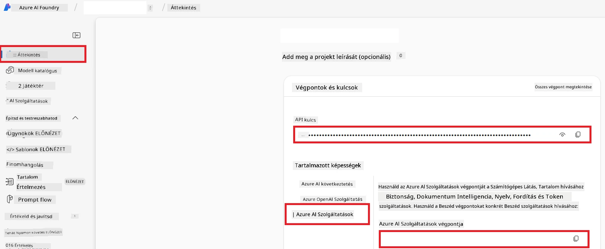

# Azure AI beállítása a Co-op Translatorhoz (Azure OpneAI és Azure AI Vision)

Ez az útmutató végigvezeti Önt az Azure OpenAI nyelvi fordításhoz és az Azure Computer Vision képtartalom elemzéshez (amelyet képalapú fordításhoz lehet használni) történő beállításán az Azure AI Foundry-n belül.

**Előfeltételek:**
- Azure-fiók aktív előfizetéssel.
- Elégséges jogosultságok az erőforrások és telepítések létrehozásához az Azure-előfizetésében.

## Azure AI projekt létrehozása

Először hozzon létre egy Azure AI projektet, amely központi helyet biztosít az AI erőforrások kezeléséhez.

1. Lépjen a [https://ai.azure.com](https://ai.azure.com) oldalra, és jelentkezzen be Azure-fiókjával.

1. Válassza az **+Create** lehetőséget egy új projekt létrehozásához.

1. Végezze el a következő feladatokat:
   - Adja meg a **Project name**-t (pl. `CoopTranslator-Project`).
   - Válassza ki az **AI hub**-ot (pl. `CoopTranslator-Hub`) (Szükség esetén hozzon létre újat).

1. Kattintson a "**Review and Create**" gombra a projekt létrehozásához. A projekt áttekintő oldalára kerül.

## Azure OpenAI beállítása nyelvi fordításhoz

A projektjén belül telepít egy Azure OpenAI modellt, amely a szövegfordítás backendjeként szolgál.

### Navigálás a projekthez

Ha még nem lenne nyitva, nyissa meg az imént létrehozott projektjét (pl. `CoopTranslator-Project`) az Azure AI Foundry-ban.

### OpenAI modell telepítése

1. A projekt bal oldali menüjében, a "My assets" alatt válassza a "**Models + endpoints**" menüpontot.

1. Válassza a **+ Deploy model** lehetőséget.

1. Válassza a **Deploy Base Model** opciót.

1. Megjelenik egy lista elérhető modellekről. Szűrjön vagy keressen egy megfelelő GPT modellt. Ajánlott például a `gpt-4o`.

1. Válassza ki a kívánt modellt, majd kattintson a **Confirm** gombra.

1. Válassza a **Deploy** opciót.

### Azure OpenAI konfiguráció

A telepítés után kiválaszthatja a telepítést a "**Models + endpoints**" oldalon, hogy megtekintse annak **REST endpoint URL**-jét, **kulcsát**, **telepítés nevét**, **modell nevét** és **API verzióját**. Ezekre szüksége lesz, hogy beépítse a fordító modellt az alkalmazásába.

> [!NOTE]
> Az API verziókat az [API version deprecation](https://learn.microsoft.com/azure/ai-services/openai/api-version-deprecation) oldalon választhatja ki igényei szerint. Vegye figyelembe, hogy az **API verzió** különbözik az Azure AI Foundry "**Models + endpoints**" oldalán megjelenő **Model verziótól**.

## Azure Computer Vision beállítása képalapú fordításhoz

A képekben található szövegek fordításának engedélyezéséhez meg kell találni az Azure AI Service API kulcsát és végpontját.

1. Navigáljon az Azure AI projektjéhez (pl. `CoopTranslator-Project`). Győződjön meg róla, hogy a projekt áttekintő oldalán van.

### Azure AI Service konfiguráció

Keresse meg az API kulcsot és a végpontot az Azure AI Service fülön.

1. Navigáljon az Azure AI projektjéhez (pl. `CoopTranslator-Project`). Győződjön meg róla, hogy a projekt áttekintő oldalán van.

1. Keresse meg az **API Key** és **Endpoint** értékeket az Azure AI Service fülön.

    

Ez a kapcsolat elérhetővé teszi a kapcsolt Azure AI Service erőforrás képességeit (beleértve a képelemzést) az AI Foundry projektje számára. Ezt a kapcsolatot használhatja jegyzetfüzeteiben vagy alkalmazásaiban képekből szöveg kinyerésére, melyeket később az Azure OpenAI modellhez küldhet fordításra.

## Hitelesítő adatainak összesítése

Eddigre az alábbiakat kell összegyűjtenie:

**Azure OpenAI (szövegfordítás) esetén:**
- Azure OpenAI végpont
- Azure OpenAI API kulcs
- Azure OpenAI modell neve (pl. `gpt-4o`)
- Azure OpenAI telepítés neve (pl. `cooptranslator-gpt4o`)
- Azure OpenAI API verzió

**Azure AI Services (képszöveg kinyerés Vision által):**
- Azure AI Service végpont
- Azure AI Service API kulcs

### Példa: Környezeti változó beállítás (előzetes)

Később, az alkalmazás építésekor ezekkel az összegyűjtött hitelesítő adatokkal fogja valószínűleg konfigurálni azt. Például így állíthatja be környezeti változóként:

```bash
# Azure AI szolgáltatás hitelesítő adatok (szükséges a képfordításhoz)
AZURE_AI_SERVICE_API_KEY="your_azure_ai_service_api_key" # pl., 21xasd...
AZURE_AI_SERVICE_ENDPOINT="https://your_azure_ai_service_endpoint.cognitiveservices.azure.com/"

# Opcionális tartalék készletek: ismétlődő változók _1/_2 utótaggal (ugyanaz az index az összes változónál a készletben)
AZURE_AI_SERVICE_API_KEY_1="your_azure_ai_service_api_key_1"
AZURE_AI_SERVICE_ENDPOINT_1="https://your_azure_ai_service_endpoint_1.cognitiveservices.azure.com/"

# Azure OpenAI hitelesítő adatok (szükséges a szövegfordításhoz)
AZURE_OPENAI_API_KEY="your_azure_openai_api_key" # pl., 21xasd...
AZURE_OPENAI_ENDPOINT="https://your_azure_openai_endpoint.openai.azure.com/"
AZURE_OPENAI_MODEL_NAME="your_model_name" # pl., gpt-4o
AZURE_OPENAI_CHAT_DEPLOYMENT_NAME="your_deployment_name" # pl., cooptranslator-gpt4o
AZURE_OPENAI_API_VERSION="your_api_version" # pl., 2024-12-01-preview

# Opcionális tartalék készletek: ismételje meg az egész AZURE_OPENAI_* készletet _1/_2 utótaggal (ugyanaz az index az összes változónál)
```

---

### További olvasnivaló

- [Hogyan hozzunk létre projektet az Azure AI Foundry-ban](https://learn.microsoft.com/azure/ai-foundry/how-to/create-projects?tabs=ai-studio)
- [Hogyan hozzunk létre Azure AI erőforrásokat](https://learn.microsoft.com/azure/ai-foundry/how-to/create-azure-ai-resource?tabs=portal)
- [Hogyan telepítsünk OpenAI modelleket az Azure AI Foundry-ban](https://learn.microsoft.com/en-us/azure/ai-foundry/how-to/deploy-models-openai)

---

<!-- CO-OP TRANSLATOR DISCLAIMER START -->
**Felelősségkizárás**:  
Ez a dokumentum az AI fordítási szolgáltatás, a [Co-op Translator](https://github.com/Azure/co-op-translator) segítségével került lefordításra. Bár igyekszünk a pontosságra, kérjük, vegye figyelembe, hogy az automatikus fordítások hibákat vagy pontatlanságokat tartalmazhatnak. Az eredeti dokumentum anyanyelvű változatát kell tekinteni hivatalos forrásnak. Kritikus információk esetén szakmai emberi fordítás használata ajánlott. Nem vállalunk felelősséget a fordítás használatából eredő félreértésekért vagy téves értelmezésekért.
<!-- CO-OP TRANSLATOR DISCLAIMER END -->