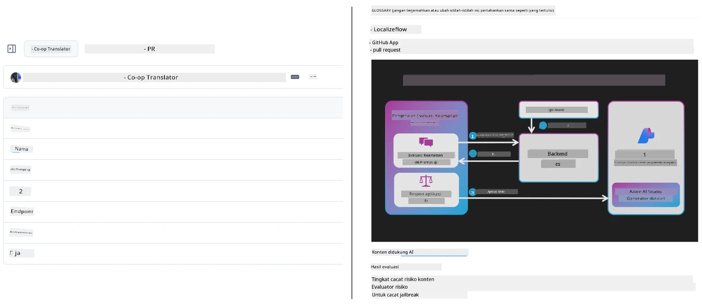
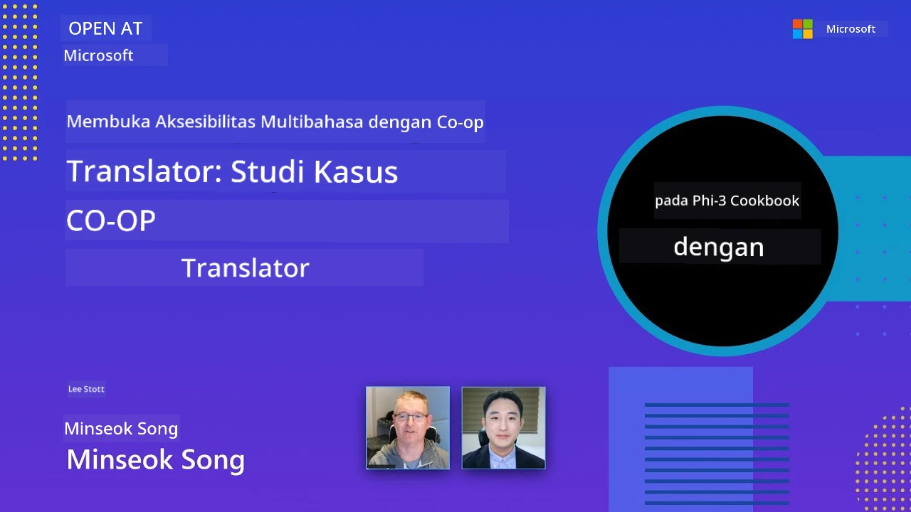

# Co-op Translator

_Mudah mengotomatisasi dan memelihara terjemahan untuk konten pendidikan GitHub Anda dalam berbagai bahasa seiring perkembangan proyek Anda._


[](https://pypi.org/project/co-op-translator/)
[](https://github.com/azure/co-op-translator/blob/main/LICENSE)
[](https://pepy.tech/project/co-op-translator)
[](https://pepy.tech/project/co-op-translator)
[](https://github.com/azure/co-op-translator/pkgs/container/co-op-translator)
[](https://github.com/psf/black)

[](https://GitHub.com/azure/co-op-translator/graphs/contributors/)
[](https://GitHub.com/azure/co-op-translator/issues/)
[](https://GitHub.com/azure/co-op-translator/pulls/)
[](http://makeapullrequest.com)

### 🌐 Dukungan Multi-Bahasa

#### Didukung oleh [Co-op Translator](https://github.com/Azure/Co-op-Translator)

<!-- CO-OP TRANSLATOR LANGUAGES TABLE START -->
[Arab](../ar/README.md) | [Benggala](../bn/README.md) | [Bulgaria](../bg/README.md) | [Birma (Myanmar)](../my/README.md) | [Tionghoa (Sederhana)](../zh-CN/README.md) | [Tionghoa (Tradisional, Hong Kong)](../zh-HK/README.md) | [Tionghoa (Tradisional, Macau)](../zh-MO/README.md) | [Tionghoa (Tradisional, Taiwan)](../zh-TW/README.md) | [Kroasia](../hr/README.md) | [Ceko](../cs/README.md) | [Denmark](../da/README.md) | [Belanda](../nl/README.md) | [Estonia](../et/README.md) | [Finlandia](../fi/README.md) | [Perancis](../fr/README.md) | [Jerman](../de/README.md) | [Yunani](../el/README.md) | [Ibrani](../he/README.md) | [Hindi](../hi/README.md) | [Hongaria](../hu/README.md) | [Indonesia](./README.md) | [Italia](../it/README.md) | [Jepang](../ja/README.md) | [Kannada](../kn/README.md) | [Kamboja](../km/README.md) | [Korea](../ko/README.md) | [Lituania](../lt/README.md) | [Melayu](../ms/README.md) | [Malayalam](../ml/README.md) | [Marathi](../mr/README.md) | [Nepal](../ne/README.md) | [Pidgin Nigeria](../pcm/README.md) | [Norwegia](../no/README.md) | [Persia (Farsi)](../fa/README.md) | [Polandia](../pl/README.md) | [Portugis (Brasil)](../pt-BR/README.md) | [Portugis (Portugal)](../pt-PT/README.md) | [Punjabi (Gurmukhi)](../pa/README.md) | [Rumania](../ro/README.md) | [Rusia](../ru/README.md) | [Serbia (Sirilik)](../sr/README.md) | [Slovakia](../sk/README.md) | [Slovenia](../sl/README.md) | [Spanyol](../es/README.md) | [Swahili](../sw/README.md) | [Swedia](../sv/README.md) | [Tagalog (Filipina)](../tl/README.md) | [Tamil](../ta/README.md) | [Telugu](../te/README.md) | [Thai](../th/README.md) | [Turki](../tr/README.md) | [Ukraina](../uk/README.md) | [Urdu](../ur/README.md) | [Vietnam](../vi/README.md)

> **Lebih Suka Clone Secara Lokal?**
>
> Repositori ini mencakup lebih dari 50 terjemahan bahasa yang secara signifikan meningkatkan ukuran unduhan. Untuk meng-clone tanpa terjemahan, gunakan sparse checkout:
>
> **Bash / macOS / Linux:**
> ```bash
> git clone --filter=blob:none --sparse https://github.com/Azure/co-op-translator.git
> cd co-op-translator
> git sparse-checkout set --no-cone '/*' '!translations' '!translated_images'
> ```
>
> **CMD (Windows):**
> ```cmd
> git clone --filter=blob:none --sparse https://github.com/Azure/co-op-translator.git
> cd co-op-translator
> git sparse-checkout set --no-cone "/*" "!translations" "!translated_images"
> ```
>
> Ini memberi Anda semua yang Anda butuhkan untuk menyelesaikan kursus dengan unduhan yang jauh lebih cepat.
<!-- CO-OP TRANSLATOR LANGUAGES TABLE END -->

[](https://GitHub.com/azure/co-op-translator/watchers/)
[](https://GitHub.com/azure/co-op-translator/network/)
[](https://GitHub.com/azure/co-op-translator/stargazers/)

[](https://discord.gg/nTYy5BXMWG)

[](https://codespaces.new/azure/co-op-translator)

## Ikhtisar

**Co-op Translator** membantu Anda melokalisasi konten pendidikan GitHub ke dalam berbagai bahasa dengan mudah.  
Saat Anda memperbarui file Markdown, gambar, atau notebook, terjemahan tetap otomatis tersinkronisasi, memastikan konten Anda tetap akurat dan terbaru untuk pelajar di seluruh dunia.

Contoh bagaimana konten terjemahan diorganisasi:



## Cara pengelolaan status terjemahan

Co-op Translator mengelola konten terjemahan sebagai **artefak perangkat lunak yang memiliki versi**,  
bukan sebagai file statis.

Alat ini melacak status Markdown, gambar, dan notebook yang diterjemahkan dengan menggunakan **metadata terbatas bahasa**.

Desain ini memungkinkan Co-op Translator untuk:

- Mendeteksi terjemahan usang dengan andal  
- Memperlakukan Markdown, gambar, dan notebook secara konsisten  
- Skalabilitas aman untuk repositori multi-bahasa besar dan bergerak cepat  

Dengan memodelkan terjemahan sebagai artefak yang dikelola,  
alur kerja terjemahan sejalan secara alami dengan praktik manajemen dependensi dan artefak perangkat lunak modern.

→ [Cara pengelolaan status terjemahan](https://techcommunity.microsoft.com/blog/azuredevcommunityblog/rethinking-documentation-translation-treating-translations-as-versioned-software/4491755)


## Memulai dengan cepat

```bash
# Buat dan aktifkan lingkungan virtual (disarankan)
python -m venv .venv
# Windows
.venv\Scripts\activate
# macOS/Linux
source .venv/bin/activate
# Pasang paket
pip install co-op-translator
# Terjemahkan
translate -l "ko ja fr" -md
```

Docker:

```bash
# Tarik gambar publik dari GHCR
docker pull ghcr.io/azure/co-op-translator:latest
# Jalankan dengan folder saat ini dipasang dan .env disediakan (Bash/Zsh)
docker run --rm -it --env-file .env -v "${PWD}:/work" ghcr.io/azure/co-op-translator:latest -l "ko ja fr" -md
```

## Pengaturan minimal

1. Pastikan Anda memiliki versi Python yang didukung (saat ini 3.10-3.12). Di poetry (pyproject.toml) ini sudah diatur otomatis.  
2. Buat file `.env` menggunakan template: [.env.template](../../.env.template)  
3. Konfigurasikan satu penyedia LLM (Azure OpenAI atau OpenAI)  
4. (Opsional) Untuk terjemahan gambar (`-img`), konfigurasikan Azure AI Vision  
5. (Opsional) Anda dapat mengkonfigurasi beberapa set kredensial dengan menduplikasi variabel dengan akhiran seperti `_1`, `_2`, dll. Semua variabel dalam satu set harus memiliki akhiran yang sama.  
6. (Disarankan) Bersihkan terjemahan sebelumnya untuk menghindari konflik (misalnya, `translations/`)  
7. (Disarankan) Tambahkan bagian terjemahan ke README Anda menggunakan [template bahasa README](./getting_started/README_languages_template.md)  
8. Lihat: [Menyiapkan Azure AI](./getting_started/set-up-azure-ai.md)

## Penggunaan

Terjemahkan semua jenis yang didukung:

```bash
translate -l "ko ja"
```

Hanya Markdown:

```bash
translate -l "de" -md
```

Markdown + gambar:

```bash
translate -l "pt" -md -img
```

Hanya notebook:

```bash
translate -l "zh" -nb
```

Lebih banyak opsi: [Referensi perintah](./getting_started/command-reference.md)

## Fitur

- Terjemahan otomatis untuk Markdown, notebook, dan gambar  
- Menjaga terjemahan tetap sinkron dengan perubahan sumber  
- Berjalan lokal (CLI) atau di CI (GitHub Actions)  
- Menggunakan Azure OpenAI atau OpenAI; opsional Azure AI Vision untuk gambar  
- Mempertahankan format dan struktur Markdown

## Dokumentasi

- [Panduan baris perintah](./getting_started/command-line-guide/command-line-guide.md)
- [Panduan GitHub Actions (Repositori publik & rahasia standar)](./getting_started/github-actions-guide/github-actions-guide-public.md)
- [Panduan GitHub Actions (Repositori organisasi Microsoft & pengaturan tingkat organisasi)](./getting_started/github-actions-guide/github-actions-guide-org.md)
- [Template bahasa README](./getting_started/README_languages_template.md)
- [Bahasa yang didukung](./getting_started/supported-languages.md)
- [Berkontribusi](./CONTRIBUTING.md)
- [Pemecahan masalah](./getting_started/troubleshooting.md)

### Panduan khusus Microsoft
> [!NOTE]
> Hanya untuk pemelihara repositori “For Beginners” Microsoft.

- [Memperbarui daftar “kursus lain” (hanya untuk repositori MS Beginners)](./getting_started/update-other-courses.md)

## Dukung kami dan dorong pembelajaran global

Bergabunglah bersama kami dalam merevolusi cara konten pendidikan dibagikan secara global! Berikan ⭐ untuk [Co-op Translator](https://github.com/azure/co-op-translator) di GitHub dan dukung misi kami untuk menghilangkan hambatan bahasa dalam pembelajaran dan teknologi. Minat dan kontribusi Anda memberikan dampak signifikan! Kontribusi kode dan usulan fitur selalu disambut.

### Jelajahi konten pendidikan Microsoft dalam bahasa Anda

- [LangChain4j-for-Beginners](https://github.com/microsoft/LangChain4j-for-Beginners)  
- [AZD for Beginners](https://github.com/microsoft/AZD-for-beginners)  
- [Edge AI for Beginners](https://github.com/microsoft/edgeai-for-beginners)  
- [Model Context Protocol (MCP) For Beginners](https://github.com/microsoft/mcp-for-beginners)  
- [AI Agents for Beginners](https://github.com/microsoft/ai-agents-for-beginners)  
- [Generative AI for Beginners using .NET](https://github.com/microsoft/Generative-AI-for-beginners-dotnet)  
- [Generative AI for Beginners](https://github.com/microsoft/generative-ai-for-beginners)  
- [Generative AI for Beginners using Java](https://github.com/microsoft/generative-ai-for-beginners-java)  
- [ML for Beginners](https://aka.ms/ml-beginners)  
- [Data Science for Beginners](https://aka.ms/datascience-beginners)  
- [AI for Beginners](https://aka.ms/ai-beginners)  
- [Cybersecurity for Beginners](https://github.com/microsoft/Security-101)  
- [Web Dev for Beginners](https://aka.ms/webdev-beginners)  
- [IoT for Beginners](https://aka.ms/iot-beginners)  
- [PhiCookBook](https://github.com/microsoft/PhiCookBook)

## Presentasi video

👉 Klik gambar di bawah untuk menonton di YouTube.

- **Open at Microsoft**: Pengantar singkat 18 menit dan panduan cepat cara menggunakan Co-op Translator.

  [](https://www.youtube.com/watch?v=jX_swfH_KNU)

## Berkontribusi

Proyek ini menyambut kontribusi dan saran. Tertarik untuk berkontribusi pada Azure Co-op Translator? Silakan lihat [CONTRIBUTING.md](./CONTRIBUTING.md) kami untuk panduan cara membantu membuat Co-op Translator lebih mudah diakses.

## Kontributor
[](https://github.com/Azure/co-op-translator/graphs/contributors)

## Kode Etik

Proyek ini telah mengadopsi [Kode Etik Open Source Microsoft](https://opensource.microsoft.com/codeofconduct/).
Untuk informasi lebih lanjut lihat [Pertanyaan Umum Kode Etik](https://opensource.microsoft.com/codeofconduct/faq/) atau
hubungi [opencode@microsoft.com](mailto:opencode@microsoft.com) untuk pertanyaan atau komentar tambahan.

## AI Bertanggung Jawab

Microsoft berkomitmen untuk membantu pelanggan kami menggunakan produk AI kami secara bertanggung jawab, berbagi pembelajaran, dan membangun kemitraan berbasis kepercayaan melalui alat seperti Transparency Notes dan Impact Assessments. Banyak sumber daya ini dapat ditemukan di [https://aka.ms/RAI](https://aka.ms/RAI).
Pendekatan Microsoft terhadap AI yang bertanggung jawab didasarkan pada prinsip AI kami yaitu keadilan, keandalan dan keamanan, privasi dan keamanan, inklusivitas, transparansi, dan akuntabilitas.

Model bahasa, gambar, dan suara berskala besar - seperti yang digunakan dalam contoh ini - berpotensi berperilaku dengan cara yang tidak adil, tidak dapat diandalkan, atau menyinggung, yang pada gilirannya dapat menyebabkan kerugian. Silakan lihat [nota transparansi layanan Azure OpenAI](https://learn.microsoft.com/legal/cognitive-services/openai/transparency-note?tabs=text) untuk mendapatkan informasi tentang risiko dan keterbatasan.

Pendekatan yang disarankan untuk mengurangi risiko ini adalah dengan menyertakan sistem keamanan dalam arsitektur Anda yang dapat mendeteksi dan mencegah perilaku berbahaya. [Azure AI Content Safety](https://learn.microsoft.com/azure/ai-services/content-safety/overview) menyediakan lapisan perlindungan independen yang mampu mendeteksi konten berbahaya yang dihasilkan pengguna dan AI dalam aplikasi dan layanan. Azure AI Content Safety mencakup API teks dan gambar yang memungkinkan Anda mendeteksi materi yang berbahaya. Kami juga memiliki Content Safety Studio interaktif yang memungkinkan Anda melihat, mengeksplorasi, dan mencoba kode contoh untuk mendeteksi konten berbahaya di berbagai modalitas. Dokumentasi [quickstart berikut](https://learn.microsoft.com/azure/ai-services/content-safety/quickstart-text?tabs=visual-studio%2Clinux&pivots=programming-language-rest) memandu Anda melalui proses membuat permintaan ke layanan ini.

Aspek lain yang perlu diperhitungkan adalah performa keseluruhan aplikasi. Dengan aplikasi multi-modal dan multi-model, kami menganggap performa berarti sistem berfungsi seperti yang Anda dan pengguna harapkan, termasuk tidak menghasilkan output yang berbahaya. Penting untuk menilai performa aplikasi Anda secara keseluruhan menggunakan [metrik kualitas generasi serta risiko dan keamanan](https://learn.microsoft.com/azure/ai-studio/concepts/evaluation-metrics-built-in).

Anda dapat mengevaluasi aplikasi AI Anda di lingkungan pengembangan menggunakan [prompt flow SDK](https://microsoft.github.io/promptflow/index.html). Dengan dataset uji atau target, generasi aplikasi AI generatif Anda diukur secara kuantitatif dengan evaluator bawaan atau evaluator kustom pilihan Anda. Untuk memulai dengan prompt flow sdk guna mengevaluasi sistem Anda, Anda dapat mengikuti [panduan quickstart](https://learn.microsoft.com/azure/ai-studio/how-to/develop/flow-evaluate-sdk). Setelah menjalankan evaluasi, Anda dapat [memvisualisasikan hasilnya di Azure AI Studio](https://learn.microsoft.com/azure/ai-studio/how-to/evaluate-flow-results).

## Merek Dagang

Proyek ini mungkin berisi merek dagang atau logo untuk proyek, produk, atau layanan. Penggunaan merek dagang atau logo Microsoft yang sah tunduk pada dan harus mengikuti
[Pedoman Merek & Merek Dagang Microsoft](https://www.microsoft.com/en-us/legal/intellectualproperty/trademarks/usage/general).
Penggunaan merek dagang atau logo Microsoft dalam versi modifikasi proyek ini tidak boleh menimbulkan kebingungan atau menyiratkan sponsor dari Microsoft.
Penggunaan merek dagang atau logo pihak ketiga tunduk pada kebijakan pihak ketiga tersebut.

## Mendapatkan Bantuan

Jika Anda mengalami kesulitan atau memiliki pertanyaan tentang membangun aplikasi AI, bergabunglah dengan:

[](https://discord.gg/nTYy5BXMWG)

Jika Anda memiliki masukan produk atau menemukan kesalahan saat membangun, kunjungi:

[](https://aka.ms/foundry/forum)

---

<!-- CO-OP TRANSLATOR DISCLAIMER START -->
**Penafian**:  
Dokumen ini telah diterjemahkan menggunakan layanan terjemahan AI [Co-op Translator](https://github.com/Azure/co-op-translator). Meskipun kami berupaya untuk akurasi, harap diketahui bahwa terjemahan otomatis mungkin mengandung kesalahan atau ketidakakuratan. Dokumen asli dalam bahasa aslinya harus dianggap sebagai sumber yang sah. Untuk informasi penting, disarankan menggunakan terjemahan profesional oleh manusia. Kami tidak bertanggung jawab atas kesalahpahaman atau penafsiran yang salah yang timbul dari penggunaan terjemahan ini.
<!-- CO-OP TRANSLATOR DISCLAIMER END -->