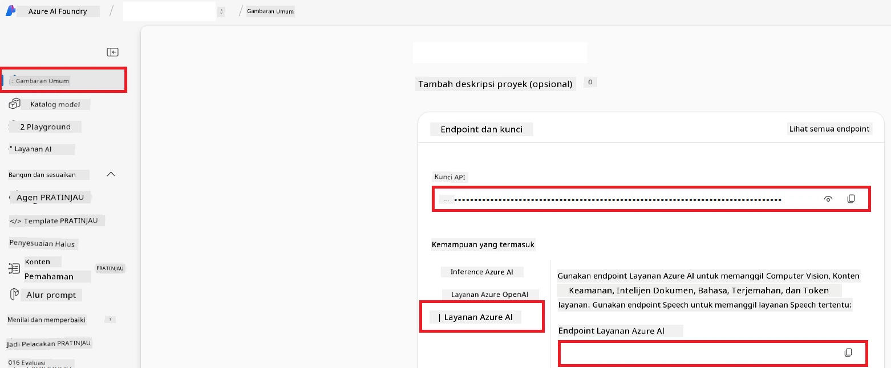

# Siapkan Azure AI untuk Co-op Translator (Azure OpneAI & Azure AI Vision)

Panduan ini memandu Anda dalam menyiapkan Azure OpenAI untuk terjemahan bahasa dan Azure Computer Vision untuk analisis konten gambar (yang kemudian dapat digunakan untuk terjemahan berbasis gambar) di dalam Azure AI Foundry.

**Prasyarat:**
- Akun Azure dengan langganan yang aktif.
- Izin yang cukup untuk membuat sumber daya dan penyebaran di langganan Azure Anda.

## Buat Proyek Azure AI

Anda akan memulai dengan membuat Proyek Azure AI, yang berfungsi sebagai tempat pusat untuk mengelola sumber daya AI Anda.

1. Buka [https://ai.azure.com](https://ai.azure.com) dan masuk dengan akun Azure Anda.

1. Pilih **+Create** untuk membuat proyek baru.

1. Lakukan tugas berikut:
   - Masukkan **Nama Proyek** (misal, `CoopTranslator-Project`).
   - Pilih **AI hub**  (misal, `CoopTranslator-Hub`) (Buat yang baru jika diperlukan).

1. Klik "**Review and Create**" untuk mengatur proyek Anda. Anda akan dibawa ke halaman ringkasan proyek Anda.

## Siapkan Azure OpenAI untuk Terjemahan Bahasa

Di dalam proyek Anda, Anda akan melakukan penyebaran model Azure OpenAI yang berfungsi sebagai backend untuk terjemahan teks.

### Buka Proyek Anda

Jika belum ada di sana, buka proyek yang baru dibuat (misal, `CoopTranslator-Project`) di Azure AI Foundry.

### Sebarkan Model OpenAI

1. Dari menu di sebelah kiri proyek Anda, di bawah "My assets", pilih "**Models + endpoints**".

1. Pilih **+ Deploy model**.

1. Pilih **Deploy Base Model**.

1. Anda akan melihat daftar model yang tersedia. Filter atau cari model GPT yang sesuai. Kami merekomendasikan `gpt-4o`.

1. Pilih model yang diinginkan dan klik **Confirm**.

1. Pilih **Deploy**.

### Konfigurasi Azure OpenAI

Setelah disebarkan, Anda dapat memilih penyebaran dari halaman "**Models + endpoints**" untuk menemukan **REST endpoint URL**, **Key**, **Deployment name**, **Model name** dan **API version**. Ini akan dibutuhkan untuk menghubungkan model terjemahan ke aplikasi Anda.

> [!NOTE]
> Anda dapat memilih versi API dari halaman [API version deprecation](https://learn.microsoft.com/azure/ai-services/openai/api-version-deprecation) sesuai kebutuhan Anda. Perlu diingat bahwa **API version** berbeda dari **Model version** yang ditampilkan pada halaman **Models + endpoints** di Azure AI Foundry.

## Siapkan Azure Computer Vision untuk Terjemahan Gambar

Untuk memungkinkan terjemahan teks di dalam gambar, Anda perlu menemukan Kunci API dan Endpoint Layanan Azure AI.

1. Buka Proyek Azure AI Anda (misal, `CoopTranslator-Project`). Pastikan Anda berada di halaman ringkasan proyek.

### Konfigurasi Layanan Azure AI

Temukan Kunci API dan Endpoint dari tab Layanan Azure AI.

1. Buka Proyek Azure AI Anda (misal, `CoopTranslator-Project`). Pastikan Anda berada di halaman ringkasan proyek.

1. Temukan **API Key** dan **Endpoint** di tab Layanan Azure AI.

    

Koneksi ini menjadikan kemampuan sumber daya Layanan Azure AI yang terhubung (termasuk analisis gambar) tersedia untuk proyek AI Foundry Anda. Anda kemudian dapat menggunakan koneksi ini dalam notebook atau aplikasi Anda untuk mengekstrak teks dari gambar, yang selanjutnya dapat dikirim ke model Azure OpenAI untuk diterjemahkan.

## Mengkonsolidasikan Kredensial Anda

Saat ini, Anda seharusnya telah mengumpulkan hal-hal berikut:

**Untuk Azure OpenAI (Terjemahan Teks):**
- Azure OpenAI Endpoint
- Azure OpenAI API Key
- Nama Model Azure OpenAI (misal, `gpt-4o`)
- Nama Penyebaran Azure OpenAI (misal, `cooptranslator-gpt4o`)
- Versi API Azure OpenAI

**Untuk Layanan Azure AI (Ekstraksi Teks Gambar melalui Vision):**
- Endpoint Layanan Azure AI
- Kunci API Layanan Azure AI

### Contoh: Konfigurasi Variabel Lingkungan (Pratinjau)

Nanti, saat membangun aplikasi Anda, kemungkinan besar Anda akan mengonfigurasinya menggunakan kredensial yang telah dikumpulkan ini. Misalnya, Anda bisa menetapkannya sebagai variabel lingkungan seperti berikut:

```bash
# Kredensial Layanan AI Azure (Diperlukan untuk terjemahan gambar)
AZURE_AI_SERVICE_API_KEY="your_azure_ai_service_api_key" # misalnya, 21xasd...
AZURE_AI_SERVICE_ENDPOINT="https://your_azure_ai_service_endpoint.cognitiveservices.azure.com/"

# Set fallback opsional: variabel duplikat dengan akhiran _1/_2 (indeks sama untuk semua variabel dalam set)
AZURE_AI_SERVICE_API_KEY_1="your_azure_ai_service_api_key_1"
AZURE_AI_SERVICE_ENDPOINT_1="https://your_azure_ai_service_endpoint_1.cognitiveservices.azure.com/"

# Kredensial Azure OpenAI (Diperlukan untuk terjemahan teks)
AZURE_OPENAI_API_KEY="your_azure_openai_api_key" # misalnya, 21xasd...
AZURE_OPENAI_ENDPOINT="https://your_azure_openai_endpoint.openai.azure.com/"
AZURE_OPENAI_MODEL_NAME="your_model_name" # misalnya, gpt-4o
AZURE_OPENAI_CHAT_DEPLOYMENT_NAME="your_deployment_name" # misalnya, cooptranslator-gpt4o
AZURE_OPENAI_API_VERSION="your_api_version" # misalnya, 2024-12-01-preview

# Set fallback opsional: duplikat seluruh set AZURE_OPENAI_* dengan akhiran _1/_2 (indeks sama untuk semua variabel)
```

---

### Bacaan Lebih Lanjut

- [Cara Membuat proyek di Azure AI Foundry](https://learn.microsoft.com/azure/ai-foundry/how-to/create-projects?tabs=ai-studio)
- [Cara Membuat sumber daya Azure AI](https://learn.microsoft.com/azure/ai-foundry/how-to/create-azure-ai-resource?tabs=portal)
- [Cara Menyebarkan model OpenAI di Azure AI Foundry](https://learn.microsoft.com/en-us/azure/ai-foundry/how-to/deploy-models-openai)

---

<!-- CO-OP TRANSLATOR DISCLAIMER START -->
**Penafian**:  
Dokumen ini telah diterjemahkan menggunakan layanan terjemahan AI [Co-op Translator](https://github.com/Azure/co-op-translator). Meskipun kami berusaha untuk mencapai akurasi, harap diperhatikan bahwa terjemahan otomatis mungkin mengandung kesalahan atau ketidakakuratan. Dokumen asli dalam bahasa aslinya harus dianggap sebagai sumber yang sahih. Untuk informasi penting, disarankan menggunakan terjemahan profesional oleh manusia. Kami tidak bertanggung jawab atas kesalahpahaman atau salah tafsir yang timbul dari penggunaan terjemahan ini.
<!-- CO-OP TRANSLATOR DISCLAIMER END -->