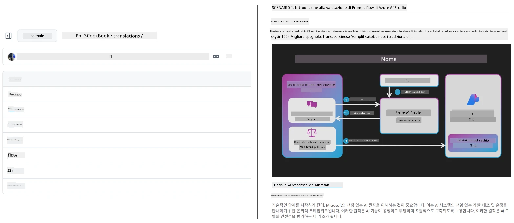
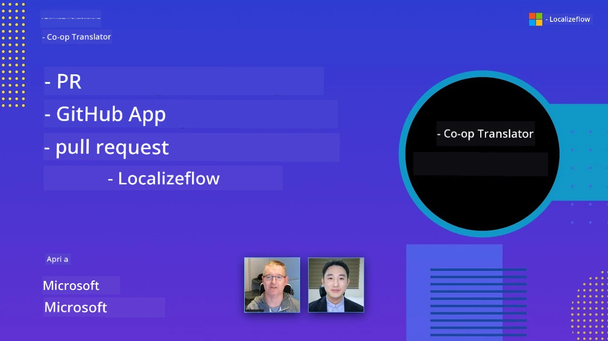

# Co-op Translator

_Automatizza facilmente e mantieni le traduzioni per i tuoi contenuti educativi su GitHub in più lingue mentre il tuo progetto si evolve._


[](https://pypi.org/project/co-op-translator/)
[](https://github.com/azure/co-op-translator/blob/main/LICENSE)
[](https://pepy.tech/project/co-op-translator)
[](https://pepy.tech/project/co-op-translator)
[](https://github.com/azure/co-op-translator/pkgs/container/co-op-translator)
[](https://github.com/psf/black)

[](https://GitHub.com/azure/co-op-translator/graphs/contributors/)
[](https://GitHub.com/azure/co-op-translator/issues/)
[](https://GitHub.com/azure/co-op-translator/pulls/)
[](http://makeapullrequest.com)

### 🌐 Supporto Multilingue

#### Supportato da [Co-op Translator](https://github.com/Azure/Co-op-Translator)

<!-- CO-OP TRANSLATOR LANGUAGES TABLE START -->
[Arabic](../ar/README.md) | [Bengali](../bn/README.md) | [Bulgarian](../bg/README.md) | [Burmese (Myanmar)](../my/README.md) | [Chinese (Simplified)](../zh-CN/README.md) | [Chinese (Traditional, Hong Kong)](../zh-HK/README.md) | [Chinese (Traditional, Macau)](../zh-MO/README.md) | [Chinese (Traditional, Taiwan)](../zh-TW/README.md) | [Croatian](../hr/README.md) | [Czech](../cs/README.md) | [Danish](../da/README.md) | [Dutch](../nl/README.md) | [Estonian](../et/README.md) | [Finnish](../fi/README.md) | [French](../fr/README.md) | [German](../de/README.md) | [Greek](../el/README.md) | [Hebrew](../he/README.md) | [Hindi](../hi/README.md) | [Hungarian](../hu/README.md) | [Indonesian](../id/README.md) | [Italian](./README.md) | [Japanese](../ja/README.md) | [Kannada](../kn/README.md) | [Khmer](../km/README.md) | [Korean](../ko/README.md) | [Lithuanian](../lt/README.md) | [Malay](../ms/README.md) | [Malayalam](../ml/README.md) | [Marathi](../mr/README.md) | [Nepali](../ne/README.md) | [Nigerian Pidgin](../pcm/README.md) | [Norwegian](../no/README.md) | [Persian (Farsi)](../fa/README.md) | [Polish](../pl/README.md) | [Portuguese (Brazil)](../pt-BR/README.md) | [Portuguese (Portugal)](../pt-PT/README.md) | [Punjabi (Gurmukhi)](../pa/README.md) | [Romanian](../ro/README.md) | [Russian](../ru/README.md) | [Serbian (Cyrillic)](../sr/README.md) | [Slovak](../sk/README.md) | [Slovenian](../sl/README.md) | [Spanish](../es/README.md) | [Swahili](../sw/README.md) | [Swedish](../sv/README.md) | [Tagalog (Filipino)](../tl/README.md) | [Tamil](../ta/README.md) | [Telugu](../te/README.md) | [Thai](../th/README.md) | [Turkish](../tr/README.md) | [Ukrainian](../uk/README.md) | [Urdu](../ur/README.md) | [Vietnamese](../vi/README.md)

> **Preferisci clonare localmente?**
>
> Questo repository include traduzioni in più di 50 lingue, il che aumenta significativamente la dimensione del download. Per clonare senza le traduzioni, usa il sparse checkout:
>
> **Bash / macOS / Linux:**
> ```bash
> git clone --filter=blob:none --sparse https://github.com/skytin1004/co-op-translator.git
> cd co-op-translator
> git sparse-checkout set --no-cone '/*' '!translations' '!translated_images'
> ```
>
> **CMD (Windows):**
> ```cmd
> git clone --filter=blob:none --sparse https://github.com/skytin1004/co-op-translator.git
> cd co-op-translator
> git sparse-checkout set --no-cone "/*" "!translations" "!translated_images"
> ```
>
> Questo ti offre tutto il necessario per completare il corso con un download molto più veloce.
<!-- CO-OP TRANSLATOR LANGUAGES TABLE END -->

[](https://GitHub.com/azure/co-op-translator/watchers/)
[](https://GitHub.com/azure/co-op-translator/network/)
[](https://GitHub.com/azure/co-op-translator/stargazers/)

[](https://discord.gg/nTYy5BXMWG)

[](https://codespaces.new/azure/co-op-translator)

## Panoramica

**Co-op Translator** ti aiuta a localizzare i tuoi contenuti educativi su GitHub in più lingue senza sforzo.  
Quando aggiorni i tuoi file Markdown, immagini o notebook, le traduzioni rimangono automaticamente sincronizzate, garantendo che il tuo contenuto sia sempre preciso e aggiornato per gli studenti di tutto il mondo.

Esempio di come è organizzato il contenuto tradotto:



## Come viene gestito lo stato della traduzione

Co-op Translator gestisce i contenuti tradotti come **artefatti software versionati**,  
non come file statici.

Lo strumento tiene traccia dello stato di Markdown, immagini e notebook tradotti  
usando **metadati specifici per lingua**.

Questo design permette a Co-op Translator di:

- Rilevare in modo affidabile traduzioni obsolete
- Gestire in modo coerente Markdown, immagini e notebook
- Scalare in sicurezza repository grandi, dinamici e multilingua

Modellando le traduzioni come artefatti gestiti,  
i flussi di lavoro di traduzione si allineano naturalmente con le moderne  
pratiche di gestione delle dipendenze e degli artefatti software.

→ [Come viene gestito lo stato della traduzione](https://techcommunity.microsoft.com/blog/azuredevcommunityblog/rethinking-documentation-translation-treating-translations-as-versioned-software/4491755)


## Avvio rapido

```bash
# Crea e attiva un ambiente virtuale (consigliato)
python -m venv .venv
# Windows
.venv\Scripts\activate
# macOS/Linux
source .venv/bin/activate
# Installa il pacchetto
pip install co-op-translator
# Traduci
translate -l "ko ja fr" -md
```

Docker:

```bash
# Estrai l'immagine pubblica da GHCR
docker pull ghcr.io/azure/co-op-translator:latest
# Esegui con la cartella corrente montata e .env fornito (Bash/Zsh)
docker run --rm -it --env-file .env -v "${PWD}:/work" ghcr.io/azure/co-op-translator:latest -l "ko ja fr" -md
```

## Configurazione minimale

1. Verifica di avere una versione Python supportata (attualmente 3.10-3.12). In poetry (pyproject.toml) questa è gestita automaticamente.  
2. Crea un file `.env` usando il modello: [.env.template](../../.env.template)  
3. Configura un fornitore LLM (Azure OpenAI o OpenAI)  
4. (Opzionale) Per la traduzione delle immagini (`-img`), configura Azure AI Vision  
5. (Opzionale) Puoi configurare più set di credenziali duplicando le variabili con suffissi come `_1`, `_2`, ecc. Tutte le variabili in un set devono condividere lo stesso suffisso.  
6. (Consigliato) Pulisci eventuali traduzioni precedenti per evitare conflitti (es. `translations/`)  
7. (Consigliato) Aggiungi una sezione delle traduzioni al tuo README usando il [modello lingue README](./getting_started/README_languages_template.md)  
8. Consulta: [Configura Azure AI](./getting_started/set-up-azure-ai.md)  

## Uso

Traduci tutti i tipi supportati:

```bash
translate -l "ko ja"
```

Solo Markdown:

```bash
translate -l "de" -md
```

Markdown + immagini:

```bash
translate -l "pt" -md -img
```

Solo notebook:

```bash
translate -l "zh" -nb
```

Altri flag: [Riferimento comandi](./getting_started/command-reference.md)

## Funzionalità

- Traduzione automatica per Markdown, notebook e immagini  
- Mantiene le traduzioni sincronizzate con le modifiche della sorgente  
- Funziona localmente (CLI) o in CI (GitHub Actions)  
- Usa Azure OpenAI o OpenAI; opzionale Azure AI Vision per immagini  
- Preserva formattazione e struttura Markdown  

## Documentazione

- [Guida da linea di comando](./getting_started/command-line-guide/command-line-guide.md)  
- [Guida GitHub Actions (repository pubblici & segreti standard)](./getting_started/github-actions-guide/github-actions-guide-public.md)  
- [Guida GitHub Actions (repository Microsoft organizzazione & configurazioni a livello org)](./getting_started/github-actions-guide/github-actions-guide-org.md)  
- [Modello lingue README](./getting_started/README_languages_template.md)  
- [Lingue supportate](./getting_started/supported-languages.md)  
- [Contribuire](./CONTRIBUTING.md)  
- [Risoluzione problemi](./getting_started/troubleshooting.md)  

### Guida specifica Microsoft  
> [!NOTE]  
> Solo per i manutentori dei repository “For Beginners” Microsoft.

- [Aggiornare la lista “altri corsi” (solo per repository MS Beginners)](./getting_started/update-other-courses.md)

## Supportaci e promuovi l’apprendimento globale

Unisciti a noi nella rivoluzione del modo in cui i contenuti educativi vengono condivisi globalmente! Dai a [Co-op Translator](https://github.com/azure/co-op-translator) una ⭐ su GitHub e supporta la nostra missione di abbattere le barriere linguistiche nell’apprendimento e nella tecnologia. Il tuo interesse e i tuoi contributi hanno un impatto significativo! Contributi al codice e suggerimenti per nuove funzionalità sono sempre benvenuti.

### Esplora contenuti educativi Microsoft nella tua lingua

- [LangChain4j-for-Beginners](https://github.com/microsoft/LangChain4j-for-Beginners)  
- [AZD for Beginners](https://github.com/microsoft/AZD-for-beginners)  
- [Edge AI for Beginners](https://github.com/microsoft/edgeai-for-beginners)  
- [Model Context Protocol (MCP) For Beginners](https://github.com/microsoft/mcp-for-beginners)  
- [AI Agents for Beginners](https://github.com/microsoft/ai-agents-for-beginners)  
- [Generative AI for Beginners using .NET](https://github.com/microsoft/Generative-AI-for-beginners-dotnet)  
- [Generative AI for Beginners](https://github.com/microsoft/generative-ai-for-beginners)  
- [Generative AI for Beginners using Java](https://github.com/microsoft/generative-ai-for-beginners-java)  
- [ML for Beginners](https://aka.ms/ml-beginners)  
- [Data Science for Beginners](https://aka.ms/datascience-beginners)  
- [AI for Beginners](https://aka.ms/ai-beginners)  
- [Cybersecurity for Beginners](https://github.com/microsoft/Security-101)  
- [Web Dev for Beginners](https://aka.ms/webdev-beginners)  
- [IoT for Beginners](https://aka.ms/iot-beginners)  
- [PhiCookBook](https://github.com/microsoft/PhiCookBook)  

## Presentazioni video

👉 Clicca sull’immagine qui sotto per guardare su YouTube.

- **Open at Microsoft**: una breve introduzione di 18 minuti e una guida rapida su come utilizzare Co-op Translator.

  [](https://www.youtube.com/watch?v=jX_swfH_KNU)

## Contribuire

Questo progetto accoglie contributi e suggerimenti. Interessato a contribuire a Azure Co-op Translator? Consulta il nostro [CONTRIBUTING.md](./CONTRIBUTING.md) per le indicazioni su come rendere Co-op Translator più accessibile.

## Contributors
[](https://github.com/Azure/co-op-translator/graphs/contributors)

## Codice di Condotta

Questo progetto ha adottato il [Microsoft Open Source Code of Conduct](https://opensource.microsoft.com/codeofconduct/).
Per maggiori informazioni consulta le [FAQ sul Codice di Condotta](https://opensource.microsoft.com/codeofconduct/faq/) o
contatta [opencode@microsoft.com](mailto:opencode@microsoft.com) per domande o commenti aggiuntivi.

## Intelligenza Artificiale Responsabile

Microsoft si impegna ad aiutare i nostri clienti a utilizzare i nostri prodotti di AI in modo responsabile, condividendo le nostre esperienze e costruendo partnership basate sulla fiducia attraverso strumenti come le Note di Trasparenza e le Valutazioni d’Impatto. Molte di queste risorse possono essere trovate su [https://aka.ms/RAI](https://aka.ms/RAI).
L’approccio di Microsoft all’intelligenza artificiale responsabile si basa sui nostri principi di AI di equità, affidabilità e sicurezza, privacy e sicurezza, inclusività, trasparenza e responsabilità.

I modelli di linguaggio naturale, immagini e voce su larga scala – come quelli utilizzati in questo esempio – possono potenzialmente comportarsi in modi ingiusti, inaffidabili o offensivi, causando danni. Ti invitiamo a consultare la [nota di trasparenza del servizio Azure OpenAI](https://learn.microsoft.com/legal/cognitive-services/openai/transparency-note?tabs=text) per essere informato sui rischi e le limitazioni.

L’approccio raccomandato per mitigare questi rischi è includere un sistema di sicurezza nella tua architettura che possa rilevare e prevenire comportamenti dannosi. [Azure AI Content Safety](https://learn.microsoft.com/azure/ai-services/content-safety/overview) fornisce uno strato di protezione indipendente, in grado di rilevare contenuti dannosi generati dall’utente e dall’AI in applicazioni e servizi. Azure AI Content Safety include API di testo e immagini che ti consentono di rilevare materiale dannoso. Disponiamo inoltre di uno studio interattivo Content Safety Studio che permette di visualizzare, esplorare e provare codice di esempio per rilevare contenuti dannosi in diverse modalità. La seguente [documentazione quickstart](https://learn.microsoft.com/azure/ai-services/content-safety/quickstart-text?tabs=visual-studio%2Clinux&pivots=programming-language-rest) ti guida attraverso l’invio di richieste al servizio.

Un altro aspetto da considerare è la performance complessiva dell’applicazione. Con applicazioni multimodali e multimodello, consideriamo la performance come la capacità del sistema di funzionare come tu e i tuoi utenti vi aspettate, incluso il non generare output dannosi. È importante valutare la performance della tua applicazione complessiva usando [metriche di qualità di generazione, rischio e sicurezza](https://learn.microsoft.com/azure/ai-studio/concepts/evaluation-metrics-built-in).

Puoi valutare la tua applicazione AI nel tuo ambiente di sviluppo usando l’[SDK prompt flow](https://microsoft.github.io/promptflow/index.html). Dato un dataset di test o un obiettivo, le generazioni della tua applicazione di AI generativa vengono misurate quantitativamente con valutatori integrati o personalizzati a tua scelta. Per iniziare con l’SDK prompt flow per valutare il tuo sistema, puoi seguire la [guida quickstart](https://learn.microsoft.com/azure/ai-studio/how-to/develop/flow-evaluate-sdk). Una volta eseguita una valutazione, puoi [visualizzare i risultati in Azure AI Studio](https://learn.microsoft.com/azure/ai-studio/how-to/evaluate-flow-results).

## Marchi

Questo progetto può contenere marchi o loghi per progetti, prodotti o servizi. L’uso autorizzato di marchi o loghi Microsoft è soggetto e deve rispettare
le [Microsoft's Trademark & Brand Guidelines](https://www.microsoft.com/en-us/legal/intellectualproperty/trademarks/usage/general).
L’uso di marchi o loghi Microsoft in versioni modificate di questo progetto non deve causare confusione o implicare sponsorizzazione da parte di Microsoft.
Qualsiasi uso di marchi o loghi di terzi è soggetto alle politiche di tali terze parti.

## Richiedere Aiuto

Se rimani bloccato o hai domande sulla creazione di app AI, unisciti a:

[](https://discord.gg/nTYy5BXMWG)

Se hai feedback sul prodotto o errori durante la creazione visita:

[](https://aka.ms/foundry/forum)

---

<!-- CO-OP TRANSLATOR DISCLAIMER START -->
**Disclaimer**:
Questo documento è stato tradotto utilizzando il servizio di traduzione AI [Co-op Translator](https://github.com/Azure/co-op-translator). Pur impegnandoci per l'accuratezza, si prega di notare che le traduzioni automatiche possono contenere errori o imprecisioni. Il documento originale nella sua lingua natale deve essere considerato la fonte autorevole. Per informazioni critiche, si raccomanda la traduzione professionale umana. Non siamo responsabili per eventuali malintesi o interpretazioni errate derivanti dall'uso di questa traduzione.
<!-- CO-OP TRANSLATOR DISCLAIMER END -->