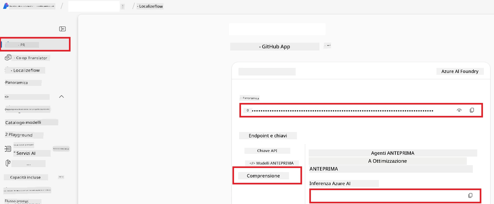

# Configurare Azure AI per Co-op Translator (Azure OpneAI e Azure AI Vision)

Questa guida ti accompagna nella configurazione di Azure OpenAI per la traduzione linguistica e Azure Computer Vision per l'analisi del contenuto delle immagini (che può poi essere utilizzata per la traduzione basata su immagini) all'interno di Azure AI Foundry.

**Prerequisiti:**
- Un account Azure con una sottoscrizione attiva.
- Permessi sufficienti per creare risorse e deployment nella tua sottoscrizione Azure.

## Creare un progetto Azure AI

Inizierai creando un progetto Azure AI, che funge da luogo centrale per la gestione delle tue risorse AI.

1. Naviga su [https://ai.azure.com](https://ai.azure.com) e accedi con il tuo account Azure.

1. Seleziona **+Create** per creare un nuovo progetto.

1. Esegui le seguenti operazioni:
   - Inserisci un **Nome progetto** (ad esempio, `CoopTranslator-Project`).
   - Seleziona il **hub AI** (ad esempio, `CoopTranslator-Hub`) (creane uno nuovo se necessario).

1. Clicca su "**Review and Create**" per configurare il tuo progetto. Verrai portato alla pagina di panoramica del progetto.

## Configurare Azure OpenAI per la Traduzione Linguistica

All'interno del tuo progetto, distribuirai un modello Azure OpenAI che fungerà da backend per la traduzione del testo.

### Naviga al tuo progetto

Se non sei già lì, apri il progetto appena creato (esempio: `CoopTranslator-Project`) in Azure AI Foundry.

### Distribuire un modello OpenAI

1. Dal menu a sinistra del tuo progetto, sotto "My assets", seleziona "**Models + endpoints**".

1. Seleziona **+ Deploy model**.

1. Seleziona **Deploy Base Model**.

1. Ti verrà presentata una lista di modelli disponibili. Filtra o cerca un modello GPT adatto. Raccomandiamo `gpt-4o`.

1. Seleziona il modello desiderato e clicca su **Confirm**.

1. Seleziona **Deploy**.

### Configurazione Azure OpenAI

Una volta distribuito, puoi selezionare il deployment dalla pagina "**Models + endpoints**" per trovare il suo **URL endpoint REST**, la **Chiave**, il **Nome del deployment**, il **Nome del modello** e la **versione API**. Questi dati saranno necessari per integrare il modello di traduzione nella tua applicazione.

> [!NOTE]
> Puoi selezionare le versioni API dalla pagina di [deprecazione delle versioni API](https://learn.microsoft.com/azure/ai-services/openai/api-version-deprecation) in base alle tue esigenze. Ricorda che la **versione API** è diversa dalla **versione del modello** mostrata nella pagina **Models + endpoints** in Azure AI Foundry.

## Configurare Azure Computer Vision per la traduzione delle immagini

Per abilitare la traduzione del testo contenuto nelle immagini, devi reperire la Chiave API e l'Endpoint del servizio Azure AI.

1. Naviga al tuo progetto Azure AI (esempio: `CoopTranslator-Project`). Assicurati di essere nella pagina panoramica del progetto.

### Configurazione del servizio Azure AI

Trova la Chiave API e l'Endpoint dal servizio Azure AI.

1. Naviga al tuo progetto Azure AI (esempio: `CoopTranslator-Project`). Assicurati di essere nella pagina panoramica del progetto.

1. Trova la **Chiave API** e l'**Endpoint** nella scheda del servizio Azure AI.

    

Questa connessione rende disponibili le capacità della risorsa Azure AI Services collegata (inclusa l'analisi delle immagini) al tuo progetto AI Foundry. Puoi quindi utilizzare questa connessione nei tuoi notebook o applicazioni per estrarre testo dalle immagini, che può essere successivamente inviato al modello Azure OpenAI per la traduzione.

## Consolidamento delle tue credenziali

A questo punto, dovresti aver raccolto quanto segue:

**Per Azure OpenAI (Traduzione Testo):**
- Endpoint Azure OpenAI
- Chiave API Azure OpenAI
- Nome modello Azure OpenAI (esempio `gpt-4o`)
- Nome deployment Azure OpenAI (esempio `cooptranslator-gpt4o`)
- Versione API Azure OpenAI

**Per Azure AI Services (Estrazione testo da immagini tramite Vision):**
- Endpoint Azure AI Service
- Chiave API Azure AI Service

### Esempio: configurazione variabili ambiente (anteprima)

In seguito, quando costruirai la tua applicazione, probabilmente la configurerai usando queste credenziali raccolte. Ad esempio, potresti impostarle come variabili d'ambiente come segue:

```bash
# Credenziali del Servizio Azure AI (Necessarie per la traduzione delle immagini)
AZURE_AI_SERVICE_API_KEY="your_azure_ai_service_api_key" # ad es., 21xasd...
AZURE_AI_SERVICE_ENDPOINT="https://your_azure_ai_service_endpoint.cognitiveservices.azure.com/"

# Set di riserva opzionali: variabili duplicate con suffisso _1/_2 (stesso indice per tutte le variabili nel set)
AZURE_AI_SERVICE_API_KEY_1="your_azure_ai_service_api_key_1"
AZURE_AI_SERVICE_ENDPOINT_1="https://your_azure_ai_service_endpoint_1.cognitiveservices.azure.com/"

# Credenziali Azure OpenAI (Necessarie per la traduzione del testo)
AZURE_OPENAI_API_KEY="your_azure_openai_api_key" # ad es., 21xasd...
AZURE_OPENAI_ENDPOINT="https://your_azure_openai_endpoint.openai.azure.com/"
AZURE_OPENAI_MODEL_NAME="your_model_name" # ad es., gpt-4o
AZURE_OPENAI_CHAT_DEPLOYMENT_NAME="your_deployment_name" # ad es., cooptranslator-gpt4o
AZURE_OPENAI_API_VERSION="your_api_version" # ad es., 2024-12-01-preview

# Set di riserva opzionali: duplicare l'intero set AZURE_OPENAI_* con suffisso _1/_2 (stesso indice per tutte le variabili)
```

---

### Ulteriori letture

- [Come creare un progetto in Azure AI Foundry](https://learn.microsoft.com/azure/ai-foundry/how-to/create-projects?tabs=ai-studio)
- [Come creare risorse Azure AI](https://learn.microsoft.com/azure/ai-foundry/how-to/create-azure-ai-resource?tabs=portal)
- [Come distribuire modelli OpenAI in Azure AI Foundry](https://learn.microsoft.com/en-us/azure/ai-foundry/how-to/deploy-models-openai)

---

<!-- CO-OP TRANSLATOR DISCLAIMER START -->
**Disclaimer**:  
Questo documento è stato tradotto utilizzando il servizio di traduzione AI [Co-op Translator](https://github.com/Azure/co-op-translator). Pur impegnandoci per l'accuratezza, si prega di notare che le traduzioni automatiche possono contenere errori o inesattezze. Il documento originale nella sua lingua nativa deve essere considerato la fonte autorevole. Per informazioni critiche, si raccomanda una traduzione professionale effettuata da persone. Non siamo responsabili per eventuali incomprensioni o interpretazioni errate derivanti dall'uso di questa traduzione.
<!-- CO-OP TRANSLATOR DISCLAIMER END -->