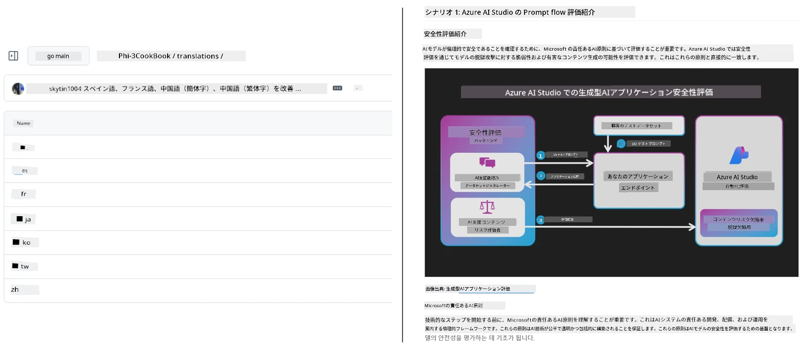
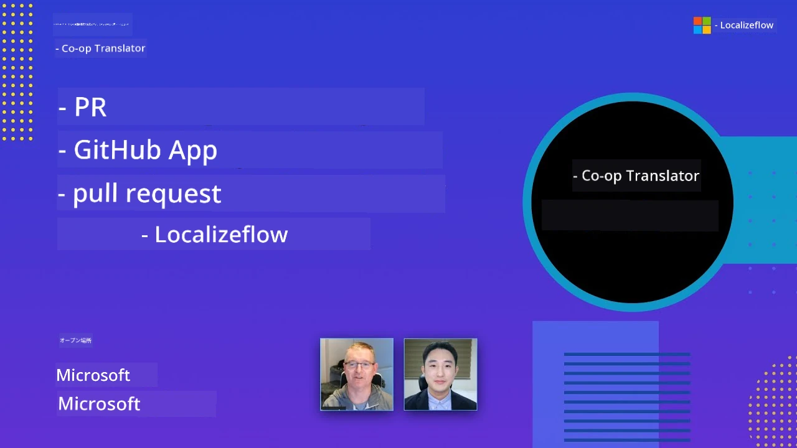

# Co-op Translator

_教育向けのGitHubコンテンツをプロジェクトの進展に合わせて複数言語で簡単に自動化・維持管理します。_


[](https://pypi.org/project/co-op-translator/)
[](https://github.com/azure/co-op-translator/blob/main/LICENSE)
[](https://pepy.tech/project/co-op-translator)
[](https://pepy.tech/project/co-op-translator)
[](https://github.com/azure/co-op-translator/pkgs/container/co-op-translator)
[](https://github.com/psf/black)

[](https://GitHub.com/azure/co-op-translator/graphs/contributors/)
[](https://GitHub.com/azure/co-op-translator/issues/)
[](https://GitHub.com/azure/co-op-translator/pulls/)
[](http://makeapullrequest.com)

### 🌐 多言語サポート

#### [Co-op Translator](https://github.com/Azure/Co-op-Translator) によってサポートされています

<!-- CO-OP TRANSLATOR LANGUAGES TABLE START -->
[Arabic](../ar/README.md) | [Bengali](../bn/README.md) | [Bulgarian](../bg/README.md) | [Burmese (Myanmar)](../my/README.md) | [Chinese (Simplified)](../zh-CN/README.md) | [Chinese (Traditional, Hong Kong)](../zh-HK/README.md) | [Chinese (Traditional, Macau)](../zh-MO/README.md) | [Chinese (Traditional, Taiwan)](../zh-TW/README.md) | [Croatian](../hr/README.md) | [Czech](../cs/README.md) | [Danish](../da/README.md) | [Dutch](../nl/README.md) | [Estonian](../et/README.md) | [Finnish](../fi/README.md) | [French](../fr/README.md) | [German](../de/README.md) | [Greek](../el/README.md) | [Hebrew](../he/README.md) | [Hindi](../hi/README.md) | [Hungarian](../hu/README.md) | [Indonesian](../id/README.md) | [Italian](../it/README.md) | [Japanese](./README.md) | [Kannada](../kn/README.md) | [Khmer](../km/README.md) | [Korean](../ko/README.md) | [Lithuanian](../lt/README.md) | [Malay](../ms/README.md) | [Malayalam](../ml/README.md) | [Marathi](../mr/README.md) | [Nepali](../ne/README.md) | [Nigerian Pidgin](../pcm/README.md) | [Norwegian](../no/README.md) | [Persian (Farsi)](../fa/README.md) | [Polish](../pl/README.md) | [Portuguese (Brazil)](../pt-BR/README.md) | [Portuguese (Portugal)](../pt-PT/README.md) | [Punjabi (Gurmukhi)](../pa/README.md) | [Romanian](../ro/README.md) | [Russian](../ru/README.md) | [Serbian (Cyrillic)](../sr/README.md) | [Slovak](../sk/README.md) | [Slovenian](../sl/README.md) | [Spanish](../es/README.md) | [Swahili](../sw/README.md) | [Swedish](../sv/README.md) | [Tagalog (Filipino)](../tl/README.md) | [Tamil](../ta/README.md) | [Telugu](../te/README.md) | [Thai](../th/README.md) | [Turkish](../tr/README.md) | [Ukrainian](../uk/README.md) | [Urdu](../ur/README.md) | [Vietnamese](../vi/README.md)

> **ローカルでクローンしたいですか？**
>
> このリポジトリには50以上の言語翻訳が含まれており、ダウンロードサイズが大幅に増加します。翻訳なしでクローンするには、スパースチェックアウトを使用してください：
>
> **Bash / macOS / Linux:**
> ```bash
> git clone --filter=blob:none --sparse https://github.com/skytin1004/co-op-translator.git
> cd co-op-translator
> git sparse-checkout set --no-cone '/*' '!translations' '!translated_images'
> ```
>
> **CMD (Windows):**
> ```cmd
> git clone --filter=blob:none --sparse https://github.com/skytin1004/co-op-translator.git
> cd co-op-translator
> git sparse-checkout set --no-cone "/*" "!translations" "!translated_images"
> ```
>
> これにより、コースを完了するために必要なすべてのものが、より高速なダウンロードで手に入ります。
<!-- CO-OP TRANSLATOR LANGUAGES TABLE END -->

[](https://GitHub.com/azure/co-op-translator/watchers/)
[](https://GitHub.com/azure/co-op-translator/network/)
[](https://GitHub.com/azure/co-op-translator/stargazers/)

[](https://discord.gg/nTYy5BXMWG)

[](https://codespaces.new/azure/co-op-translator)

## 概要

**Co-op Translator** は教育向けのGitHubコンテンツを複数言語に簡単にローカライズできるツールです。  
Markdownファイル、画像、ノートブックを更新すると、翻訳も自動的に同期され、世界中の学習者に向けて常に正確で最新のコンテンツを保ちます。

翻訳されたコンテンツの整理例：



## 翻訳状態の管理方法

Co-op Translatorは翻訳コンテンツを<strong>静的ファイルではなく、バージョン管理されたソフトウェアアーティファクト</strong>として管理します。  

ツールは<strong>言語別メタデータ</strong>を用いて翻訳されたMarkdown、画像、ノートブックの状態を追跡します。

この設計により、Co-op Translatorは以下を実現します：

- 翻訳の古さを信頼性高く検出
- Markdown、画像、ノートブックを一貫して扱う
- 大規模で高速な多言語リポジトリでも安全に拡張可能

翻訳を管理されたアーティファクトとしてモデル化することで、  
翻訳ワークフローが最新のソフトウェア依存関係とアーティファクト管理の実践に自然に適合します。

→ [翻訳状態の管理方法](https://techcommunity.microsoft.com/blog/azuredevcommunityblog/rethinking-documentation-translation-treating-translations-as-versioned-software/4491755)


## クイックスタート

```bash
# 仮想環境を作成して有効化する（推奨）
python -m venv .venv
# Windows
.venv\Scripts\activate
# macOS/Linux
source .venv/bin/activate
# パッケージをインストールする
pip install co-op-translator
# 翻訳する
translate -l "ko ja fr" -md
```

Docker:

```bash
# GHCRからパブリックイメージを取得する
docker pull ghcr.io/azure/co-op-translator:latest
# 現在のフォルダをマウントし、.envを提供して実行する（Bash/Zsh）
docker run --rm -it --env-file .env -v "${PWD}:/work" ghcr.io/azure/co-op-translator:latest -l "ko ja fr" -md
```

## 最小セットアップ

1. サポートされているPythonバージョン（現在は3.10～3.12）を持っていることを確認してください。poetry（pyproject.toml）では自動的に処理されます。
2. テンプレートを使って`.env`ファイルを作成します: [.env.template](../../.env.template)
3. LLMプロバイダーを1つ設定します（Azure OpenAIまたはOpenAI）
4. （オプション）画像翻訳（`-img`）にはAzure AI Visionを設定します
5. （オプション）`_1`, `_2`などの接尾辞で変数を複製することで複数の認証情報セットを設定できます。セット内のすべての変数は同じ接尾辞を共有する必要があります。
6. （推奨）競合を避けるために以前の翻訳ファイルをクリーンアップします（例: `translations/`）
7. （推奨）READMEに翻訳セクションを追加します。[README言語テンプレート](./getting_started/README_languages_template.md)を参照してください。
8. 参照: [Azure AIのセットアップ](./getting_started/set-up-azure-ai.md)

## 使い方

サポートされているすべてのタイプを翻訳:

```bash
translate -l "ko ja"
```

Markdownのみ:

```bash
translate -l "de" -md
```

Markdown＋画像:

```bash
translate -l "pt" -md -img
```

ノートブックのみ:

```bash
translate -l "zh" -nb
```

その他のフラグ: [コマンドリファレンス](./getting_started/command-reference.md)

## 特長

- Markdown、ノートブック、画像の自動翻訳
- ソースの変更に同期して翻訳を維持
- ローカル（CLI）またはCI（GitHub Actions）で動作
- Azure OpenAIまたはOpenAIの利用、画像にはオプションでAzure AI Visionを使用
- Markdownの書式・構造を保持

## ドキュメント

- [コマンドラインガイド](./getting_started/command-line-guide/command-line-guide.md)
- [GitHub Actionsガイド（公開リポジトリ＆標準シークレット）](./getting_started/github-actions-guide/github-actions-guide-public.md)
- [GitHub Actionsガイド（Microsoft組織リポジトリ＆組織レベルセットアップ）](./getting_started/github-actions-guide/github-actions-guide-org.md)
- [README言語テンプレート](./getting_started/README_languages_template.md)
- [対応言語一覧](./getting_started/supported-languages.md)
- [貢献ガイド](./CONTRIBUTING.md)
- [トラブルシューティング](./getting_started/troubleshooting.md)

### Microsoft特化ガイド
> [!NOTE]
> Microsoft「For Beginners」リポジトリのメンテナのみ対象。

- [“other courses”リスト更新（MS Beginnersリポジトリ専用）](./getting_started/update-other-courses.md)

## サポートとグローバルラーニングの促進

教育コンテンツのグローバル共有の革命に参加しませんか！  
[Co-op Translator](https://github.com/azure/co-op-translator) にGitHubで⭐をつけて、学習と技術の言語障壁をなくす私たちのミッションを支援してください。あなたの関心と貢献が大きな影響をもたらします！コード貢献や機能提案は常に歓迎しています。

### Microsoftの教育コンテンツをあなたの言語で探る

- [LangChain4j-for-Beginners](https://github.com/microsoft/LangChain4j-for-Beginners)
- [AZD for Beginners](https://github.com/microsoft/AZD-for-beginners)
- [Edge AI for Beginners](https://github.com/microsoft/edgeai-for-beginners)
- [Model Context Protocol (MCP) For Beginners](https://github.com/microsoft/mcp-for-beginners)
- [AI Agents for Beginners](https://github.com/microsoft/ai-agents-for-beginners)
- [Generative AI for Beginners using .NET](https://github.com/microsoft/Generative-AI-for-beginners-dotnet)
- [Generative AI for Beginners](https://github.com/microsoft/generative-ai-for-beginners)
- [Generative AI for Beginners using Java](https://github.com/microsoft/generative-ai-for-beginners-java)
- [ML for Beginners](https://aka.ms/ml-beginners)
- [Data Science for Beginners](https://aka.ms/datascience-beginners)
- [AI for Beginners](https://aka.ms/ai-beginners)
- [Cybersecurity for Beginners](https://github.com/microsoft/Security-101)
- [Web Dev for Beginners](https://aka.ms/webdev-beginners)
- [IoT for Beginners](https://aka.ms/iot-beginners)
- [PhiCookBook](https://github.com/microsoft/PhiCookBook)

## ビデオプレゼンテーション

👉 以下の画像をクリックしてYouTubeで視聴できます。

- **Open at Microsoft**：18分の簡単な紹介とCo-op Translatorの使い方クイックガイド。

  [](https://www.youtube.com/watch?v=jX_swfH_KNU)

## 貢献について

このプロジェクトは貢献や提案を歓迎します。Azure Co-op Translatorへの貢献に興味がある方は、私たちの[CONTRIBUTING.md](./CONTRIBUTING.md)をご覧になり、Co-op Translatorをよりアクセシブルにするお手伝いをしてください。

## 貢献者
[](https://github.com/Azure/co-op-translator/graphs/contributors)

## 行動規範

本プロジェクトでは、[Microsoft Open Source Code of Conduct](https://opensource.microsoft.com/codeofconduct/)を採用しています。
詳細は[Code of Conduct FAQ](https://opensource.microsoft.com/codeofconduct/faq/)をご覧いただくか、
ご不明点やご意見があれば[opencode@microsoft.com](mailto:opencode@microsoft.com)までご連絡ください。

## 責任あるAI

Microsoftは、お客様が当社のAI製品を責任を持って使用できるよう支援し、学びを共有し、Transparency Notesや影響評価などのツールを通じて信頼に基づくパートナーシップを構築することに取り組んでいます。これらのリソースの多くは[https://aka.ms/RAI](https://aka.ms/RAI)でご覧いただけます。
Microsoftの責任あるAIへのアプローチは、公平性、信頼性と安全性、プライバシーとセキュリティ、包括性、透明性、説明責任というAI原則に基づいています。

このサンプルで使用されているような大規模な自然言語、画像、音声モデルは、不公平、不信頼、攻撃的な振る舞いをする可能性があり、それによって被害を引き起こすことがあります。[Azure OpenAI service Transparency note](https://learn.microsoft.com/legal/cognitive-services/openai/transparency-note?tabs=text)をご参照いただき、リスクと制限事項についてご確認ください。

これらのリスクを軽減する推奨アプローチは、有害な行動を検知し防止できる安全システムを構成に組み込むことです。[Azure AI Content Safety](https://learn.microsoft.com/azure/ai-services/content-safety/overview) は、アプリケーションやサービス内のユーザー生成およびAI生成の有害なコンテンツを検知可能な独立した保護レイヤーを提供します。Azure AI Content Safetyには有害な素材を検知するテキストおよび画像APIが含まれています。また、Content Safety Studioでは、異なるモダリティにわたって有害コンテンツを検知するサンプルコードを閲覧、探索、試行できます。以下の[クイックスタートドキュメント](https://learn.microsoft.com/azure/ai-services/content-safety/quickstart-text?tabs=visual-studio%2Clinux&pivots=programming-language-rest)ではサービスへのリクエスト手順をご案内しています。

もう一つ考慮すべき側面は全体的なアプリケーションのパフォーマンスです。マルチモーダルおよびマルチモデルのアプリケーションでは、パフォーマンスとはシステムがあなたおよびユーザーの期待通りに動作し、有害な出力を生成しないことを意味します。全体的なアプリケーションのパフォーマンスを評価するには、[生成品質およびリスク・安全性指標](https://learn.microsoft.com/azure/ai-studio/concepts/evaluation-metrics-built-in)を使用することが重要です。

開発環境でAIアプリケーションを評価するには、[prompt flow SDK](https://microsoft.github.io/promptflow/index.html)を利用できます。テストデータセットまたは目標が与えられると、生成AIアプリケーションの生成結果は組み込みまたはカスタム評価者で定量的に測定されます。prompt flow SDKでシステム評価を開始するには、[クイックスタートガイド](https://learn.microsoft.com/azure/ai-studio/how-to/develop/flow-evaluate-sdk)をご覧ください。評価実行後は、[Azure AI Studioで結果を可視化](https://learn.microsoft.com/azure/ai-studio/how-to/evaluate-flow-results)できます。

## 商標

本プロジェクトにはプロジェクト、製品、サービスの商標やロゴが含まれる場合があります。Microsoftの商標やロゴを利用する場合は、[Microsoft's Trademark & Brand Guidelines](https://www.microsoft.com/en-us/legal/intellectualproperty/trademarks/usage/general)に従う必要があります。
本プロジェクトの改変版でMicrosoftの商標やロゴを使用するときは、混乱を招いたりMicrosoftのスポンサーシップを暗示したりしないようにしてください。
また、第三者の商標やロゴの利用については当該第三者の方針に従う必要があります。

## サポートを受けるには

AIアプリケーションの構築で行き詰まったり質問がある場合は、以下に参加してください：

[](https://discord.gg/nTYy5BXMWG)

製品のフィードバックや構築中のエラーについては以下を参照してください：

[](https://aka.ms/foundry/forum)

---

<!-- CO-OP TRANSLATOR DISCLAIMER START -->
**免責事項**:  
本書類は AI 翻訳サービス [Co-op Translator](https://github.com/Azure/co-op-translator) を使用して翻訳されています。正確性を追求しておりますが、自動翻訳には誤りや不正確な部分が含まれる可能性があることをご留意ください。原文の母国語版が正式な情報源と見なされます。重要な情報については、専門の人間による翻訳を推奨します。本翻訳の使用により生じた誤解や解釈の相違について、当方は一切の責任を負いません。
<!-- CO-OP TRANSLATOR DISCLAIMER END -->