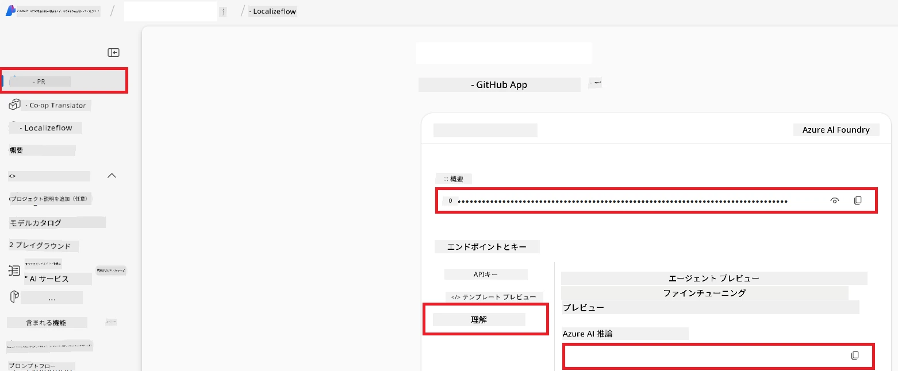

# Co-op Translator 用 Azure AI のセットアップ (Azure OpenAI & Azure AI Vision)

このガイドでは、Azure AI Foundry 内で言語翻訳用の Azure OpenAI と画像ベースの翻訳に使用できる画像コンテンツ解析用の Azure Computer Vision のセットアップ方法を説明します。

**前提条件:**
- 有効なサブスクリプションを持つ Azure アカウント。
- Azure サブスクリプション内でリソースとデプロイメントを作成するための十分な権限。

## Azure AI プロジェクトの作成

最初に、AI リソースの管理を一元化するための Azure AI プロジェクトを作成します。

1. [https://ai.azure.com](https://ai.azure.com) に移動し、Azure アカウントでサインインします。

1. **+Create** を選択して新しいプロジェクトを作成します。

1. 次の操作を行います:
   - **Project name** を入力します（例: `CoopTranslator-Project`）。
   - **AI hub** を選択します（例: `CoopTranslator-Hub`）（必要に応じて新規作成）。

1. 「**Review and Create**」をクリックしてプロジェクトを設定します。プロジェクトの概要ページが表示されます。

## 言語翻訳用 Azure OpenAI のセットアップ

プロジェクト内で、テキスト翻訳のバックエンドとして機能する Azure OpenAI モデルをデプロイします。

### プロジェクトに移動

まだであれば、Azure AI Foundry で新しく作成したプロジェクト（例: `CoopTranslator-Project`）を開きます。

### OpenAI モデルをデプロイ

1. プロジェクトの左メニューの「My assets」から「**Models + endpoints**」を選択します。

1. **+ Deploy model** を選択します。

1. **Deploy Base Model** を選択します。

1. 利用可能なモデルの一覧が表示されます。適切な GPT モデルを絞り込みまたは検索します。推奨は `gpt-4o` です。

1. 希望のモデルを選択して **Confirm** をクリックします。

1. **Deploy** を選択します。

### Azure OpenAI の設定

デプロイ完了後、「**Models + endpoints**」ページからデプロイメントを選択すると、**REST endpoint URL**、**Key**、**Deployment name**、**Model name**、**API version** を確認できます。これらは翻訳モデルをアプリケーションに統合する際に必要です。

> [!NOTE]
> 要件に応じて [API version deprecation](https://learn.microsoft.com/azure/ai-services/openai/api-version-deprecation) ページから API バージョンを選択できます。**API version** は Azure AI Foundry の「Models + endpoints」ページに表示される **Model version** とは異なることにご注意ください。

## 画像翻訳用 Azure Computer Vision のセットアップ

画像内のテキストを翻訳可能にするには、Azure AI Service の API キーとエンドポイントを取得する必要があります。

1. Azure AI プロジェクト（例: `CoopTranslator-Project`）に移動し、プロジェクトの概要ページであることを確認します。

### Azure AI Service の設定

Azure AI Service から API キーとエンドポイントを見つけます。

1. Azure AI プロジェクト（例: `CoopTranslator-Project`）の概要ページにあることを確認します。

1. Azure AI Service タブから **API Key** と **Endpoint** を探します。

    

この接続により、リンクされた Azure AI Services リソース（画像解析を含む）の機能が AI Foundry プロジェクトで利用可能になります。これを使ってノートブックやアプリケーションで画像からテキストを抽出し、そのテキストを Azure OpenAI モデルに送信して翻訳処理できます。

## 認証情報のまとめ

この時点で、以下の情報を収集できているはずです。

**Azure OpenAI (テキスト翻訳) 用:**
- Azure OpenAI エンドポイント
- Azure OpenAI API キー
- Azure OpenAI モデル名（例: `gpt-4o`）
- Azure OpenAI デプロイメント名（例: `cooptranslator-gpt4o`）
- Azure OpenAI API バージョン

**Azure AI Services (Vision による画像テキスト抽出) 用:**
- Azure AI Service エンドポイント
- Azure AI Service API キー

### 例: 環境変数の設定 (プレビュー)

後でアプリケーションを構築する際には、収集した認証情報を環境変数として設定することが一般的です。例えば以下のように設定します。

```bash
# Azure AIサービスの認証情報（画像翻訳に必要）
AZURE_AI_SERVICE_API_KEY="your_azure_ai_service_api_key" # 例：21xasd...
AZURE_AI_SERVICE_ENDPOINT="https://your_azure_ai_service_endpoint.cognitiveservices.azure.com/"

# オプションのフォールバックセット：接尾辞 _1/_2 を付けた変数の複製（セット内のすべての変数は同じインデックス）
AZURE_AI_SERVICE_API_KEY_1="your_azure_ai_service_api_key_1"
AZURE_AI_SERVICE_ENDPOINT_1="https://your_azure_ai_service_endpoint_1.cognitiveservices.azure.com/"

# Azure OpenAI認証情報（テキスト翻訳に必要）
AZURE_OPENAI_API_KEY="your_azure_openai_api_key" # 例：21xasd...
AZURE_OPENAI_ENDPOINT="https://your_azure_openai_endpoint.openai.azure.com/"
AZURE_OPENAI_MODEL_NAME="your_model_name" # 例：gpt-4o
AZURE_OPENAI_CHAT_DEPLOYMENT_NAME="your_deployment_name" # 例：cooptranslator-gpt4o
AZURE_OPENAI_API_VERSION="your_api_version" # 例：2024-12-01-preview

# オプションのフォールバックセット：接尾辞 _1/_2 を付けた完全なAZURE_OPENAI_*セットの複製（すべての変数は同じインデックス）
```

---

### 関連資料

- [Azure AI Foundry でのプロジェクト作成方法](https://learn.microsoft.com/azure/ai-foundry/how-to/create-projects?tabs=ai-studio)
- [Azure AI リソースの作成方法](https://learn.microsoft.com/azure/ai-foundry/how-to/create-azure-ai-resource?tabs=portal)
- [Azure AI Foundry での OpenAI モデルデプロイ方法](https://learn.microsoft.com/en-us/azure/ai-foundry/how-to/deploy-models-openai)

---

<!-- CO-OP TRANSLATOR DISCLAIMER START -->
**免責事項**:  
本書類は AI 翻訳サービス [Co-op Translator](https://github.com/Azure/co-op-translator) を使用して翻訳されています。正確さを期していますが、自動翻訳には誤りや不正確な部分が含まれる可能性があります。原文の言語で記されたオリジナル文書が権威あるソースと見なされるべきです。重要な情報については、専門の人間による翻訳を推奨します。本翻訳の使用に起因するいかなる誤解や誤訳についても責任を負いかねます。
<!-- CO-OP TRANSLATOR DISCLAIMER END -->